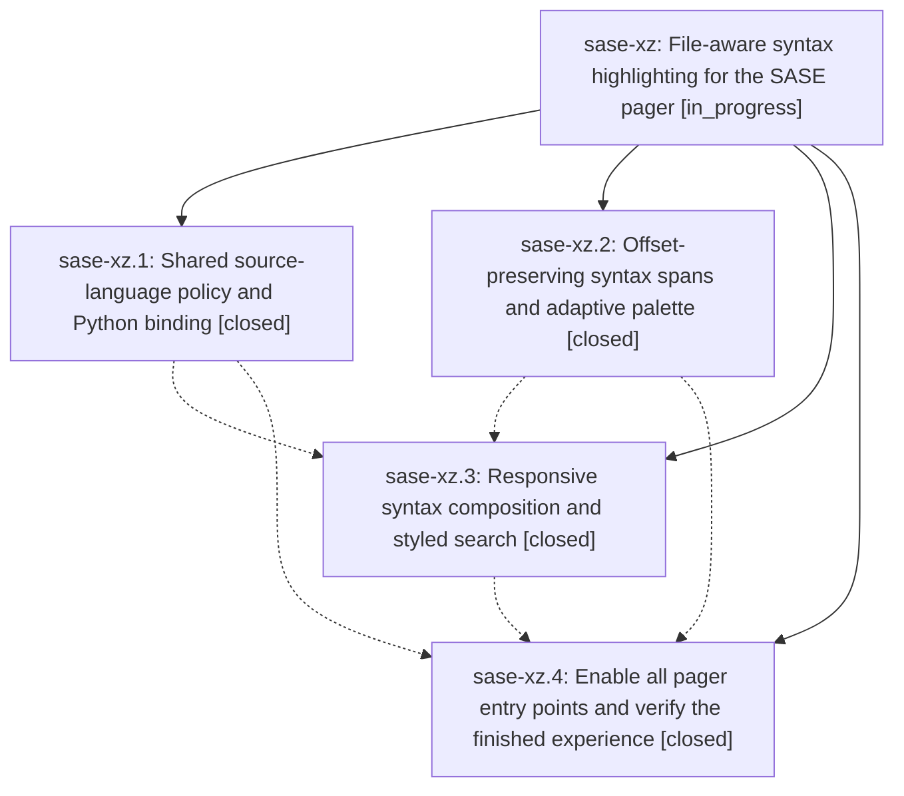

# Bead: sase-xz — File-aware syntax highlighting for the SASE pager

[Bead Pages](../README.md) / sase-xz

**Status:** ◐ in_progress · **Type:** ▸ plan · **Tier:** epic
**Owner:** `bryanbugyi34@gmail.com` · **Created by:** [bbugyi200.athena.03g](https://github.com/sase-org/sase--agents/blob/main/families/bbugyi200.athena.03g.md) · **Assignee:** `sase-xz.land`
**Created:** 2026-09-07 10:51:40 EDT
**Plan:** [202609/pager\_filetype\_syntax.md](https://github.com/sase-org/sase--plans/blob/main/202609/pager_filetype_syntax.md)

<!-- sase:links:start -->

## Links

| Relation | Artifact | Why |
| --- | --- | --- |
| implemented-by | [plan:202609/pager_filetype_syntax.md][1] | derived from the plan's `bead_id:` frontmatter field |

[1]: https://github.com/sase-org/sase--plans/blob/main/202609/pager_filetype_syntax.md

<!-- sase:links:end -->

## Description

Make source files, Markdown documents, and diffs quietly beautiful in every pager entry point while preserving source text, existing styles, link actions, search, and responsiveness.

## Phases

| Bead | Title | Status | Size | Created | Agents | Commits |
|---|---|---|---|---|---:|---:|
| [sase-xz.1](sase-xz.1.md) | Shared source-language policy and Python binding | ✓ closed | medium | 2026-09-07 | 1 | 2 |
| [sase-xz.2](sase-xz.2.md) | Offset-preserving syntax spans and adaptive palette | ✓ closed | medium | 2026-09-07 | 1 | 1 |
| [sase-xz.3](sase-xz.3.md) | Responsive syntax composition and styled search | ✓ closed | medium | 2026-09-07 | 1 | 1 |
| [sase-xz.4](sase-xz.4.md) | Enable all pager entry points and verify the finished experience | ✓ closed | medium | 2026-09-07 | 1 | 1 |

## Lineage

## Agents

| Agent | Bead | Commits |
|---|---|---:|
| [bbugyi200.athena.sase-xz.1](https://github.com/sase-org/sase--agents/blob/main/agents/bbugyi200.athena.sase-xz.1/README.md) | [sase-xz.1](sase-xz.1.md) | 2 |
| [bbugyi200.athena.sase-xz.2](https://github.com/sase-org/sase--agents/blob/main/agents/bbugyi200.athena.sase-xz.2/README.md) | [sase-xz.2](sase-xz.2.md) | 1 |
| [bbugyi200.athena.sase-xz.3](https://github.com/sase-org/sase--agents/blob/main/agents/bbugyi200.athena.sase-xz.3/README.md) | [sase-xz.3](sase-xz.3.md) | 1 |
| [bbugyi200.athena.sase-xz.4](https://github.com/sase-org/sase--agents/blob/main/agents/bbugyi200.athena.sase-xz.4/README.md) | [sase-xz.4](sase-xz.4.md) | 1 |
| [bbugyi200.athena.sase-xz.land](https://github.com/sase-org/sase--agents/blob/main/agents/bbugyi200.athena.sase-xz.land/README.md) | [sase-xz](README.md) | 0 |

## Commits

| Repo | Commit | Subject | Bead | Committed |
|---|---|---|---|---|
| sase | [`7ca1654`](https://github.com/sase-org/sase/commit/7ca1654a2175b3e042b862f9bacb20f04535d2bc) | feat(pager): add source-language facade over the rust contract | [sase-xz.1](sase-xz.1.md) | 2026-09-07 12:37:22 EDT |
| sase-core | [`sase-core@eacd178`](https://github.com/sase-org/sase-core/commit/eacd17823834d441f205289b0c4f30510918734f) | feat(source-language): add pager language policy and wire API | [sase-xz.1](sase-xz.1.md) | 2026-09-07 12:42:24 EDT |
| sase | [`0aa7cb9`](https://github.com/sase-org/sase/commit/0aa7cb9e965b504f08a6b3fccef69b84902c03a7) | feat(pager): add inactive syntax span engine | [sase-xz.2](sase-xz.2.md) | 2026-09-07 13:24:59 EDT |
| sase | [`a9f95ca`](https://github.com/sase-org/sase/commit/a9f95ca5e64510df9f6161ee259d4d99d042537f) | feat(pager): thread source-language syntax hints through screen and layout | [sase-xz.3](sase-xz.3.md) | 2026-09-07 14:10:25 EDT |
| sase | [`dbf9413`](https://github.com/sase-org/sase/commit/dbf94132ce3d34ec849eed9ab82e8cb401aec443) | feat(pager): activate file-aware syntax highlighting at every entry point | [sase-xz.4](sase-xz.4.md) | 2026-09-07 15:51:05 EDT |
