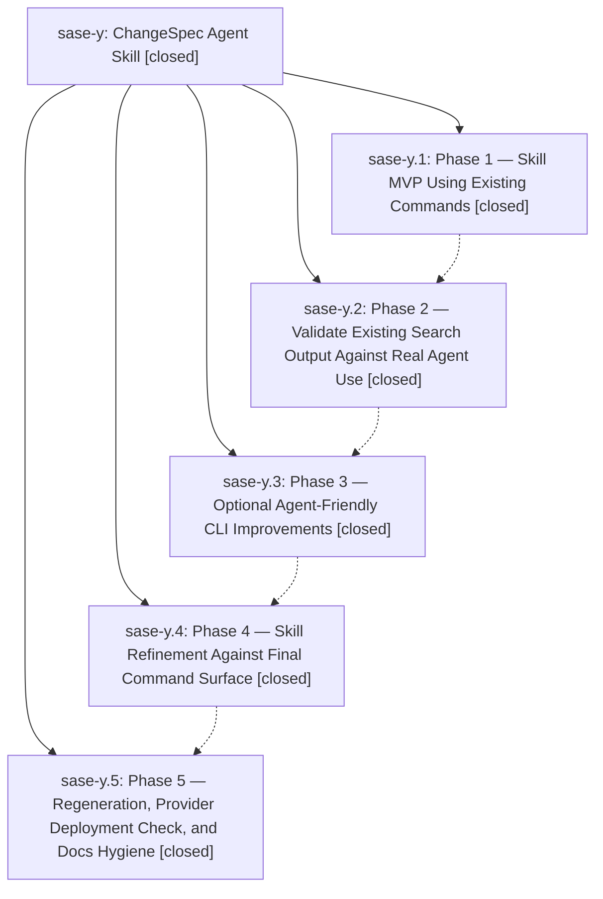

# Bead: sase-y — ChangeSpec Agent Skill

[Bead Pages](../README.md) / sase-y

**Status:** ✓ closed · **Resolution:** (unrecorded) · **Type:** plan · **Tier:** epic
**Owner:** `bryanbugyi34@gmail.com`
**Created:** 2026-04-27 18:27:38 UTC · **Closed:** 2026-04-27 19:04:01 UTC
**Plan:** [202604/changespec\_skill\_1.md](https://github.com/sase-org/sase--plans/blob/main/202604/changespec_skill_1.md)

## Phases

| Bead | Title | Status | Size | Agents | Commits |
|---|---|---|---|---:|---:|
| [sase-y.1](sase-y.1.md) | Phase 1 — Skill MVP Using Existing Commands | ✓ closed | small | 0 | 1 |
| [sase-y.2](sase-y.2.md) | Phase 2 — Validate Existing Search Output Against Real Agent Use | ✓ closed | small | 0 | 1 |
| [sase-y.3](sase-y.3.md) | Phase 3 — Optional Agent-Friendly CLI Improvements | ✓ closed | small | 0 | 0 |
| [sase-y.4](sase-y.4.md) | Phase 4 — Skill Refinement Against Final Command Surface | ✓ closed | small | 0 | 1 |
| [sase-y.5](sase-y.5.md) | Phase 5 — Regeneration, Provider Deployment Check, and Docs Hygiene | ✓ closed | small | 0 | 0 |

## Lineage

## Commits

| Commit | Subject | Bead | Committed (UTC) |
|---|---|---|---|
| [`de284bc`](https://github.com/sase-org/sase/commit/de284bc7e607730fdc1eb28c94ad4cf090403249) | feat(skills): add sase\_changespecs skill for ChangeSpec analysis (sase-y.1) | [sase-y.1](sase-y.1.md) | 2026-04-27 18:35:48 |
| [`959eb3d`](https://github.com/sase-org/sase/commit/959eb3dd7c0028ea4f7bd0172d93d5a1a4a889eb) | test(query): assert &name is exact, no substring match (sase-y.2) | [sase-y.2](sase-y.2.md) | 2026-04-27 18:47:51 |
| [`c5731f7`](https://github.com/sase-org/sase/commit/c5731f737b4661dabd5e26447e94edf08d1a7e2d) | feat(skills): add practical workflow recipes to sase\_changespecs (sase-y.4) | [sase-y.4](sase-y.4.md) | 2026-04-27 18:56:29 |
