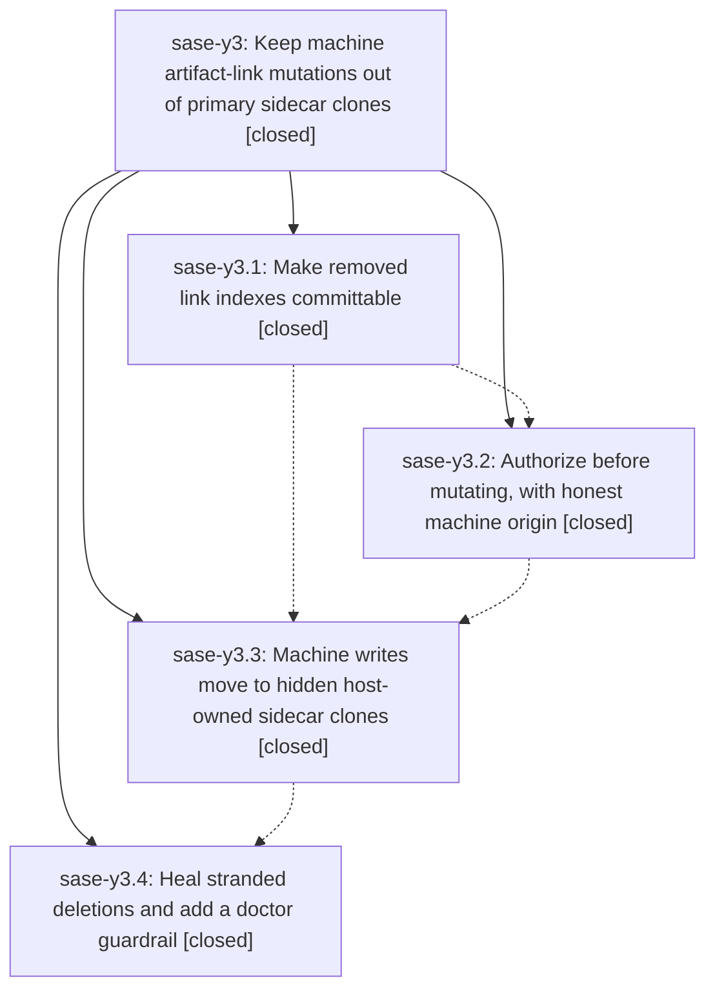

# Bead: sase-y3 — Keep machine artifact-link mutations out of primary sidecar clones

[Bead Pages](../README.md) / sase-y3

**Status:** ✓ closed · **Resolution:** done · **Type:** ▸ plan · **Tier:** epic
**Owner:** `bryanbugyi34@gmail.com` · **Created by:** [bbugyi200.athena.04n](https://github.com/sase-org/sase--agents/blob/main/families/bbugyi200.athena.04n.md) · **Assignee:** `sase-y3.land`
**Created:** 2026-09-07 15:14:44 EDT · **Closed:** 2026-09-08 08:52:21 EDT
**Plan:** [202609/machine\_link\_mutations\_off\_primary.md](https://github.com/sase-org/sase--plans/blob/main/202609/machine_link_mutations_off_primary.md)

<!-- sase:links:start -->

## Links

| Relation | Artifact | Why |
| --- | --- | --- |
| implemented-by | [plan:202609/machine_link_mutations_off_primary.md][1] | derived from the plan's `bead_id:` frontmatter field |

[1]: https://github.com/sase-org/sase--plans/blob/main/202609/machine_link_mutations_off_primary.md

<!-- sase:links:end -->

## Description

SASE background link maintenance never dirties or commits into the sidecar clones nested under a project's primary (human) workspace checkout: rename-repair deletions are committable, every background writer authorizes before mutating with an honest machine origin, machine writes land in hidden host-owned sidecar clones that push to the remote, the primary's clones converge via pull-based auto-sync only, and the currently stranded deletions are healed with a doctor guardrail against recurrence.

## Notes

[2026-09-08T12:17:06Z · sase-y3.land] LANDING (sase-y3.land, part 1 of 2): phase sase-y3.3 was CLOSED BUT NEVER LANDED; recovered.

VERIFICATION FINDING. Only three of this epic's four phases reached master: ec6bc4a42 (sase-y3.1), 87f4cf141 (sase-y3.2), fe58c5efe (sase-y3.4). Phase sase-y3.3 (hidden-clone-machine-writes, large) had NO commit on any ref: src/sase/sdd/_artifact_link_machine_store.py did not exist, AccessKind.HOST_OWNED_SIDECAR was absent, and both background anchors still resolved from the primary checkout (sase_chop_artifact_link_backfill.py:204 resolve_artifact_link_store(cwd=workspace_dir), referenced_by_publication._resolve_store via resolve_sdd_store(primary)). The epic therefore shipped only the Phase-2 interim regression -- background link maintenance as a diagnosed no-op -- with nothing to relieve it. sase patch search found no open patch; git log --all found no such commit.

RECOVERY. The work was found intact as unpushed commit 009733edb in the phase agent's workspace (sase_39, agent bbugyi200.athena.06m). Its parent chain carried a spurious "Initialize SDD" commit that 009733edb itself reverted, so the diff 787bb91bc..009733edb excluding sdd/** is exactly the phase-3 work: 11 files, +1016/-15. It applies cleanly to current master -- none of the eleven files changed on master since 787bb91bc -- and is now in this landing workspace. Focused suites: 30 passed (tests/sdd/test_artifact_link_machine_store.py, tests/workspace_provider/test_ownership_hidden_sidecar.py, tests/agents_sync/test_referenced_by_publication.py, tests/sdd/test_artifact_link_hidden_clone_e2e.py, tests/test_axe_chop_artifact_link_backfill.py), matching the count sase-y3.3's own note recorded. just check: every lint gate green (fmt, keep-sorted, ruff, mypy, flags, pyscripts, test waits, changelog, terminology, symvision, toobig, SASE validation, committed plans).

INTEGRATION with the ~35 commits that landed since 2026-09-07 15:00: no conflict and no duplication. Nothing outside this epic touched the artifact-link stores, the ownership contract, the backfill chop, or the agents-sync drain. Phase 4's docs/artifact_links.md and checks_artifact_links.py already describe the machine write lane phase 3 provides, so the two now agree. The pre-existing sase-core floor probe warning (0.32.42 missing 7 provider_usage capabilities) belongs to epic sase-y5, not here.

CHILD-NOTE FOLLOW-UPS, all four resolved:
- sase-y3.4 #1 (decisions-web record) -> new memory task sase-yd (small, ready).
- sase-y3.4 #2 (unpublished-commit retry/aging) -> new bug task sase-ye (medium, ready), with related links to sase-xi and sase-xj; confirmed real by reading _unpublished_sidecar_error (_artifact_link_commit.py:327-359): one push_bead_work_launch, then a message, with no queue, backoff, or aging sweep.
- sase-y3.4 #3 (mypy red on src/sase/pager/_layout.py:_measure_section_heights) -> already fixed on master; the symbol is gone and lint (mypy) is green. No bead filed.
- sase-y3.4 #6 (stale --epic-symbol entries for closed bead sase-xe) -> already cleaned; the Justfile now lists only sase-n4 and sase-y5.7. No bead filed.

Phase 4's guardrail verified live: sase doctor -C project.primary_sidecar_link_dirt reports OK, so the 12 stranded research link-index deletions healed in sase-y3.4 note #5 have stayed healed.

STRAY DUPLICATE: sase-y2 is a never-worked duplicate epic bead built from this same plan file (sase-y1 canceled, sase-y2 stray, sase-y3 real). Documented on sase-y2 with a recommended disposition; left open because it is outside this land agent's assignment.

sase bead epic-symbols sase-y3 reports no entries. Remaining before close: the just check-full landing gate over the combined tree, now running under a monitor.

[2026-09-08T12:52:21Z · sase-y3.land--1] LANDING (sase-y3.land, part 2 of 2): gate result and disposition. See note #1 for the phase-3 recovery and the step 1-2 verification/integration evidence that this close rests on.

GATE: just check-full over the combined tree (recovered phase-3 work applied, 11 files, +1016/-15) via monitor t2ck9mbyqkw0, 26m58s. Every lint/format/validation gate green: fmt (python), fmt (markdown), keep-sorted, ruff, mypy, feature flags, pyscripts, test waits, changelog, patch/stitch terminology, symvision, toobig, SASE validation, committed plans. Full suite: 39608 passed, 14 skipped, 2 failed. Both failures are pre-existing on master and unrelated to this epic; neither touches any of the eleven files in this diff.

FAILURE 1 (routed): tests/completion/test_snapshot.py::test_checked_in_snapshot_has_no_drift and ::test_current_structural_view_matches_checked_in_snapshot. Diffed current_structural_view() against tests/completion/snapshots/cli_spec.json: the entire 155-line delta is confined to .root.subcommands[notify] -- the new '+1' subtree plus three new 'notify create' options. git log -S names commit 9abf4724c (phase sase-y6.5) as the sole introducer, and that commit did not regenerate the snapshot. Recorded as a DISCOVERED ISSUE on in-progress epic sase-y6, which owns the causing commit; not filed as a new task and not +1'd onto superseded task sase-pr. Fix is just sync-completion-spec, owned by the sase-y6 landing.

FAILURE 2 (routed): check-full aborted at test-cost, so its last two steps never ran. I ran both to complete the gate. tools/check_test_cost_budgets --report-advisories: exit 0, advisories only (six overages, already tracked as task sase-xc). just selection-health --fail-on-new-flake: exit 2, but NOT a new-flake verdict -- load_flake_baseline() raises on 'tests/reproducible_flake_baseline.txt:410: duplicate fixed-at entry for tests/test_xprompt_directive_completion_parity.py::test_ace_and_lsp_directive_name_rows_match'. Commit b0f6f4f11 (phase sase-y5.2) added a second fixed-at line for a node that already had one from 8e00e742b (fixed-at count by revision: b0f6f4f11^ -> 1, b0f6f4f11 -> 2, HEAD -> 2). The file is unmodified in this landing tree. Recorded as a DISCOVERED ISSUE on in-progress epic sase-y5.

EPIC SYMBOLS: sase bead epic-symbols sase-y3 re-run after the gate -- no --epic-symbol entries.

FOLLOW-UPS from the phase beads (full disposition in note #1): two of sase-y3.4's four PROPOSED FOLLOW-UP entries were already fixed on master and were declined as such; the two live ones became task beads sase-yd (decisions-web strand for the machine artifact-link write lane) and sase-ye (artifact-link index commits get a single push attempt with no retry or aging).

ALSO: sase-y2 is a stray never-worked duplicate epic bead of this one, created by the same agent from the same plan file within 18 minutes; documented in a note on sase-y2 with a recommended superseded close, left to the owner because that bead is outside this land agent's assignment.

## Phases

| Bead | Title | Status | Size | Created | Agents | Commits |
|---|---|---|---|---|---:|---:|
| [sase-y3.1](sase-y3.1.md) | Make removed link indexes committable | ✓ closed | small | 2026-09-07 | 1 | 1 |
| [sase-y3.2](sase-y3.2.md) | Authorize before mutating, with honest machine origin | ✓ closed | medium | 2026-09-07 | 1 | 1 |
| [sase-y3.3](sase-y3.3.md) | Machine writes move to hidden host-owned sidecar clones | ✓ closed | large | 2026-09-07 | 1 | 0 |
| [sase-y3.4](sase-y3.4.md) | Heal stranded deletions and add a doctor guardrail | ✓ closed | small | 2026-09-07 | 1 | 0 |

## Lineage

## Agents

| Agent | Bead | Commits |
|---|---|---:|
| [bbugyi200.athena.sase-y3.1](https://github.com/sase-org/sase--agents/blob/main/agents/bbugyi200.athena.sase-y3.1/README.md) | [sase-y3.1](sase-y3.1.md) | 1 |
| [bbugyi200.athena.sase-y3.2](https://github.com/sase-org/sase--agents/blob/main/agents/bbugyi200.athena.sase-y3.2/README.md) | [sase-y3.2](sase-y3.2.md) | 1 |
| [bbugyi200.athena.sase-y3.3](https://github.com/sase-org/sase--agents/blob/main/families/bbugyi200.athena.sase-y3.3.md) | [sase-y3.3](sase-y3.3.md) | 0 |
| [bbugyi200.athena.sase-y3.4](https://github.com/sase-org/sase--agents/blob/main/families/bbugyi200.athena.sase-y3.4.md) | [sase-y3.4](sase-y3.4.md) | 0 |
| [bbugyi200.athena.sase-y3.land](https://github.com/sase-org/sase--agents/blob/main/families/bbugyi200.athena.sase-y3.land.md) | [sase-y3](README.md) | 2 |

## Commits

| Repo | Commit | Subject | Bead | Committed |
|---|---|---|---|---|
| sase | [`ec6bc4a`](https://github.com/sase-org/sase/commit/ec6bc4a422f56b8fa45dc809f26cc8f6ea7c3e33) | fix(artifact-links): commit removed link indexes | [sase-y3.1](sase-y3.1.md) | 2026-09-07 15:41:02 EDT |
| sase | [`87f4cf1`](https://github.com/sase-org/sase/commit/87f4cf1416da9963e599e4e3fc0e04eeef64b6b5) | fix(sdd): gate background artifact-link writers on machine writability | [sase-y3.2](sase-y3.2.md) | 2026-09-07 18:09:28 EDT |
| sase | [`2edf986`](https://github.com/sase-org/sase/commit/2edf986b6dc2921ae297d556d12ffaf60d874523) | feat(sdd): route machine artifact-link writes to hidden host-owned clones | [sase-y3](README.md) | 2026-09-08 08:55:45 EDT |
| sase--plans | [`sase--plans@6501730`](https://github.com/sase-org/sase--plans/commit/6501730abeaf56cc36460121cdb4c0835c6aeef4) | docs(plans): mark machine\_link\_mutations\_off\_primary done | [sase-y3](README.md) | 2026-09-08 08:58:19 EDT |
