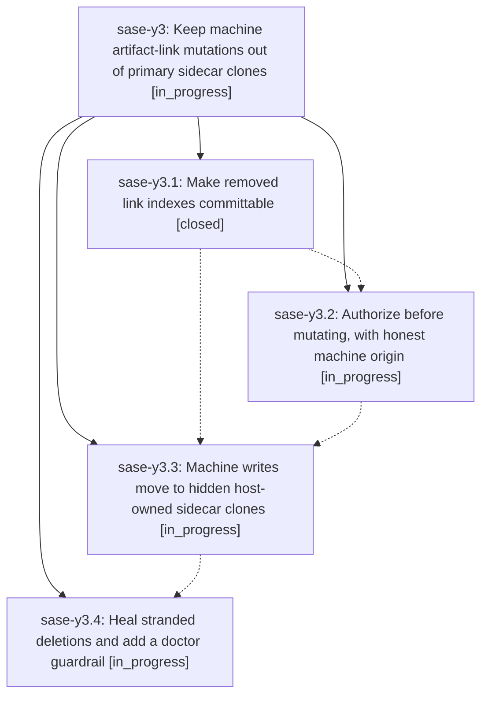

# Bead: sase-y3 — Keep machine artifact-link mutations out of primary sidecar clones

[Bead Pages](../README.md) / sase-y3

**Status:** ◐ in_progress · **Type:** ▸ plan · **Tier:** epic
**Owner:** `bryanbugyi34@gmail.com` · **Created by:** [bbugyi200.athena.04n](https://github.com/sase-org/sase--agents/blob/main/families/bbugyi200.athena.04n.md) · **Assignee:** `sase-y3.land`
**Created:** 2026-09-07 15:14:44 EDT
**Plan:** [202609/machine\_link\_mutations\_off\_primary.md](https://github.com/sase-org/sase--plans/blob/main/202609/machine_link_mutations_off_primary.md)

<!-- sase:links:start -->

## Links

| Relation | Artifact | Why |
| --- | --- | --- |
| implemented-by | [plan:202609/machine_link_mutations_off_primary.md][1] | derived from the plan's `bead_id:` frontmatter field |

[1]: https://github.com/sase-org/sase--plans/blob/main/202609/machine_link_mutations_off_primary.md

<!-- sase:links:end -->

## Description

SASE background link maintenance never dirties or commits into the sidecar clones nested under a project's primary (human) workspace checkout: rename-repair deletions are committable, every background writer authorizes before mutating with an honest machine origin, machine writes land in hidden host-owned sidecar clones that push to the remote, the primary's clones converge via pull-based auto-sync only, and the currently stranded deletions are healed with a doctor guardrail against recurrence.

## Phases

| Bead | Title | Status | Size | Created | Agents | Commits |
|---|---|---|---|---|---:|---:|
| [sase-y3.1](sase-y3.1.md) | Make removed link indexes committable | ✓ closed | small | 2026-09-07 | 1 | 1 |
| [sase-y3.2](sase-y3.2.md) | Authorize before mutating, with honest machine origin | ◐ in_progress | medium | 2026-09-07 | 1 | 0 |
| [sase-y3.3](sase-y3.3.md) | Machine writes move to hidden host-owned sidecar clones | ◐ in_progress | large | 2026-09-07 | 1 | 0 |
| [sase-y3.4](sase-y3.4.md) | Heal stranded deletions and add a doctor guardrail | ◐ in_progress | small | 2026-09-07 | 1 | 0 |

## Lineage

## Agents

| Agent | Bead | Commits |
|---|---|---:|
| [bbugyi200.athena.sase-y3.1](https://github.com/sase-org/sase--agents/blob/main/agents/bbugyi200.athena.sase-y3.1/README.md) | [sase-y3.1](sase-y3.1.md) | 1 |
| [bbugyi200.athena.sase-y3.2](https://github.com/sase-org/sase--agents/blob/main/agents/bbugyi200.athena.sase-y3.2/README.md) | [sase-y3.2](sase-y3.2.md) | 0 |
| [bbugyi200.athena.sase-y3.3](https://github.com/sase-org/sase--agents/blob/main/agents/bbugyi200.athena.sase-y3.3/README.md) | [sase-y3.3](sase-y3.3.md) | 0 |
| [bbugyi200.athena.sase-y3.4](https://github.com/sase-org/sase--agents/blob/main/agents/bbugyi200.athena.sase-y3.4/README.md) | [sase-y3.4](sase-y3.4.md) | 0 |
| [bbugyi200.athena.sase-y3.land](https://github.com/sase-org/sase--agents/blob/main/agents/bbugyi200.athena.sase-y3.land/README.md) | [sase-y3](README.md) | 0 |

## Commits

| Repo | Commit | Subject | Bead | Committed |
|---|---|---|---|---|
| sase | [`ec6bc4a`](https://github.com/sase-org/sase/commit/ec6bc4a422f56b8fa45dc809f26cc8f6ea7c3e33) | fix(artifact-links): commit removed link indexes | [sase-y3.1](sase-y3.1.md) | 2026-09-07 15:41:02 EDT |
