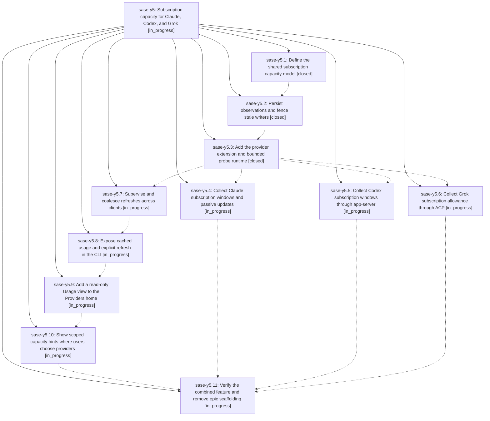

# Bead: sase-y5 — Subscription capacity for Claude, Codex, and Grok

[Bead Pages](../README.md) / sase-y5

**Status:** ◐ in_progress · **Type:** ▸ plan · **Tier:** epic
**Owner:** `bryanbugyi34@gmail.com` · **Created by:** [bbugyi200.athena.052](https://github.com/sase-org/sase--agents/blob/main/families/bbugyi200.athena.052.md) · **Assignee:** `sase-y5.land`
**Created:** 2026-09-07 16:09:18 EDT
**Plan:** [202609/subscription\_capacity.md](https://github.com/sase-org/sase--plans/blob/main/202609/subscription_capacity.md)

<!-- sase:links:start -->

## Links

| Relation | Artifact | Why |
| --- | --- | --- |
| implemented-by | [plan:202609/subscription_capacity.md][1] | derived from the plan's `bead_id:` frontmatter field |

[1]: https://github.com/sase-org/sase--plans/blob/main/202609/subscription_capacity.md

<!-- sase:links:end -->

## Description

Let subscription users inspect remaining provider allowances, their scope, resets, and freshness through an extensible shared backend, CLI, and responsive ACE experience.

## Phases

| Bead | Title | Status | Size | Created | Agents | Commits |
|---|---|---|---|---|---:|---:|
| [sase-y5.1](sase-y5.1.md) | Define the shared subscription capacity model | ✓ closed | medium | 2026-09-07 | 1 | 1 |
| [sase-y5.10](sase-y5.10.md) | Show scoped capacity hints where users choose providers | ◐ in_progress | medium | 2026-09-07 | 1 | 0 |
| [sase-y5.11](sase-y5.11.md) | Verify the combined feature and remove epic scaffolding | ◐ in_progress | medium | 2026-09-07 | 1 | 0 |
| [sase-y5.2](sase-y5.2.md) | Persist observations and fence stale writers | ✓ closed | medium | 2026-09-07 | 1 | 0 |
| [sase-y5.3](sase-y5.3.md) | Add the provider extension and bounded probe runtime | ✓ closed | medium | 2026-09-07 | 1 | 1 |
| [sase-y5.4](sase-y5.4.md) | Collect Claude subscription windows and passive updates | ◐ in_progress | medium | 2026-09-07 | 1 | 0 |
| [sase-y5.5](sase-y5.5.md) | Collect Codex subscription windows through app-server | ◐ in_progress | medium | 2026-09-07 | 1 | 0 |
| [sase-y5.6](sase-y5.6.md) | Collect Grok subscription allowance through ACP | ◐ in_progress | medium | 2026-09-07 | 1 | 0 |
| [sase-y5.7](sase-y5.7.md) | Supervise and coalesce refreshes across clients | ◐ in_progress | medium | 2026-09-07 | 1 | 0 |
| [sase-y5.8](sase-y5.8.md) | Expose cached usage and explicit refresh in the CLI | ◐ in_progress | medium | 2026-09-07 | 1 | 0 |
| [sase-y5.9](sase-y5.9.md) | Add a read-only Usage view to the Providers home | ◐ in_progress | medium | 2026-09-07 | 1 | 0 |

## Lineage

## Agents

| Agent | Bead | Commits |
|---|---|---:|
| [bbugyi200.athena.sase-y5.1](https://github.com/sase-org/sase--agents/blob/main/agents/bbugyi200.athena.sase-y5.1/README.md) | [sase-y5.1](sase-y5.1.md) | 1 |
| [bbugyi200.athena.sase-y5.10](https://github.com/sase-org/sase--agents/blob/main/agents/bbugyi200.athena.sase-y5.10/README.md) | [sase-y5.10](sase-y5.10.md) | 0 |
| [bbugyi200.athena.sase-y5.11](https://github.com/sase-org/sase--agents/blob/main/agents/bbugyi200.athena.sase-y5.11/README.md) | [sase-y5.11](sase-y5.11.md) | 0 |
| [bbugyi200.athena.sase-y5.2](https://github.com/sase-org/sase--agents/blob/main/families/bbugyi200.athena.sase-y5.2.md) | [sase-y5.2](sase-y5.2.md) | 0 |
| [bbugyi200.athena.sase-y5.3](https://github.com/sase-org/sase--agents/blob/main/agents/bbugyi200.athena.sase-y5.3/README.md) | [sase-y5.3](sase-y5.3.md) | 1 |
| [bbugyi200.athena.sase-y5.4](https://github.com/sase-org/sase--agents/blob/main/agents/bbugyi200.athena.sase-y5.4/README.md) | [sase-y5.4](sase-y5.4.md) | 0 |
| [bbugyi200.athena.sase-y5.5](https://github.com/sase-org/sase--agents/blob/main/agents/bbugyi200.athena.sase-y5.5/README.md) | [sase-y5.5](sase-y5.5.md) | 0 |
| [bbugyi200.athena.sase-y5.6](https://github.com/sase-org/sase--agents/blob/main/agents/bbugyi200.athena.sase-y5.6/README.md) | [sase-y5.6](sase-y5.6.md) | 0 |
| [bbugyi200.athena.sase-y5.7](https://github.com/sase-org/sase--agents/blob/main/agents/bbugyi200.athena.sase-y5.7/README.md) | [sase-y5.7](sase-y5.7.md) | 0 |
| [bbugyi200.athena.sase-y5.8](https://github.com/sase-org/sase--agents/blob/main/agents/bbugyi200.athena.sase-y5.8/README.md) | [sase-y5.8](sase-y5.8.md) | 0 |
| [bbugyi200.athena.sase-y5.9](https://github.com/sase-org/sase--agents/blob/main/agents/bbugyi200.athena.sase-y5.9/README.md) | [sase-y5.9](sase-y5.9.md) | 0 |
| [bbugyi200.athena.sase-y5.land](https://github.com/sase-org/sase--agents/blob/main/agents/bbugyi200.athena.sase-y5.land/README.md) | [sase-y5](README.md) | 0 |

## Commits

| Repo | Commit | Subject | Bead | Committed |
|---|---|---|---|---|
| sase-core | [`sase-core@07bd3bc`](https://github.com/sase-org/sase-core/commit/07bd3bc80be6cefba3643a36b74c1ebf2f6e6b20) | feat(provider-usage): add observation and public read contracts | [sase-y5.1](sase-y5.1.md) | 2026-09-07 16:55:07 EDT |
| sase | [`502b3e7`](https://github.com/sase-org/sase/commit/502b3e7675b88110f91f88135562d4ad854f89cf) | feat(llm): add subscription usage probe runtime and beta flag | [sase-y5.3](sase-y5.3.md) | 2026-09-08 06:30:00 EDT |
