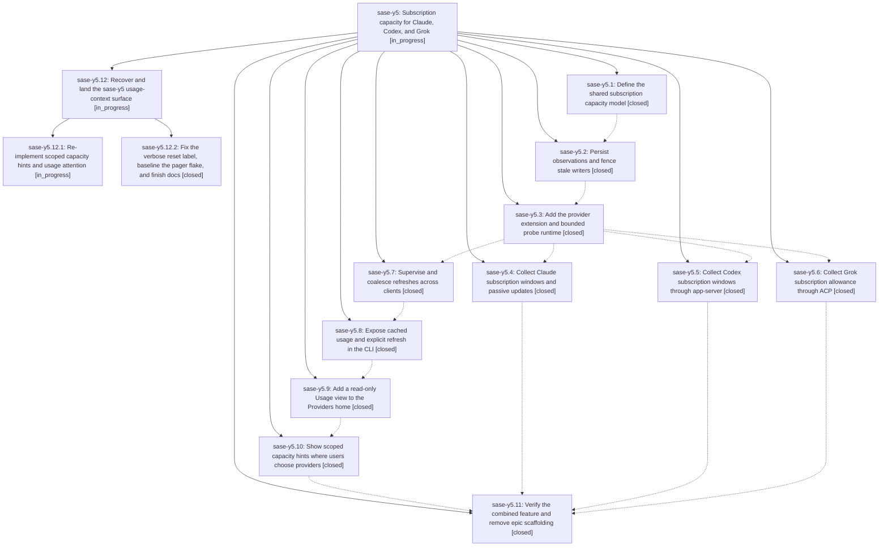

# Bead: sase-y5 — Subscription capacity for Claude, Codex, and Grok

[Bead Pages](../README.md) / sase-y5

**Status:** ◐ in_progress · **Type:** ▸ plan · **Tier:** epic
**Owner:** `bryanbugyi34@gmail.com` · **Created by:** [bbugyi200.athena.052](https://github.com/sase-org/sase--agents/blob/main/families/bbugyi200.athena.052.md) · **Assignee:** `sase-y5.land`
**Created:** 2026-09-07 16:09:18 EDT
**Plan:** [202609/subscription\_capacity.md](https://github.com/sase-org/sase--plans/blob/main/202609/subscription_capacity.md)

<!-- sase:links:start -->

## Links

| Relation | Artifact | Why |
| --- | --- | --- |
| implemented-by | [plan:202609/subscription_capacity.md][1] | derived from the plan's `bead_id:` frontmatter field |
| related | file:explicit:762a0fcfad720e2b70a9331b | attached via sase artifact create --bead |

[1]: https://github.com/sase-org/sase--plans/blob/main/202609/subscription_capacity.md

<!-- sase:links:end -->

## Description

Let subscription users inspect remaining provider allowances, their scope, resets, and freshness through an extensible shared backend, CLI, and responsive ACE experience.

## Notes

[2026-09-08T12:51:28Z · sase-y3.land--1] DISCOVERED ISSUE (found by the sase-y3 land agent while completing the two check-full steps that never ran after test-cost failed): phase sase-y5.2's commit b0f6f4f11 'feat: Persist observations and fence stale writers (sase-y5.2)' made tests/reproducible_flake_baseline.txt malformed, so check-full's final gate errors out on every tree.

SYMPTOM: just selection-health --fail-on-new-flake exits 2 with 'flake baseline gate: tests/reproducible_flake_baseline.txt:410: duplicate fixed-at entry for tests/test_xprompt_directive_completion_parity.py::test_ace_and_lsp_directive_name_rows_match'. This is load_flake_baseline() raising ValueError, i.e. the gate cannot judge flakes at all -- it is a parse failure, not a new-flake verdict.

EVIDENCE: the node now has two fixed-at lines -- line 239 (2026-09-08T00:21:54Z, added by b0f6f4f11) and line 410 (2026-09-08T00:40:36Z, added earlier by 8e00e742b 'feat(dispatch): integrate and harden remote dispatch during the sase-xe landing'). Count of matching fixed-at lines by revision: 8e00e742b -> 1, ddbd1b10a -> 1, b0f6f4f11^ -> 1, b0f6f4f11 -> 2, HEAD (63f385c9a) -> 2. b0f6f4f11 is the commit that introduced the collision. Its own block comment at lines 407-408 asserts 'directive_name_rows_match's earlier sase-s6 fixed-at line was removed rather than duplicated; this instant is a strict superset', so the intended dedup did not happen -- note the surviving duplicate is the OLDER-timestamped line the new commit added, so decide deliberately which line to keep rather than assuming the newer one wins.

NOT CAUSED BY sase-y3: tests/reproducible_flake_baseline.txt is unmodified in the sase-y3 landing tree (git status clean for that path); the defect reproduces at committed HEAD.

FIX: remove the redundant fixed-at line so exactly one remains for that node, and re-run just selection-health --fail-on-new-flake to confirm it reaches a real verdict instead of exit 2.

[2026-09-08T13:13:07Z · sase-y6.land] Update on note #1 (malformed tests/reproducible_flake_baseline.txt from sase-y5.2 commit b0f6f4f11): repaired during the sase-y6 landing. The duplicate fixed-at entry for test_ace_and_lsp_directive_name_rows_match (00:21:54Z in the sase-s6 block) was removed; the sase-xe block's 00:40:36Z instant is a strict superset, so no evidence retirement was lost. selection-health --fail-on-new-flake exits 0 again. The same landing also re-keyed the stale --epic-symbol sase-y5.7(SyntheticUsageProvider) Justfile entry to open bead sase-y5.11, since the symbol still has no non-test consumer; sase-y5.11 must resolve or retire it.

[2026-09-08T14:31:30Z · sase-y6.land--1] DISCOVERED ISSUE (found by the sase-y6 land agent's check-full landing gate): tests/llm_provider/test_grok_usage_probe.py::test_grok_usage_probe_reaps_descendant_processes is flaky — introduced by sase-y5.6 commit 0f71004c5. Evidence: failed once in the full parallel check-full lane (2026-09-08 monitor gjydvdfzbtz0), then on the same unchanged tree serial reruns gave 1 fail / 2 pass ('.venv/bin/python -m pytest tests/llm_provider/test_grok_usage_probe.py::test_grok_usage_probe_reaps_descendant_processes -q'). Failure mode: ValueError int('') at test line 303 — the test waits only for the child pidfile to EXIST, then immediately reads it, racing the fake grok child (tests/llm_provider/fixtures/usage_probe/grok_acp_cli.py) which creates the file before its pid content is flushed. Fix suggestion: write the pidfile atomically (write temp + rename) or poll until the file is non-empty. Suitable for sase-y5.11 (verify phase) to absorb.

[2026-09-08T17:06:49Z · 08z--code] DISCOVERED ISSUE: During pager_bead_links verification on 2026-09-08, just check passed formatting, Ruff, mypy, feature-flag lint, pyscripts, test-waits, changelog, and patch/stitch terminology, then failed at just _lint-symvision because Justfile still whitelists six public usage-refresh symbols under closed phase sase-y5.8: UsageRefreshProviderResult, UsageRefreshReceipt, eligible_usage_providers, mark_usage_refresh_due, run_admitted_refresh, and submit_usage_refresh. Re-running Symvision without those closed-bead --epic-symbol entries shows those six symbols are currently unused by src/sase. This is unrelated to the pager bead-link diff and belongs to the open verify/remove-scaffolding scope of sase-y5.11.

[2026-09-09T01:07:26Z · sase-xe.16.land] Supplementary historical evidence proposed by sase-xe.16.8 note #1: its full-lane test_grok_usage_probe_reaps_descendant_processes failure passed immediately in focused rerun (with clan-summary SIGTERM test, 2 passed in 9.52s). This duplicates note #3 and remains with the subscription-capacity verification scope. The sase-xe.16 land audit did not reproduce a new failure; no new task or flake allowance was created.

[2026-09-09T09:59:19Z · sase-y5.land] DISCOVERED ISSUE (sase-y5 land agent): phase sase-y5.10 closed at 2026-09-08T21:04Z claiming verified work, but its commit never landed — the workflow's 'sase stitch create' failed at 17:05 EDT because the before-commit hook (just fix) hit ENOSPC rebuilding sase_core_rs (/mnt/poseidon was 100% full; same root cause later blocked just install for this landing). The worker's tracked-file edits (picker/indicator/store wiring) were subsequently lost to workspace resets; only its new files survived as untracked and were recovered from a git stash. Recovery artifact: file:explicit:762a0fcfad720e2b70a9331b (git-apply patch vs 1cad7ed16 with usage/hints.py, usage/peek.py, 6 test files, 2 PNG goldens; 8 stale provider_usage_metrics/override_flags references need adapting to the post-flag-removal tree, and store.py needs a provider_usage_window_applies re-export from sase_core_rs). Land agent freed 197G on /mnt/poseidon by deleting stale per-bead cargo target dirs (sase-y5-2, sase-y5-7, sase27, debug, maturin, tmp). Remaining epic work (usage-context re-implementation + release residue) is being planned as a child plan.

## Phases

| Bead | Title | Status | Size | Created | Agents | Commits |
|---|---|---|---|---|---:|---:|
| [sase-y5.1](sase-y5.1.md) | Define the shared subscription capacity model | ✓ closed | medium | 2026-09-07 | 1 | 1 |
| [sase-y5.10](sase-y5.10.md) | Show scoped capacity hints where users choose providers | ✓ closed | medium | 2026-09-07 | 0 | 0 |
| [sase-y5.11](sase-y5.11.md) | Verify the combined feature and remove epic scaffolding | ✓ closed | medium | 2026-09-07 | 1 | 1 |
| [sase-y5.2](sase-y5.2.md) | Persist observations and fence stale writers | ✓ closed | medium | 2026-09-07 | 0 | 2 |
| [sase-y5.3](sase-y5.3.md) | Add the provider extension and bounded probe runtime | ✓ closed | medium | 2026-09-07 | 1 | 1 |
| [sase-y5.4](sase-y5.4.md) | Collect Claude subscription windows and passive updates | ✓ closed | medium | 2026-09-07 | 1 | 1 |
| [sase-y5.5](sase-y5.5.md) | Collect Codex subscription windows through app-server | ✓ closed | medium | 2026-09-07 | 1 | 1 |
| [sase-y5.6](sase-y5.6.md) | Collect Grok subscription allowance through ACP | ✓ closed | medium | 2026-09-07 | 1 | 1 |
| [sase-y5.7](sase-y5.7.md) | Supervise and coalesce refreshes across clients | ✓ closed | medium | 2026-09-07 | 1 | 2 |
| [sase-y5.8](sase-y5.8.md) | Expose cached usage and explicit refresh in the CLI | ✓ closed | medium | 2026-09-07 | 1 | 1 |
| [sase-y5.9](sase-y5.9.md) | Add a read-only Usage view to the Providers home | ✓ closed | medium | 2026-09-07 | 1 | 1 |

## Lineage

## Agents

| Agent | Bead | Commits |
|---|---|---:|
| [bbugyi200.athena.sase-y5.1](https://github.com/sase-org/sase--agents/blob/main/agents/bbugyi200.athena.sase-y5.1/README.md) | [sase-y5.1](sase-y5.1.md) | 1 |
| [bbugyi200.athena.sase-y5.11](https://github.com/sase-org/sase--agents/blob/main/agents/bbugyi200.athena.sase-y5.11/README.md) | [sase-y5.11](sase-y5.11.md) | 1 |
| [bbugyi200.athena.sase-y5.12.1](https://github.com/sase-org/sase--agents/blob/main/agents/bbugyi200.athena.sase-y5.12.1/README.md) | [sase-y5.12.1](sase-y5.12.1.md) | 0 |
| [bbugyi200.athena.sase-y5.12.2](https://github.com/sase-org/sase--agents/blob/main/agents/bbugyi200.athena.sase-y5.12.2/README.md) | [sase-y5.12.2](sase-y5.12.2.md) | 1 |
| [bbugyi200.athena.sase-y5.12.land](https://github.com/sase-org/sase--agents/blob/main/agents/bbugyi200.athena.sase-y5.12.land/README.md) | [sase-y5.12](sase-y5.12.md) | 0 |
| [bbugyi200.athena.sase-y5.3](https://github.com/sase-org/sase--agents/blob/main/agents/bbugyi200.athena.sase-y5.3/README.md) | [sase-y5.3](sase-y5.3.md) | 1 |
| [bbugyi200.athena.sase-y5.4](https://github.com/sase-org/sase--agents/blob/main/agents/bbugyi200.athena.sase-y5.4/README.md) | [sase-y5.4](sase-y5.4.md) | 1 |
| [bbugyi200.athena.sase-y5.5](https://github.com/sase-org/sase--agents/blob/main/agents/bbugyi200.athena.sase-y5.5/README.md) | [sase-y5.5](sase-y5.5.md) | 1 |
| [bbugyi200.athena.sase-y5.6](https://github.com/sase-org/sase--agents/blob/main/agents/bbugyi200.athena.sase-y5.6/README.md) | [sase-y5.6](sase-y5.6.md) | 1 |
| [bbugyi200.athena.sase-y5.7](https://github.com/sase-org/sase--agents/blob/main/agents/bbugyi200.athena.sase-y5.7/README.md) | [sase-y5.7](sase-y5.7.md) | 2 |
| [bbugyi200.athena.sase-y5.8](https://github.com/sase-org/sase--agents/blob/main/agents/bbugyi200.athena.sase-y5.8/README.md) | [sase-y5.8](sase-y5.8.md) | 1 |
| [bbugyi200.athena.sase-y5.9](https://github.com/sase-org/sase--agents/blob/main/agents/bbugyi200.athena.sase-y5.9/README.md) | [sase-y5.9](sase-y5.9.md) | 1 |
| [bbugyi200.athena.sase-y5.land](https://github.com/sase-org/sase--agents/blob/main/families/bbugyi200.athena.sase-y5.land.md) | [sase-y5](README.md) | 0 |

## Commits

| Repo | Commit | Subject | Bead | Committed |
|---|---|---|---|---|
| sase-core | [`sase-core@07bd3bc`](https://github.com/sase-org/sase-core/commit/07bd3bc80be6cefba3643a36b74c1ebf2f6e6b20) | feat(provider-usage): add observation and public read contracts | [sase-y5.1](sase-y5.1.md) | 2026-09-07 16:55:07 EDT |
| sase | [`502b3e7`](https://github.com/sase-org/sase/commit/502b3e7675b88110f91f88135562d4ad854f89cf) | feat(llm): add subscription usage probe runtime and beta flag | [sase-y5.3](sase-y5.3.md) | 2026-09-08 06:30:00 EDT |
| sase | [`b0f6f4f`](https://github.com/sase-org/sase/commit/b0f6f4f112b8f8e5c94898acbe5215bc1eedf957) | feat: Persist observations and fence stale writers (sase-y5.2) | [sase-y5.2](sase-y5.2.md) | 2026-09-08 06:57:14 EDT |
| sase-core | [`sase-core@0c26b04`](https://github.com/sase-org/sase-core/commit/0c26b043da326c081863ed67833cb044a827dfdf) | feat: Persist observations and fence stale writers (sase-y5.2) | [sase-y5.2](sase-y5.2.md) | 2026-09-08 06:57:42 EDT |
| sase | [`63f385c`](https://github.com/sase-org/sase/commit/63f385c9a626872840b6e74f6b8c32211944a8fa) | feat(llm): add Codex subscription usage collector | [sase-y5.5](sase-y5.5.md) | 2026-09-08 07:49:20 EDT |
| sase | [`0f71004`](https://github.com/sase-org/sase/commit/0f71004c5a4aaf12558d6b50934eec602e15084d) | feat(llm): collect Grok subscription allowance through ACP | [sase-y5.6](sase-y5.6.md) | 2026-09-08 07:55:21 EDT |
| sase | [`a0ac015`](https://github.com/sase-org/sase/commit/a0ac015e0bda1d0cc1e1eeb859e92e2f0314cdfe) | feat(llm): add shared subscription usage refresh service | [sase-y5.7](sase-y5.7.md) | 2026-09-08 09:23:27 EDT |
| sase-core | [`sase-core@f829e0b`](https://github.com/sase-org/sase-core/commit/f829e0bb8a26d5f96f0977cbc0cdaa8b50bec97d) | feat(provider-usage): add refresh admission, due, and backoff | [sase-y5.7](sase-y5.7.md) | 2026-09-08 09:28:56 EDT |
| sase | [`cc58987`](https://github.com/sase-org/sase/commit/cc58987c2bab268906eb48f8ebe7688637ad8807) | feat(usage): collect Claude subscription windows | [sase-y5.4](sase-y5.4.md) | 2026-09-08 10:42:10 EDT |
| sase | [`3f9c7b4`](https://github.com/sase-org/sase/commit/3f9c7b451655ec5bb6857b7c0b6bfefffdeac49d) | feat(usage): add cached usage CLI | [sase-y5.8](sase-y5.8.md) | 2026-09-08 13:52:40 EDT |
| sase | [`65fe412`](https://github.com/sase-org/sase/commit/65fe4124f62acde7394102045c1882df939e71f2) | feat(ace): add Providers · Usage view to Models panel | [sase-y5.9](sase-y5.9.md) | 2026-09-08 16:11:28 EDT |
| sase | [`1cad7ed`](https://github.com/sase-org/sase/commit/1cad7ed16e4af8de850cf2f35cfe35164706fc2c) | feat(usage): make provider usage tracking default-on and drop the beta flag | [sase-y5.11](sase-y5.11.md) | 2026-09-09 05:28:42 EDT |
| sase | [`d165fbb`](https://github.com/sase-org/sase/commit/d165fbbaaf0abfac0a23114e4a25a5381715beb6) | fix(usage): omit relative age on future verbose reset labels | [sase-y5.12.2](sase-y5.12.2.md) | 2026-09-09 07:40:24 EDT |
