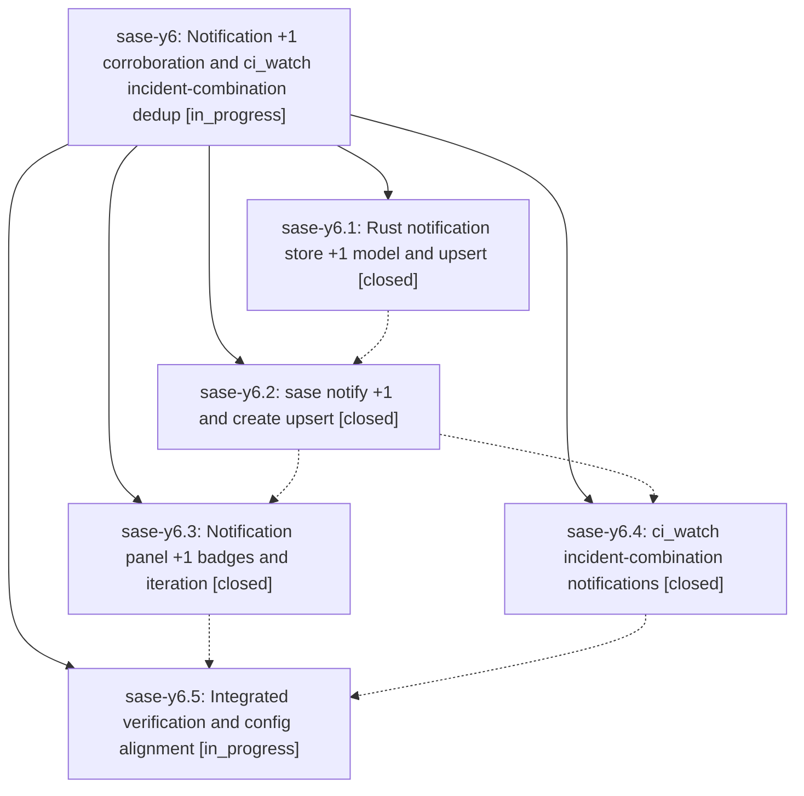

# Bead: sase-y6 — Notification +1 corroboration and ci\_watch incident-combination dedup

[Bead Pages](../README.md) / sase-y6

**Status:** ◐ in_progress · **Type:** ▸ plan · **Tier:** epic
**Owner:** `bryanbugyi34@gmail.com` · **Created by:** [bbugyi200.athena.05k](https://github.com/sase-org/sase--agents/blob/main/families/bbugyi200.athena.05k.md) · **Assignee:** `sase-y6.land`
**Created:** 2026-09-07 17:06:55 EDT
**Plan:** [202609/ci\_watch\_notification\_plus\_one.md](https://github.com/sase-org/sase--plans/blob/main/202609/ci_watch_notification_plus_one.md)

<!-- sase:links:start -->

## Links

| Relation | Artifact | Why |
| --- | --- | --- |
| implemented-by | [plan:202609/ci_watch_notification_plus_one.md][1] | derived from the plan's `bead_id:` frontmatter field |

[1]: https://github.com/sase-org/sase--plans/blob/main/202609/ci_watch_notification_plus_one.md

<!-- sase:links:end -->

## Description

A repeated CI failure adds a quiet, visible +1 note to its existing notification instead of a new notification; a new notification arrives only when a repo that no existing CI-failure notification covers starts failing.

## Phases

| Bead | Title | Status | Size | Created | Agents | Commits |
|---|---|---|---|---|---:|---:|
| [sase-y6.1](sase-y6.1.md) | Rust notification store +1 model and upsert | ✓ closed | medium | 2026-09-07 | 1 | 1 |
| [sase-y6.2](sase-y6.2.md) | sase notify +1 and create upsert | ✓ closed | medium | 2026-09-07 | 1 | 0 |
| [sase-y6.3](sase-y6.3.md) | Notification panel +1 badges and iteration | ✓ closed | medium | 2026-09-07 | 1 | 1 |
| [sase-y6.4](sase-y6.4.md) | ci\_watch incident-combination notifications | ✓ closed | medium | 2026-09-07 | 1 | 0 |
| [sase-y6.5](sase-y6.5.md) | Integrated verification and config alignment | ◐ in_progress | small | 2026-09-07 | 1 | 0 |

## Lineage

## Agents

| Agent | Bead | Commits |
|---|---|---:|
| [bbugyi200.athena.sase-y6.1](https://github.com/sase-org/sase--agents/blob/main/agents/bbugyi200.athena.sase-y6.1/README.md) | [sase-y6.1](sase-y6.1.md) | 1 |
| [bbugyi200.athena.sase-y6.2](https://github.com/sase-org/sase--agents/blob/main/agents/bbugyi200.athena.sase-y6.2/README.md) | [sase-y6.2](sase-y6.2.md) | 0 |
| [bbugyi200.athena.sase-y6.3](https://github.com/sase-org/sase--agents/blob/main/agents/bbugyi200.athena.sase-y6.3/README.md) | [sase-y6.3](sase-y6.3.md) | 1 |
| [bbugyi200.athena.sase-y6.4](https://github.com/sase-org/sase--agents/blob/main/agents/bbugyi200.athena.sase-y6.4/README.md) | [sase-y6.4](sase-y6.4.md) | 0 |
| [bbugyi200.athena.sase-y6.5](https://github.com/sase-org/sase--agents/blob/main/agents/bbugyi200.athena.sase-y6.5/README.md) | [sase-y6.5](sase-y6.5.md) | 0 |
| [bbugyi200.athena.sase-y6.land](https://github.com/sase-org/sase--agents/blob/main/agents/bbugyi200.athena.sase-y6.land/README.md) | [sase-y6](README.md) | 0 |

## Commits

| Repo | Commit | Subject | Bead | Committed |
|---|---|---|---|---|
| sase-core | [`sase-core@a86bb91`](https://github.com/sase-org/sase-core/commit/a86bb91bf4978925d98b877688af3298fe408d96) | feat(notifications): add plus-one entries, dedup key, and create-or-plus-one upsert | [sase-y6.1](sase-y6.1.md) | 2026-09-07 17:39:43 EDT |
| sase | [`5665525`](https://github.com/sase-org/sase/commit/5665525e7f27d90cf2898ca75de9982537267c4d) | feat(notifications): render +1 badges and iterate evidence in the ACE panel | [sase-y6.3](sase-y6.3.md) | 2026-09-08 06:26:37 EDT |
