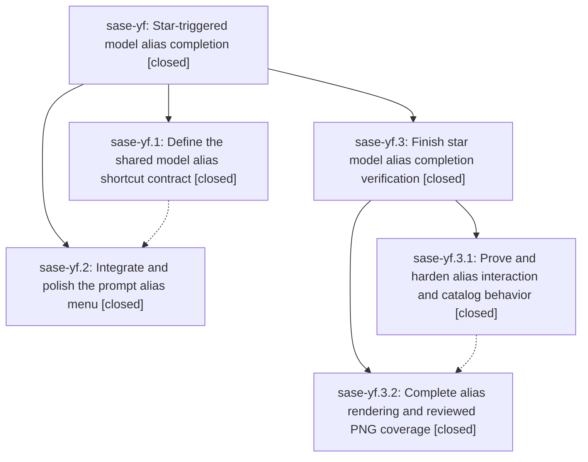

# Bead: sase-yf — Star-triggered model alias completion

[Bead Pages](../README.md) / sase-yf

**Status:** ✓ closed · **Resolution:** done · **Type:** ▸ plan · **Tier:** epic
**Owner:** `bryanbugyi34@gmail.com` · **Created by:** [bbugyi200.athena.087](https://github.com/sase-org/sase--agents/blob/main/families/bbugyi200.athena.087.md) · **Assignee:** `sase-yf.land`
**Created:** 2026-09-08 09:26:01 EDT · **Closed:** 2026-09-09 06:13:26 EDT
**Plan:** [202609/star\_model\_alias\_completion.md](https://github.com/sase-org/sase--plans/blob/main/202609/star_model_alias_completion.md)

<!-- sase:links:start -->

## Links

| Relation | Artifact | Why |
| --- | --- | --- |
| implemented-by | [plan:202609/star_model_alias_completion.md][1] | derived from the plan's `bead_id:` frontmatter field |

[1]: https://github.com/sase-org/sase--plans/blob/main/202609/star_model_alias_completion.md

<!-- sase:links:end -->

## Description

Make choosing any configured model alias fast, clear, and reliable by expanding an accepted prompt-widget star completion into a canonical model directive.

## Notes

[2026-09-09T10:13:26Z · sase-yf.3.land--1] LAND RECHECK of the parent plan bead after child epic sase-yf.3 closed.

DESCENDANTS. sase-yf.1 and sase-yf.2 are CLOSED with verification notes and carry no
PROPOSED FOLLOW-UP entries; child epic sase-yf.3 is CLOSED with its own long verification
note. `sase bead epic-symbols sase-yf` is empty, so no --epic-symbol whitelist entry is
keyed to this bead or its phases.

DELIVERABLES RE-VERIFIED IN THE TREE (not taken from the prior landing note):
- src/sase/ace/tui/modals/help_modal/binding_common.py:45 `("*alias", "Shortcut to
  %m:@alias")` help row.
- src/sase/default_config.yml:310-311 `*alias` comment above `auto_directive_menu: true`.
- docs/ace.md:5666 Model alias shortcut section (whole-star-token rewrite, same-token
  suffix, trailing-space handling); docs/ace.md:6193 auto_directive_menu prose; the
  bare-`%` claim corrected at docs/ace.md:6196.
- docs/configuration.md:1381 table row and :1438 prose.
- sase-core-revision.txt pinned to 4d8fa79 (v0.32.46), matching the pyproject.toml floor
  `sase-core-rs>=0.32.46,<0.33.0`.

POST-CHILD DRIFT, INTEGRATED. origin/master advanced past this workspace's HEAD 986feca08
by 1cad7ed16 (feat(usage): provider usage tracking default-on) and 3b338c208
(perf(wait-deps): cache artifact directory lookups). 1cad7ed16 edits docs/ace.md,
docs/configuration.md and src/sase/default_config.yml -- the same three files carrying
this epic's docs deliverables -- so each deliverable was re-checked against
`git show origin/master:<path>`. All five survive intact at the same content on
origin/master; nothing was clobbered and no re-application is needed. 3b338c208 touches
wait-dependency indexing only. Earlier drift bfeca946d and a41e3c3d4 was already
integrated by the child epic.

VERIFICATION ON THE COMBINED TREE:
- `just check-full` through monitor gnpxe55njpgk: every fmt/lint/validation gate green
  (fmt python+markdown, keep-sorted, ruff, mypy, feature flags, pyscripts, test waits,
  changelog, patch/stitch terminology, symvision, toobig, SASE validation, committed
  plans). The run then stalled at `just test-cost` and was killed by the 20m idle timeout
  -- that is the known sase-x4 hang, not a regression.
- The lanes check-full never reached were driven manually: `selection-health
  --fail-on-new-flake` fails on exactly one node, `tests/pager/test_rendered_link_contract
  .py::test_kitchen_follow_copy_edit_and_media_for_each_supported_action`, and it fails
  byte-identically with this change set stashed away, so it is not ours. Filed as sase-yp.
  test-cost budgets remain the known-stale sase-xc gate.
- `just symvision` clean.
- Diff-scoped selection escalates to FULL_SUITE only from a stale coverage baseline (2118
  commits behind) and the serial budget, not from this diff; the honest 204-file scoped
  selection runs 2494 tests, all passing in 76s.
- 46 alias tests green (38 focused + 8 model-completion PNG tests with all 5 new goldens),
  re-run after `just symvision` rebuilt the linked core from 0.32.50 to 0.32.51.

The advisory core-floor-probe stale_actionable warning is not this epic's; it is owned by
sase-yh/sase-yj per sase-yh note #1.

The phase-2 change set (9 files, +399/-24, plus 5 new PNG goldens) is being committed with
this close; a durable copy is held at /home/bryan/tmp/sase/sase-yf.3-land-backup in case
the commit hook strands it again (sase-yo).

## Phases

| Bead | Title | Status | Size | Created | Agents | Commits |
|---|---|---|---|---|---:|---:|
| [sase-yf.1](sase-yf.1.md) | Define the shared model alias shortcut contract | ✓ closed | small | 2026-09-08 | 1 | 1 |
| [sase-yf.2](sase-yf.2.md) | Integrate and polish the prompt alias menu | ✓ closed | medium | 2026-09-08 | 1 | 1 |

## Lineage

## Agents

| Agent | Bead | Commits |
|---|---|---:|
| [bbugyi200.athena.sase-yf.1](https://github.com/sase-org/sase--agents/blob/main/agents/bbugyi200.athena.sase-yf.1/README.md) | [sase-yf.1](sase-yf.1.md) | 1 |
| [bbugyi200.athena.sase-yf.2](https://github.com/sase-org/sase--agents/blob/main/agents/bbugyi200.athena.sase-yf.2/README.md) | [sase-yf.2](sase-yf.2.md) | 1 |
| [bbugyi200.athena.sase-yf.3.1](https://github.com/sase-org/sase--agents/blob/main/agents/bbugyi200.athena.sase-yf.3.1/README.md) | [sase-yf.3.1](sase-yf.3.1.md) | 2 |
| [bbugyi200.athena.sase-yf.3.2](https://github.com/sase-org/sase--agents/blob/main/agents/bbugyi200.athena.sase-yf.3.2/README.md) | [sase-yf.3.2](sase-yf.3.2.md) | 0 |
| [bbugyi200.athena.sase-yf.3.land](https://github.com/sase-org/sase--agents/blob/main/families/bbugyi200.athena.sase-yf.3.land.md) | [sase-yf.3](sase-yf.3.md) | 1 |
| [bbugyi200.athena.sase-yf.land](https://github.com/sase-org/sase--agents/blob/main/families/bbugyi200.athena.sase-yf.land.md) | [sase-yf](README.md) | 0 |

## Commits

| Repo | Commit | Subject | Bead | Committed |
|---|---|---|---|---|
| sase-core | [`sase-core@be8f552`](https://github.com/sase-org/sase-core/commit/be8f55233bd9648a84b111da1377baab8732da81) | feat(editor): add model alias shortcut contract | [sase-yf.1](sase-yf.1.md) | 2026-09-08 09:54:47 EDT |
| sase | [`a95d7c1`](https://github.com/sase-org/sase/commit/a95d7c1ddfcd34d95b56de75d3ad2265f8e3b1a0) | feat(ace): add prompt model alias shortcut | [sase-yf.2](sase-yf.2.md) | 2026-09-08 12:14:53 EDT |
| sase | [`5620ac0`](https://github.com/sase-org/sase/commit/5620ac028d1a56439705849330f5937946b1fb7b) | fix(model-alias): harden shortcut completion behavior | [sase-yf.3.1](sase-yf.3.1.md) | 2026-09-08 17:10:22 EDT |
| sase-core | [`sase-core@76145a0`](https://github.com/sase-org/sase-core/commit/76145a0de75e1618a4ffd49c76c254f858fc2393) | fix(model-alias): exclude jinja shortcut regions | [sase-yf.3.1](sase-yf.3.1.md) | 2026-09-08 17:20:31 EDT |
| sase | [`00b8f02`](https://github.com/sase-org/sase/commit/00b8f021650b6a5857c5aadd9af2f20e4c7daaf8) | feat(ace): polish the star model alias completion panel | [sase-yf.3](sase-yf.3.md) | 2026-09-09 06:15:55 EDT |
