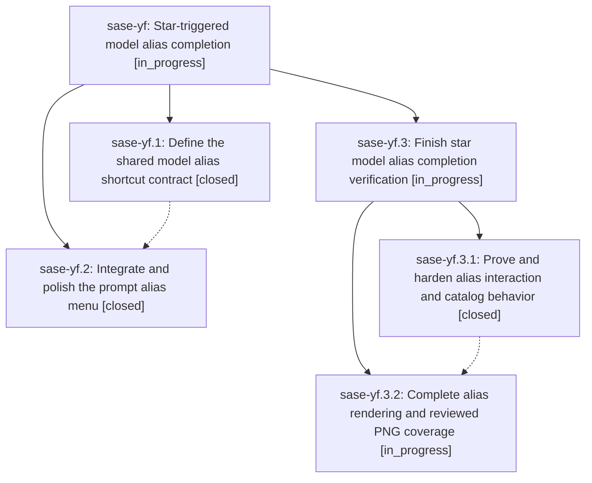

# Bead: sase-yf — Star-triggered model alias completion

[Bead Pages](../README.md) / sase-yf

**Status:** ◐ in_progress · **Type:** ▸ plan · **Tier:** epic
**Owner:** `bryanbugyi34@gmail.com` · **Created by:** [bbugyi200.athena.087](https://github.com/sase-org/sase--agents/blob/main/families/bbugyi200.athena.087.md) · **Assignee:** `sase-yf.land`
**Created:** 2026-09-08 09:26:01 EDT
**Plan:** [202609/star\_model\_alias\_completion.md](https://github.com/sase-org/sase--plans/blob/main/202609/star_model_alias_completion.md)

<!-- sase:links:start -->

## Links

| Relation | Artifact | Why |
| --- | --- | --- |
| implemented-by | [plan:202609/star_model_alias_completion.md][1] | derived from the plan's `bead_id:` frontmatter field |

[1]: https://github.com/sase-org/sase--plans/blob/main/202609/star_model_alias_completion.md

<!-- sase:links:end -->

## Description

Make choosing any configured model alias fast, clear, and reliable by expanding an accepted prompt-widget star completion into a canonical model directive.

## Phases

| Bead | Title | Status | Size | Created | Agents | Commits |
|---|---|---|---|---|---:|---:|
| [sase-yf.1](sase-yf.1.md) | Define the shared model alias shortcut contract | ✓ closed | small | 2026-09-08 | 1 | 1 |
| [sase-yf.2](sase-yf.2.md) | Integrate and polish the prompt alias menu | ✓ closed | medium | 2026-09-08 | 1 | 1 |

## Lineage

## Agents

| Agent | Bead | Commits |
|---|---|---:|
| [bbugyi200.athena.sase-yf.1](https://github.com/sase-org/sase--agents/blob/main/agents/bbugyi200.athena.sase-yf.1/README.md) | [sase-yf.1](sase-yf.1.md) | 1 |
| [bbugyi200.athena.sase-yf.2](https://github.com/sase-org/sase--agents/blob/main/agents/bbugyi200.athena.sase-yf.2/README.md) | [sase-yf.2](sase-yf.2.md) | 1 |
| [bbugyi200.athena.sase-yf.3.1](https://github.com/sase-org/sase--agents/blob/main/agents/bbugyi200.athena.sase-yf.3.1/README.md) | [sase-yf.3.1](sase-yf.3.1.md) | 2 |
| [bbugyi200.athena.sase-yf.3.2](https://github.com/sase-org/sase--agents/blob/main/agents/bbugyi200.athena.sase-yf.3.2/README.md) | [sase-yf.3.2](sase-yf.3.2.md) | 0 |
| [bbugyi200.athena.sase-yf.3.land](https://github.com/sase-org/sase--agents/blob/main/agents/bbugyi200.athena.sase-yf.3.land/README.md) | [sase-yf.3](sase-yf.3.md) | 0 |
| [bbugyi200.athena.sase-yf.land](https://github.com/sase-org/sase--agents/blob/main/families/bbugyi200.athena.sase-yf.land.md) | [sase-yf](README.md) | 0 |

## Commits

| Repo | Commit | Subject | Bead | Committed |
|---|---|---|---|---|
| sase-core | [`sase-core@be8f552`](https://github.com/sase-org/sase-core/commit/be8f55233bd9648a84b111da1377baab8732da81) | feat(editor): add model alias shortcut contract | [sase-yf.1](sase-yf.1.md) | 2026-09-08 09:54:47 EDT |
| sase | [`a95d7c1`](https://github.com/sase-org/sase/commit/a95d7c1ddfcd34d95b56de75d3ad2265f8e3b1a0) | feat(ace): add prompt model alias shortcut | [sase-yf.2](sase-yf.2.md) | 2026-09-08 12:14:53 EDT |
| sase | [`5620ac0`](https://github.com/sase-org/sase/commit/5620ac028d1a56439705849330f5937946b1fb7b) | fix(model-alias): harden shortcut completion behavior | [sase-yf.3.1](sase-yf.3.1.md) | 2026-09-08 17:10:22 EDT |
| sase-core | [`sase-core@76145a0`](https://github.com/sase-org/sase-core/commit/76145a0de75e1618a4ffd49c76c254f858fc2393) | fix(model-alias): exclude jinja shortcut regions | [sase-yf.3.1](sase-yf.3.1.md) | 2026-09-08 17:20:31 EDT |
