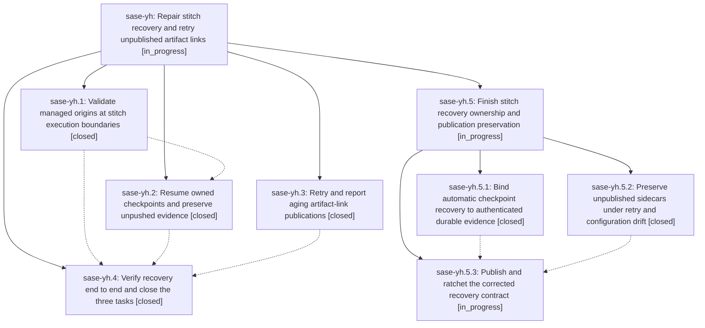

# Bead: sase-yh — Repair stitch recovery and retry unpublished artifact links

[Bead Pages](../README.md) / sase-yh

**Status:** ◐ in_progress · **Type:** ▸ plan · **Tier:** epic
**Owner:** `bryanbugyi34@gmail.com` · **Created by:** [bbugyi200.athena.08g](https://github.com/sase-org/sase--agents/blob/main/families/bbugyi200.athena.08g.md) · **Assignee:** `sase-yh.land`
**Created:** 2026-09-08 12:24:38 EDT
**Plan:** [202609/stitch\_resume\_publication\_recovery.md](https://github.com/sase-org/sase--plans/blob/main/202609/stitch_resume_publication_recovery.md)

<!-- sase:links:start -->

## Links

| Relation | Artifact | Why |
| --- | --- | --- |
| implemented-by | [plan:202609/stitch_resume_publication_recovery.md][1] | derived from the plan's `bead_id:` frontmatter field |
| related | [bead:sase-yo][2] | sase-yh is the active stitch-recovery epic and the natural home for this repair, but it did not cause this: the hook failed on disk space, not on origin reconciliation or resume |

[1]: https://github.com/sase-org/sase--plans/blob/main/202609/stitch_resume_publication_recovery.md
[2]: https://github.com/sase-org/sase--beads/blob/main/pages/sase-yo/README.md

<!-- sase:links:end -->

## Description

Prevent stale workspace origins from breaking stitch resume, finish run-owned pending stitch steps without duplicating commits or completed tracking, retry stranded artifact-link publications, and complete and close sase-yg, sase-xi, and sase-ye with verified evidence.

## Notes

[2026-09-09T01:25:46Z · sase-xe.16.land--1] DISCOVERED ISSUE: Remote-dispatch landing monitor kfbm6fy1sy53 ran just check on unchanged sase HEAD 890660e25 (2026-09-09 01:15-01:19 UTC), overall exit 0, but its advisory core-floor probe reports stale_actionable: pyproject.toml permits 0.32.46 while current callers need newer published bindings. This epic's phases sase-yh.1 and sase-yh.3 introduced decide_managed_origin_reconciliation (core d9ee8c2, released v0.32.48) and five artifact_link_publication_* bindings (ff0a72e, v0.32.47); corresponding Python commits are 3ec9b78b2 and 46f7f549e. Please include the published dependency-floor ratchet in combined-tree landing verification; source-built 0.32.50 masks the minimum-install gap. The same probe lists three queue bindings from active epic sase-yj (v0.32.50) and four eligibility/release-evidence bindings from dd1f829c2 (v0.32.48); one coordinated floor bump to a published release containing all 13 resolves the entire warning. Full evidence: file:explicit:831bc61700629257ea205a90. /sase_new_task searched matching tasks, all recent task types and active epics: sase-wg/sase-xn cover older distinct requirements already below 0.32.46, so neither was +1'ed. Routed to the causally responsible active epics rather than opening redundant floor tasks.

[2026-09-09T11:12:48Z · sase-yh.land] LAND AUDIT (remaining work): Reviewed the epic plan and every note on sase-yh and closed children sase-yh.1 through sase-yh.4; inspected the reported main commits 46f7f549e/3ec9b78b2/4068437a2, core commits ff0a72e/d9ee8c2/03ec116, github commit d09ee25, current source, and post-epic integration commits through main HEAD 4068437a2. Managed-origin reconciliation and the post-split callers are integrated, but the epic is not complete: automatic checkpoint recovery does not authenticate run/agent or full payload identity, legacy ownership is asserted unconditionally, persistence failures can be reported as durable success, publication retry treats missing upstream as success, remote drift can replace an unpublished hidden clone, probes/locks are not clipped to the chop deadline, role traversal can starve later roots, required retry regressions are absent, and the published core floor does not yet contain the corrected contract. sase bead epic-symbols sase-yh listed no entries. I prepared and validated the child epic plan Finish stitch recovery ownership and publication preservation with parent_bead sase-yh. Follow-ups: yh.1 note #1 corroborated/reopened sase-lk with verified-after-close evidence; yh.1 note #2 corroborated sase-xb; yh.4 note #1 was declined as a new task because the identical queue failures are already recorded on causally responsible active epic sase-yj and flag sase-yl; yh.4 note #2 corroborated sase-ym; yh.4 note #3 remains an unconfirmed single TUI timeout and is assigned a rerun in the child landing, with task creation only after fail-then-pass confirmation. The parent remains open pending the child.

## Phases

| Bead | Title | Status | Size | Created | Agents | Commits |
|---|---|---|---|---|---:|---:|
| [sase-yh.1](sase-yh.1.md) | Validate managed origins at stitch execution boundaries | ✓ closed | medium | 2026-09-08 | 1 | 2 |
| [sase-yh.2](sase-yh.2.md) | Resume owned checkpoints and preserve unpushed evidence | ✓ closed | medium | 2026-09-08 | 0 | 0 |
| [sase-yh.3](sase-yh.3.md) | Retry and report aging artifact-link publications | ✓ closed | medium | 2026-09-08 | 1 | 2 |
| [sase-yh.4](sase-yh.4.md) | Verify recovery end to end and close the three tasks | ✓ closed | medium | 2026-09-08 | 1 | 2 |

## Lineage

## Agents

| Agent | Bead | Commits |
|---|---|---:|
| [bbugyi200.athena.sase-yh.1](https://github.com/sase-org/sase--agents/blob/main/agents/bbugyi200.athena.sase-yh.1/README.md) | [sase-yh.1](sase-yh.1.md) | 2 |
| [bbugyi200.athena.sase-yh.3](https://github.com/sase-org/sase--agents/blob/main/agents/bbugyi200.athena.sase-yh.3/README.md) | [sase-yh.3](sase-yh.3.md) | 2 |
| [bbugyi200.athena.sase-yh.4](https://github.com/sase-org/sase--agents/blob/main/families/bbugyi200.athena.sase-yh.4.md) | [sase-yh.4](sase-yh.4.md) | 2 |
| [bbugyi200.athena.sase-yh.5.1](https://github.com/sase-org/sase--agents/blob/main/agents/bbugyi200.athena.sase-yh.5.1/README.md) | [sase-yh.5.1](sase-yh.5.1.md) | 2 |
| [bbugyi200.athena.sase-yh.5.2](https://github.com/sase-org/sase--agents/blob/main/agents/bbugyi200.athena.sase-yh.5.2/README.md) | [sase-yh.5.2](sase-yh.5.2.md) | 1 |
| [bbugyi200.athena.sase-yh.5.3](https://github.com/sase-org/sase--agents/blob/main/agents/bbugyi200.athena.sase-yh.5.3/README.md) | [sase-yh.5.3](sase-yh.5.3.md) | 1 |
| [bbugyi200.athena.sase-yh.5.land](https://github.com/sase-org/sase--agents/blob/main/agents/bbugyi200.athena.sase-yh.5.land/README.md) | [sase-yh.5](sase-yh.5.md) | 0 |
| [bbugyi200.athena.sase-yh.land](https://github.com/sase-org/sase--agents/blob/main/families/bbugyi200.athena.sase-yh.land.md) | [sase-yh](README.md) | 0 |

## Commits

| Repo | Commit | Subject | Bead | Committed |
|---|---|---|---|---|
| sase | [`46f7f54`](https://github.com/sase-org/sase/commit/46f7f549ef2edc9d4e7f9136d810786cb9792b48) | fix(sdd): retry unpublished artifact-link sidecars | [sase-yh.3](sase-yh.3.md) | 2026-09-08 16:48:27 EDT |
| sase-core | [`sase-core@ff0a72e`](https://github.com/sase-org/sase-core/commit/ff0a72e1f060130d34e49af4c8b8ba94666db453) | feat(artifact-link): add publication retry policy | [sase-yh.3](sase-yh.3.md) | 2026-09-08 16:50:16 EDT |
| sase | [`3ec9b78`](https://github.com/sase-org/sase/commit/3ec9b78b2e128554f281409e80043f77888418db) | fix(workspace): reconcile managed clone origins before stitch | [sase-yh.1](sase-yh.1.md) | 2026-09-08 17:16:31 EDT |
| sase-core | [`sase-core@d9ee8c2`](https://github.com/sase-org/sase-core/commit/d9ee8c2e3f6c0fee952f7cc4fe109b624d05c311) | feat(core): decide managed origin reconciliation | [sase-yh.1](sase-yh.1.md) | 2026-09-08 17:20:58 EDT |
| sase | [`4068437`](https://github.com/sase-org/sase/commit/4068437a2c231e9b0826f18db33b48890cc83c7c) | fix(commit): resume pending checkpoints and record unpushed stitch evidence | [sase-yh.4](sase-yh.4.md) | 2026-09-09 06:43:20 EDT |
| sase-core | [`sase-core@03ec116`](https://github.com/sase-org/sase-core/commit/03ec116f6a15bfbbefecc394dc1786f0b7c216e0) | feat(core): decide pending commit checkpoint recovery | [sase-yh.4](sase-yh.4.md) | 2026-09-09 06:45:42 EDT |
| sase | [`27bbd2f`](https://github.com/sase-org/sase/commit/27bbd2f4e4bcab9c364b175ad44c3fa24e13250d) | fix(commit): authenticate checkpoint recovery evidence | [sase-yh.5.1](sase-yh.5.1.md) | 2026-09-09 08:20:06 EDT |
| sase-core | [`sase-core@7af2640`](https://github.com/sase-org/sase-core/commit/7af26400fbca87eb70102c7082a1b029c65e310b) | fix(core): authenticate pending checkpoint recovery | [sase-yh.5.1](sase-yh.5.1.md) | 2026-09-09 08:21:04 EDT |
| sase | [`a1b08d0`](https://github.com/sase-org/sase/commit/a1b08d06c9b0419c96d91b76f8dc77a78bee82a0) | fix(sdd): preserve unpublished artifact sidecars | [sase-yh.5.2](sase-yh.5.2.md) | 2026-09-09 08:37:10 EDT |
| sase-core | [`sase-core@c2161c7`](https://github.com/sase-org/sase-core/commit/c2161c770437f39af0d9fe7d52db5d9a8107b2cf) | style(core): format xprompt LSP test | [sase-yh.5.3](sase-yh.5.3.md) | 2026-09-09 08:56:29 EDT |
