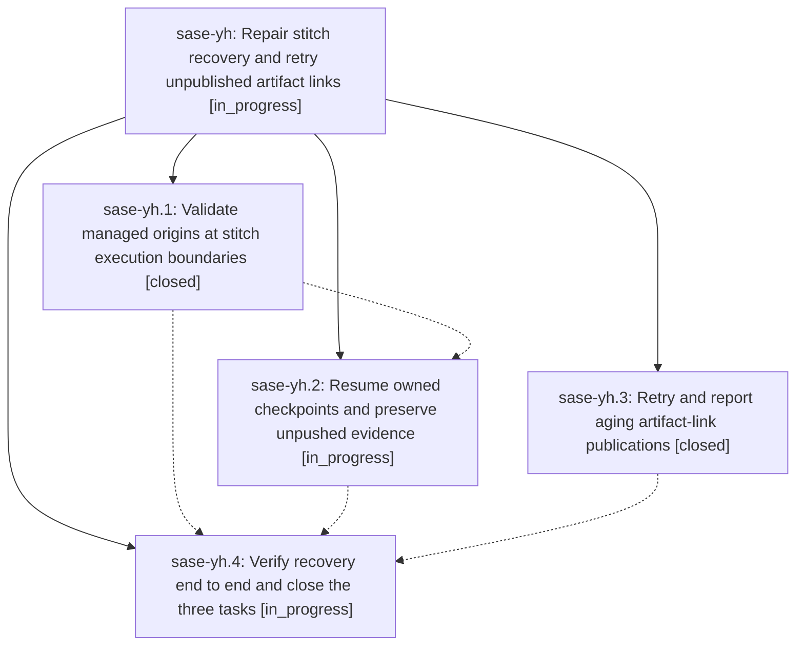

# Bead: sase-yh — Repair stitch recovery and retry unpublished artifact links

[Bead Pages](../README.md) / sase-yh

**Status:** ◐ in_progress · **Type:** ▸ plan · **Tier:** epic
**Owner:** `bryanbugyi34@gmail.com` · **Created by:** [bbugyi200.athena.08g](https://github.com/sase-org/sase--agents/blob/main/families/bbugyi200.athena.08g.md) · **Assignee:** `sase-yh.land`
**Created:** 2026-09-08 12:24:38 EDT
**Plan:** [202609/stitch\_resume\_publication\_recovery.md](https://github.com/sase-org/sase--plans/blob/main/202609/stitch_resume_publication_recovery.md)

<!-- sase:links:start -->

## Links

| Relation | Artifact | Why |
| --- | --- | --- |
| implemented-by | [plan:202609/stitch_resume_publication_recovery.md][1] | derived from the plan's `bead_id:` frontmatter field |

[1]: https://github.com/sase-org/sase--plans/blob/main/202609/stitch_resume_publication_recovery.md

<!-- sase:links:end -->

## Description

Prevent stale workspace origins from breaking stitch resume, finish run-owned pending stitch steps without duplicating commits or completed tracking, retry stranded artifact-link publications, and complete and close sase-yg, sase-xi, and sase-ye with verified evidence.

## Phases

| Bead | Title | Status | Size | Created | Agents | Commits |
|---|---|---|---|---|---:|---:|
| [sase-yh.1](sase-yh.1.md) | Validate managed origins at stitch execution boundaries | ✓ closed | medium | 2026-09-08 | 1 | 2 |
| [sase-yh.2](sase-yh.2.md) | Resume owned checkpoints and preserve unpushed evidence | ◐ in_progress | medium | 2026-09-08 | 1 | 0 |
| [sase-yh.3](sase-yh.3.md) | Retry and report aging artifact-link publications | ✓ closed | medium | 2026-09-08 | 1 | 2 |
| [sase-yh.4](sase-yh.4.md) | Verify recovery end to end and close the three tasks | ◐ in_progress | medium | 2026-09-08 | 1 | 0 |

## Lineage

## Agents

| Agent | Bead | Commits |
|---|---|---:|
| [bbugyi200.athena.sase-yh.1](https://github.com/sase-org/sase--agents/blob/main/agents/bbugyi200.athena.sase-yh.1/README.md) | [sase-yh.1](sase-yh.1.md) | 2 |
| [bbugyi200.athena.sase-yh.2](https://github.com/sase-org/sase--agents/blob/main/agents/bbugyi200.athena.sase-yh.2/README.md) | [sase-yh.2](sase-yh.2.md) | 0 |
| [bbugyi200.athena.sase-yh.3](https://github.com/sase-org/sase--agents/blob/main/agents/bbugyi200.athena.sase-yh.3/README.md) | [sase-yh.3](sase-yh.3.md) | 2 |
| [bbugyi200.athena.sase-yh.4](https://github.com/sase-org/sase--agents/blob/main/agents/bbugyi200.athena.sase-yh.4/README.md) | [sase-yh.4](sase-yh.4.md) | 0 |
| [bbugyi200.athena.sase-yh.land](https://github.com/sase-org/sase--agents/blob/main/agents/bbugyi200.athena.sase-yh.land/README.md) | [sase-yh](README.md) | 0 |

## Commits

| Repo | Commit | Subject | Bead | Committed |
|---|---|---|---|---|
| sase | [`46f7f54`](https://github.com/sase-org/sase/commit/46f7f549ef2edc9d4e7f9136d810786cb9792b48) | fix(sdd): retry unpublished artifact-link sidecars | [sase-yh.3](sase-yh.3.md) | 2026-09-08 16:48:27 EDT |
| sase-core | [`sase-core@ff0a72e`](https://github.com/sase-org/sase-core/commit/ff0a72e1f060130d34e49af4c8b8ba94666db453) | feat(artifact-link): add publication retry policy | [sase-yh.3](sase-yh.3.md) | 2026-09-08 16:50:16 EDT |
| sase | [`3ec9b78`](https://github.com/sase-org/sase/commit/3ec9b78b2e128554f281409e80043f77888418db) | fix(workspace): reconcile managed clone origins before stitch | [sase-yh.1](sase-yh.1.md) | 2026-09-08 17:16:31 EDT |
| sase-core | [`sase-core@d9ee8c2`](https://github.com/sase-org/sase-core/commit/d9ee8c2e3f6c0fee952f7cc4fe109b624d05c311) | feat(core): decide managed origin reconciliation | [sase-yh.1](sase-yh.1.md) | 2026-09-08 17:20:58 EDT |
