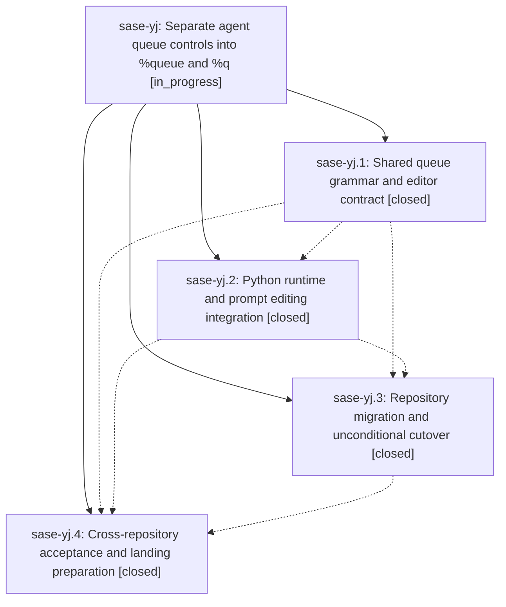

# Bead: sase-yj — Separate agent queue controls into %queue and %q

[Bead Pages](../README.md) / sase-yj

**Status:** ◐ in_progress · **Type:** ▸ plan · **Tier:** epic
**Owner:** `bryanbugyi34@gmail.com` · **Created by:** [bbugyi200.athena.09b](https://github.com/sase-org/sase--agents/blob/main/families/bbugyi200.athena.09b.md) · **Assignee:** `sase-yj.land`
**Created:** 2026-09-08 17:56:08 EDT
**Plan:** [202609/queue\_directive.md](https://github.com/sase-org/sase--plans/blob/main/202609/queue_directive.md)

<!-- sase:links:start -->

## Links

| Relation | Artifact | Why |
| --- | --- | --- |
| implemented-by | [plan:202609/queue_directive.md][1] | derived from the plan's `bead_id:` frontmatter field |

[1]: https://github.com/sase-org/sase--plans/blob/main/202609/queue_directive.md

<!-- sase:links:end -->

## Description

Move runners and priority from %wait to %queue, support positional runners and p=, preserve admission behavior, provide matching ACE and LSP completion, and migrate maintained prompt producers and documentation across linked repositories.

## Notes

[2026-09-09T01:26:46Z · sase-xe.16.land--1] DISCOVERED ISSUE: Independent remote-dispatch landing check on unchanged sase HEAD 890660e25 (monitor kfbm6fy1sy53, 2026-09-09 01:15-01:19 UTC) passed overall but reported a stale published core floor. pyproject.toml still permits sase-core-rs 0.32.46; the probe names collect_queue_fields, format_queue_directive, and queue_directive_flag_key as absent there and first released by core commit 2d8b662 in v0.32.50. Python c235300c6 / phase sase-yj.2 consumes the queue surface. Include the published floor ratchet and installed binding/LSP parity in this epic's acceptance. One coordinated floor bump to a published release carrying every current binding also resolves six retry/origin capabilities routed to sase-yh and four eligibility capabilities from dd1f829c2, for 13 total. Full exact probe output: file:explicit:831bc61700629257ea205a90. Existing sase-xn and sase-wg track older distinct requirements, so this evidence was routed to active causal epics via /sase_new_task without duplicate tasks.

[2026-09-09T02:14:30Z · toobig-50.test_view_files_pager.0] DISCOVERED ISSUE: During unrelated view-file pager test splitting at sase HEAD 67f2ca6040cf914f89862be5cf7948c56a09002a, just check escalated to the full suite (core-identity-changed) and failed 12 queue-directive nodes after the split's focused pager tests passed. Focused rerun still fails tests/test_queue_directive.py::test_typed_launch_parses_queue_and_rebuilds_canonical_prompt with ValueError: %queue requires the queue_directive feature flag, and tests/test_xprompt_directive_contract.py::test_runtime_directive_vocabulary_matches_core_contract because core still reports priority/runners under wait rather than queue. The local diff only moves tests/ace/tui/actions/test_view_files_pager.py into focused pager test modules, so this is not caused by the split. Please fold this deterministic reproduction into the %queue/%q acceptance and published core-floor/flag-retirement work.

[2026-09-09T06:48:28Z · toobig-51.utils.0--1] DISCOVERED ISSUE: Independent reproduction during unrelated workspace_provider.utils split verification (toobig-51.utils.0) at HEAD c6387f3b6. just check-full (monitor 68d66pa1d3gt, 2026-09-09T06:15-06:36Z) passed 39839 tests then failed 12 queue-directive nodes plus one pager collection error tracked separately as sase-ym. Representative failures: tests/test_queue_directive.py::test_typed_launch_parses_queue_and_rebuilds_canonical_prompt raises ValueError: %queue requires the queue_directive feature flag; tests/test_xprompt_directive_contract.py::test_runtime_directive_vocabulary_matches_core_contract still sees wait=(agent, bead, priority, proc, runners, time, ...) vs core wait without priority/runners; ACE/LSP completion parity still omits %queue/%q. The local diff only splits src/sase/workspace_provider/utils.py into _utils_git/_utils_origin/_utils_checkout plus a facade; it does not touch xprompt, flags, or sase-core. Please fold this into sase-yj.4 acceptance and the sase-yl flag-retirement/core-floor work. Corroborates note #2 from toobig-50.test_view_files_pager.0.

[2026-09-09T07:22:26Z · toobig-51.model_completion.0] DISCOVERED ISSUE: During unrelated model_completion.py splitting on 2026-09-09, just check passed formatting, ruff, mypy, feature-flag lint, pyscripts, wait/changelog/terminology lint, Symvision, toobig, and SASE validation, then failed only the diff-scoped pytest lane after selecting 249 files. The deterministic failures were tests/test_xprompt_directive_completion_parity.py::test_ace_and_lsp_include_queue_directive, the three queue argument parametrizations for %queue( / %q( / %q:, and test_wait_keywords_exclude_queue_fields. ACE and LSP agreed when queue_directive was absent, while the tests expect the post-migration %queue surface; briefly passing the legacy Rust queue_directive key restored ACE rows but exposed the already-known LSP/env and stale wait-test expectations, so the model-completion split was kept isolated. This corroborates notes #2/#3 and belongs to this epic's queue flag-retirement/core-floor acceptance work.

## Phases

| Bead | Title | Status | Size | Created | Agents | Commits |
|---|---|---|---|---|---:|---:|
| [sase-yj.1](sase-yj.1.md) | Shared queue grammar and editor contract | ✓ closed | medium | 2026-09-08 | 1 | 2 |
| [sase-yj.2](sase-yj.2.md) | Python runtime and prompt editing integration | ✓ closed | medium | 2026-09-08 | 1 | 1 |
| [sase-yj.3](sase-yj.3.md) | Repository migration and unconditional cutover | ✓ closed | medium | 2026-09-08 | 1 | 2 |
| [sase-yj.4](sase-yj.4.md) | Cross-repository acceptance and landing preparation | ✓ closed | medium | 2026-09-08 | 1 | 2 |

## Lineage

## Agents

| Agent | Bead | Commits |
|---|---|---:|
| [bbugyi200.athena.sase-yj.1](https://github.com/sase-org/sase--agents/blob/main/families/bbugyi200.athena.sase-yj.1.md) | [sase-yj.1](sase-yj.1.md) | 2 |
| [bbugyi200.athena.sase-yj.2](https://github.com/sase-org/sase--agents/blob/main/agents/bbugyi200.athena.sase-yj.2/README.md) | [sase-yj.2](sase-yj.2.md) | 1 |
| [bbugyi200.athena.sase-yj.3](https://github.com/sase-org/sase--agents/blob/main/agents/bbugyi200.athena.sase-yj.3/README.md) | [sase-yj.3](sase-yj.3.md) | 2 |
| [bbugyi200.athena.sase-yj.4](https://github.com/sase-org/sase--agents/blob/main/agents/bbugyi200.athena.sase-yj.4/README.md) | [sase-yj.4](sase-yj.4.md) | 2 |
| [bbugyi200.athena.sase-yj.land](https://github.com/sase-org/sase--agents/blob/main/agents/bbugyi200.athena.sase-yj.land/README.md) | [sase-yj](README.md) | 0 |

## Commits

| Repo | Commit | Subject | Bead | Committed |
|---|---|---|---|---|
| sase | [`c235300`](https://github.com/sase-org/sase/commit/c235300c6228bdd28f806760bdbd15284aa242c9) | feat(xprompt): add thin Python adapter for shared %queue/%q contract | [sase-yj.1](sase-yj.1.md) | 2026-09-08 19:51:35 EDT |
| sase-core | [`sase-core@2d8b662`](https://github.com/sase-org/sase-core/commit/2d8b66269bfe2d779612c79ae4beec64716f5464) | feat(core): add shared %queue/%q contract behind queue\_directive flag | [sase-yj.1](sase-yj.1.md) | 2026-09-08 19:55:39 EDT |
| sase | [`0770357`](https://github.com/sase-org/sase/commit/0770357cd84dfc16b7bd1ac59f0bfae3dc3408b7) | feat(xprompt): wire queue directive into python runtime | [sase-yj.2](sase-yj.2.md) | 2026-09-08 20:48:30 EDT |
| sase | [`3f23a53`](https://github.com/sase-org/sase/commit/3f23a53745761c38d0c25a268f634d98b5720bdf) | refactor(xprompt): retire wait\_queue flag, make %queue directive unconditional | [sase-yj.3](sase-yj.3.md) | 2026-09-08 21:37:51 EDT |
| chezmoi | [`chezmoi@93e4fd2`](https://github.com/bbugyi200/dotfiles/commit/93e4fd2b744fe43dfbe1e07036ab0d560f9cd500) | refactor(config): switch runners abbreviation to %q directive | [sase-yj.3](sase-yj.3.md) | 2026-09-08 21:40:40 EDT |
| sase | [`ff6271e`](https://github.com/sase-org/sase/commit/ff6271e53ad2a0f87a961e9c05c4a2b4da549a68) | chore(xprompt): require queue directive core support | [sase-yj.4](sase-yj.4.md) | 2026-09-09 06:23:40 EDT |
| sase-research-artifacts | [`sase-research-artifacts@cebc7c4`](https://github.com/sase-org/sase-research-artifacts/commit/cebc7c4c6a1403f9df7e0bdf40681f1d898b935d) | fix(xprompts): emit queue priority directive | [sase-yj.4](sase-yj.4.md) | 2026-09-09 06:26:21 EDT |
