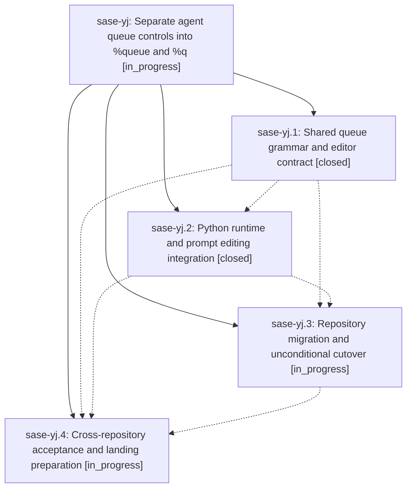

# Bead: sase-yj — Separate agent queue controls into %queue and %q

[Bead Pages](../README.md) / sase-yj

**Status:** ◐ in_progress · **Type:** ▸ plan · **Tier:** epic
**Owner:** `bryanbugyi34@gmail.com` · **Created by:** [bbugyi200.athena.09b](https://github.com/sase-org/sase--agents/blob/main/families/bbugyi200.athena.09b.md) · **Assignee:** `sase-yj.land`
**Created:** 2026-09-08 17:56:08 EDT
**Plan:** [202609/queue\_directive.md](https://github.com/sase-org/sase--plans/blob/main/202609/queue_directive.md)

<!-- sase:links:start -->

## Links

| Relation | Artifact | Why |
| --- | --- | --- |
| implemented-by | [plan:202609/queue_directive.md][1] | derived from the plan's `bead_id:` frontmatter field |

[1]: https://github.com/sase-org/sase--plans/blob/main/202609/queue_directive.md

<!-- sase:links:end -->

## Description

Move runners and priority from %wait to %queue, support positional runners and p=, preserve admission behavior, provide matching ACE and LSP completion, and migrate maintained prompt producers and documentation across linked repositories.

## Phases

| Bead | Title | Status | Size | Created | Agents | Commits |
|---|---|---|---|---|---:|---:|
| [sase-yj.1](sase-yj.1.md) | Shared queue grammar and editor contract | ✓ closed | medium | 2026-09-08 | 1 | 2 |
| [sase-yj.2](sase-yj.2.md) | Python runtime and prompt editing integration | ✓ closed | medium | 2026-09-08 | 1 | 1 |
| [sase-yj.3](sase-yj.3.md) | Repository migration and unconditional cutover | ◐ in_progress | medium | 2026-09-08 | 1 | 0 |
| [sase-yj.4](sase-yj.4.md) | Cross-repository acceptance and landing preparation | ◐ in_progress | medium | 2026-09-08 | 1 | 0 |

## Lineage

## Agents

| Agent | Bead | Commits |
|---|---|---:|
| [bbugyi200.athena.sase-yj.1](https://github.com/sase-org/sase--agents/blob/main/families/bbugyi200.athena.sase-yj.1.md) | [sase-yj.1](sase-yj.1.md) | 2 |
| [bbugyi200.athena.sase-yj.2](https://github.com/sase-org/sase--agents/blob/main/agents/bbugyi200.athena.sase-yj.2/README.md) | [sase-yj.2](sase-yj.2.md) | 1 |
| [bbugyi200.athena.sase-yj.3](https://github.com/sase-org/sase--agents/blob/main/agents/bbugyi200.athena.sase-yj.3/README.md) | [sase-yj.3](sase-yj.3.md) | 0 |
| [bbugyi200.athena.sase-yj.4](https://github.com/sase-org/sase--agents/blob/main/agents/bbugyi200.athena.sase-yj.4/README.md) | [sase-yj.4](sase-yj.4.md) | 0 |
| [bbugyi200.athena.sase-yj.land](https://github.com/sase-org/sase--agents/blob/main/agents/bbugyi200.athena.sase-yj.land/README.md) | [sase-yj](README.md) | 0 |

## Commits

| Repo | Commit | Subject | Bead | Committed |
|---|---|---|---|---|
| sase | [`c235300`](https://github.com/sase-org/sase/commit/c235300c6228bdd28f806760bdbd15284aa242c9) | feat(xprompt): add thin Python adapter for shared %queue/%q contract | [sase-yj.1](sase-yj.1.md) | 2026-09-08 19:51:35 EDT |
| sase-core | [`sase-core@2d8b662`](https://github.com/sase-org/sase-core/commit/2d8b66269bfe2d779612c79ae4beec64716f5464) | feat(core): add shared %queue/%q contract behind queue\_directive flag | [sase-yj.1](sase-yj.1.md) | 2026-09-08 19:55:39 EDT |
| sase | [`0770357`](https://github.com/sase-org/sase/commit/0770357cd84dfc16b7bd1ac59f0bfae3dc3408b7) | feat(xprompt): wire queue directive into python runtime | [sase-yj.2](sase-yj.2.md) | 2026-09-08 20:48:30 EDT |
