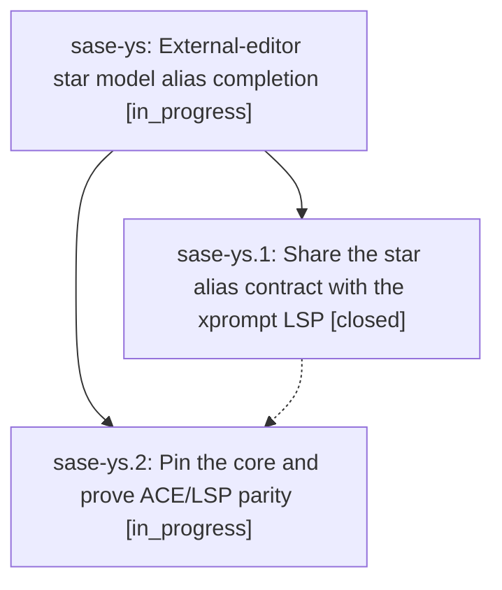

# Bead: sase-ys — External-editor star model alias completion

[Bead Pages](../README.md) / sase-ys

**Status:** ◐ in_progress · **Type:** ▸ plan · **Tier:** epic
**Owner:** `bryanbugyi34@gmail.com` · **Created by:** [bbugyi200.athena.sase-yf.land.w3](https://github.com/sase-org/sase--agents/blob/main/families/bbugyi200.athena.sase-yf.land.w3.md) · **Assignee:** `sase-ys.land`
**Created:** 2026-09-09 06:57:13 EDT
**Plan:** [202609/lsp\_star\_model\_alias\_completion.md](https://github.com/sase-org/sase--plans/blob/main/202609/lsp_star_model_alias_completion.md)

<!-- sase:links:start -->

## Links

| Relation | Artifact | Why |
| --- | --- | --- |
| implemented-by | [plan:202609/lsp_star_model_alias_completion.md][1] | derived from the plan's `bead_id:` frontmatter field |

[1]: https://github.com/sase-org/sase--plans/blob/main/202609/lsp_star_model_alias_completion.md

<!-- sase:links:end -->

## Description

Give xprompt LSP clients the same safe, canonical star-triggered model alias expansion as the ACE prompt input widget.

## Phases

| Bead | Title | Status | Size | Created | Agents | Commits |
|---|---|---|---|---|---:|---:|
| [sase-ys.1](sase-ys.1.md) | Share the star alias contract with the xprompt LSP | ✓ closed | medium | 2026-09-09 | 1 | 1 |
| [sase-ys.2](sase-ys.2.md) | Pin the core and prove ACE/LSP parity | ◐ in_progress | medium | 2026-09-09 | 1 | 0 |

## Lineage

## Agents

| Agent | Bead | Commits |
|---|---|---:|
| [bbugyi200.athena.sase-ys.1](https://github.com/sase-org/sase--agents/blob/main/agents/bbugyi200.athena.sase-ys.1/README.md) | [sase-ys.1](sase-ys.1.md) | 1 |
| [bbugyi200.athena.sase-ys.2](https://github.com/sase-org/sase--agents/blob/main/agents/bbugyi200.athena.sase-ys.2/README.md) | [sase-ys.2](sase-ys.2.md) | 0 |
| [bbugyi200.athena.sase-ys.land](https://github.com/sase-org/sase--agents/blob/main/agents/bbugyi200.athena.sase-ys.land/README.md) | [sase-ys](README.md) | 0 |

## Commits

| Repo | Commit | Subject | Bead | Committed |
|---|---|---|---|---|
| sase-core | [`sase-core@cb669ec`](https://github.com/sase-org/sase-core/commit/cb669ec96526294cb14b07cd936c28b8b39be9bc) | feat(editor): share the star model-alias shortcut contract with the xprompt LSP | [sase-ys.1](sase-ys.1.md) | 2026-09-09 07:30:41 EDT |
