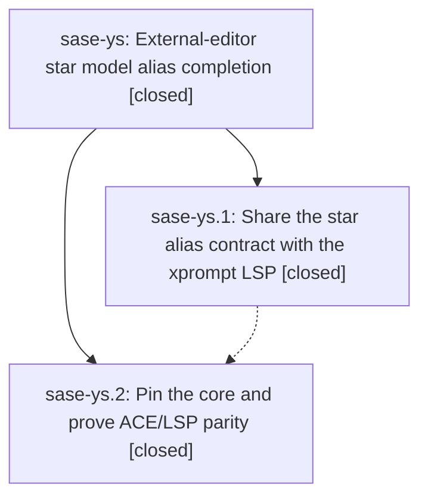

# Bead: sase-ys — External-editor star model alias completion

[Bead Pages](../README.md) / sase-ys

**Status:** ✓ closed · **Resolution:** done · **Type:** ▸ plan · **Tier:** epic
**Owner:** `bryanbugyi34@gmail.com` · **Created by:** [bbugyi200.athena.sase-yf.land.w3](https://github.com/sase-org/sase--agents/blob/main/families/bbugyi200.athena.sase-yf.land.w3.md) · **Assignee:** `sase-ys.land`
**Created:** 2026-09-09 06:57:13 EDT · **Closed:** 2026-09-09 10:38:36 EDT
**Plan:** [202609/lsp\_star\_model\_alias\_completion.md](https://github.com/sase-org/sase--plans/blob/main/202609/lsp_star_model_alias_completion.md)

<!-- sase:links:start -->

## Links

| Relation | Artifact | Why |
| --- | --- | --- |
| implemented-by | [plan:202609/lsp_star_model_alias_completion.md][1] | derived from the plan's `bead_id:` frontmatter field |

[1]: https://github.com/sase-org/sase--plans/blob/main/202609/lsp_star_model_alias_completion.md

<!-- sase:links:end -->

## Description

Give xprompt LSP clients the same safe, canonical star-triggered model alias expansion as the ACE prompt input widget.

## Notes

[2026-09-09T13:33:07Z · sase-yt.land--1] DISCOVERED ISSUE from sase-yt landing check-full monitor p42rjgz2v8xf: the advisory core-floor probe reports blocked_unpublished because declared sase-core-rs==0.32.50 lacks filter_model_alias_shortcut_entries, introduced by this epic in core commit cb669ec and consumed by main commit 1852f091a. No release tag contains cb669ec yet, so this is not currently fixable by ratcheting the published floor; resolve it in sase-ys landing after the containing core release publishes. The probe also lists two v0.32.53 stitch-recovery capabilities, already recorded on causal active epic sase-yh note #3. /sase_new_task searches found no same-root standalone task; older sase-wg/sase-xn concern distinct already-exceeded bindings, so neither was corroborated and no duplicate task was created.

[2026-09-09T13:49:35Z · 0hb--code] DISCOVERED ISSUE: During unrelated compact provider-usage indicator verification on 2026-09-09, just check passed formatting/lint/SASE validation/committed-plan/Symvision/toobig, then escalated to the full non-visual pytest lane because core-identity-changed and failed 21 nodes in tests/test_xprompt_model_alias_shortcut_parity.py. The first node is deterministic on this tree: .venv/bin/python -m pytest tests/test_xprompt_model_alias_shortcut_parity.py::test_lsp_advertises_star_trigger_character -q fails with AssertionError because '*' is not in the LSP completionProvider.triggerCharacters list (reported list begins ['#', '!', '/', '%', '.', '@', ...]). The SASE validation advisory in the same check reports stale_actionable: declared sase-core-rs==0.32.53 lacks filter_model_alias_shortcut_entries while release v0.32.54 contains it. My local diff touches ACE provider-usage indicator presentation/docs/tests/golden only, not xprompt or LSP code. /sase_new_task duplicate searches for xprompt_model_alias_shortcut_parity/star trigger/filter_model_alias_shortcut_entries/model alias shortcut and the recent-task sweep found no standalone duplicate; active-epic inspection showed this belongs to this epic rather than a new task bead.

[2026-09-09T14:38:36Z · sase-ys.land--3] Landing verification completed. Re-read the epic and both closed phase beads and checked their notes against the implementation and commit history. Phase sase-ys.1 is present in sase-core commit cb669ec96526: the shared alias-only filter/binding, star-triggered LSP completion, edit planning, UTF-16/whitespace behavior, and Rust/LSP protocol coverage are implemented. Phase sase-ys.2 is present in main commit 1852f091a: the core revision pin, ACE use of the shared filter with acceptance revalidation, installed-binary ACE/LSP parity coverage, and editor/xprompt/ACE docs are present. Reviewed every non-epic main commit since epic creation (d165fbbaa, 36af230e5, ce344836d, c26222b80, 2f4287a01, cef06cdca, 27bbd2f4e); they affect usage presentation, commit recovery, or generated memory/instructions and neither duplicate nor conflict with the star-alias work, so no integration edit was needed. No child or epic note contains a PROPOSED FOLLOW-UP entry, so no follow-up task was created. Resolved epic discovered-issue notes #1 and #2 after release v0.32.54 published by ratcheting pyproject.toml and uv.lock from sase-core-rs 0.32.50 to 0.32.54; uv lock --check and git diff --check pass, and the non-advisory core-floor probe now exits 0 with no stale capability. Verification evidence includes the phase-reported focused/Rust suites, a fully green pre-ratchet just check-full, and a post-ratchet exhaustive run in which every lint/SASE/plan/Symvision gate passed and pytest reported 39,948 passed, 14 skipped; its only nonzero gate was the global test-cost budget for ACE settle, parser construction, and Pilot.pause CPU, the same unrelated pre-existing categories observed before this two-file dependency-floor ratchet and absent from the epic diff. A same-tree rerun before the floor edit had already passed that cost gate. sase bead epic-symbols sase-ys reports no entries. The epic has no parent bead.

## Phases

| Bead | Title | Status | Size | Created | Agents | Commits |
|---|---|---|---|---|---:|---:|
| [sase-ys.1](sase-ys.1.md) | Share the star alias contract with the xprompt LSP | ✓ closed | medium | 2026-09-09 | 1 | 1 |
| [sase-ys.2](sase-ys.2.md) | Pin the core and prove ACE/LSP parity | ✓ closed | medium | 2026-09-09 | 1 | 1 |

## Lineage

## Agents

| Agent | Bead | Commits |
|---|---|---:|
| [bbugyi200.athena.sase-ys.1](https://github.com/sase-org/sase--agents/blob/main/agents/bbugyi200.athena.sase-ys.1/README.md) | [sase-ys.1](sase-ys.1.md) | 1 |
| [bbugyi200.athena.sase-ys.2](https://github.com/sase-org/sase--agents/blob/main/agents/bbugyi200.athena.sase-ys.2/README.md) | [sase-ys.2](sase-ys.2.md) | 1 |
| [bbugyi200.athena.sase-ys.land](https://github.com/sase-org/sase--agents/blob/main/families/bbugyi200.athena.sase-ys.land.md) | [sase-ys](README.md) | 0 |

## Commits

| Repo | Commit | Subject | Bead | Committed |
|---|---|---|---|---|
| sase-core | [`sase-core@cb669ec`](https://github.com/sase-org/sase-core/commit/cb669ec96526294cb14b07cd936c28b8b39be9bc) | feat(editor): share the star model-alias shortcut contract with the xprompt LSP | [sase-ys.1](sase-ys.1.md) | 2026-09-09 07:30:41 EDT |
| sase | [`1852f09`](https://github.com/sase-org/sase/commit/1852f091ac3a4ebe8ac0cc25c6298d87d7edd3ee) | feat(xprompt): pin core and share ACE/LSP star-alias completion | [sase-ys.2](sase-ys.2.md) | 2026-09-09 08:26:55 EDT |
