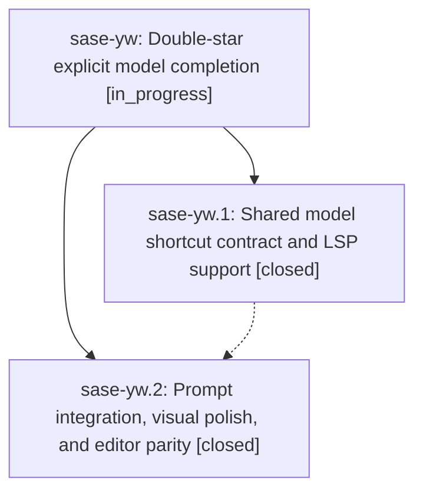

# Bead: sase-yw — Double-star explicit model completion

[Bead Pages](../README.md) / sase-yw

**Status:** ◐ in_progress · **Type:** ▸ plan · **Tier:** epic
**Owner:** `bryanbugyi34@gmail.com` · **Created by:** [bbugyi200.athena.0hg](https://github.com/sase-org/sase--agents/blob/main/families/bbugyi200.athena.0hg.md) · **Assignee:** `sase-yw.land`
**Created:** 2026-09-09 10:55:21 EDT
**Plan:** [202609/double\_star\_model\_completion.md](https://github.com/sase-org/sase--plans/blob/main/202609/double_star_model_completion.md)

<!-- sase:links:start -->

## Links

| Relation | Artifact | Why |
| --- | --- | --- |
| implemented-by | [plan:202609/double_star_model_completion.md][1] | derived from the plan's `bead_id:` frontmatter field |

[1]: https://github.com/sase-org/sase--plans/blob/main/202609/double_star_model_completion.md

<!-- sase:links:end -->

## Description

Choose concrete models with ** in the prompt widget and external editors, with consistent filtering, precise directive edits, responsive interaction, and a polished menu that complements the existing * alias shortcut.

## Phases

| Bead | Title | Status | Size | Created | Agents | Commits |
|---|---|---|---|---|---:|---:|
| [sase-yw.1](sase-yw.1.md) | Shared model shortcut contract and LSP support | ✓ closed | medium | 2026-09-09 | 1 | 1 |
| [sase-yw.2](sase-yw.2.md) | Prompt integration, visual polish, and editor parity | ✓ closed | medium | 2026-09-09 | 1 | 1 |

## Lineage

## Agents

| Agent | Bead | Commits |
|---|---|---:|
| [bbugyi200.athena.sase-yw.1](https://github.com/sase-org/sase--agents/blob/main/agents/bbugyi200.athena.sase-yw.1/README.md) | [sase-yw.1](sase-yw.1.md) | 1 |
| [bbugyi200.athena.sase-yw.2](https://github.com/sase-org/sase--agents/blob/main/agents/bbugyi200.athena.sase-yw.2/README.md) | [sase-yw.2](sase-yw.2.md) | 1 |
| [bbugyi200.athena.sase-yw.land](https://github.com/sase-org/sase--agents/blob/main/agents/bbugyi200.athena.sase-yw.land/README.md) | [sase-yw](README.md) | 0 |

## Commits

| Repo | Commit | Subject | Bead | Committed |
|---|---|---|---|---|
| sase-core | [`sase-core@d4d81b6`](https://github.com/sase-org/sase-core/commit/d4d81b64d7a002f711a6645ebcea4a66b58160aa) | feat(editor): add explicit model shortcut LSP support | [sase-yw.1](sase-yw.1.md) | 2026-09-09 11:26:25 EDT |
| sase | [`4b1e5f8`](https://github.com/sase-org/sase/commit/4b1e5f8eb40e5e9deeae9e129f40860367fefd6e) | feat(ace): add explicit model shortcut completion | [sase-yw.2](sase-yw.2.md) | 2026-09-09 12:45:20 EDT |
