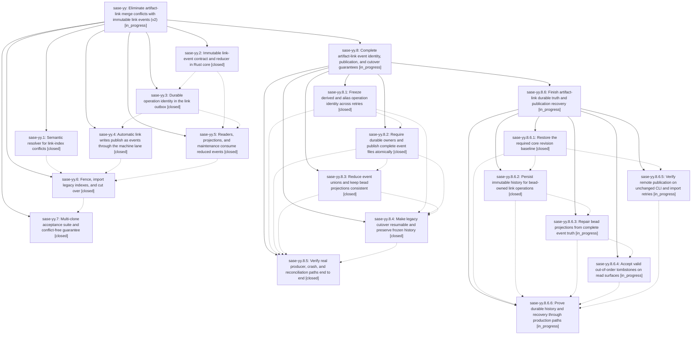

# Bead: sase-yy — Eliminate artifact-link merge conflicts with immutable link events (v2)

[Bead Pages](../README.md) / sase-yy

**Status:** ◐ in_progress · **Type:** ▸ plan · **Tier:** epic
**Owner:** `bryanbugyi34@gmail.com` · **Created by:** [bbugyi200.athena.09d.f1](https://github.com/sase-org/sase--agents/blob/main/families/bbugyi200.athena.09d.f1.md) · **Assignee:** `sase-yy.land`
**Created:** 2026-09-09 11:48:14 EDT
**Plan:** [202609/artifact\_link\_events\_v2.md](https://github.com/sase-org/sase--plans/blob/main/202609/artifact_link_events_v2.md)

<!-- sase:links:start -->

## Links

| Relation | Artifact | Why |
| --- | --- | --- |
| implemented-by | [plan:202609/artifact_link_events_v2.md][1] | derived from the plan's `bead_id:` frontmatter field |

[1]: https://github.com/sase-org/sase--plans/blob/main/202609/artifact_link_events_v2.md

<!-- sase:links:end -->

## Description

Automatic artifact-link writes never produce a merge conflict an agent must hand-resolve: link mutations become immutable, content-addressed events reduced deterministically in Rust core and published through the host-owned machine lane, consuming the publication retry/aging ledger sase-yh landed instead of building a second one, while a conservative semantic resolver auto-repairs legacy links/*.json conflicts during rollout.

## Notes

[2026-09-10T18:25:25Z · sase-yy.land] LANDING AUDIT: Not ready to close. Reviewed the epic (no prior notes; no parent), all seven closed children and every note, the linked original plan, the seven primary epic commits and Rust commits 528c3db/55770cb/1842f29, current source, and relevant overlap among 53 non-epic commits since the first exact epic commit. Fetched origin/master; both it and HEAD are abdcb86d6. Module splits/public facade repair, sidecar eviction protection, clone fallback, and the existing publication retry ledger must remain integrated. Binding validator exited 0; 35 focused event/import/resolver/rebase tests passed in 17.96s. Isolated reproductions nevertheless confirm: derived sweeps reuse an ID with different timestamps/bytes; an ineligible mixed-v1/v2 drain silently removes v1 with drained=0,dropped=0; no-owner events report published=1 but keep no event/aggregate row; SIGKILL after final-path creation leaves an unretryable zero-byte event; interrupted multi-role marker writes cannot resume; post-import rename rewrites/deletes frozen legacy indexes; cross-clone row reconciliation counts two distinct observations as one. Also inspected manual/inlet checkout-store routing, alias actor/eligibility, missing fleet-capability attestation, Rust boundary gaps, and bead projection/receipt parity requirements. All are remaining epic work, not external bug follow-ups. Audit file:explicit:e7416d60ce1cf8d99a71fe3c; reproduction script file:explicit:7f5e04013d3b9e6e1b5a54db; results file:explicit:a6e3025e88ceccabf89d82ae. Child-note outcomes: sase-yy.2 note 1 and sase-yy.3 note 1 propose the same Rust floor ratchet and are already addressed by >=0.33.0,<0.34.0 plus the successful binding validator; no tasks created. sase-yy.6 note 1 proposes closing existing flag bead sase-z0: code-level flag/schema removal is confirmed, but retain it until repaired cutover/acceptance satisfies its removal condition. The optional original-plan suggestion for a decisions memory task is deferred until a successful landing establishes the settled behavior. sase-yy.4's auto-close note is not verification; the independent publisher audit uncovered the blockers above. sase bead epic-symbols sase-yy reports no entries. No production source edits or live cutover performed; full just check-full remains required on the repaired combined tree through sase_monitor before closing. Submitting a five-phase repair epic with parent_bead: sase-yy; validated with --explain and again without it, both passed with no warnings. Keep this epic and its original plan unfinished. After the repair child lands, recheck all descendants/notes, original requirements, drift and full verification, resolve the flag proposal, rerun epic-symbols, and close normally only if complete; there is no parent ancestor above sase-yy.

[2026-09-10T20:34:50Z · sase-z7.land] DISCOVERED ISSUE: flag bead sase-z0 (link_events) has no registry definition, so tools/check_feature_flags rule 8 errors and `just check`/`just check-full` are red repo-wide for every agent, not just this epic. Reproduced 2026-09-10 at master HEAD 1ef9c092e on a clean tree from workspace sase_16: `just _lint-flags` exits 1 with "rule 8: live flag bead 'sase-z0' has no definition (key 'link_events'); created 2026-09-09T18:46:15Z by bbugyi200.athena.sase-yy.4 - add the registry definition or close the bead". sase-z5/sase-z6/sase-z9 are still inside their creation grace window and only warn; sase-z0 is past it and hard-errors. Cause: sase-yy.6's commit a8d99d295 (feat(artifact-links): cut over legacy indexes to events) deleted the link_events registry definition while leaving the flag bead open. This epic's landing note of 2026-09-10 deliberately retains sase-z0 until the repaired cutover/acceptance satisfies its removal condition; that decision is what leaves the gate red. Found by the sase-z7 land agent while verifying epic sase-z7 (proposed in sase-z7.3 note #1); sase-z7 changed nothing in the flag registry and cannot fix this. Restoring a definition is wrong because the Off branch is gone, so the only correct repairs are closing sase-z0 with the cutover or extending its thresholds/grace deliberately - please resolve it as part of this epic's landing so master's flag gate goes green.

[2026-09-11T00:58:58Z · sase-yy.8.land--1] LANDING BLOCKER after audit of child sase-yy.8: the five closed repair phases still leave confirmed canonical bead-history loss, state-suppressing projection receipts, reader rejection of valid out-of-order tombstones, false successful synchronous publication retries, and a stale required core pin. Full audit file:explicit:ad257e3976535af8057b15c5; corrected probes file:explicit:5c0b68b9f1d02f0c4685ab56; results file:explicit:a7d62bf742d8d718c4494088. This turn re-read this parent's own notes, all seven original child notes and both linked plans as well as the repair children and current/base drift. A six-phase remaining-work child plan is being submitted with parent_bead: sase-yy.8. Keep sase-yy and its plan unfinished. Follow-up disposition detail is recorded on sase-yy.8: z0 closed, z7.3 stale entries gone, query helper drift fixed; wait lint corroborated on sase-zh; restart-audit fixture filed as small CI task sase-zi; fleet/research failures routed to their active causal owners. Both ancestor epic-symbol queries are empty. After the new child lands, rerun every descendant/plan readiness check, inspect post-child drift, require full monitored check-full, and close normal nested plan ancestors only while fully complete. No live migration or hidden clone repair was performed.

## Phases

| Bead | Title | Status | Size | Created | Agents | Commits |
|---|---|---|---|---|---:|---:|
| [sase-yy.1](sase-yy.1.md) | Semantic resolver for link-index conflicts | ✓ closed | large | 2026-09-09 | 1 | 2 |
| [sase-yy.2](sase-yy.2.md) | Immutable link-event contract and reducer in Rust core | ✓ closed | large | 2026-09-09 | 1 | 2 |
| [sase-yy.3](sase-yy.3.md) | Durable operation identity in the link outbox | ✓ closed | medium | 2026-09-09 | 1 | 1 |
| [sase-yy.4](sase-yy.4.md) | Automatic link writes publish as events through the machine lane | ✓ closed | large | 2026-09-09 | 1 | 2 |
| [sase-yy.5](sase-yy.5.md) | Readers, projections, and maintenance consume reduced events | ✓ closed | large | 2026-09-09 | 1 | 1 |
| [sase-yy.6](sase-yy.6.md) | Fence, import legacy indexes, and cut over | ✓ closed | large | 2026-09-09 | 1 | 1 |
| [sase-yy.7](sase-yy.7.md) | Multi-clone acceptance suite and conflict-free guarantee | ✓ closed | medium | 2026-09-09 | 1 | 1 |

## Lineage

## Agents

| Agent | Bead | Commits |
|---|---|---:|
| [bbugyi200.athena.sase-yy.1](https://github.com/sase-org/sase--agents/blob/main/families/bbugyi200.athena.sase-yy.1.md) | [sase-yy.1](sase-yy.1.md) | 2 |
| [bbugyi200.athena.sase-yy.2](https://github.com/sase-org/sase--agents/blob/main/families/bbugyi200.athena.sase-yy.2.md) | [sase-yy.2](sase-yy.2.md) | 2 |
| [bbugyi200.athena.sase-yy.3](https://github.com/sase-org/sase--agents/blob/main/agents/bbugyi200.athena.sase-yy.3/README.md) | [sase-yy.3](sase-yy.3.md) | 1 |
| [bbugyi200.athena.sase-yy.4](https://github.com/sase-org/sase--agents/blob/main/families/bbugyi200.athena.sase-yy.4.md) | [sase-yy.4](sase-yy.4.md) | 2 |
| [bbugyi200.athena.sase-yy.5](https://github.com/sase-org/sase--agents/blob/main/families/bbugyi200.athena.sase-yy.5.md) | [sase-yy.5](sase-yy.5.md) | 1 |
| [bbugyi200.athena.sase-yy.6](https://github.com/sase-org/sase--agents/blob/main/families/bbugyi200.athena.sase-yy.6.md) | [sase-yy.6](sase-yy.6.md) | 1 |
| [bbugyi200.athena.sase-yy.7](https://github.com/sase-org/sase--agents/blob/main/agents/bbugyi200.athena.sase-yy.7/README.md) | [sase-yy.7](sase-yy.7.md) | 1 |
| [bbugyi200.athena.sase-yy.8.1](https://github.com/sase-org/sase--agents/blob/main/agents/bbugyi200.athena.sase-yy.8.1/README.md) | [sase-yy.8.1](sase-yy.8.1.md) | 2 |
| [bbugyi200.athena.sase-yy.8.2](https://github.com/sase-org/sase--agents/blob/main/families/bbugyi200.athena.sase-yy.8.2.md) | [sase-yy.8.2](sase-yy.8.2.md) | 2 |
| [bbugyi200.athena.sase-yy.8.3](https://github.com/sase-org/sase--agents/blob/main/families/bbugyi200.athena.sase-yy.8.3.md) | [sase-yy.8.3](sase-yy.8.3.md) | 2 |
| [bbugyi200.athena.sase-yy.8.4](https://github.com/sase-org/sase--agents/blob/main/families/bbugyi200.athena.sase-yy.8.4.md) | [sase-yy.8.4](sase-yy.8.4.md) | 2 |
| [bbugyi200.athena.sase-yy.8.5](https://github.com/sase-org/sase--agents/blob/main/families/bbugyi200.athena.sase-yy.8.5.md) | [sase-yy.8.5](sase-yy.8.5.md) | 1 |
| [bbugyi200.athena.sase-yy.8.6.1](https://github.com/sase-org/sase--agents/blob/main/agents/bbugyi200.athena.sase-yy.8.6.1/README.md) | [sase-yy.8.6.1](sase-yy.8.6.1.md) | 0 |
| [bbugyi200.athena.sase-yy.8.6.2](https://github.com/sase-org/sase--agents/blob/main/agents/bbugyi200.athena.sase-yy.8.6.2/README.md) | [sase-yy.8.6.2](sase-yy.8.6.2.md) | 1 |
| [bbugyi200.athena.sase-yy.8.6.3](https://github.com/sase-org/sase--agents/blob/main/agents/bbugyi200.athena.sase-yy.8.6.3/README.md) | [sase-yy.8.6.3](sase-yy.8.6.3.md) | 0 |
| [bbugyi200.athena.sase-yy.8.6.4](https://github.com/sase-org/sase--agents/blob/main/agents/bbugyi200.athena.sase-yy.8.6.4/README.md) | [sase-yy.8.6.4](sase-yy.8.6.4.md) | 0 |
| [bbugyi200.athena.sase-yy.8.6.5](https://github.com/sase-org/sase--agents/blob/main/agents/bbugyi200.athena.sase-yy.8.6.5/README.md) | [sase-yy.8.6.5](sase-yy.8.6.5.md) | 0 |
| [bbugyi200.athena.sase-yy.8.6.6](https://github.com/sase-org/sase--agents/blob/main/agents/bbugyi200.athena.sase-yy.8.6.6/README.md) | [sase-yy.8.6.6](sase-yy.8.6.6.md) | 0 |
| [bbugyi200.athena.sase-yy.8.6.land](https://github.com/sase-org/sase--agents/blob/main/agents/bbugyi200.athena.sase-yy.8.6.land/README.md) | [sase-yy.8.6](sase-yy.8.6.md) | 0 |
| [bbugyi200.athena.sase-yy.8.land](https://github.com/sase-org/sase--agents/blob/main/families/bbugyi200.athena.sase-yy.8.land.md) | [sase-yy.8](sase-yy.8.md) | 0 |
| [bbugyi200.athena.sase-yy.land](https://github.com/sase-org/sase--agents/blob/main/families/bbugyi200.athena.sase-yy.land.md) | [sase-yy](README.md) | 0 |

## Commits

| Repo | Commit | Subject | Bead | Committed |
|---|---|---|---|---|
| sase | [`232ffbb`](https://github.com/sase-org/sase/commit/232ffbba3fdd9011f4c35d4a392c59d699df7709) | test: validate artifact link event bindings | [sase-yy.2](sase-yy.2.md) | 2026-09-09 13:09:25 EDT |
| sase-core | [`sase-core@528c3db`](https://github.com/sase-org/sase-core/commit/528c3dbd7ee3dd6a1a6de221287cb73d1b37b7ac) | feat: add artifact link event contract | [sase-yy.2](sase-yy.2.md) | 2026-09-09 13:12:27 EDT |
| sase | [`9e52abc`](https://github.com/sase-org/sase/commit/9e52abc5a3c998c1d86c673e6f5754580de23f09) | feat(sdd): resolve semantic artifact-link conflicts | [sase-yy.1](sase-yy.1.md) | 2026-09-09 13:33:27 EDT |
| sase-core | [`sase-core@55770cb`](https://github.com/sase-org/sase-core/commit/55770cb46f4ab99d61289fb6efee7c6fb96877db) | feat(artifact-links): merge link indexes | [sase-yy.1](sase-yy.1.md) | 2026-09-09 13:42:52 EDT |
| sase | [`fb89440`](https://github.com/sase-org/sase/commit/fb89440a55d1971bb0bb17934ef0ebace24ddeee) | feat(artifact-links): add operation-aware link outbox | [sase-yy.3](sase-yy.3.md) | 2026-09-09 14:25:28 EDT |
| sase | [`37ab56b`](https://github.com/sase-org/sase/commit/37ab56bd93a84d851c80cc5c50e63c75747f4aa6) | feat(artifact-links): publish immutable link events | [sase-yy.4](sase-yy.4.md) | 2026-09-09 16:23:43 EDT |
| sase-core | [`sase-core@1842f29`](https://github.com/sase-org/sase-core/commit/1842f29c00a9288f90d8cbc898ef8c8a40731c85) | feat(beads): support link operation ids | [sase-yy.4](sase-yy.4.md) | 2026-09-09 16:27:08 EDT |
| sase | [`ba73bc3`](https://github.com/sase-org/sase/commit/ba73bc30e4c0438e8861dfbe3e95a3754d121252) | feat(artifact-links): consume reduced event truth | [sase-yy.5](sase-yy.5.md) | 2026-09-10 09:59:41 EDT |
| sase | [`a8d99d2`](https://github.com/sase-org/sase/commit/a8d99d2952681d2aed4e755a30942e8cc82a0424) | feat(artifact-links): cut over legacy indexes to events | [sase-yy.6](sase-yy.6.md) | 2026-09-10 13:34:12 EDT |
| sase | [`abdcb86`](https://github.com/sase-org/sase/commit/abdcb86d6af27acbadc809013dfd968648ae9a1f) | fix(sdd): harden artifact link event publication | [sase-yy.7](sase-yy.7.md) | 2026-09-10 14:07:25 EDT |
| sase | [`f5a3f5c`](https://github.com/sase-org/sase/commit/f5a3f5c99ec7c55a44ff0517c7eea820f0b46c3c) | fix(artifact-links): freeze replayable producer identity | [sase-yy.8.1](sase-yy.8.1.md) | 2026-09-10 15:08:10 EDT |
| sase-core | [`sase-core@d5d5be4`](https://github.com/sase-org/sase-core/commit/d5d5be4baa62d807a4a8959d2f43f12ff292bcf5) | fix(artifact-links): expose stable producer identity helpers | [sase-yy.8.1](sase-yy.8.1.md) | 2026-09-10 15:10:33 EDT |
| sase | [`811700b`](https://github.com/sase-org/sase/commit/811700bc3830558df0db9ff7eaefecb2b6e7614b) | fix(artifact-links): require durable publication receipts | [sase-yy.8.2](sase-yy.8.2.md) | 2026-09-10 16:42:07 EDT |
| sase-core | [`sase-core@da0a738`](https://github.com/sase-org/sase-core/commit/da0a73895ff8d5aa3597df4abb3fe6004c443489) | feat(artifact-links): add publication ownership receipts | [sase-yy.8.2](sase-yy.8.2.md) | 2026-09-10 16:45:16 EDT |
| sase | [`840824c`](https://github.com/sase-org/sase/commit/840824c5bb71a9d78e46ee446625f47cdea0b7d4) | feat(sdd): reconcile artifact link event unions | [sase-yy.8.3](sase-yy.8.3.md) | 2026-09-10 17:53:38 EDT |
| sase-core | [`sase-core@717c36e`](https://github.com/sase-org/sase-core/commit/717c36e7fa0d9ca5e967fb4e058317242570bd50) | feat(beads): project artifact links by edge receipt | [sase-yy.8.3](sase-yy.8.3.md) | 2026-09-10 17:56:21 EDT |
| sase | [`2dcd6a1`](https://github.com/sase-org/sase/commit/2dcd6a136c715427c3916581a4e942822dc47155) | feat(artifact-links): make cutover import resumable | [sase-yy.8.4](sase-yy.8.4.md) | 2026-09-10 19:37:26 EDT |
| sase-core | [`sase-core@e0f105d`](https://github.com/sase-org/sase-core/commit/e0f105d68045ffe00ae78f64263cd4bfb6f3d559) | feat(artifact-links): add cutover recovery policy | [sase-yy.8.4](sase-yy.8.4.md) | 2026-09-10 19:40:18 EDT |
| sase | [`8eabf9e`](https://github.com/sase-org/sase/commit/8eabf9ecf82518d960cadb41f9cc17318e6d6558) | test(artifact-links): cover process death, mutation isolation, and cutover resume | [sase-yy.8.5](sase-yy.8.5.md) | 2026-09-10 20:28:17 EDT |
| sase | [`2f9bef1`](https://github.com/sase-org/sase/commit/2f9bef14cbce4405e0c7c2a83812215125dd6492) | fix(artifact-links): persist bead-owned event history | [sase-yy.8.6.2](sase-yy.8.6.2.md) | 2026-09-11 08:11:48 EDT |
