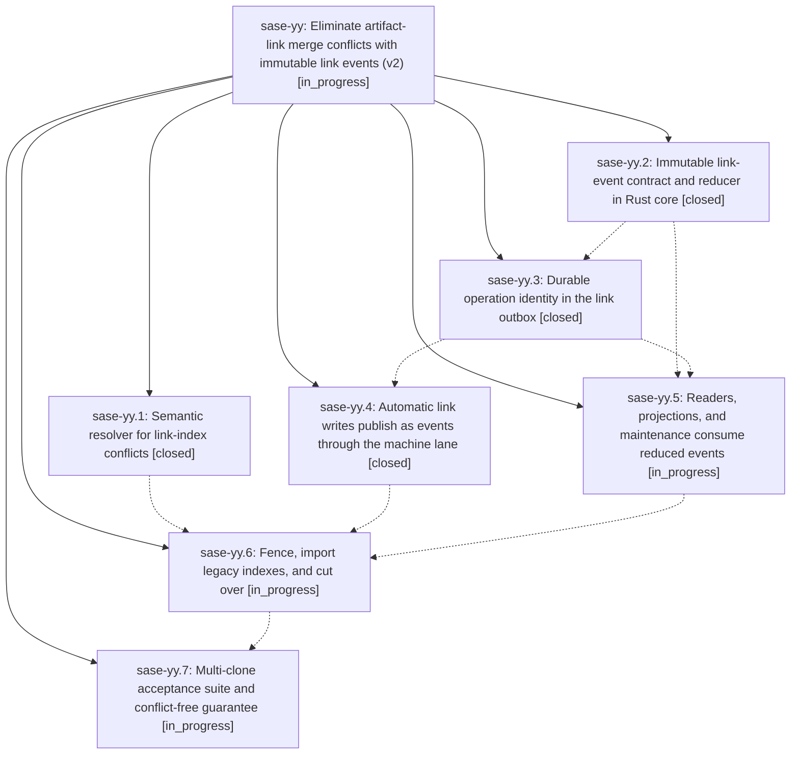

# Bead: sase-yy — Eliminate artifact-link merge conflicts with immutable link events (v2)

[Bead Pages](../README.md) / sase-yy

**Status:** ◐ in_progress · **Type:** ▸ plan · **Tier:** epic
**Owner:** `bryanbugyi34@gmail.com` · **Created by:** [bbugyi200.athena.09d.f1](https://github.com/sase-org/sase--agents/blob/main/families/bbugyi200.athena.09d.f1.md) · **Assignee:** `sase-yy.land`
**Created:** 2026-09-09 11:48:14 EDT
**Plan:** [202609/artifact\_link\_events\_v2.md](https://github.com/sase-org/sase--plans/blob/main/202609/artifact_link_events_v2.md)

<!-- sase:links:start -->

## Links

| Relation | Artifact | Why |
| --- | --- | --- |
| implemented-by | [plan:202609/artifact_link_events_v2.md][1] | derived from the plan's `bead_id:` frontmatter field |

[1]: https://github.com/sase-org/sase--plans/blob/main/202609/artifact_link_events_v2.md

<!-- sase:links:end -->

## Description

Automatic artifact-link writes never produce a merge conflict an agent must hand-resolve: link mutations become immutable, content-addressed events reduced deterministically in Rust core and published through the host-owned machine lane, consuming the publication retry/aging ledger sase-yh landed instead of building a second one, while a conservative semantic resolver auto-repairs legacy links/*.json conflicts during rollout.

## Phases

| Bead | Title | Status | Size | Created | Agents | Commits |
|---|---|---|---|---|---:|---:|
| [sase-yy.1](sase-yy.1.md) | Semantic resolver for link-index conflicts | ✓ closed | large | 2026-09-09 | 1 | 2 |
| [sase-yy.2](sase-yy.2.md) | Immutable link-event contract and reducer in Rust core | ✓ closed | large | 2026-09-09 | 1 | 2 |
| [sase-yy.3](sase-yy.3.md) | Durable operation identity in the link outbox | ✓ closed | medium | 2026-09-09 | 1 | 1 |
| [sase-yy.4](sase-yy.4.md) | Automatic link writes publish as events through the machine lane | ✓ closed | large | 2026-09-09 | 1 | 2 |
| [sase-yy.5](sase-yy.5.md) | Readers, projections, and maintenance consume reduced events | ◐ in_progress | large | 2026-09-09 | 1 | 0 |
| [sase-yy.6](sase-yy.6.md) | Fence, import legacy indexes, and cut over | ◐ in_progress | large | 2026-09-09 | 1 | 0 |
| [sase-yy.7](sase-yy.7.md) | Multi-clone acceptance suite and conflict-free guarantee | ◐ in_progress | medium | 2026-09-09 | 1 | 0 |

## Lineage

## Agents

| Agent | Bead | Commits |
|---|---|---:|
| [bbugyi200.athena.sase-yy.1](https://github.com/sase-org/sase--agents/blob/main/families/bbugyi200.athena.sase-yy.1.md) | [sase-yy.1](sase-yy.1.md) | 2 |
| [bbugyi200.athena.sase-yy.2](https://github.com/sase-org/sase--agents/blob/main/families/bbugyi200.athena.sase-yy.2.md) | [sase-yy.2](sase-yy.2.md) | 2 |
| [bbugyi200.athena.sase-yy.3](https://github.com/sase-org/sase--agents/blob/main/agents/bbugyi200.athena.sase-yy.3/README.md) | [sase-yy.3](sase-yy.3.md) | 1 |
| [bbugyi200.athena.sase-yy.4](https://github.com/sase-org/sase--agents/blob/main/families/bbugyi200.athena.sase-yy.4.md) | [sase-yy.4](sase-yy.4.md) | 2 |
| [bbugyi200.athena.sase-yy.5](https://github.com/sase-org/sase--agents/blob/main/families/bbugyi200.athena.sase-yy.5.md) | [sase-yy.5](sase-yy.5.md) | 0 |
| [bbugyi200.athena.sase-yy.6](https://github.com/sase-org/sase--agents/blob/main/agents/bbugyi200.athena.sase-yy.6/README.md) | [sase-yy.6](sase-yy.6.md) | 0 |
| [bbugyi200.athena.sase-yy.7](https://github.com/sase-org/sase--agents/blob/main/agents/bbugyi200.athena.sase-yy.7/README.md) | [sase-yy.7](sase-yy.7.md) | 0 |
| [bbugyi200.athena.sase-yy.land](https://github.com/sase-org/sase--agents/blob/main/agents/bbugyi200.athena.sase-yy.land/README.md) | [sase-yy](README.md) | 0 |

## Commits

| Repo | Commit | Subject | Bead | Committed |
|---|---|---|---|---|
| sase | [`232ffbb`](https://github.com/sase-org/sase/commit/232ffbba3fdd9011f4c35d4a392c59d699df7709) | test: validate artifact link event bindings | [sase-yy.2](sase-yy.2.md) | 2026-09-09 13:09:25 EDT |
| sase-core | [`sase-core@528c3db`](https://github.com/sase-org/sase-core/commit/528c3dbd7ee3dd6a1a6de221287cb73d1b37b7ac) | feat: add artifact link event contract | [sase-yy.2](sase-yy.2.md) | 2026-09-09 13:12:27 EDT |
| sase | [`9e52abc`](https://github.com/sase-org/sase/commit/9e52abc5a3c998c1d86c673e6f5754580de23f09) | feat(sdd): resolve semantic artifact-link conflicts | [sase-yy.1](sase-yy.1.md) | 2026-09-09 13:33:27 EDT |
| sase-core | [`sase-core@55770cb`](https://github.com/sase-org/sase-core/commit/55770cb46f4ab99d61289fb6efee7c6fb96877db) | feat(artifact-links): merge link indexes | [sase-yy.1](sase-yy.1.md) | 2026-09-09 13:42:52 EDT |
| sase | [`fb89440`](https://github.com/sase-org/sase/commit/fb89440a55d1971bb0bb17934ef0ebace24ddeee) | feat(artifact-links): add operation-aware link outbox | [sase-yy.3](sase-yy.3.md) | 2026-09-09 14:25:28 EDT |
| sase | [`37ab56b`](https://github.com/sase-org/sase/commit/37ab56bd93a84d851c80cc5c50e63c75747f4aa6) | feat(artifact-links): publish immutable link events | [sase-yy.4](sase-yy.4.md) | 2026-09-09 16:23:43 EDT |
| sase-core | [`sase-core@1842f29`](https://github.com/sase-org/sase-core/commit/1842f29c00a9288f90d8cbc898ef8c8a40731c85) | feat(beads): support link operation ids | [sase-yy.4](sase-yy.4.md) | 2026-09-09 16:27:08 EDT |
