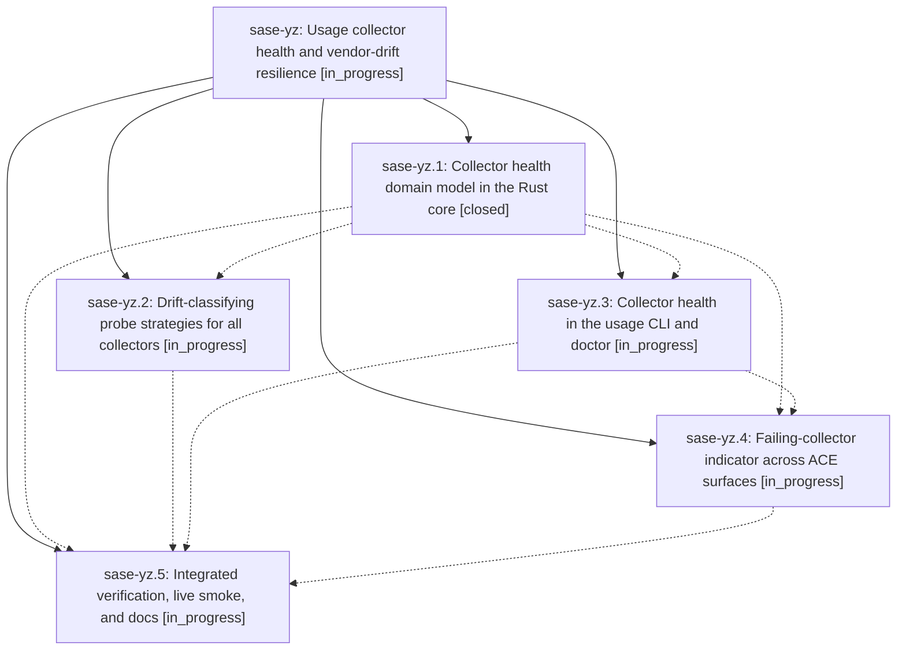

# Bead: sase-yz — Usage collector health and vendor-drift resilience

[Bead Pages](../README.md) / sase-yz

**Status:** ◐ in_progress · **Type:** ▸ plan · **Tier:** epic
**Owner:** `bryanbugyi34@gmail.com` · **Created by:** [bbugyi200.athena.0hd.f1](https://github.com/sase-org/sase--agents/blob/main/families/bbugyi200.athena.0hd.f1.md) · **Assignee:** `sase-yz.land`
**Created:** 2026-09-09 12:39:14 EDT
**Plan:** [202609/usage\_collector\_health\_and\_drift\_resilience.md](https://github.com/sase-org/sase--plans/blob/main/202609/usage_collector_health_and_drift_resilience.md)

<!-- sase:links:start -->

## Links

| Relation | Artifact | Why |
| --- | --- | --- |
| implemented-by | [plan:202609/usage_collector_health_and_drift_resilience.md][1] | derived from the plan's `bead_id:` frontmatter field |

[1]: https://github.com/sase-org/sase--plans/blob/main/202609/usage_collector_health_and_drift_resilience.md

<!-- sase:links:end -->

## Description

Provider usage collection classifies and survives vendor CLI drift, exposes an honest per-collector health state derived from failure streaks, and ACE shows a calm, distinct visual indicator whenever a collector is failing consistently.

## Phases

| Bead | Title | Status | Size | Created | Agents | Commits |
|---|---|---|---|---|---:|---:|
| [sase-yz.1](sase-yz.1.md) | Collector health domain model in the Rust core | ✓ closed | medium | 2026-09-09 | 1 | 1 |
| [sase-yz.2](sase-yz.2.md) | Drift-classifying probe strategies for all collectors | ◐ in_progress | medium | 2026-09-09 | 1 | 0 |
| [sase-yz.3](sase-yz.3.md) | Collector health in the usage CLI and doctor | ◐ in_progress | small | 2026-09-09 | 1 | 0 |
| [sase-yz.4](sase-yz.4.md) | Failing-collector indicator across ACE surfaces | ◐ in_progress | medium | 2026-09-09 | 1 | 0 |
| [sase-yz.5](sase-yz.5.md) | Integrated verification, live smoke, and docs | ◐ in_progress | small | 2026-09-09 | 1 | 0 |

## Lineage

## Agents

| Agent | Bead | Commits |
|---|---|---:|
| [bbugyi200.athena.sase-yz.1](https://github.com/sase-org/sase--agents/blob/main/agents/bbugyi200.athena.sase-yz.1/README.md) | [sase-yz.1](sase-yz.1.md) | 1 |
| [bbugyi200.athena.sase-yz.2](https://github.com/sase-org/sase--agents/blob/main/agents/bbugyi200.athena.sase-yz.2/README.md) | [sase-yz.2](sase-yz.2.md) | 0 |
| [bbugyi200.athena.sase-yz.3](https://github.com/sase-org/sase--agents/blob/main/agents/bbugyi200.athena.sase-yz.3/README.md) | [sase-yz.3](sase-yz.3.md) | 0 |
| [bbugyi200.athena.sase-yz.4](https://github.com/sase-org/sase--agents/blob/main/agents/bbugyi200.athena.sase-yz.4/README.md) | [sase-yz.4](sase-yz.4.md) | 0 |
| [bbugyi200.athena.sase-yz.5](https://github.com/sase-org/sase--agents/blob/main/agents/bbugyi200.athena.sase-yz.5/README.md) | [sase-yz.5](sase-yz.5.md) | 0 |
| [bbugyi200.athena.sase-yz.land](https://github.com/sase-org/sase--agents/blob/main/agents/bbugyi200.athena.sase-yz.land/README.md) | [sase-yz](README.md) | 0 |

## Commits

| Repo | Commit | Subject | Bead | Committed |
|---|---|---|---|---|
| sase | [`7a4fb21`](https://github.com/sase-org/sase/commit/7a4fb2149a1d308299d968f0f3d7c477c72dbaec) | feat(usage): accept vendor drift reason | [sase-yz.1](sase-yz.1.md) | 2026-09-09 14:23:37 EDT |
