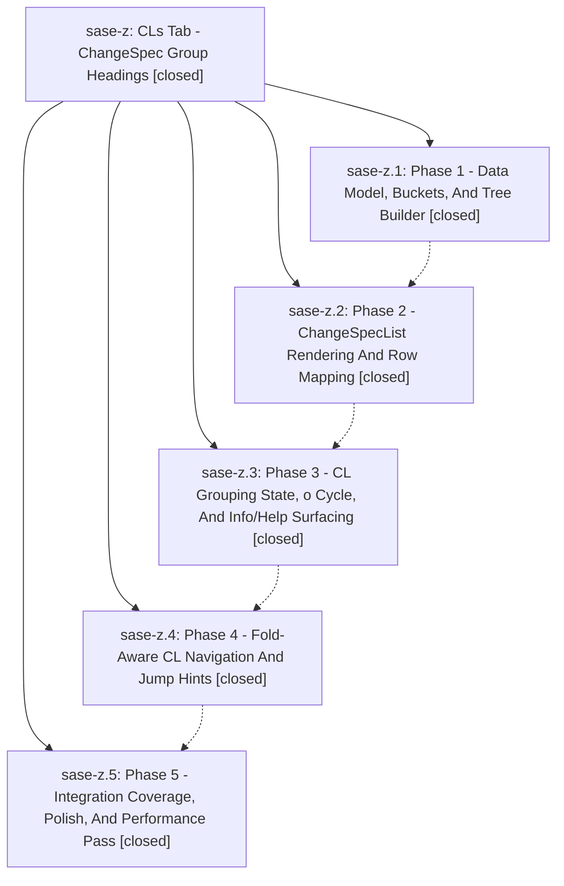

# Bead: sase-z — CLs Tab - ChangeSpec Group Headings

[Bead Pages](../README.md) / sase-z

**Status:** ✓ closed · **Resolution:** (unrecorded) · **Type:** plan · **Tier:** epic
**Owner:** `bryanbugyi34@gmail.com`
**Created:** 2026-04-28 00:09:57 UTC · **Closed:** 2026-04-28 01:18:19 UTC
**Plan:** [202604/changespec\_group\_headings.md](https://github.com/sase-org/sase--plans/blob/main/202604/changespec_group_headings.md)

## Phases

| Bead | Title | Status | Size | Agents | Commits |
|---|---|---|---|---:|---:|
| [sase-z.1](sase-z.1.md) | Phase 1 - Data Model, Buckets, And Tree Builder | ✓ closed | small | 0 | 1 |
| [sase-z.2](sase-z.2.md) | Phase 2 - ChangeSpecList Rendering And Row Mapping | ✓ closed | small | 0 | 1 |
| [sase-z.3](sase-z.3.md) | Phase 3 - CL Grouping State, o Cycle, And Info/Help Surfacing | ✓ closed | small | 0 | 1 |
| [sase-z.4](sase-z.4.md) | Phase 4 - Fold-Aware CL Navigation And Jump Hints | ✓ closed | small | 0 | 1 |
| [sase-z.5](sase-z.5.md) | Phase 5 - Integration Coverage, Polish, And Performance Pass | ✓ closed | small | 0 | 1 |

## Lineage

## Commits

| Commit | Subject | Bead | Committed (UTC) |
|---|---|---|---|
| [`ddee1a3`](https://github.com/sase-org/sase/commit/ddee1a38f59833c2509aacfee353ae2f85bf0054) | feat(ace): add ChangeSpec grouping model layer (sase-z.1) | [sase-z.1](sase-z.1.md) | 2026-04-28 00:25:44 |
| [`b63c4b3`](https://github.com/sase-org/sase/commit/b63c4b3fd59e6b7a9a118998a39ce7f2e4ee1910) | feat(ace): render ChangeSpec group banners in CLs tab list (sase-z.2) | [sase-z.2](sase-z.2.md) | 2026-04-28 00:35:37 |
| [`d7b6795`](https://github.com/sase-org/sase/commit/d7b6795a90a13fe4fc4ed65a8cc77c8928aa07e1) | feat(ace): wire \`o\` cycle to CLs tab grouping mode (sase-z.3) | [sase-z.3](sase-z.3.md) | 2026-04-28 00:46:42 |
| [`2be9acd`](https://github.com/sase-org/sase/commit/2be9acde391ab8a38171e98a64f8ff55d7926e25) | feat(ace): fold-aware CLs-tab navigation and jump hints (sase-z.4) | [sase-z.4](sase-z.4.md) | 2026-04-28 01:00:47 |
| [`3db5bcd`](https://github.com/sase-org/sase/commit/3db5bcd4510baacb8af014bda8a7c78500861e75) | feat(ace): integration coverage, polish, and perf pass for CLs grouping (sase-z.5) | [sase-z.5](sase-z.5.md) | 2026-04-28 01:16:08 |
