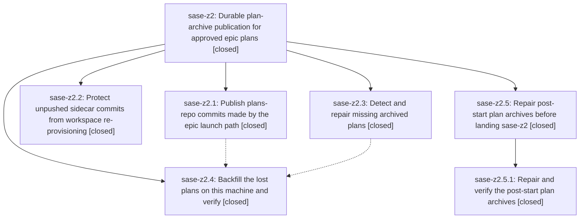

# Bead: sase-z2 — Durable plan-archive publication for approved epic plans

[Bead Pages](../README.md) / sase-z2

**Status:** ✓ closed · **Resolution:** done · **Type:** ▸ plan · **Tier:** epic
**Owner:** `bryanbugyi34@gmail.com` · **Created by:** [bbugyi200.athena.0i2](https://github.com/sase-org/sase--agents/blob/main/families/bbugyi200.athena.0i2.md) · **Assignee:** `sase-z2.land`
**Created:** 2026-09-09 18:24:58 EDT · **Closed:** 2026-09-10 13:11:33 EDT
**Plan:** [202609/durable\_plan\_archive\_publication.md](https://github.com/sase-org/sase--plans/blob/main/202609/durable_plan_archive_publication.md)

<!-- sase:links:start -->

## Links

| Relation | Artifact | Why |
| --- | --- | --- |
| implemented-by | [plan:202609/durable_plan_archive_publication.md][1] | derived from the plan's `bead_id:` frontmatter field |

[1]: https://github.com/sase-org/sase--plans/blob/main/202609/durable_plan_archive_publication.md

<!-- sase:links:end -->

## Description

Approved plan files always reach the plans sidecar remote: the epic-launch archive path publishes its plans-repo commits, workspace re-provisioning can no longer destroy the only copy of an unpushed plans commit, and every plan lost to this defect (starting with 202609/unified_agents_across_machines.md) is backfilled and verified against the sidecar remote.

## Notes

[2026-09-10T17:11:33Z · sase-z2.5.land] Rechecked the linked epic plan and every descendant note after child sase-z2.5 landed. Current source retains: synchronous post-launch plans and beads publication with durable failure notification; pre-eviction publish-or-rescue protection for every direct sidecar role; plan-archive doctor detection, committed-plan validation, supported archive repair, bead_id restoration, and verified push; and invalid legacy-plan preservation. Reviewed epic commits d6b116360, 54d9c112a, b8ac9f392, and 93de14277 plus backfill commits 4a7b546c and 0cadf221. The original acceptance archive unified_agents_across_machines.md resolves from bead sase-xe.16.11.7 and carries that bead_id in canonical, sidecar, and origin/main copies. A fresh doctor repair preview has no recoverable archives; the historical source-missing and invalid local-only set remains deliberate. The later sase-z2.5 repair also archived shared_format_bridge.md and weighted_queue_capacity.md plus two valid contemporaneous local-only plans, and its repeat repair is a no-op. Post-child primary commit 4f6eb2b17 advances weighted capacity only and needs no archive integration. Focused publication, concurrency, sidecar-eviction, auto-connect, and doctor suites pass 45/45 in fixture-compatible groups. Phase z2.4 follow-up note #2 was corroborated on existing task sase-bw with proposing-bead evidence; note #3 became ready medium bug task sase-zb linked to proposing bead sase-z2.4. No other PROPOSED FOLLOW-UP entries were found. All descendants are closed, the plan validates with zero warnings, and epic-symbols is empty.

## Phases

| Bead | Title | Status | Size | Created | Agents | Commits |
|---|---|---|---|---|---:|---:|
| [sase-z2.1](sase-z2.1.md) | Publish plans-repo commits made by the epic launch path | ✓ closed | medium | 2026-09-09 | 1 | 1 |
| [sase-z2.2](sase-z2.2.md) | Protect unpushed sidecar commits from workspace re-provisioning | ✓ closed | medium | 2026-09-09 | 1 | 1 |
| [sase-z2.3](sase-z2.3.md) | Detect and repair missing archived plans | ✓ closed | medium | 2026-09-09 | 1 | 1 |
| [sase-z2.4](sase-z2.4.md) | Backfill the lost plans on this machine and verify | ✓ closed | small | 2026-09-09 | 1 | 1 |

## Lineage

## Agents

| Agent | Bead | Commits |
|---|---|---:|
| [bbugyi200.athena.sase-z2.1](https://github.com/sase-org/sase--agents/blob/main/agents/bbugyi200.athena.sase-z2.1/README.md) | [sase-z2.1](sase-z2.1.md) | 1 |
| [bbugyi200.athena.sase-z2.2](https://github.com/sase-org/sase--agents/blob/main/agents/bbugyi200.athena.sase-z2.2/README.md) | [sase-z2.2](sase-z2.2.md) | 1 |
| [bbugyi200.athena.sase-z2.3](https://github.com/sase-org/sase--agents/blob/main/agents/bbugyi200.athena.sase-z2.3/README.md) | [sase-z2.3](sase-z2.3.md) | 1 |
| [bbugyi200.athena.sase-z2.4](https://github.com/sase-org/sase--agents/blob/main/agents/bbugyi200.athena.sase-z2.4/README.md) | [sase-z2.4](sase-z2.4.md) | 1 |
| [bbugyi200.athena.sase-z2.5.1](https://github.com/sase-org/sase--agents/blob/main/agents/bbugyi200.athena.sase-z2.5.1/README.md) | [sase-z2.5.1](sase-z2.5.1.md) | 0 |
| [bbugyi200.athena.sase-z2.5.land](https://github.com/sase-org/sase--agents/blob/main/agents/bbugyi200.athena.sase-z2.5.land/README.md) | [sase-z2.5](sase-z2.5.md) | 1 |
| [bbugyi200.athena.sase-z2.land](https://github.com/sase-org/sase--agents/blob/main/families/bbugyi200.athena.sase-z2.land.md) | [sase-z2](README.md) | 0 |

## Commits

| Repo | Commit | Subject | Bead | Committed |
|---|---|---|---|---|
| sase | [`d6b1163`](https://github.com/sase-org/sase/commit/d6b116360301dda75ed92c63ca61eb64b2c4c717) | fix(bead): publish epic plan archives after launch | [sase-z2.1](sase-z2.1.md) | 2026-09-09 19:27:19 EDT |
| sase | [`b8ac9f3`](https://github.com/sase-org/sase/commit/b8ac9f39290d48a3710277541c438a0cd154d107) | feat(beads): add plan archive doctor repair | [sase-z2.3](sase-z2.3.md) | 2026-09-09 19:40:47 EDT |
| sase | [`93de142`](https://github.com/sase-org/sase/commit/93de1427708a8fc8b6b1bcb02d1ee944ab57bed1) | fix(beads): skip invalid plan archive sources | [sase-z2.4](sase-z2.4.md) | 2026-09-09 20:16:42 EDT |
| sase | [`54d9c11`](https://github.com/sase-org/sase/commit/54d9c112af8c732bb2a2a664971e3d85f5112100) | fix(workspace): protect sidecar clones before eviction | [sase-z2.2](sase-z2.2.md) | 2026-09-10 11:56:50 EDT |
| sase--plans | [`sase--plans@33a265a`](https://github.com/sase-org/sase--plans/commit/33a265a8a9cc23254b9f14070cdb6dee7ea40e20) | docs(plans): mark archive publication epics done | [sase-z2.5](sase-z2.5.md) | 2026-09-10 13:15:06 EDT |
