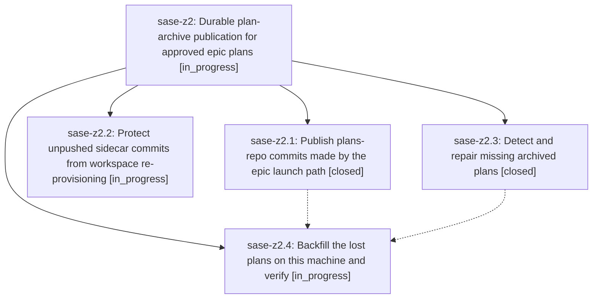

# Bead: sase-z2 — Durable plan-archive publication for approved epic plans

[Bead Pages](../README.md) / sase-z2

**Status:** ◐ in_progress · **Type:** ▸ plan · **Tier:** epic
**Owner:** `bryanbugyi34@gmail.com` · **Created by:** [bbugyi200.athena.0i2](https://github.com/sase-org/sase--agents/blob/main/families/bbugyi200.athena.0i2.md) · **Assignee:** `sase-z2.land`
**Created:** 2026-09-09 18:24:58 EDT
**Plan:** [202609/durable\_plan\_archive\_publication.md](https://github.com/sase-org/sase--plans/blob/main/202609/durable_plan_archive_publication.md)

<!-- sase:links:start -->

## Links

| Relation | Artifact | Why |
| --- | --- | --- |
| implemented-by | [plan:202609/durable_plan_archive_publication.md][1] | derived from the plan's `bead_id:` frontmatter field |

[1]: https://github.com/sase-org/sase--plans/blob/main/202609/durable_plan_archive_publication.md

<!-- sase:links:end -->

## Description

Approved plan files always reach the plans sidecar remote: the epic-launch archive path publishes its plans-repo commits, workspace re-provisioning can no longer destroy the only copy of an unpushed plans commit, and every plan lost to this defect (starting with 202609/unified_agents_across_machines.md) is backfilled and verified against the sidecar remote.

## Phases

| Bead | Title | Status | Size | Created | Agents | Commits |
|---|---|---|---|---|---:|---:|
| [sase-z2.1](sase-z2.1.md) | Publish plans-repo commits made by the epic launch path | ✓ closed | medium | 2026-09-09 | 1 | 1 |
| [sase-z2.2](sase-z2.2.md) | Protect unpushed sidecar commits from workspace re-provisioning | ◐ in_progress | medium | 2026-09-09 | 1 | 0 |
| [sase-z2.3](sase-z2.3.md) | Detect and repair missing archived plans | ✓ closed | medium | 2026-09-09 | 1 | 1 |
| [sase-z2.4](sase-z2.4.md) | Backfill the lost plans on this machine and verify | ◐ in_progress | small | 2026-09-09 | 1 | 0 |

## Lineage

## Agents

| Agent | Bead | Commits |
|---|---|---:|
| [bbugyi200.athena.sase-z2.1](https://github.com/sase-org/sase--agents/blob/main/agents/bbugyi200.athena.sase-z2.1/README.md) | [sase-z2.1](sase-z2.1.md) | 1 |
| [bbugyi200.athena.sase-z2.2](https://github.com/sase-org/sase--agents/blob/main/families/bbugyi200.athena.sase-z2.2.md) | [sase-z2.2](sase-z2.2.md) | 0 |
| [bbugyi200.athena.sase-z2.3](https://github.com/sase-org/sase--agents/blob/main/agents/bbugyi200.athena.sase-z2.3/README.md) | [sase-z2.3](sase-z2.3.md) | 1 |
| [bbugyi200.athena.sase-z2.4](https://github.com/sase-org/sase--agents/blob/main/agents/bbugyi200.athena.sase-z2.4/README.md) | [sase-z2.4](sase-z2.4.md) | 0 |
| [bbugyi200.athena.sase-z2.land](https://github.com/sase-org/sase--agents/blob/main/agents/bbugyi200.athena.sase-z2.land/README.md) | [sase-z2](README.md) | 0 |

## Commits

| Repo | Commit | Subject | Bead | Committed |
|---|---|---|---|---|
| sase | [`d6b1163`](https://github.com/sase-org/sase/commit/d6b116360301dda75ed92c63ca61eb64b2c4c717) | fix(bead): publish epic plan archives after launch | [sase-z2.1](sase-z2.1.md) | 2026-09-09 19:27:19 EDT |
| sase | [`b8ac9f3`](https://github.com/sase-org/sase/commit/b8ac9f39290d48a3710277541c438a0cd154d107) | feat(beads): add plan archive doctor repair | [sase-z2.3](sase-z2.3.md) | 2026-09-09 19:40:47 EDT |
