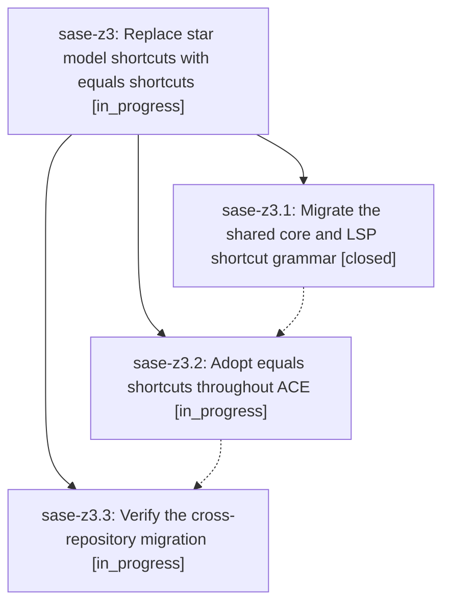

# Bead: sase-z3 — Replace star model shortcuts with equals shortcuts

[Bead Pages](../README.md) / sase-z3

**Status:** ◐ in_progress · **Type:** ▸ plan · **Tier:** epic
**Owner:** `bryanbugyi34@gmail.com` · **Created by:** [bbugyi200.athena.0i4](https://github.com/sase-org/sase--agents/blob/main/families/bbugyi200.athena.0i4.md) · **Assignee:** `sase-z3.land`
**Created:** 2026-09-09 19:46:28 EDT
**Plan:** [202609/equals\_model\_shortcuts.md](https://github.com/sase-org/sase--plans/blob/main/202609/equals_model_shortcuts.md)

<!-- sase:links:start -->

## Links

| Relation | Artifact | Why |
| --- | --- | --- |
| implemented-by | [plan:202609/equals_model_shortcuts.md][1] | derived from the plan's `bead_id:` frontmatter field |

[1]: https://github.com/sase-org/sase--plans/blob/main/202609/equals_model_shortcuts.md

<!-- sase:links:end -->

## Description

ACE and xprompt-aware external editors use =alias and ==model for model completion while retiring the former star syntax and preserving their shared completion contract

## Phases

| Bead | Title | Status | Size | Created | Agents | Commits |
|---|---|---|---|---|---:|---:|
| [sase-z3.1](sase-z3.1.md) | Migrate the shared core and LSP shortcut grammar | ✓ closed | medium | 2026-09-09 | 1 | 1 |
| [sase-z3.2](sase-z3.2.md) | Adopt equals shortcuts throughout ACE | ◐ in_progress | medium | 2026-09-09 | 1 | 0 |
| [sase-z3.3](sase-z3.3.md) | Verify the cross-repository migration | ◐ in_progress | small | 2026-09-09 | 1 | 0 |

## Lineage

## Agents

| Agent | Bead | Commits |
|---|---|---:|
| [bbugyi200.athena.sase-z3.1](https://github.com/sase-org/sase--agents/blob/main/agents/bbugyi200.athena.sase-z3.1/README.md) | [sase-z3.1](sase-z3.1.md) | 1 |
| [bbugyi200.athena.sase-z3.2](https://github.com/sase-org/sase--agents/blob/main/agents/bbugyi200.athena.sase-z3.2/README.md) | [sase-z3.2](sase-z3.2.md) | 0 |
| [bbugyi200.athena.sase-z3.3](https://github.com/sase-org/sase--agents/blob/main/agents/bbugyi200.athena.sase-z3.3/README.md) | [sase-z3.3](sase-z3.3.md) | 0 |
| [bbugyi200.athena.sase-z3.land](https://github.com/sase-org/sase--agents/blob/main/agents/bbugyi200.athena.sase-z3.land/README.md) | [sase-z3](README.md) | 0 |

## Commits

| Repo | Commit | Subject | Bead | Committed |
|---|---|---|---|---|
| sase-core | [`sase-core@c86d66e`](https://github.com/sase-org/sase-core/commit/c86d66e99b006579bab2f95cbb5819c9f6e103ab) | feat(editor)!: use equals model shortcuts | [sase-z3.1](sase-z3.1.md) | 2026-09-09 20:16:35 EDT |
