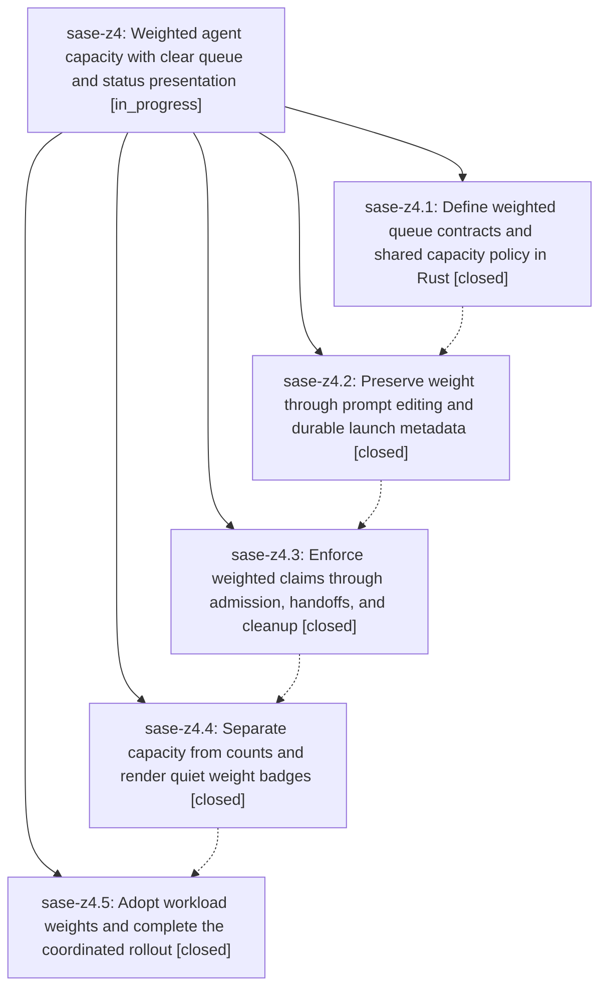

# Bead: sase-z4 — Weighted agent capacity with clear queue and status presentation

[Bead Pages](../README.md) / sase-z4

**Status:** ◐ in_progress · **Type:** ▸ plan · **Tier:** epic
**Owner:** `bryanbugyi34@gmail.com` · **Created by:** [bbugyi200.athena.0i5](https://github.com/sase-org/sase--agents/blob/main/families/bbugyi200.athena.0i5.md) · **Assignee:** `sase-z4.land`
**Created:** 2026-09-09 20:51:13 EDT
**Plan:** [202609/weighted\_queue\_capacity.md](https://github.com/sase-org/sase--plans/blob/main/202609/weighted_queue_capacity.md)

<!-- sase:links:start -->

## Links

| Relation | Artifact | Why |
| --- | --- | --- |
| implemented-by | [plan:202609/weighted_queue_capacity.md][1] | derived from the plan's `bead_id:` frontmatter field |

[1]: https://github.com/sase-org/sase--plans/blob/main/202609/weighted_queue_capacity.md

<!-- sase:links:end -->

## Description

Support positive fractional weights on %queue/%q, enforce and display weighted capacity consistently across agent lifecycles, and adopt heavier epic landers and lighter research swarm members.

## Phases

| Bead | Title | Status | Size | Created | Agents | Commits |
|---|---|---|---|---|---:|---:|
| [sase-z4.1](sase-z4.1.md) | Define weighted queue contracts and shared capacity policy in Rust | ✓ closed | medium | 2026-09-09 | 1 | 1 |
| [sase-z4.2](sase-z4.2.md) | Preserve weight through prompt editing and durable launch metadata | ✓ closed | medium | 2026-09-09 | 1 | 1 |
| [sase-z4.3](sase-z4.3.md) | Enforce weighted claims through admission, handoffs, and cleanup | ✓ closed | medium | 2026-09-09 | 1 | 1 |
| [sase-z4.4](sase-z4.4.md) | Separate capacity from counts and render quiet weight badges | ✓ closed | medium | 2026-09-09 | 1 | 1 |
| [sase-z4.5](sase-z4.5.md) | Adopt workload weights and complete the coordinated rollout | ✓ closed | medium | 2026-09-09 | 1 | 3 |

## Lineage

## Agents

| Agent | Bead | Commits |
|---|---|---:|
| [bbugyi200.athena.sase-z4.1](https://github.com/sase-org/sase--agents/blob/main/agents/bbugyi200.athena.sase-z4.1/README.md) | [sase-z4.1](sase-z4.1.md) | 1 |
| [bbugyi200.athena.sase-z4.2](https://github.com/sase-org/sase--agents/blob/main/agents/bbugyi200.athena.sase-z4.2/README.md) | [sase-z4.2](sase-z4.2.md) | 1 |
| [bbugyi200.athena.sase-z4.3](https://github.com/sase-org/sase--agents/blob/main/agents/bbugyi200.athena.sase-z4.3/README.md) | [sase-z4.3](sase-z4.3.md) | 1 |
| [bbugyi200.athena.sase-z4.4](https://github.com/sase-org/sase--agents/blob/main/agents/bbugyi200.athena.sase-z4.4/README.md) | [sase-z4.4](sase-z4.4.md) | 1 |
| [bbugyi200.athena.sase-z4.5](https://github.com/sase-org/sase--agents/blob/main/agents/bbugyi200.athena.sase-z4.5/README.md) | [sase-z4.5](sase-z4.5.md) | 3 |
| [bbugyi200.athena.sase-z4.land](https://github.com/sase-org/sase--agents/blob/main/agents/bbugyi200.athena.sase-z4.land/README.md) | [sase-z4](README.md) | 0 |

## Commits

| Repo | Commit | Subject | Bead | Committed |
|---|---|---|---|---|
| sase-core | [`sase-core@63bb275`](https://github.com/sase-org/sase-core/commit/63bb275ef9563903b8d8c02b666997cfe1312c87) | feat(core): add weighted queue capacity contracts | [sase-z4.1](sase-z4.1.md) | 2026-09-09 21:34:32 EDT |
| sase | [`7c31d9a`](https://github.com/sase-org/sase/commit/7c31d9abac15e0c772d4d9f2bacbd3536417cfe9) | feat(agent-launch): preserve weighted queue metadata | [sase-z4.2](sase-z4.2.md) | 2026-09-09 23:08:03 EDT |
| sase | [`71c3df7`](https://github.com/sase-org/sase/commit/71c3df748fac1ccf09c3c885474ddbc1f935befe) | feat(runner-slots): enforce weighted admission lifecycle | [sase-z4.3](sase-z4.3.md) | 2026-09-10 00:00:43 EDT |
| sase | [`81064c1`](https://github.com/sase-org/sase/commit/81064c144a7ef289d0c9080a7565a6f62ecae0f7) | feat(tui): show weighted runner capacity | [sase-z4.4](sase-z4.4.md) | 2026-09-10 01:25:48 EDT |
| sase | [`0afe85b`](https://github.com/sase-org/sase/commit/0afe85be475848d994eb78f622980097a017cbfb) | feat(xprompt): complete weighted queue rollout | [sase-z4.5](sase-z4.5.md) | 2026-09-10 07:52:27 EDT |
| sase-core | [`sase-core@41bec95`](https://github.com/sase-org/sase-core/commit/41bec95d3c4ad741452a4f259a1fef102c90e8a5) | chore(migration): classify legacy patch heading | [sase-z4.5](sase-z4.5.md) | 2026-09-10 07:55:29 EDT |
| sase-research-artifacts | [`sase-research-artifacts@526604b`](https://github.com/sase-org/sase-research-artifacts/commit/526604b6ea706ccf4668d6aed6aaf7d3a3003eb2) | feat(research): weight research swarm segments | [sase-z4.5](sase-z4.5.md) | 2026-09-10 07:57:16 EDT |
