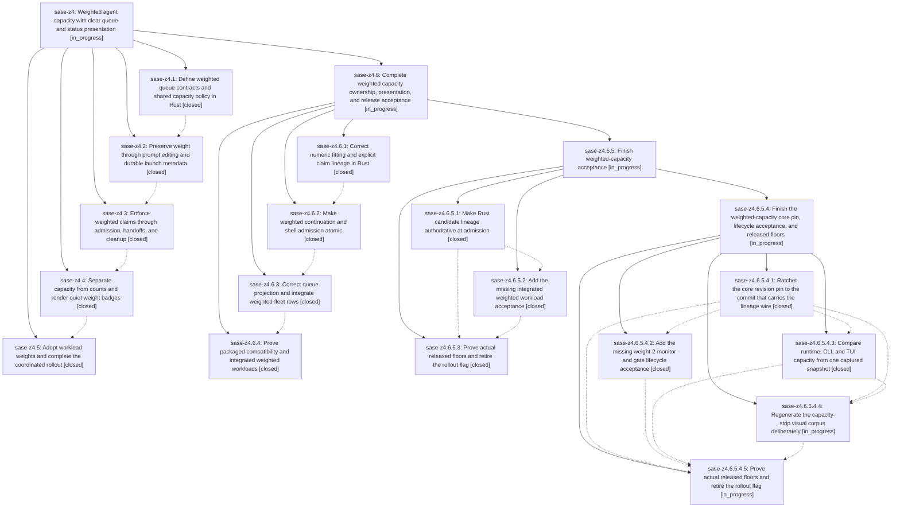

# Bead: sase-z4 — Weighted agent capacity with clear queue and status presentation

[Bead Pages](../README.md) / sase-z4

**Status:** ◐ in_progress · **Type:** ▸ plan · **Tier:** epic
**Owner:** `bryanbugyi34@gmail.com` · **Created by:** [bbugyi200.athena.0i5](https://github.com/sase-org/sase--agents/blob/main/families/bbugyi200.athena.0i5.md) · **Assignee:** `sase-z4.land`
**Created:** 2026-09-09 20:51:13 EDT
**Plan:** [202609/weighted\_queue\_capacity.md](https://github.com/sase-org/sase--plans/blob/main/202609/weighted_queue_capacity.md)

<!-- sase:links:start -->

## Links

| Relation | Artifact | Why |
| --- | --- | --- |
| implemented-by | [plan:202609/weighted_queue_capacity.md][1] | derived from the plan's `bead_id:` frontmatter field |
| related | file:explicit:5a03b708fc9d4e94c358413c | attached via sase artifact create --bead |

[1]: https://github.com/sase-org/sase--plans/blob/main/202609/weighted_queue_capacity.md

<!-- sase:links:end -->

## Description

Support positive fractional weights on %queue/%q, enforce and display weighted capacity consistently across agent lifecycles, and adopt heavier epic landers and lighter research swarm members.

## Notes

[2026-09-10T12:13:07Z · sase-z4.land] LANDING REVIEW: Reviewed sase-z4 and every note on all five children, linked plan plan:202609/weighted_queue_capacity.md, feature commits (core 63bb275; SASE 7c31d9aba, 71c3df748, 81064c144, 0afe85be4; plugin 526604b), and intervening master changes through SASE 0afe85be4/core 41bec95/plugin 526604b. Epic is NOT ready to close. Evidence: file:explicit:5a03b708fc9d4e94c358413c. Reproduced: 99 x 0.1 claims reject a fitting 0.1 waiter at limit 10; parallel predecessor plus serial successor double-counts 2.0 as 4.0; a pre-stamped released successor admits itself while unrelated work fills capacity; queued serial children disappear from TUI ranks; parked ordering ignores capacity shortfall. Source audit also requires authored/inherited weight and invalid-metadata handling, atomic monitor/gate admission, authoritative pre-display capacity projection, and newer fleet summary/row weight integration. Launch Control labels and weighted PNG/end-to-end acceptance remain incomplete. PROPOSED FOLLOW-UP dispositions: sase-z4.5 note 1 (published compatibility floors) is explicit epic scope, retained as remaining work; its source-overridden wheel test does not verify the declared minima. Note 2 (retired weighted_queue_capacity) belongs on existing flag bead sase-z5 and will be resolved there after acceptance; no duplicate task. No unrelated task warranted. Source pin already includes weighted APIs. Epic-symbols reports no entries. No parent bead is linked. Authored and twice validated remaining-work child epic plan with parent_bead: sase-z4; proposing it next. Parent close, post-close symvision, and original plan status update are reserved for resumed landing after child completion. Do not force-close or treat the original child success notes as sufficient.

[2026-09-10T12:13:58Z · sase-z4.land] LANDING REVIEW CLARIFICATION: The pre-stamped-successor bypass in file:explicit:5a03b708fc9d4e94c358413c is a direct admission-adapter reproduction, not a completed production-runner reproduction. Normal build_agent_meta rebuilding can remove run_started_at before admission; the helper still publishes a pre-admission stamp, and the adapter trusts that candidate record as its own claim. The repair plan explicitly requires tracing bootstrap and the publication window before choosing the fix. The decimal boundary, parallel-lineage projection, missing TUI serial waiter, and parked-order failures were independently reproduced as reported.

[2026-09-10T20:35:32Z · sase-z7.land] DISCOVERED ISSUE: the agents-pane PNG golden corpus was never regenerated after this epic changed the agents status strip, so `just test-visual` is broadly red on clean master. Reproduced 2026-09-10 at master HEAD 1ef9c092e on a clean tree (workspace sase_16, freshly built local sase_core_rs): a fixed 12-file agents-pane subset gives 44 failed / 12 passed in 30.10s. Every diff is confined to the single status-strip row; for tests/ace/tui/visual/snapshots/png/agents_list_120x40.png the golden reads '3 [0/10 running · 1 failed · 2 done]' while the render now reads '3  0.0/10.0 [0 running · 1 failed · 2 done]' (7317/1520532 changed pixels, 0.481%). Cause: phase sase-z4.4's commit 81064c144 (feat(tui): show weighted runner capacity) added ProviderInfoPanel._append_capacity_prefix / _append_status_strip in src/sase/ace/tui/widgets/agent_info_panel.py and updated zero PNG goldens; sase-z4.6.3's commit cceed09a9 refreshed only 3 goldens and added 2 new ones, leaving the rest of the corpus stale. This is not renderer drift, so it is a different root cause from task sase-x5, and it needs one deliberate golden regeneration by whoever owns the final weighted-capacity display text, not a bulk accept by an unrelated agent. Found by the sase-z7 land agent while verifying epic sase-z7 (proposed in sase-z7.3 note #3); sase-z7's own usage-indicator visual lane is 10/10 green and its badges do not appear in these diffs. Recorded here because this epic's 2026-09-10 landing review already lists weighted PNG acceptance as incomplete; see the matching note on sase-z4.6.5.

## Phases

| Bead | Title | Status | Size | Created | Agents | Commits |
|---|---|---|---|---|---:|---:|
| [sase-z4.1](sase-z4.1.md) | Define weighted queue contracts and shared capacity policy in Rust | ✓ closed | medium | 2026-09-09 | 1 | 1 |
| [sase-z4.2](sase-z4.2.md) | Preserve weight through prompt editing and durable launch metadata | ✓ closed | medium | 2026-09-09 | 1 | 1 |
| [sase-z4.3](sase-z4.3.md) | Enforce weighted claims through admission, handoffs, and cleanup | ✓ closed | medium | 2026-09-09 | 1 | 1 |
| [sase-z4.4](sase-z4.4.md) | Separate capacity from counts and render quiet weight badges | ✓ closed | medium | 2026-09-09 | 1 | 1 |
| [sase-z4.5](sase-z4.5.md) | Adopt workload weights and complete the coordinated rollout | ✓ closed | medium | 2026-09-09 | 1 | 2 |

## Lineage

## Agents

| Agent | Bead | Commits |
|---|---|---:|
| [bbugyi200.athena.sase-z4.1](https://github.com/sase-org/sase--agents/blob/main/agents/bbugyi200.athena.sase-z4.1/README.md) | [sase-z4.1](sase-z4.1.md) | 1 |
| [bbugyi200.athena.sase-z4.2](https://github.com/sase-org/sase--agents/blob/main/agents/bbugyi200.athena.sase-z4.2/README.md) | [sase-z4.2](sase-z4.2.md) | 1 |
| [bbugyi200.athena.sase-z4.3](https://github.com/sase-org/sase--agents/blob/main/agents/bbugyi200.athena.sase-z4.3/README.md) | [sase-z4.3](sase-z4.3.md) | 1 |
| [bbugyi200.athena.sase-z4.4](https://github.com/sase-org/sase--agents/blob/main/agents/bbugyi200.athena.sase-z4.4/README.md) | [sase-z4.4](sase-z4.4.md) | 1 |
| [bbugyi200.athena.sase-z4.5](https://github.com/sase-org/sase--agents/blob/main/agents/bbugyi200.athena.sase-z4.5/README.md) | [sase-z4.5](sase-z4.5.md) | 2 |
| [bbugyi200.athena.sase-z4.6.1](https://github.com/sase-org/sase--agents/blob/main/agents/bbugyi200.athena.sase-z4.6.1/README.md) | [sase-z4.6.1](sase-z4.6.1.md) | 1 |
| [bbugyi200.athena.sase-z4.6.2](https://github.com/sase-org/sase--agents/blob/main/agents/bbugyi200.athena.sase-z4.6.2/README.md) | [sase-z4.6.2](sase-z4.6.2.md) | 1 |
| [bbugyi200.athena.sase-z4.6.3](https://github.com/sase-org/sase--agents/blob/main/agents/bbugyi200.athena.sase-z4.6.3/README.md) | [sase-z4.6.3](sase-z4.6.3.md) | 2 |
| [bbugyi200.athena.sase-z4.6.4](https://github.com/sase-org/sase--agents/blob/main/agents/bbugyi200.athena.sase-z4.6.4/README.md) | [sase-z4.6.4](sase-z4.6.4.md) | 1 |
| [bbugyi200.athena.sase-z4.6.5.1](https://github.com/sase-org/sase--agents/blob/main/families/bbugyi200.athena.sase-z4.6.5.1.md) | [sase-z4.6.5.1](sase-z4.6.5.1.md) | 2 |
| [bbugyi200.athena.sase-z4.6.5.2](https://github.com/sase-org/sase--agents/blob/main/agents/bbugyi200.athena.sase-z4.6.5.2/README.md) | [sase-z4.6.5.2](sase-z4.6.5.2.md) | 1 |
| [bbugyi200.athena.sase-z4.6.5.3](https://github.com/sase-org/sase--agents/blob/main/agents/bbugyi200.athena.sase-z4.6.5.3/README.md) | [sase-z4.6.5.3](sase-z4.6.5.3.md) | 1 |
| [bbugyi200.athena.sase-z4.6.5.4.1](https://github.com/sase-org/sase--agents/blob/main/agents/bbugyi200.athena.sase-z4.6.5.4.1/README.md) | [sase-z4.6.5.4.1](sase-z4.6.5.4.1.md) | 1 |
| [bbugyi200.athena.sase-z4.6.5.4.2](https://github.com/sase-org/sase--agents/blob/main/agents/bbugyi200.athena.sase-z4.6.5.4.2/README.md) | [sase-z4.6.5.4.2](sase-z4.6.5.4.2.md) | 1 |
| [bbugyi200.athena.sase-z4.6.5.4.3](https://github.com/sase-org/sase--agents/blob/main/agents/bbugyi200.athena.sase-z4.6.5.4.3/README.md) | [sase-z4.6.5.4.3](sase-z4.6.5.4.3.md) | 1 |
| [bbugyi200.athena.sase-z4.6.5.4.4](https://github.com/sase-org/sase--agents/blob/main/agents/bbugyi200.athena.sase-z4.6.5.4.4/README.md) | [sase-z4.6.5.4.4](sase-z4.6.5.4.4.md) | 0 |
| [bbugyi200.athena.sase-z4.6.5.4.5](https://github.com/sase-org/sase--agents/blob/main/agents/bbugyi200.athena.sase-z4.6.5.4.5/README.md) | [sase-z4.6.5.4.5](sase-z4.6.5.4.5.md) | 0 |
| [bbugyi200.athena.sase-z4.6.5.4.land](https://github.com/sase-org/sase--agents/blob/main/agents/bbugyi200.athena.sase-z4.6.5.4.land/README.md) | [sase-z4.6.5.4](sase-z4.6.5.4.md) | 0 |
| [bbugyi200.athena.sase-z4.6.5.land](https://github.com/sase-org/sase--agents/blob/main/families/bbugyi200.athena.sase-z4.6.5.land.md) | [sase-z4.6.5](sase-z4.6.5.md) | 0 |
| [bbugyi200.athena.sase-z4.6.land](https://github.com/sase-org/sase--agents/blob/main/families/bbugyi200.athena.sase-z4.6.land.md) | [sase-z4.6](sase-z4.6.md) | 0 |
| [bbugyi200.athena.sase-z4.land](https://github.com/sase-org/sase--agents/blob/main/families/bbugyi200.athena.sase-z4.land.md) | [sase-z4](README.md) | 0 |

## Commits

| Repo | Commit | Subject | Bead | Committed |
|---|---|---|---|---|
| sase-core | [`sase-core@63bb275`](https://github.com/sase-org/sase-core/commit/63bb275ef9563903b8d8c02b666997cfe1312c87) | feat(core): add weighted queue capacity contracts | [sase-z4.1](sase-z4.1.md) | 2026-09-09 21:34:32 EDT |
| sase | [`7c31d9a`](https://github.com/sase-org/sase/commit/7c31d9abac15e0c772d4d9f2bacbd3536417cfe9) | feat(agent-launch): preserve weighted queue metadata | [sase-z4.2](sase-z4.2.md) | 2026-09-09 23:08:03 EDT |
| sase | [`71c3df7`](https://github.com/sase-org/sase/commit/71c3df748fac1ccf09c3c885474ddbc1f935befe) | feat(runner-slots): enforce weighted admission lifecycle | [sase-z4.3](sase-z4.3.md) | 2026-09-10 00:00:43 EDT |
| sase | [`81064c1`](https://github.com/sase-org/sase/commit/81064c144a7ef289d0c9080a7565a6f62ecae0f7) | feat(tui): show weighted runner capacity | [sase-z4.4](sase-z4.4.md) | 2026-09-10 01:25:48 EDT |
| sase | [`0afe85b`](https://github.com/sase-org/sase/commit/0afe85be475848d994eb78f622980097a017cbfb) | feat(xprompt): complete weighted queue rollout | [sase-z4.5](sase-z4.5.md) | 2026-09-10 07:52:27 EDT |
| sase-core | [`sase-core@41bec95`](https://github.com/sase-org/sase-core/commit/41bec95d3c4ad741452a4f259a1fef102c90e8a5) | chore(migration): classify legacy patch heading | [sase-z4.5](sase-z4.5.md) | 2026-09-10 07:55:29 EDT |
| sase-core | [`sase-core@8b672ab`](https://github.com/sase-org/sase-core/commit/8b672ab09b2e4351cfa0f0f243ea71e68d71c3a2) | fix(runner-capacity): repair weighted claim lineage | [sase-z4.6.1](sase-z4.6.1.md) | 2026-09-10 08:47:09 EDT |
| sase | [`7da379e`](https://github.com/sase-org/sase/commit/7da379ea28e86cede528d1e58c8a0f7075aba5f1) | fix(agent-runner): make weighted shell admission atomic | [sase-z4.6.2](sase-z4.6.2.md) | 2026-09-10 09:45:23 EDT |
| sase | [`cceed09`](https://github.com/sase-org/sase/commit/cceed09a993f4395f045310f72ca6f25b14174c9) | fix(ace): display weighted runner capacity from source rows | [sase-z4.6.3](sase-z4.6.3.md) | 2026-09-10 11:40:27 EDT |
| sase-core | [`sase-core@8e491c3`](https://github.com/sase-org/sase-core/commit/8e491c337cafd43c44d1d34278fe16d64e069811) | feat(fleet): expose queue weight metadata | [sase-z4.6.3](sase-z4.6.3.md) | 2026-09-10 11:43:37 EDT |
| sase | [`4f6eb2b`](https://github.com/sase-org/sase/commit/4f6eb2b173aacb3f4aeb954753fb57aefcb01f10) | deps(core): ratchet weighted capacity floor | [sase-z4.6.4](sase-z4.6.4.md) | 2026-09-10 12:57:36 EDT |
| sase | [`3260f6a`](https://github.com/sase-org/sase/commit/3260f6a42b5f6ae22a5cab4473aacd7c6e2ebac1) | feat(runner-slots): make Rust candidate lineage authoritative at admission | [sase-z4.6.5.1](sase-z4.6.5.1.md) | 2026-09-10 15:49:06 EDT |
| sase-core | [`sase-core@120556a`](https://github.com/sase-org/sase-core/commit/120556af3243255921d640845d07686b544dca69) | feat(agent-scan): add runner\_claim\_owner\_key wire field and lineage lookup | [sase-z4.6.5.1](sase-z4.6.5.1.md) | 2026-09-10 15:51:20 EDT |
| sase | [`788c63e`](https://github.com/sase-org/sase/commit/788c63e286604dbdda92ad476750fe02be9abc9f) | test(runner-slots): add integrated weighted fakey acceptance | [sase-z4.6.5.2](sase-z4.6.5.2.md) | 2026-09-10 16:32:28 EDT |
| sase | [`0444bac`](https://github.com/sase-org/sase/commit/0444bac58336afc9bf179303d66f4418cb7a1eea) | test(validate-sase-core-rs): harden weighted-capacity floor checks | [sase-z4.6.5.3](sase-z4.6.5.3.md) | 2026-09-10 17:15:16 EDT |
| sase | [`3e32c5c`](https://github.com/sase-org/sase/commit/3e32c5cc665828662a0d316cdb61ecbacdf40a5b) | fix(core-pin): ratchet sase-core-revision.txt to the lineage-wire commit | [sase-z4.6.5.4.1](sase-z4.6.5.4.1.md) | 2026-09-10 17:49:45 EDT |
| sase | [`74a4e42`](https://github.com/sase-org/sase/commit/74a4e4282f7dbf29a4e258de2dad8687da01d6ae) | test(capacity-snapshot): add cross-view weighted-capacity parity tests | [sase-z4.6.5.4.3](sase-z4.6.5.4.3.md) | 2026-09-10 18:36:17 EDT |
| sase | [`25b5d4c`](https://github.com/sase-org/sase/commit/25b5d4cf7007610448a72754cf4445c379eb9fe4) | test(fakey): add real monitor/gate weighted-capacity lifecycle e2e tests | [sase-z4.6.5.4.2](sase-z4.6.5.4.2.md) | 2026-09-10 19:03:20 EDT |
