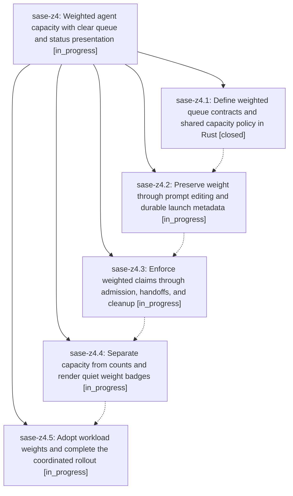

# Bead: sase-z4 — Weighted agent capacity with clear queue and status presentation

[Bead Pages](../README.md) / sase-z4

**Status:** ◐ in_progress · **Type:** ▸ plan · **Tier:** epic
**Owner:** `bryanbugyi34@gmail.com` · **Created by:** [bbugyi200.athena.0i5](https://github.com/sase-org/sase--agents/blob/main/families/bbugyi200.athena.0i5.md) · **Assignee:** `sase-z4.land`
**Created:** 2026-09-09 20:51:13 EDT
**Plan:** [202609/weighted\_queue\_capacity.md](https://github.com/sase-org/sase--plans/blob/main/202609/weighted_queue_capacity.md)

<!-- sase:links:start -->

## Links

| Relation | Artifact | Why |
| --- | --- | --- |
| implemented-by | [plan:202609/weighted_queue_capacity.md][1] | derived from the plan's `bead_id:` frontmatter field |

[1]: https://github.com/sase-org/sase--plans/blob/main/202609/weighted_queue_capacity.md

<!-- sase:links:end -->

## Description

Support positive fractional weights on %queue/%q, enforce and display weighted capacity consistently across agent lifecycles, and adopt heavier epic landers and lighter research swarm members.

## Phases

| Bead | Title | Status | Size | Created | Agents | Commits |
|---|---|---|---|---|---:|---:|
| [sase-z4.1](sase-z4.1.md) | Define weighted queue contracts and shared capacity policy in Rust | ✓ closed | medium | 2026-09-09 | 1 | 0 |
| [sase-z4.2](sase-z4.2.md) | Preserve weight through prompt editing and durable launch metadata | ◐ in_progress | medium | 2026-09-09 | 1 | 0 |
| [sase-z4.3](sase-z4.3.md) | Enforce weighted claims through admission, handoffs, and cleanup | ◐ in_progress | medium | 2026-09-09 | 1 | 0 |
| [sase-z4.4](sase-z4.4.md) | Separate capacity from counts and render quiet weight badges | ◐ in_progress | medium | 2026-09-09 | 1 | 0 |
| [sase-z4.5](sase-z4.5.md) | Adopt workload weights and complete the coordinated rollout | ◐ in_progress | medium | 2026-09-09 | 1 | 0 |

## Lineage

## Agents

| Agent | Bead | Commits |
|---|---|---:|
| [bbugyi200.athena.sase-z4.1](https://github.com/sase-org/sase--agents/blob/main/agents/bbugyi200.athena.sase-z4.1/README.md) | [sase-z4.1](sase-z4.1.md) | 0 |
| [bbugyi200.athena.sase-z4.2](https://github.com/sase-org/sase--agents/blob/main/agents/bbugyi200.athena.sase-z4.2/README.md) | [sase-z4.2](sase-z4.2.md) | 0 |
| [bbugyi200.athena.sase-z4.3](https://github.com/sase-org/sase--agents/blob/main/agents/bbugyi200.athena.sase-z4.3/README.md) | [sase-z4.3](sase-z4.3.md) | 0 |
| [bbugyi200.athena.sase-z4.4](https://github.com/sase-org/sase--agents/blob/main/agents/bbugyi200.athena.sase-z4.4/README.md) | [sase-z4.4](sase-z4.4.md) | 0 |
| [bbugyi200.athena.sase-z4.5](https://github.com/sase-org/sase--agents/blob/main/agents/bbugyi200.athena.sase-z4.5/README.md) | [sase-z4.5](sase-z4.5.md) | 0 |
| [bbugyi200.athena.sase-z4.land](https://github.com/sase-org/sase--agents/blob/main/agents/bbugyi200.athena.sase-z4.land/README.md) | [sase-z4](README.md) | 0 |
