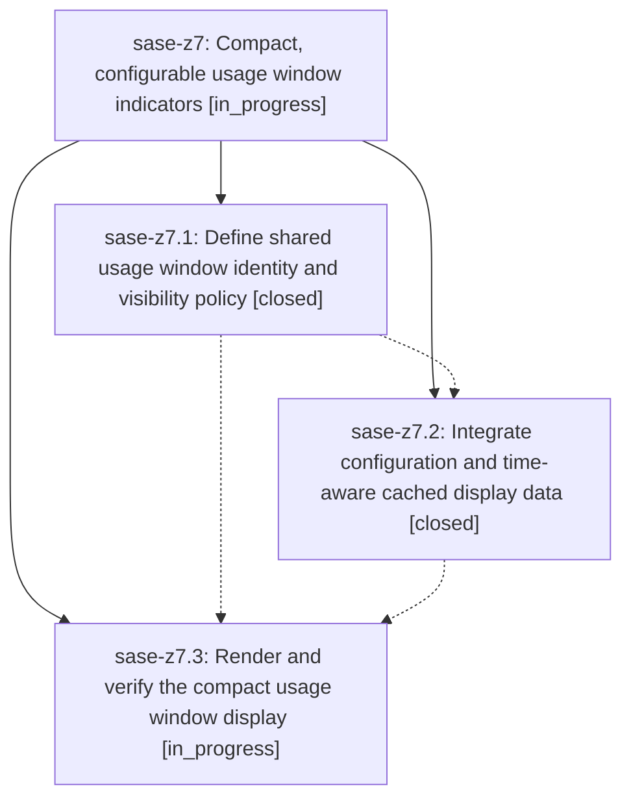

# Bead: sase-z7 — Compact, configurable usage window indicators

[Bead Pages](../README.md) / sase-z7

**Status:** ◐ in_progress · **Type:** ▸ plan · **Tier:** epic
**Owner:** `bryanbugyi34@gmail.com` · **Created by:** [bbugyi200.athena.0hy](https://github.com/sase-org/sase--agents/blob/main/families/bbugyi200.athena.0hy.md) · **Assignee:** `sase-z7.land`
**Created:** 2026-09-10 07:06:06 EDT
**Plan:** [202609/usage\_window\_indicators.md](https://github.com/sase-org/sase--plans/blob/main/202609/usage_window_indicators.md)

<!-- sase:links:start -->

## Links

| Relation | Artifact | Why |
| --- | --- | --- |
| implemented-by | [plan:202609/usage_window_indicators.md][1] | derived from the plan's `bead_id:` frontmatter field |

[1]: https://github.com/sase-org/sase--plans/blob/main/202609/usage_window_indicators.md

<!-- sase:links:end -->

## Description

Make each provider usage window independently configurable and show compact, truthful capacity and reset countdowns with clear ten-bucket colors in ACE.

## Phases

| Bead | Title | Status | Size | Created | Agents | Commits |
|---|---|---|---|---|---:|---:|
| [sase-z7.1](sase-z7.1.md) | Define shared usage window identity and visibility policy | ✓ closed | medium | 2026-09-10 | 1 | 1 |
| [sase-z7.2](sase-z7.2.md) | Integrate configuration and time-aware cached display data | ✓ closed | medium | 2026-09-10 | 1 | 1 |
| [sase-z7.3](sase-z7.3.md) | Render and verify the compact usage window display | ◐ in_progress | medium | 2026-09-10 | 1 | 0 |

## Lineage

## Agents

| Agent | Bead | Commits |
|---|---|---:|
| [bbugyi200.athena.sase-z7.1](https://github.com/sase-org/sase--agents/blob/main/agents/bbugyi200.athena.sase-z7.1/README.md) | [sase-z7.1](sase-z7.1.md) | 1 |
| [bbugyi200.athena.sase-z7.2](https://github.com/sase-org/sase--agents/blob/main/agents/bbugyi200.athena.sase-z7.2/README.md) | [sase-z7.2](sase-z7.2.md) | 1 |
| [bbugyi200.athena.sase-z7.3](https://github.com/sase-org/sase--agents/blob/main/agents/bbugyi200.athena.sase-z7.3/README.md) | [sase-z7.3](sase-z7.3.md) | 0 |
| [bbugyi200.athena.sase-z7.land](https://github.com/sase-org/sase--agents/blob/main/agents/bbugyi200.athena.sase-z7.land/README.md) | [sase-z7](README.md) | 0 |

## Commits

| Repo | Commit | Subject | Bead | Committed |
|---|---|---|---|---|
| sase-core | [`sase-core@7c949b4`](https://github.com/sase-org/sase-core/commit/7c949b46c3ae656a84b5a94759ddcb926fa6f3c1) | feat: add usage indicator policy projection | [sase-z7.1](sase-z7.1.md) | 2026-09-10 07:52:17 EDT |
| sase | [`4504b1b`](https://github.com/sase-org/sase/commit/4504b1b84f70252596818fc8908fad8c926c6f82) | feat(usage): integrate usage indicator config | [sase-z7.2](sase-z7.2.md) | 2026-09-10 09:59:06 EDT |
