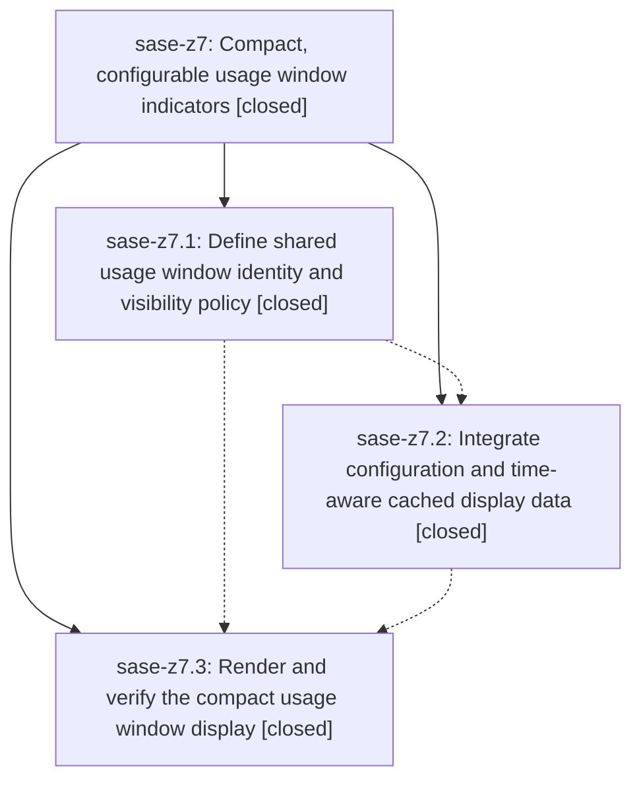

# Bead: sase-z7 — Compact, configurable usage window indicators

[Bead Pages](../README.md) / sase-z7

**Status:** ✓ closed · **Resolution:** done · **Type:** ▸ plan · **Tier:** epic
**Owner:** `bryanbugyi34@gmail.com` · **Created by:** [bbugyi200.athena.0hy](https://github.com/sase-org/sase--agents/blob/main/families/bbugyi200.athena.0hy.md) · **Assignee:** `sase-z7.land`
**Created:** 2026-09-10 07:06:06 EDT · **Closed:** 2026-09-10 16:46:01 EDT
**Plan:** [202609/usage\_window\_indicators.md](https://github.com/sase-org/sase--plans/blob/main/202609/usage_window_indicators.md)

<!-- sase:links:start -->

## Links

| Relation | Artifact | Why |
| --- | --- | --- |
| implemented-by | [plan:202609/usage_window_indicators.md][1] | derived from the plan's `bead_id:` frontmatter field |

[1]: https://github.com/sase-org/sase--plans/blob/main/202609/usage_window_indicators.md

<!-- sase:links:end -->

## Description

Make each provider usage window independently configurable and show compact, truthful capacity and reset countdowns with clear ten-bucket colors in ACE.

## Notes

[2026-09-10T20:46:01Z · sase-z7.land] LANDING VERIFICATION (epic sase-z7, 2026-09-10, master HEAD 1ef9c092e = origin/master, clean tree, workspace sase_16).

VERIFIED COMPLETE. Reviewed the epic bead, all three closed phases and every child note, the linked plan plan:202609/usage_window_indicators.md, and the actual source and commits: core 7c949b4 (phase 1, crates/sase_core/src/provider_usage/indicator.rs 917 lines + tests.rs 434 + sase_core_py registration), SASE 4504b1b84 (phase 2) and 1ef9c092e (phase 3). Every phase note's claims hold up against the tree:

- Phase 1 (window-policy): validate_usage_indicator_config/project_usage_indicator exist in core and are exported; the installed binding exposes provider_usage_validate_indicator_config, provider_usage_project_indicator, and provider_usage_indicator_schema_version.
- Phase 2 (config-and-cache): llm_provider.usage_metrics.indicator is in src/sase/config/sase.schema.json (reusable policy definition, open-ended provider/window maps) and src/sase/default_config.yml with commented examples; config.py memoizes normalized settings by config token and logs diagnostics once per generation; peek.py captures settings/eligibility with the store and cached_usage_indicator_projection() projects from memory with an injected now; usage_peek_change_token() folds in current_config_token() so a config-only change reloads; docs/configuration.md and docs/llms.md document all three policy forms, precedence, remaining-vs-used semantics, invalid-config isolation and reload; the authorized glossary strand sase/memory/glossary/usage-window.md exists and Usage Window is in the generated roster; sase-core-revision.txt was ratcheted.
- Phase 3 (compact-display): _provider_usage_indicator.py consumes the projection and builds one UsageBadge per selected window; _usage_indicator_palette.py implements the documented ten dark/light buckets; _usage_indicator_format.py implements the two-unit countdown, floor/<1%/100% percent text, and specifier omission for weekly-all; provider_disables_indicator.py caches badges, repaints on theme change (watch app.theme) and caps usage at min(remaining, total // 2); docs/ace.md documents badges, ~ / ?% 0h0m↻ / ? / ! / ⚠, ranking, overflow, tooltip contents and click-to-Usage. Dead indicator_usage_items/indicator_usage_attention are gone and CapacityHint/UsagePeekSnapshot/cached_usage_display_snapshot are privatized, with no stale references anywhere in src/tests/tools/docs. Picker/header capacity hints stay on the old attention path as the plan required.

INTEGRATION. Reviewed all 32 non-epic commits since the epic's first commit; HEAD equals origin/master, and phase 3 is the tip, so nothing landed after it. Only five non-epic commits touch usage-adjacent files, and none conflicts: 2fd8e9ee1 (doctor test split), eee1d8d12 (agent-list status indicator tests), and ba73bc30e/024e01b70/54d9c112a, which privatized then re-exposed presentation.collector_health_label/_style as thin public wrappers - phase 3's _provider_usage_indicator.py correctly consumes the public wrapper, so the split-module pattern is intact. sase-yz.4's collector-failure indicator (41f8dfe61, pre-epic) is preserved by the rewrite: collector_problem entries still get an attached ⚠, an uncovered provider still yields a standalone <icon> ⚠ badge, and collection_problem keeps its attention rank. No other surface duplicates the ten-bucket palette (no other file references #FF5F6D/#65C3ED/#A22534) or the compact countdown. sase usage list -p <provider> --json still exposes windows[].key as the docs claim. No integration edits were needed.

VERIFICATION RUN THIS TURN. Rebuilt/installed the local core binding first, because `uv run` re-syncs from uv.lock and silently swaps in the published sase-core-rs 0.33.0 wheel, which is behind the pinned core revision - all results below use .venv/bin/python or just. Green: fmt (python), fmt (markdown), keep-sorted, ruff, mypy, pyscripts, test-waits, changelog, patch/stitch terminology, symvision, toobig, SASE validation, committed plans. Focused usage visual lane 10/10 passed (test_ace_png_snapshots_provider_usage_indicator.py + _states.py, including the eight goldens phase 3 added). Non-visual lane tests/llm_provider + test_provider_usage_indicator_presentation.py + test_provider_disables_indicator.py + test_llm_provider_usage.py + tests/ace/tui: 12588 passed, 10 failed in 5:46, with every failure in fleet code this epic does not touch (see below). sase bead epic-symbols sase-z7 reports no entries, and the Justfile epic-symbol lines phase 2 added were removed by phase 3.

NOT GREEN, NOT CAUSED BY THIS EPIC - three items, all routed to the active epics that own them:
1. just check / just check-full still fail at lint (feature flags): tools/check_feature_flags rule 8 errors because live flag bead sase-z0 (link_events) has no registry definition after sase-yy.6's commit a8d99d295 deleted it. This is red repo-wide for every agent. Recorded as DISCOVERED ISSUE on active epic sase-yy, whose landing note deliberately retains sase-z0. Not a new task: the sase-yy land agent owns the decision. Because this gate aborts `just check` before its later stages, I ran each remaining gate individually (all listed green above) instead of accepting a single red exit code.
2. tests/ace/tui/test_fleet_agents.py (7 nodes) and test_agents_fleet_refresh_laziness.py (3 nodes) fail in isolation, not just under load: core commit 270e50168391 ("bound owner-side presentation and derive honest freshness", phase sase-xe.16.11.7.14.1) changed fleet_normalize_federation_response to drop unobserved summaries, and the SASE-side fixtures/callers have not been adopted. It became live when the sase-za land agent ratcheted sase-core-revision.txt to 270e501 in commit 1bfd9f0a1 for unrelated reasons; published 0.33.0 predates it, so CI has not seen it yet. Recorded as DISCOVERED ISSUE on active epic sase-xe.16.11.7.14, whose phases .3 and .4 are exactly this adoption work.
3. just test-visual is broadly red on the agents pane: 44 failed / 12 passed across a fixed 12-file subset, every diff confined to the status-strip row where goldens expect "[0/10 running" and the render now emits "0.0/10.0 [0 running". Cause is sase-z4.4's commit 81064c144, which added _append_capacity_prefix to agent_info_panel.py and regenerated zero goldens (sase-z4.6.3's cceed09a9 refreshed only three and added two). Different root cause from task sase-x5 (renderer drift), so not a duplicate. Recorded as DISCOVERED ISSUE on epic sase-z4 and on its active descendant sase-z4.6.5, which is finishing weighted-capacity acceptance; deliberately NOT bulk-accepted here.

CHILD PROPOSED FOLLOW-UP DISPOSITIONS (all three from sase-z7.3):
- note #1 (sase-z0 blocks the feature-flag gate): confirmed still reproducing; routed to active epic sase-yy as item 1 above. No task bead created, because /sase_new_task's active-epic branch applies and no existing task covers it.
- note #2 (8 weighted-capacity/runner-slot test failures): RESOLVED, no action needed. The note itself predicted "rebasing may resolve it"; it has. tests/test_fleet_contract_sase_core_rs.py, tests/ace/tui/test_agent_runner_slots.py, tests/test_core_agent_scan_options.py, tests/test_agent_wait_live.py and tests/test_agent_list_runner_slots.py are 67 passed at HEAD with a correctly built binding. The residual symptom the phase agent saw is reproducible only when the published 0.33.0 wheel shadows the dev build, which is an environment artifact rather than a repo defect.
- note #3 (ACE PNG visual suite red): confirmed still reproducing and root-caused to sase-z4.4 rather than to a binding mismatch; routed to sase-z4 / sase-z4.6.5 as item 3 above.

No task beads were created: every genuinely distinct follow-up had a credibly causal active epic, which /sase_new_task routes to a DISCOVERED ISSUE note rather than a new task.

## Phases

| Bead | Title | Status | Size | Created | Agents | Commits |
|---|---|---|---|---|---:|---:|
| [sase-z7.1](sase-z7.1.md) | Define shared usage window identity and visibility policy | ✓ closed | medium | 2026-09-10 | 1 | 1 |
| [sase-z7.2](sase-z7.2.md) | Integrate configuration and time-aware cached display data | ✓ closed | medium | 2026-09-10 | 1 | 1 |
| [sase-z7.3](sase-z7.3.md) | Render and verify the compact usage window display | ✓ closed | medium | 2026-09-10 | 1 | 1 |

## Lineage

## Agents

| Agent | Bead | Commits |
|---|---|---:|
| [bbugyi200.athena.sase-z7.1](https://github.com/sase-org/sase--agents/blob/main/agents/bbugyi200.athena.sase-z7.1/README.md) | [sase-z7.1](sase-z7.1.md) | 1 |
| [bbugyi200.athena.sase-z7.2](https://github.com/sase-org/sase--agents/blob/main/agents/bbugyi200.athena.sase-z7.2/README.md) | [sase-z7.2](sase-z7.2.md) | 1 |
| [bbugyi200.athena.sase-z7.3](https://github.com/sase-org/sase--agents/blob/main/families/bbugyi200.athena.sase-z7.3.md) | [sase-z7.3](sase-z7.3.md) | 1 |
| [bbugyi200.athena.sase-z7.land](https://github.com/sase-org/sase--agents/blob/main/agents/bbugyi200.athena.sase-z7.land/README.md) | [sase-z7](README.md) | 1 |

## Commits

| Repo | Commit | Subject | Bead | Committed |
|---|---|---|---|---|
| sase-core | [`sase-core@7c949b4`](https://github.com/sase-org/sase-core/commit/7c949b46c3ae656a84b5a94759ddcb926fa6f3c1) | feat: add usage indicator policy projection | [sase-z7.1](sase-z7.1.md) | 2026-09-10 07:52:17 EDT |
| sase | [`4504b1b`](https://github.com/sase-org/sase/commit/4504b1b84f70252596818fc8908fad8c926c6f82) | feat(usage): integrate usage indicator config | [sase-z7.2](sase-z7.2.md) | 2026-09-10 09:59:06 EDT |
| sase | [`1ef9c09`](https://github.com/sase-org/sase/commit/1ef9c092e35cdeba38fed1fa76799dc661d15295) | feat(ace): render compact provider usage window badges | [sase-z7.3](sase-z7.3.md) | 2026-09-10 16:17:34 EDT |
| sase--plans | [`sase--plans@8f5d16b`](https://github.com/sase-org/sase--plans/commit/8f5d16b7976398cc57b0c18ba71ad9ec63073525) | docs(plans): mark usage window indicators plan done | [sase-z7](README.md) | 2026-09-10 16:48:18 EDT |
