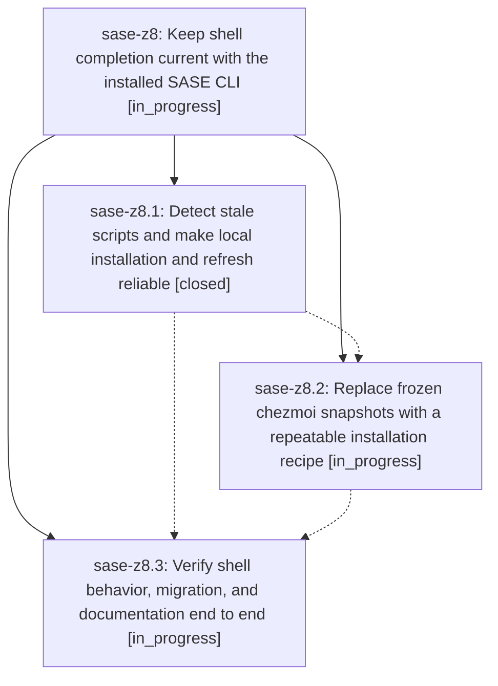

# Bead: sase-z8 — Keep shell completion current with the installed SASE CLI

[Bead Pages](../README.md) / sase-z8

**Status:** ◐ in_progress · **Type:** ▸ plan · **Tier:** epic
**Owner:** `bryanbugyi34@gmail.com` · **Created by:** [bbugyi200.athena.0i9](https://github.com/sase-org/sase--agents/blob/main/families/bbugyi200.athena.0i9.md) · **Assignee:** `sase-z8.land`
**Created:** 2026-09-10 09:46:03 EDT
**Plan:** [202609/completion\_freshness.md](https://github.com/sase-org/sase--plans/blob/main/202609/completion_freshness.md)

<!-- sase:links:start -->

## Links

| Relation | Artifact | Why |
| --- | --- | --- |
| implemented-by | [plan:202609/completion_freshness.md][1] | derived from the plan's `bead_id:` frontmatter field |

[1]: https://github.com/sase-org/sase--plans/blob/main/202609/completion_freshness.md

<!-- sase:links:end -->

## Description

Restore usage completion and reliably refresh and verify generated shell scripts when commands change, including on chezmoi-managed machines.

## Phases

| Bead | Title | Status | Size | Created | Agents | Commits |
|---|---|---|---|---|---:|---:|
| [sase-z8.1](sase-z8.1.md) | Detect stale scripts and make local installation and refresh reliable | ✓ closed | medium | 2026-09-10 | 1 | 1 |
| [sase-z8.2](sase-z8.2.md) | Replace frozen chezmoi snapshots with a repeatable installation recipe | ◐ in_progress | medium | 2026-09-10 | 1 | 0 |
| [sase-z8.3](sase-z8.3.md) | Verify shell behavior, migration, and documentation end to end | ◐ in_progress | medium | 2026-09-10 | 1 | 0 |

## Lineage

## Agents

| Agent | Bead | Commits |
|---|---|---:|
| [bbugyi200.athena.sase-z8.1](https://github.com/sase-org/sase--agents/blob/main/agents/bbugyi200.athena.sase-z8.1/README.md) | [sase-z8.1](sase-z8.1.md) | 1 |
| [bbugyi200.athena.sase-z8.2](https://github.com/sase-org/sase--agents/blob/main/agents/bbugyi200.athena.sase-z8.2/README.md) | [sase-z8.2](sase-z8.2.md) | 0 |
| [bbugyi200.athena.sase-z8.3](https://github.com/sase-org/sase--agents/blob/main/agents/bbugyi200.athena.sase-z8.3/README.md) | [sase-z8.3](sase-z8.3.md) | 0 |
| [bbugyi200.athena.sase-z8.land](https://github.com/sase-org/sase--agents/blob/main/agents/bbugyi200.athena.sase-z8.land/README.md) | [sase-z8](README.md) | 0 |

## Commits

| Repo | Commit | Subject | Bead | Committed |
|---|---|---|---|---|
| sase | [`25266f2`](https://github.com/sase-org/sase/commit/25266f215dd16b12da78f0aed9cf2a02b3c245c0) | feat(completion): refresh stale shell scripts reliably | [sase-z8.1](sase-z8.1.md) | 2026-09-10 10:29:48 EDT |
