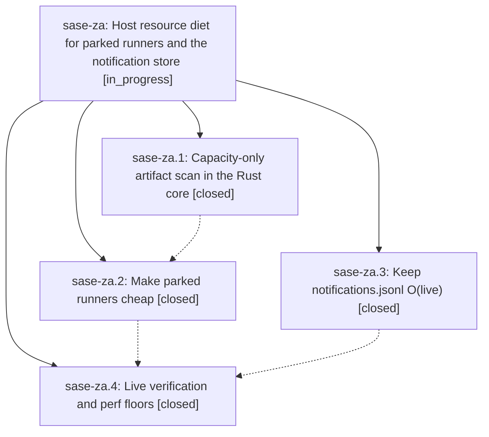

# Bead: sase-za — Host resource diet for parked runners and the notification store

[Bead Pages](../README.md) / sase-za

**Status:** ◐ in_progress · **Type:** ▸ plan · **Tier:** epic
**Owner:** `bryanbugyi34@gmail.com` · **Created by:** [bbugyi200.athena.0ih](https://github.com/sase-org/sase--agents/blob/main/families/bbugyi200.athena.0ih.md) · **Assignee:** `sase-za.land`
**Created:** 2026-09-10 11:44:15 EDT
**Plan:** [202609/host\_resource\_diet.md](https://github.com/sase-org/sase--plans/blob/main/202609/host_resource_diet.md)

<!-- sase:links:start -->

## Links

| Relation | Artifact | Why |
| --- | --- | --- |
| implemented-by | [plan:202609/host_resource_diet.md][1] | derived from the plan's `bead_id:` frontmatter field |

[1]: https://github.com/sase-org/sase--plans/blob/main/202609/host_resource_diet.md

<!-- sase:links:end -->

## Description

Parked agent runners and the ACE TUI stop consuming CPU, RSS, and swap in proportion to on-disk history: runner-slot admission scans only live capacity state, and the notification store stays O(live) via compaction.

## Notes

[2026-09-10T18:51:52Z · sase-za.4] Phase 4 (sase-za.4) live before/after verification, captured 2026-09-10 on athena.

BENCH FLOORS ADDED: capacity-mode scan floor (scan_agent_artifacts.synthetic_6p_200pp.capacity_scan_facade, tests/perf/bench_agent_scan.py) and a mostly-dismissed notification snapshot-read floor (notification_store.mostly_dismissed_900.notification_store_mostly_dismissed_load_snapshot, tests/perf/bench_notification_store.py), both wired into tests/perf/baselines/phase7_regression_floor.json and passing under `just phase7-perf-check`.

SYNTHETIC (mostly-done 1,200-dir tree, 1,100 done/100 running): capacity-only scan ~20-31ms vs ~250ms full-history scan_facade (~8-12x cheaper), matching the plan's O(live) intent.

LIVE HOST (real ~/.sase/projects tree, 32 projects, 12,650 ace-run artifact dirs): capacity-only scan took ~4.2s / 635MB peak RSS vs ~5.6s / 942MB peak RSS for the old full-history scan - only ~25% faster and ~33% less RSS, far short of the synthetic win. Root cause: 9,345 of 12,650 dirs (~74%) have NO done.json marker (many have agent_meta.stopped_at set, i.e. they did finish), so capacity_only's "done.json exists -> skip" check can't cheaply skip them. This is pre-existing historical debris, not a regression from this epic. See PROPOSED FOLLOW-UP on sase-za.4.

ACE TUI py-spy (15s @10Hz sample, PID of live `sase ace --restart-axe`): read_current_notifications_snapshot and its callees now account for ~11.7% of samples (inclusive), down from the ~38% recorded in this plan's Problem section before notification-compaction landed.

Host load average now 21-26 (vs 31-46 before) and swap ~33GB in use (similar to the ~31+GB before) - but the current swap pressure traces to dozens of genuinely RUNNING agents (real LLM-invoking work, several at 900MB-2.7GB RSS each) rather than idle parked runners or notification-store overhead; no parked run_agent_runner processes were observable on this host at measurement time to directly re-sample the original "20 parked runners holding ~16.6GB RSS" scenario, so slot-poll-diet's steady-state cheapness rests on its Phase 2 unit tests plus this phase's synthetic capacity-scan floor rather than a fresh live parked-process ps snapshot.

## Phases

| Bead | Title | Status | Size | Created | Agents | Commits |
|---|---|---|---|---|---:|---:|
| [sase-za.1](sase-za.1.md) | Capacity-only artifact scan in the Rust core | ✓ closed | medium | 2026-09-10 | 1 | 2 |
| [sase-za.2](sase-za.2.md) | Make parked runners cheap | ✓ closed | medium | 2026-09-10 | 1 | 1 |
| [sase-za.3](sase-za.3.md) | Keep notifications.jsonl O(live) | ✓ closed | medium | 2026-09-10 | 1 | 1 |
| [sase-za.4](sase-za.4.md) | Live verification and perf floors | ✓ closed | small | 2026-09-10 | 1 | 1 |

## Lineage

## Agents

| Agent | Bead | Commits |
|---|---|---:|
| [bbugyi200.athena.sase-za.1](https://github.com/sase-org/sase--agents/blob/main/agents/bbugyi200.athena.sase-za.1/README.md) | [sase-za.1](sase-za.1.md) | 2 |
| [bbugyi200.athena.sase-za.2](https://github.com/sase-org/sase--agents/blob/main/agents/bbugyi200.athena.sase-za.2/README.md) | [sase-za.2](sase-za.2.md) | 1 |
| [bbugyi200.athena.sase-za.3](https://github.com/sase-org/sase--agents/blob/main/agents/bbugyi200.athena.sase-za.3/README.md) | [sase-za.3](sase-za.3.md) | 1 |
| [bbugyi200.athena.sase-za.4](https://github.com/sase-org/sase--agents/blob/main/agents/bbugyi200.athena.sase-za.4/README.md) | [sase-za.4](sase-za.4.md) | 1 |
| [bbugyi200.athena.sase-za.land](https://github.com/sase-org/sase--agents/blob/main/agents/bbugyi200.athena.sase-za.land/README.md) | [sase-za](README.md) | 1 |

## Commits

| Repo | Commit | Subject | Bead | Committed |
|---|---|---|---|---|
| sase | [`ae07c41`](https://github.com/sase-org/sase/commit/ae07c41f4b3b673650114b9763a511a055e75940) | feat(core): add capacity\_only mode to agent scan wire | [sase-za.1](sase-za.1.md) | 2026-09-10 12:27:29 EDT |
| sase-core | [`sase-core@161206b`](https://github.com/sase-org/sase-core/commit/161206bac94875d1c5aac1be8d89095c85877507) | feat(agent\_scan): add capacity\_only fast path to scanner | [sase-za.1](sase-za.1.md) | 2026-09-10 12:30:34 EDT |
| sase-core | [`sase-core@dc3d0a8`](https://github.com/sase-org/sase-core/commit/dc3d0a8b4e7e73538615c3e3aaec4c597a7252d3) | feat(notifications): compact old dismissed rows | [sase-za.3](sase-za.3.md) | 2026-09-10 12:42:00 EDT |
| sase | [`755ef4a`](https://github.com/sase-org/sase/commit/755ef4a7b60a3bae79072a94b3c8cf4f010f7574) | perf(axe): cheapen parked runner-slot waiters | [sase-za.2](sase-za.2.md) | 2026-09-10 13:50:52 EDT |
| sase | [`b8a4b90`](https://github.com/sase-org/sase/commit/b8a4b9003945e08ed4bb3a1730df7f00716b5b28) | perf(tests): add capacity-scan and mostly-dismissed notification floors | [sase-za.4](sase-za.4.md) | 2026-09-10 14:54:18 EDT |
| sase | [`1bfd9f0`](https://github.com/sase-org/sase/commit/1bfd9f0a1c181392a3fa9e7d9d40875a61c928b3) | fix(logs): read archived notifications when packing logs | [sase-za](README.md) | 2026-09-10 15:42:30 EDT |
