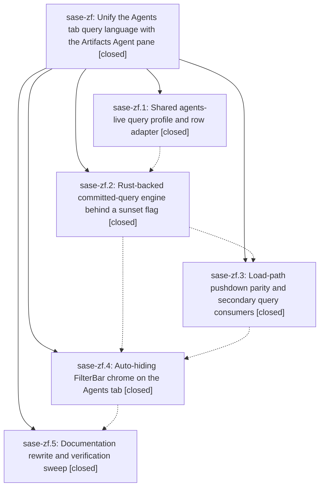

# Bead: sase-zf — Unify the Agents tab query language with the Artifacts Agent pane

[Bead Pages](../README.md) / sase-zf

**Status:** ✓ closed · **Resolution:** done · **Type:** ▸ plan · **Tier:** epic
**Owner:** `bryanbugyi34@gmail.com` · **Created by:** [bbugyi200.athena.0iy](https://github.com/sase-org/sase--agents/blob/main/families/bbugyi200.athena.0iy.md) · **Assignee:** `sase-zf.land`
**Created:** 2026-09-10 18:01:45 EDT · **Closed:** 2026-09-10 22:54:11 EDT
**Plan:** [202609/agents\_query\_unification.md](https://github.com/sase-org/sase--plans/blob/main/202609/agents_query_unification.md)

<!-- sase:links:start -->

## Links

| Relation | Artifact | Why |
| --- | --- | --- |
| implemented-by | [plan:202609/agents_query_unification.md][1] | derived from the plan's `bead_id:` frontmatter field |

[1]: https://github.com/sase-org/sase--plans/blob/main/202609/agents_query_unification.md

<!-- sase:links:end -->

## Description

The top-level Agents tab filters with the same boolean query-profile dialect, Rust-backed evaluation, and FilterBar editing chrome as the Artifacts Agent pane, with zero idle screen-space cost and no measurable performance regression.

## Notes

[2026-09-11T02:54:11Z · sase-zf.land] Verified all five phases against source and their commits: bfcdc0416 (zf.1: _agents_shared.py factoring, agents-live schema + pane registration, agent_live_query adapter, conformance goldens), 699d2adf7 (zf.2: agents_unified_query sunset flag [registry bead sase-zg] + Rust-backed committed engine, both-finalize mask application), e62e96f5f (zf.3: agents-live pushdown parity compiler wired into load_tiered_agents, machines-pane/seed/unread-jump/neighbor/prospective-clan consumers migrated), 6278e02c4 (zf.4: auto-hiding AgentsFilterBar, info-panel highlighted readout + match count, f binding in default_config.yml, PNG goldens), a53f4d04e (zf.5: docs/ace.md rewrite with the legacy migration table verbatim, query_language.md two-dialect note, configuration.md). Re-ran 124 focused tests green on master 26d84256a (unified filter, pushdown, adapter, profile schema, filter-bar session/widgets, info panel, Python/Rust query conformance). Legacy agent_query imports are confined to flag-Off branches (_filter_actions, _search_query_seed, machines_pane, agent_loader); QueryEditModal reachable only Off-flag; legacy deletion stays with flag bead sase-zg per plan. Integration: all 17 non-epic commits since epic start (sase-z4.6.x, sase-xe.16.x, sase-yy.8.x, untagged refactors/test splits) share zero files with the epic and none reference either dialect; 1546398fa also fixed two failures phase notes had reported. epic-symbols: no entries (zf.3's two entries were retired in-flight by 3c2bd38cb). Follow-up dispositions: (1) zf.4 saved-query picker proposal -> new feature task sase-zj (medium, ready, related-linked to sase-zg); (2) zf.3 restart_recovery marker-audit failure -> corroborated existing ready task sase-zi with +1 (still fails on 26d84256a); (3) zf.3 test-wait lint violations -> duplicate of existing task sase-zh, since fixed on master by 1546398fa, resolution noted on sase-zh; (4) zf.1/zf.3 sase-z0 link_events registry drift -> resolved, flag bead sase-z0 closed and _lint-flags no longer names it; (5) zf.3/zf.5 sase-z5 weighted_queue_capacity rule-8 drift, now a hard `just check` blocker -> DISCOVERED ISSUE note on causally owning active epic sase-z4 (no task per policy); (6) zf.3 fleet_count_logical_agents and research_swarm full-suite failures -> declined, verified passing on current master (fixed by 1546398fa / plugin refresh). Full `just check` remains blocked repo-wide at _lint-flags by the unrelated sase-z5 drift recorded above.

## Phases

| Bead | Title | Status | Size | Created | Agents | Commits |
|---|---|---|---|---|---:|---:|
| [sase-zf.1](sase-zf.1.md) | Shared agents-live query profile and row adapter | ✓ closed | medium | 2026-09-10 | 1 | 2 |
| [sase-zf.2](sase-zf.2.md) | Rust-backed committed-query engine behind a sunset flag | ✓ closed | medium | 2026-09-10 | 1 | 1 |
| [sase-zf.3](sase-zf.3.md) | Load-path pushdown parity and secondary query consumers | ✓ closed | medium | 2026-09-10 | 1 | 1 |
| [sase-zf.4](sase-zf.4.md) | Auto-hiding FilterBar chrome on the Agents tab | ✓ closed | medium | 2026-09-10 | 1 | 1 |
| [sase-zf.5](sase-zf.5.md) | Documentation rewrite and verification sweep | ✓ closed | small | 2026-09-10 | 1 | 1 |

## Lineage

## Agents

| Agent | Bead | Commits |
|---|---|---:|
| [bbugyi200.athena.sase-zf.1](https://github.com/sase-org/sase--agents/blob/main/agents/bbugyi200.athena.sase-zf.1/README.md) | [sase-zf.1](sase-zf.1.md) | 2 |
| [bbugyi200.athena.sase-zf.2](https://github.com/sase-org/sase--agents/blob/main/agents/bbugyi200.athena.sase-zf.2/README.md) | [sase-zf.2](sase-zf.2.md) | 1 |
| [bbugyi200.athena.sase-zf.3](https://github.com/sase-org/sase--agents/blob/main/agents/bbugyi200.athena.sase-zf.3/README.md) | [sase-zf.3](sase-zf.3.md) | 1 |
| [bbugyi200.athena.sase-zf.4](https://github.com/sase-org/sase--agents/blob/main/agents/bbugyi200.athena.sase-zf.4/README.md) | [sase-zf.4](sase-zf.4.md) | 1 |
| [bbugyi200.athena.sase-zf.5](https://github.com/sase-org/sase--agents/blob/main/agents/bbugyi200.athena.sase-zf.5/README.md) | [sase-zf.5](sase-zf.5.md) | 1 |
| [bbugyi200.athena.sase-zf.land](https://github.com/sase-org/sase--agents/blob/main/agents/bbugyi200.athena.sase-zf.land/README.md) | [sase-zf](README.md) | 1 |

## Commits

| Repo | Commit | Subject | Bead | Committed |
|---|---|---|---|---|
| sase | [`bfcdc04`](https://github.com/sase-org/sase/commit/bfcdc0416288ba8d9175177ecbdadaf6a3e64c9e) | feat(query): add agents-live profile adapter | [sase-zf.1](sase-zf.1.md) | 2026-09-10 18:56:37 EDT |
| sase-core | [`sase-core@7d6dfcf`](https://github.com/sase-org/sase-core/commit/7d6dfcfa96ec50003df79fc0942726a51bc1db52) | fix(query): quote canonical property values | [sase-zf.1](sase-zf.1.md) | 2026-09-10 18:59:47 EDT |
| sase | [`699d2ad`](https://github.com/sase-org/sase/commit/699d2adf7a8ab928c0bcfa57dedfb54357f9189c) | feat(agents-tab): add Rust-backed committed-query engine behind sunset flag | [sase-zf.2](sase-zf.2.md) | 2026-09-10 20:02:31 EDT |
| sase | [`e62e96f`](https://github.com/sase-org/sase/commit/e62e96f5ff917f5837051f2a192f842f453ce18d) | feat(agents): push down live query filters | [sase-zf.3](sase-zf.3.md) | 2026-09-10 20:45:16 EDT |
| sase | [`6278e02`](https://github.com/sase-org/sase/commit/6278e02c446a430671c96273b034fd0ada67c157) | feat(agents-tab): add auto-hiding FilterBar chrome (sase-zf.4) | [sase-zf.4](sase-zf.4.md) | 2026-09-10 22:04:56 EDT |
| sase | [`a53f4d0`](https://github.com/sase-org/sase/commit/a53f4d04e5fa8e45452a3e293d1edeee6188fc23) | docs(ace): document unified agents query syntax | [sase-zf.5](sase-zf.5.md) | 2026-09-10 22:28:25 EDT |
| sase--plans | [`sase--plans@89c8f4e`](https://github.com/sase-org/sase--plans/commit/89c8f4ede58e4053a31e0a15cacb8f24c774ab17) | docs(plans): mark agents\_query\_unification done after landing epic sase-zf | [sase-zf](README.md) | 2026-09-10 22:58:53 EDT |
