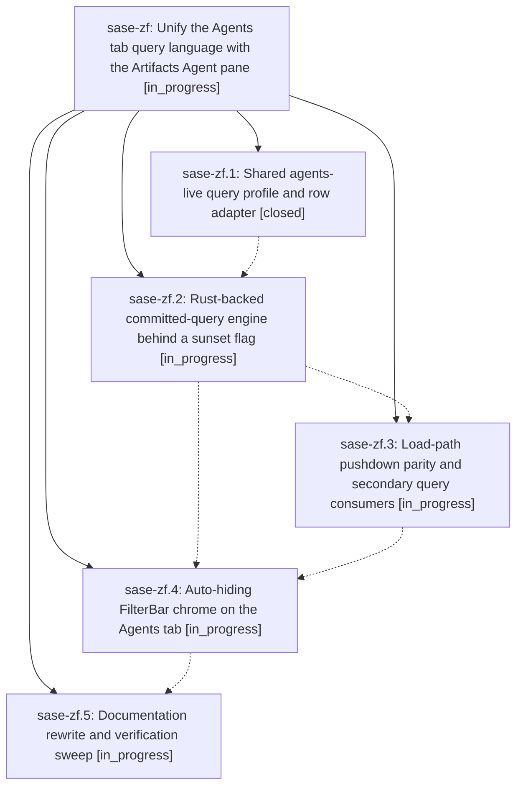

# Bead: sase-zf — Unify the Agents tab query language with the Artifacts Agent pane

[Bead Pages](../README.md) / sase-zf

**Status:** ◐ in_progress · **Type:** ▸ plan · **Tier:** epic
**Owner:** `bryanbugyi34@gmail.com` · **Created by:** [bbugyi200.athena.0iy](https://github.com/sase-org/sase--agents/blob/main/families/bbugyi200.athena.0iy.md) · **Assignee:** `sase-zf.land`
**Created:** 2026-09-10 18:01:45 EDT
**Plan:** [202609/agents\_query\_unification.md](https://github.com/sase-org/sase--plans/blob/main/202609/agents_query_unification.md)

## Description

The top-level Agents tab filters with the same boolean query-profile dialect, Rust-backed evaluation, and FilterBar editing chrome as the Artifacts Agent pane, with zero idle screen-space cost and no measurable performance regression.

## Phases

| Bead | Title | Status | Size | Created | Agents | Commits |
|---|---|---|---|---|---:|---:|
| [sase-zf.1](sase-zf.1.md) | Shared agents-live query profile and row adapter | ✓ closed | medium | 2026-09-10 | 1 | 1 |
| [sase-zf.2](sase-zf.2.md) | Rust-backed committed-query engine behind a sunset flag | ◐ in_progress | medium | 2026-09-10 | 1 | 0 |
| [sase-zf.3](sase-zf.3.md) | Load-path pushdown parity and secondary query consumers | ◐ in_progress | medium | 2026-09-10 | 1 | 0 |
| [sase-zf.4](sase-zf.4.md) | Auto-hiding FilterBar chrome on the Agents tab | ◐ in_progress | medium | 2026-09-10 | 1 | 0 |
| [sase-zf.5](sase-zf.5.md) | Documentation rewrite and verification sweep | ◐ in_progress | small | 2026-09-10 | 1 | 0 |

## Lineage

## Agents

| Agent | Bead | Commits |
|---|---|---:|
| [bbugyi200.athena.sase-zf.1](https://github.com/sase-org/sase--agents/blob/main/agents/bbugyi200.athena.sase-zf.1/README.md) | [sase-zf.1](sase-zf.1.md) | 1 |
| [bbugyi200.athena.sase-zf.2](https://github.com/sase-org/sase--agents/blob/main/agents/bbugyi200.athena.sase-zf.2/README.md) | [sase-zf.2](sase-zf.2.md) | 0 |
| [bbugyi200.athena.sase-zf.3](https://github.com/sase-org/sase--agents/blob/main/agents/bbugyi200.athena.sase-zf.3/README.md) | [sase-zf.3](sase-zf.3.md) | 0 |
| [bbugyi200.athena.sase-zf.4](https://github.com/sase-org/sase--agents/blob/main/agents/bbugyi200.athena.sase-zf.4/README.md) | [sase-zf.4](sase-zf.4.md) | 0 |
| [bbugyi200.athena.sase-zf.5](https://github.com/sase-org/sase--agents/blob/main/agents/bbugyi200.athena.sase-zf.5/README.md) | [sase-zf.5](sase-zf.5.md) | 0 |
| [bbugyi200.athena.sase-zf.land](https://github.com/sase-org/sase--agents/blob/main/agents/bbugyi200.athena.sase-zf.land/README.md) | [sase-zf](README.md) | 0 |

## Commits

| Repo | Commit | Subject | Bead | Committed |
|---|---|---|---|---|
| sase | [`bfcdc04`](https://github.com/sase-org/sase/commit/bfcdc0416288ba8d9175177ecbdadaf6a3e64c9e) | feat(query): add agents-live profile adapter | [sase-zf.1](sase-zf.1.md) | 2026-09-10 18:56:37 EDT |
