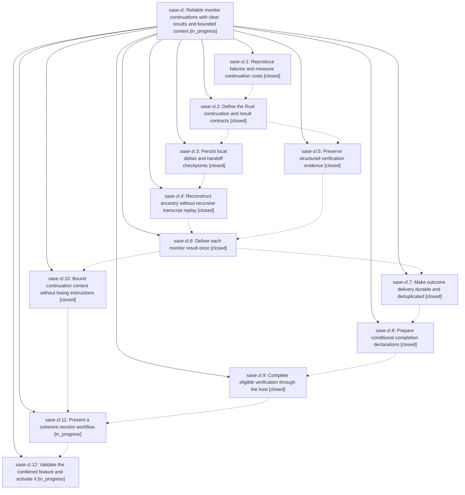

# Bead: sase-zl — Reliable monitor continuations with clear results and bounded context

[Bead Pages](../README.md) / sase-zl

**Status:** ◐ in_progress · **Type:** ▸ plan · **Tier:** epic
**Owner:** `bryanbugyi34@gmail.com` · **Created by:** [bbugyi200.athena.0j2](https://github.com/sase-org/sase--agents/blob/main/families/bbugyi200.athena.0j2.md) · **Assignee:** `sase-zl.land`
**Created:** 2026-09-11 06:30:10 EDT
**Plan:** [202609/monitor\_continuations.md](https://github.com/sase-org/sase--plans/blob/main/202609/monitor_continuations.md)

## Description

Monitor chains preserve the user's intent without recursively replaying history, deliver one useful result with recoverable evidence, and reliably continue or finish through an explicitly prepared host completion action in a clear, polished interface.

## Phases

| Bead | Title | Status | Size | Created | Agents | Commits |
|---|---|---|---|---|---:|---:|
| [sase-zl.1](sase-zl.1.md) | Reproduce failures and measure continuation costs | ✓ closed | medium | 2026-09-11 | 1 | 1 |
| [sase-zl.10](sase-zl.10.md) | Bound continuation context without losing instructions | ✓ closed | medium | 2026-09-11 | 1 | 2 |
| [sase-zl.11](sase-zl.11.md) | Present a coherent monitor workflow | ◐ in_progress | medium | 2026-09-11 | 1 | 0 |
| [sase-zl.12](sase-zl.12.md) | Validate the combined feature and activate it | ◐ in_progress | medium | 2026-09-11 | 1 | 0 |
| [sase-zl.2](sase-zl.2.md) | Define the Rust continuation and result contracts | ✓ closed | medium | 2026-09-11 | 1 | 2 |
| [sase-zl.3](sase-zl.3.md) | Persist local deltas and handoff checkpoints | ✓ closed | medium | 2026-09-11 | 1 | 1 |
| [sase-zl.4](sase-zl.4.md) | Reconstruct ancestry without recursive transcript replay | ✓ closed | medium | 2026-09-11 | 1 | 2 |
| [sase-zl.5](sase-zl.5.md) | Preserve structured verification evidence | ✓ closed | medium | 2026-09-11 | 1 | 1 |
| [sase-zl.6](sase-zl.6.md) | Deliver each monitor result once | ✓ closed | medium | 2026-09-11 | 1 | 1 |
| [sase-zl.7](sase-zl.7.md) | Make outcome delivery durable and deduplicated | ✓ closed | medium | 2026-09-11 | 1 | 0 |
| [sase-zl.8](sase-zl.8.md) | Prepare conditional completion declarations | ✓ closed | medium | 2026-09-11 | 1 | 2 |
| [sase-zl.9](sase-zl.9.md) | Complete eligible verification through the host | ✓ closed | medium | 2026-09-11 | 1 | 1 |

## Lineage

## Dependencies

- **Blocks:** [sase-zm.5](../sase-zm/sase-zm.5.md) ◐ · ⧖ 2026-09-11

## Agents

| Agent | Bead | Commits |
|---|---|---:|
| [bbugyi200.athena.sase-zl.1](https://github.com/sase-org/sase--agents/blob/main/agents/bbugyi200.athena.sase-zl.1/README.md) | [sase-zl.1](sase-zl.1.md) | 1 |
| [bbugyi200.athena.sase-zl.10](https://github.com/sase-org/sase--agents/blob/main/agents/bbugyi200.athena.sase-zl.10/README.md) | [sase-zl.10](sase-zl.10.md) | 0 |
| [bbugyi200.athena.sase-zl.11](https://github.com/sase-org/sase--agents/blob/main/agents/bbugyi200.athena.sase-zl.11/README.md) | [sase-zl.11](sase-zl.11.md) | 0 |
| [bbugyi200.athena.sase-zl.12](https://github.com/sase-org/sase--agents/blob/main/agents/bbugyi200.athena.sase-zl.12/README.md) | [sase-zl.12](sase-zl.12.md) | 0 |
| [bbugyi200.athena.sase-zl.2](https://github.com/sase-org/sase--agents/blob/main/agents/bbugyi200.athena.sase-zl.2/README.md) | [sase-zl.2](sase-zl.2.md) | 0 |
| [bbugyi200.athena.sase-zl.3](https://github.com/sase-org/sase--agents/blob/main/agents/bbugyi200.athena.sase-zl.3/README.md) | [sase-zl.3](sase-zl.3.md) | 1 |
| [bbugyi200.athena.sase-zl.4](https://github.com/sase-org/sase--agents/blob/main/agents/bbugyi200.athena.sase-zl.4/README.md) | [sase-zl.4](sase-zl.4.md) | 2 |
| [bbugyi200.athena.sase-zl.5](https://github.com/sase-org/sase--agents/blob/main/agents/bbugyi200.athena.sase-zl.5/README.md) | [sase-zl.5](sase-zl.5.md) | 1 |
| [bbugyi200.athena.sase-zl.6](https://github.com/sase-org/sase--agents/blob/main/agents/bbugyi200.athena.sase-zl.6/README.md) | [sase-zl.6](sase-zl.6.md) | 1 |
| [bbugyi200.athena.sase-zl.7](https://github.com/sase-org/sase--agents/blob/main/agents/bbugyi200.athena.sase-zl.7/README.md) | [sase-zl.7](sase-zl.7.md) | 0 |
| [bbugyi200.athena.sase-zl.8](https://github.com/sase-org/sase--agents/blob/main/agents/bbugyi200.athena.sase-zl.8/README.md) | [sase-zl.8](sase-zl.8.md) | 2 |
| [bbugyi200.athena.sase-zl.9](https://github.com/sase-org/sase--agents/blob/main/agents/bbugyi200.athena.sase-zl.9/README.md) | [sase-zl.9](sase-zl.9.md) | 1 |
| [bbugyi200.athena.sase-zl.land](https://github.com/sase-org/sase--agents/blob/main/agents/bbugyi200.athena.sase-zl.land/README.md) | [sase-zl](README.md) | 0 |

## Commits

| Repo | Commit | Subject | Bead | Committed |
|---|---|---|---|---|
| sase | [`e40da3e`](https://github.com/sase-org/sase/commit/e40da3e1aa29f8518bb54bae45f2739a71ae2998) | feat(monitor): record continuation baseline measurements | [sase-zl.1](sase-zl.1.md) | 2026-09-11 07:16:33 EDT |
| sase-core | [`sase-core@a5d2609`](https://github.com/sase-org/sase-core/commit/a5d2609b31ed13143602ae94801f0cbfa1f2c680) | feat: Define the Rust continuation and result contracts (sase-zl.2) | [sase-zl.2](sase-zl.2.md) | 2026-09-11 08:47:21 EDT |
| sase | [`a657cba`](https://github.com/sase-org/sase/commit/a657cba4272651b1a83c9b014713a5cb9468cead) | feat: Define the Rust continuation and result contracts (sase-zl.2) | [sase-zl.2](sase-zl.2.md) | 2026-09-11 08:47:39 EDT |
| sase | [`de84c60`](https://github.com/sase-org/sase/commit/de84c60d1c9908fef3402fd41ddd514f8f05297a) | feat(continuation): persist local turn capture | [sase-zl.3](sase-zl.3.md) | 2026-09-11 09:44:40 EDT |
| sase | [`e3feeb1`](https://github.com/sase-org/sase/commit/e3feeb1ec19afb04788f996d704475e8bf48a6ab) | feat(monitor): preserve diagnostic evidence | [sase-zl.5](sase-zl.5.md) | 2026-09-11 10:01:27 EDT |
| sase | [`64360fe`](https://github.com/sase-org/sase/commit/64360feed600faeaf52950cfa8116be50d693cb6) | feat(continuation): render versioned replay forks | [sase-zl.4](sase-zl.4.md) | 2026-09-11 10:48:37 EDT |
| sase-core | [`sase-core@f10d25d`](https://github.com/sase-org/sase-core/commit/f10d25d849f0f17a0e051bb06a89d5ffae6c325f) | feat(continuation): expose stable replay blocks | [sase-zl.4](sase-zl.4.md) | 2026-09-11 10:51:21 EDT |
| sase | [`875447e`](https://github.com/sase-org/sase/commit/875447e2142f71dc04daeb49eab72c655c343be7) | feat(monitor): freeze monitor result evidence | [sase-zl.6](sase-zl.6.md) | 2026-09-11 12:15:45 EDT |
| sase | [`0cc6632`](https://github.com/sase-org/sase/commit/0cc66329ebdce3e0d4e8f912606d0d2bc816d8c1) | feat: Bound continuation context without losing instructions (sase-zl.10) | [sase-zl.10](sase-zl.10.md) | 2026-09-11 13:31:08 EDT |
| sase-core | [`sase-core@e1ab1d0`](https://github.com/sase-org/sase-core/commit/e1ab1d0efbbd0e518287f1d3954dae3de0b769f0) | feat: Bound continuation context without losing instructions (sase-zl.10) | [sase-zl.10](sase-zl.10.md) | 2026-09-11 13:31:23 EDT |
| sase | [`d70fa0a`](https://github.com/sase-org/sase/commit/d70fa0ace8f3f02d73db172337e28ec0ec339953) | feat(monitor): prepare host-sealed conditional completion intents | [sase-zl.8](sase-zl.8.md) | 2026-09-11 15:16:05 EDT |
| sase-core | [`sase-core@633c0cb`](https://github.com/sase-org/sase-core/commit/633c0cbd800ac205c49fa48325c0f3d6961a702e) | feat(continuation): add conditional completion seal and bind contracts | [sase-zl.8](sase-zl.8.md) | 2026-09-11 15:19:18 EDT |
| sase | [`0b653f0`](https://github.com/sase-org/sase/commit/0b653f0a2b1ca7aba2942fc0e7b71322066cfb7e) | feat(monitor): complete eligible verification through the host | [sase-zl.9](sase-zl.9.md) | 2026-09-11 16:34:04 EDT |
