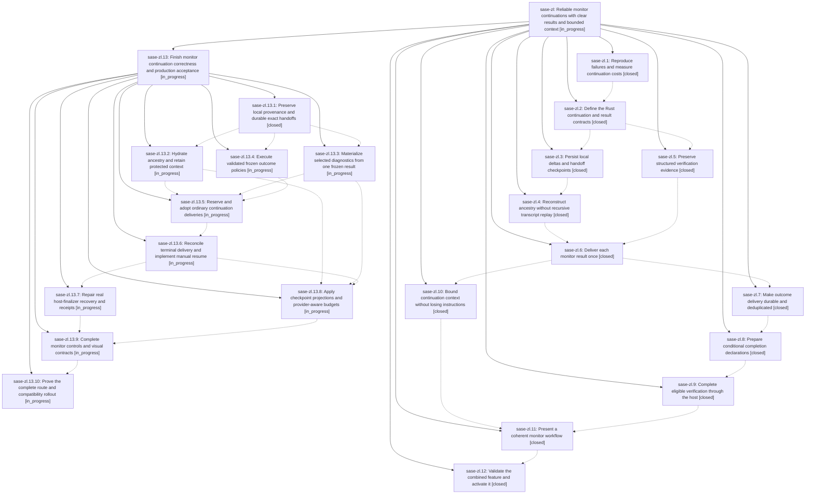

# Bead: sase-zl — Reliable monitor continuations with clear results and bounded context

[Bead Pages](../README.md) / sase-zl

**Status:** ◐ in_progress · **Type:** ▸ plan · **Tier:** epic
**Owner:** `bryanbugyi34@gmail.com` · **Created by:** [bbugyi200.athena.0j2](https://github.com/sase-org/sase--agents/blob/main/families/bbugyi200.athena.0j2.md) · **Assignee:** `sase-zl.land`
**Created:** 2026-09-11 06:30:10 EDT
**Plan:** [202609/monitor\_continuations.md](https://github.com/sase-org/sase--plans/blob/main/202609/monitor_continuations.md)

## Description

Monitor chains preserve the user's intent without recursively replaying history, deliver one useful result with recoverable evidence, and reliably continue or finish through an explicitly prepared host completion action in a clear, polished interface.

## Notes

[2026-09-12T03:41:54Z · sase-zl.land] LANDING AUDIT — NOT READY TO CLOSE. Reviewed sase-zl (no prior epic notes), all twelve children and every note, the complete linked plan, tagged primary/core commits, and non-epic drift since e40da3e1a. Primary clean master 9202146ca; opened core acab7b4. All old phases are closed but production requirements are incomplete. Durable audit: file:explicit:b356c51cb45677f60961e909 (attached to this bead).

Confirmed with temporary, no-provider probes: (1) direct child fork loses ORIGINAL_CONSTRAINT_SENTINEL and reports its existing parent missing, with both the phase-12 custom wheel and published core 0.34.15; (2) complete_prompt_segments mislabels expanded inherited context local_materialized; (3) host _recover calls the real launch_followup_agent without five required keyword-only arguments and raises TypeError. Source confirms policy file is only hashed/discarded; ordinary delivery has no reserved-key receiver adoption; reconciliation excludes terminal monitors; monitor resume/checkpoint CLI are absent; budget supplies no reduction candidates or provider-dependent limit; selected diagnostic refs are not materialized into the successor; rollout and production acceptance remain incomplete. These are epic work, not unrelated task beads. The old 100-node family fixture and mocked two-argument recovery callback miss the real integration failures.

Integration must preserve capture/replay package splits b49a92212/485906e0d, typed launch and requester recovery 5428b9943/e47d159b5, weighted capacity e48aa7db0 and later admission changes, unified Agents/search keys and cached refresh improvements, and current Rust/Grok bindings. sase-zm.5 explicitly waits on this epic; independent command weights remain its work. No parent_bead above this epic. epic-symbols reported none. No close/force/plan-done action and no full-check success claimed.

ALL 20 PROPOSED FOLLOW-UP OUTCOMES, carry into eventual close note:
- .1#1: z6/z9 closed, current feature-flag and raw Symvision gates pass; decline historical lint task.
- .2#1: same resolved flag report; no task.
- .2#2: decline unverified 34-failure umbrella; final combined full gate still required and any persisting failure needs concrete node-specific triage.
- .2#3: historical root already tracked by sase-zk; current Symvision passes, so no duplicate or false fresh-failure +1.
- .3#1 and .4#1: resolved z6/z9 flag reports; no tasks.
- .4#2: Symvision passes; capture toobig was epic-owned and b49a92212 already split it. No task.
- .4#3: decline historical mixed-suite umbrella; preserve as final-gate coverage after intervening artifact-link/launch/fleet fixes, with concrete triage if anything recurs.
- .5#1 and .6#1 and .7#1: resolved flag reports; no tasks.
- .7#2: Symvision passes and capture split exists; no task.
- .8#1: epic-owned continuation_budget assignment fixed by 0b653f0a2; current ruff and mypy for that file pass. No unrelated task.
- .9#1: flag/Symvision checks pass and capture split exists; no task.
- .10#1: published core 0.34.15 exposes provider_usage_normalize_grok_billing; binding validator passes. db535fabd/bebabf9 integrated it; no task.
- .11#1: z9 closed canceled as orphan; flag checker passes. No task.
- .11#2: current Symvision passes; historical root already sase-zk. No duplicate.
- .11#3: epic-owned capture split delivered b49a92212; no task.
- .11#4: no generic mixed-suite task; require final full gate and node-specific follow-up outcomes before close.
- .12#1: independently reproduced installed research plugin 0.2.0 still emitting retired %wait(priority=...). Appended DISCOVERED ISSUE corroboration to existing causal epic sase-z4.6.5.4 (published-floors phase .5). Its current optional E2E skip is not release compatibility proof; no new task.
Task skill registered; all-status task searches, recent-week sweep and active-epic sweep completed. Independently reproduced configured repo-open display-name mismatch and +1 recorded on existing sase-zo; sanctioned external open allowed review. Audit ref attachment initially hit a dirty hidden plans clone, but explicit bead ref add subsequently succeeded; no foreign clone cleanup was performed.

REMAINING-WORK HANDOFF: sase_plan_monitor_continuation_landing_repairs.md has parent_bead: sase-zl and ten sized implementation/acceptance phases. Both validate --explain and revalidate passed with zero warnings. Submit through sase_plan; child landing resumes this parent normally. Parent close, post-close symvision and parent plan-done are not child phases. Final acceptance must run coordinated Rust/PyO3 checks, real visual/evaluation evidence and just check-full through sase_monitor before this landing can complete. No tracked application source was changed in this review.

## References

- file:explicit:b356c51cb45677f60961e909

## Phases

| Bead | Title | Status | Size | Created | Agents | Commits |
|---|---|---|---|---|---:|---:|
| [sase-zl.1](sase-zl.1.md) | Reproduce failures and measure continuation costs | ✓ closed | medium | 2026-09-11 | 1 | 1 |
| [sase-zl.10](sase-zl.10.md) | Bound continuation context without losing instructions | ✓ closed | medium | 2026-09-11 | 1 | 2 |
| [sase-zl.11](sase-zl.11.md) | Present a coherent monitor workflow | ✓ closed | medium | 2026-09-11 | 1 | 2 |
| [sase-zl.12](sase-zl.12.md) | Validate the combined feature and activate it | ✓ closed | medium | 2026-09-11 | 2 | 3 |
| [sase-zl.2](sase-zl.2.md) | Define the Rust continuation and result contracts | ✓ closed | medium | 2026-09-11 | 1 | 2 |
| [sase-zl.3](sase-zl.3.md) | Persist local deltas and handoff checkpoints | ✓ closed | medium | 2026-09-11 | 1 | 1 |
| [sase-zl.4](sase-zl.4.md) | Reconstruct ancestry without recursive transcript replay | ✓ closed | medium | 2026-09-11 | 1 | 2 |
| [sase-zl.5](sase-zl.5.md) | Preserve structured verification evidence | ✓ closed | medium | 2026-09-11 | 1 | 1 |
| [sase-zl.6](sase-zl.6.md) | Deliver each monitor result once | ✓ closed | medium | 2026-09-11 | 1 | 1 |
| [sase-zl.7](sase-zl.7.md) | Make outcome delivery durable and deduplicated | ✓ closed | medium | 2026-09-11 | 1 | 0 |
| [sase-zl.8](sase-zl.8.md) | Prepare conditional completion declarations | ✓ closed | medium | 2026-09-11 | 1 | 2 |
| [sase-zl.9](sase-zl.9.md) | Complete eligible verification through the host | ✓ closed | medium | 2026-09-11 | 1 | 2 |

## Lineage

## Dependencies

- **Blocks:** [sase-zm.5](../sase-zm/sase-zm.5.md) ◐ · ⧖ 2026-09-11

## Agents

| Agent | Bead | Commits |
|---|---|---:|
| [bbugyi200.athena.sase-xe.16.11.7.14.6.6](https://github.com/sase-org/sase--agents/blob/main/families/bbugyi200.athena.sase-xe.16.11.7.14.6.6.md) | [sase-zl.12](sase-zl.12.md) | 1 |
| [bbugyi200.athena.sase-zl.1](https://github.com/sase-org/sase--agents/blob/main/agents/bbugyi200.athena.sase-zl.1/README.md) | [sase-zl.1](sase-zl.1.md) | 1 |
| [bbugyi200.athena.sase-zl.10](https://github.com/sase-org/sase--agents/blob/main/agents/bbugyi200.athena.sase-zl.10/README.md) | [sase-zl.10](sase-zl.10.md) | 0 |
| [bbugyi200.athena.sase-zl.11](https://github.com/sase-org/sase--agents/blob/main/agents/bbugyi200.athena.sase-zl.11/README.md) | [sase-zl.11](sase-zl.11.md) | 2 |
| [bbugyi200.athena.sase-zl.12](https://github.com/sase-org/sase--agents/blob/main/families/bbugyi200.athena.sase-zl.12.md) | [sase-zl.12](sase-zl.12.md) | 2 |
| [bbugyi200.athena.sase-zl.13.1](https://github.com/sase-org/sase--agents/blob/main/agents/bbugyi200.athena.sase-zl.13.1/README.md) | [sase-zl.13.1](sase-zl.13.1.md) | 1 |
| [bbugyi200.athena.sase-zl.13.10](https://github.com/sase-org/sase--agents/blob/main/agents/bbugyi200.athena.sase-zl.13.10/README.md) | [sase-zl.13.10](sase-zl.13.10.md) | 0 |
| [bbugyi200.athena.sase-zl.13.2](https://github.com/sase-org/sase--agents/blob/main/agents/bbugyi200.athena.sase-zl.13.2/README.md) | [sase-zl.13.2](sase-zl.13.2.md) | 0 |
| [bbugyi200.athena.sase-zl.13.3](https://github.com/sase-org/sase--agents/blob/main/agents/bbugyi200.athena.sase-zl.13.3/README.md) | [sase-zl.13.3](sase-zl.13.3.md) | 0 |
| [bbugyi200.athena.sase-zl.13.4](https://github.com/sase-org/sase--agents/blob/main/agents/bbugyi200.athena.sase-zl.13.4/README.md) | [sase-zl.13.4](sase-zl.13.4.md) | 0 |
| [bbugyi200.athena.sase-zl.13.5](https://github.com/sase-org/sase--agents/blob/main/agents/bbugyi200.athena.sase-zl.13.5/README.md) | [sase-zl.13.5](sase-zl.13.5.md) | 0 |
| [bbugyi200.athena.sase-zl.13.6](https://github.com/sase-org/sase--agents/blob/main/agents/bbugyi200.athena.sase-zl.13.6/README.md) | [sase-zl.13.6](sase-zl.13.6.md) | 0 |
| [bbugyi200.athena.sase-zl.13.7](https://github.com/sase-org/sase--agents/blob/main/agents/bbugyi200.athena.sase-zl.13.7/README.md) | [sase-zl.13.7](sase-zl.13.7.md) | 0 |
| [bbugyi200.athena.sase-zl.13.8](https://github.com/sase-org/sase--agents/blob/main/agents/bbugyi200.athena.sase-zl.13.8/README.md) | [sase-zl.13.8](sase-zl.13.8.md) | 0 |
| [bbugyi200.athena.sase-zl.13.9](https://github.com/sase-org/sase--agents/blob/main/agents/bbugyi200.athena.sase-zl.13.9/README.md) | [sase-zl.13.9](sase-zl.13.9.md) | 0 |
| [bbugyi200.athena.sase-zl.13.land](https://github.com/sase-org/sase--agents/blob/main/agents/bbugyi200.athena.sase-zl.13.land/README.md) | [sase-zl.13](sase-zl.13.md) | 0 |
| [bbugyi200.athena.sase-zl.2](https://github.com/sase-org/sase--agents/blob/main/agents/bbugyi200.athena.sase-zl.2/README.md) | [sase-zl.2](sase-zl.2.md) | 0 |
| [bbugyi200.athena.sase-zl.3](https://github.com/sase-org/sase--agents/blob/main/agents/bbugyi200.athena.sase-zl.3/README.md) | [sase-zl.3](sase-zl.3.md) | 1 |
| [bbugyi200.athena.sase-zl.4](https://github.com/sase-org/sase--agents/blob/main/agents/bbugyi200.athena.sase-zl.4/README.md) | [sase-zl.4](sase-zl.4.md) | 2 |
| [bbugyi200.athena.sase-zl.5](https://github.com/sase-org/sase--agents/blob/main/agents/bbugyi200.athena.sase-zl.5/README.md) | [sase-zl.5](sase-zl.5.md) | 1 |
| [bbugyi200.athena.sase-zl.6](https://github.com/sase-org/sase--agents/blob/main/agents/bbugyi200.athena.sase-zl.6/README.md) | [sase-zl.6](sase-zl.6.md) | 1 |
| [bbugyi200.athena.sase-zl.7](https://github.com/sase-org/sase--agents/blob/main/agents/bbugyi200.athena.sase-zl.7/README.md) | [sase-zl.7](sase-zl.7.md) | 0 |
| [bbugyi200.athena.sase-zl.8](https://github.com/sase-org/sase--agents/blob/main/agents/bbugyi200.athena.sase-zl.8/README.md) | [sase-zl.8](sase-zl.8.md) | 2 |
| [bbugyi200.athena.sase-zl.9](https://github.com/sase-org/sase--agents/blob/main/agents/bbugyi200.athena.sase-zl.9/README.md) | [sase-zl.9](sase-zl.9.md) | 2 |
| [bbugyi200.athena.sase-zl.land](https://github.com/sase-org/sase--agents/blob/main/families/bbugyi200.athena.sase-zl.land.md) | [sase-zl](README.md) | 0 |

## Commits

| Repo | Commit | Subject | Bead | Committed |
|---|---|---|---|---|
| sase | [`e40da3e`](https://github.com/sase-org/sase/commit/e40da3e1aa29f8518bb54bae45f2739a71ae2998) | feat(monitor): record continuation baseline measurements | [sase-zl.1](sase-zl.1.md) | 2026-09-11 07:16:33 EDT |
| sase-core | [`sase-core@a5d2609`](https://github.com/sase-org/sase-core/commit/a5d2609b31ed13143602ae94801f0cbfa1f2c680) | feat: Define the Rust continuation and result contracts (sase-zl.2) | [sase-zl.2](sase-zl.2.md) | 2026-09-11 08:47:21 EDT |
| sase | [`a657cba`](https://github.com/sase-org/sase/commit/a657cba4272651b1a83c9b014713a5cb9468cead) | feat: Define the Rust continuation and result contracts (sase-zl.2) | [sase-zl.2](sase-zl.2.md) | 2026-09-11 08:47:39 EDT |
| sase | [`de84c60`](https://github.com/sase-org/sase/commit/de84c60d1c9908fef3402fd41ddd514f8f05297a) | feat(continuation): persist local turn capture | [sase-zl.3](sase-zl.3.md) | 2026-09-11 09:44:40 EDT |
| sase | [`e3feeb1`](https://github.com/sase-org/sase/commit/e3feeb1ec19afb04788f996d704475e8bf48a6ab) | feat(monitor): preserve diagnostic evidence | [sase-zl.5](sase-zl.5.md) | 2026-09-11 10:01:27 EDT |
| sase | [`64360fe`](https://github.com/sase-org/sase/commit/64360feed600faeaf52950cfa8116be50d693cb6) | feat(continuation): render versioned replay forks | [sase-zl.4](sase-zl.4.md) | 2026-09-11 10:48:37 EDT |
| sase-core | [`sase-core@f10d25d`](https://github.com/sase-org/sase-core/commit/f10d25d849f0f17a0e051bb06a89d5ffae6c325f) | feat(continuation): expose stable replay blocks | [sase-zl.4](sase-zl.4.md) | 2026-09-11 10:51:21 EDT |
| sase | [`875447e`](https://github.com/sase-org/sase/commit/875447e2142f71dc04daeb49eab72c655c343be7) | feat(monitor): freeze monitor result evidence | [sase-zl.6](sase-zl.6.md) | 2026-09-11 12:15:45 EDT |
| sase | [`0cc6632`](https://github.com/sase-org/sase/commit/0cc66329ebdce3e0d4e8f912606d0d2bc816d8c1) | feat: Bound continuation context without losing instructions (sase-zl.10) | [sase-zl.10](sase-zl.10.md) | 2026-09-11 13:31:08 EDT |
| sase-core | [`sase-core@e1ab1d0`](https://github.com/sase-org/sase-core/commit/e1ab1d0efbbd0e518287f1d3954dae3de0b769f0) | feat: Bound continuation context without losing instructions (sase-zl.10) | [sase-zl.10](sase-zl.10.md) | 2026-09-11 13:31:23 EDT |
| sase | [`d70fa0a`](https://github.com/sase-org/sase/commit/d70fa0ace8f3f02d73db172337e28ec0ec339953) | feat(monitor): prepare host-sealed conditional completion intents | [sase-zl.8](sase-zl.8.md) | 2026-09-11 15:16:05 EDT |
| sase-core | [`sase-core@633c0cb`](https://github.com/sase-org/sase-core/commit/633c0cbd800ac205c49fa48325c0f3d6961a702e) | feat(continuation): add conditional completion seal and bind contracts | [sase-zl.8](sase-zl.8.md) | 2026-09-11 15:19:18 EDT |
| sase | [`0b653f0`](https://github.com/sase-org/sase/commit/0b653f0a2b1ca7aba2942fc0e7b71322066cfb7e) | feat(monitor): complete eligible verification through the host | [sase-zl.9](sase-zl.9.md) | 2026-09-11 16:34:04 EDT |
| sase-core | [`sase-core@5c03775`](https://github.com/sase-org/sase-core/commit/5c03775530ea7785a1519b6233ca61d3dee05c0e) | feat(continuation): evaluate and consume host completion intents | [sase-zl.9](sase-zl.9.md) | 2026-09-11 16:36:57 EDT |
| sase | [`15fa55e`](https://github.com/sase-org/sase/commit/15fa55e5ed125956e3f7b7df8354837350ba76d4) | feat(monitor): present coherent workflow status | [sase-zl.11](sase-zl.11.md) | 2026-09-11 18:27:11 EDT |
| sase-core | [`sase-core@477e406`](https://github.com/sase-org/sase-core/commit/477e4062da4f56fef9c4f15347f08c1292ffe3c6) | feat(agent-scan): expose monitor workflow metadata | [sase-zl.11](sase-zl.11.md) | 2026-09-11 18:40:45 EDT |
| sase | [`ae7fde6`](https://github.com/sase-org/sase/commit/ae7fde656f3a39c61560e66f1418780564dee14b) | test(ace): align fleet PNG snapshots with the unified Agents list | [sase-zl.12](sase-zl.12.md) | 2026-09-11 23:04:16 EDT |
| sase | [`9202146`](https://github.com/sase-org/sase/commit/9202146ca4133fe28721cd2d4f5ca6f3ecaec1c4) | feat(continuation): activate monitor continuation replay | [sase-zl.12](sase-zl.12.md) | 2026-09-11 23:19:28 EDT |
| sase-core | [`sase-core@acab7b4`](https://github.com/sase-org/sase-core/commit/acab7b44e09f8c2db36be4f6d195ecab756c5c2c) | fix(continuation): allow long monitor commands | [sase-zl.12](sase-zl.12.md) | 2026-09-11 23:22:53 EDT |
| sase | [`e530d97`](https://github.com/sase-org/sase/commit/e530d978f0aa861e832ab14fb202cd44cbfa488b) | feat(continuation): persist local provenance and exact monitor handoffs | [sase-zl.13.1](sase-zl.13.1.md) | 2026-09-12 01:08:01 EDT |
