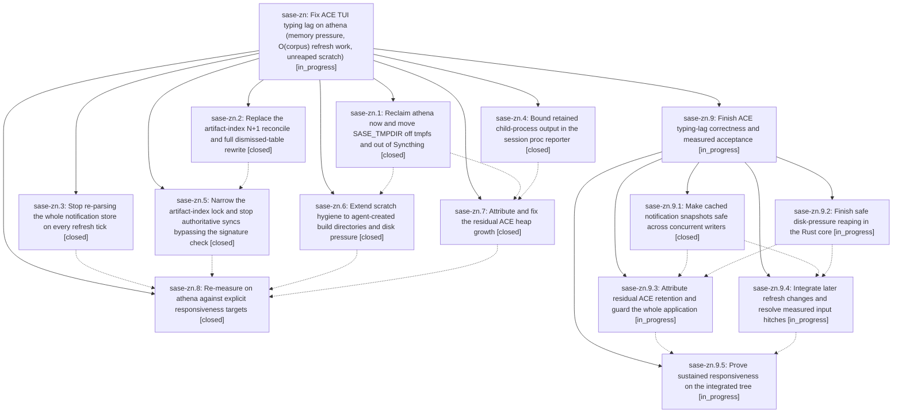

# Bead: sase-zn — Fix ACE TUI typing lag on athena (memory pressure, O(corpus) refresh work, unreaped scratch)

[Bead Pages](../README.md) / sase-zn

**Status:** ◐ in_progress · **Type:** ▸ plan · **Tier:** epic
**Owner:** `bryanbugyi34@gmail.com` · **Created by:** `bbugyi200.kellys_mbp.03` · **Assignee:** `sase-zn.land`
**Created:** 2026-09-11 12:20:19 EDT
**Plan:** [202609/ace\_typing\_lag\_athena.md](https://github.com/sase-org/sase--plans/blob/main/202609/ace_typing_lag_athena.md)

<!-- sase:links:start -->

## Links

| Relation | Artifact | Why |
| --- | --- | --- |
| implemented-by | [plan:202609/ace_typing_lag_athena.md][1] | derived from the plan's `bead_id:` frontmatter field |

[1]: https://github.com/sase-org/sase--plans/blob/main/202609/ace_typing_lag_athena.md

<!-- sase:links:end -->

## Description

Typing in the ACE prompt input stays responsive on athena under normal agent load: the long-lived `sase ace` process holds a bounded heap instead of growing to ~12.5 GB, its periodic refresh work stops re-doing O(corpus) index and notification passes, and SASE scratch stops filling a RAM-backed /tmp and a Syncthing-synced SASE_TMPDIR.

## Notes

[2026-09-12T21:26:41Z · sase-zn.land] LANDING AUDIT 2026-09-12: intentionally left open; no close or done-plan update. Reviewed this epic (no prior notes or parent), all eight children and all 16 child notes, original plan:202609/ace_typing_lag_athena.md, eight primary epic commits ace0de267 through ebb17c4c2, Rust 34b32290, relevant implementation/tests, and all intervening primary history to e498ce822. Fetched base master and reviewed the additional edaf35bd9 (sase-zw.4). Evidence: file:explicit:02de8d015400f55bd6267c43.

Verified delivered: Rust set-based dismissed reconcile and 40k/10k parity fixture; diff/forced replacement and PyO3 GIL release; authoritative signature fast path and bounded interactive local locks/fallbacks; notification memo, snooze/mutation invalidation and hourly core compaction; 2-MiB reporter retention with full JSON opt-out; managed launch env; opt-in heap sampler wiring. Integrated review must preserve newer unknown-bucket/horizon changes (3114dbd03, 336c17e94), proc retention (e498ce822), managed-Cargo docs/incremental suppression (new base edaf35bd9), deferred/indexed history and schema 28 (c0fd017f3, 3c1185c28/Rust 7949496), one-index-read gate reconciliation (335d71223), and the queue adapter cohort (89d51301f).

BLOCKERS REMAINING IN THIS EPIC: (1) Reproduced notification token race introduced by .3: external write after Rust unlock but before Python post-read stat caches old snapshot under new token; second read remained old with one Rust parse. (2) Reproduced pressure integration defect: an unknown bucket with 13h-old root mtime and a fresh 4096-byte child survives the age pass but the pressure pass deletes both. Only isolated temp files were used. The original free-filesystem-space trigger is absent and shared reaper policy still lives in Python. Noted on sase-zw to avoid duplicate repair. (3) .7 shipped a sampler but no live attribution; repeated-stream regression is not whole-ACE retention coverage. (4) .8 recorded 17 loop + 5 pump hitches/30min, no fresh PERF capture, and one 5h09m RSS point, not multi-day bounded growth. A current read-only ACE sample had RSS 1,877,060 kB, swap 930,348 kB, corrected SASE_TMPDIR, and no HEAP/PERF env. Different hot stacks do not discharge explicit latency criteria. Validated remaining-only five-phase child plan sase_plan_finish_ace_typing_lag.md with parent_bead=sase-zn; submitting through /sase_plan. Parent lifecycle steps are not child phases.

ALL EIGHT PROPOSED FOLLOW-UP OUTCOMES:
- sase-zn.2 #1 repo list/open mismatch: independently reproduced for sase-core and plans, +1 corroborated ready task sase-zo; sanctioned gh:sase-org/sase-core fallback worked. No duplicate.
- sase-zn.3 #1 large inline notification action_data: created large bug task sase-103, now READY, with proposing bead and audit ref; live 1,585 rows/12,065,024 bytes, max action_data 1,944,239 bytes. This pre-existing payload redesign is expressly excluded by original plan; cache race remains epic work.
- sase-zn.4 #1 cleanup requests/retention: newer sase-zw.3/e498ce822 implements runtime retention. Distinct pre-existing whole-corpus request cost remains: 121 retained requests, 8 over 1MiB, max 12,931,369 bytes; largest agent.cleanup contains ~7.4MB agents_with_children plus ~2MB dismissed identities. Created large bug sase-104, now READY. Preserve existing retention.
- sase-zn.5 #1 old Symvision private imports: duplicate sase-zk; recorded source evidence there that public names now exist (18f472c96). No new task, no false fresh failure or claim of a completed lint pass.
- sase-zn.5 #2 j/k threshold excursions: selected-tribe case is existing sase-lx, appended explicitly inherited corroboration there. Fleet/AXE excursions need fresh measurements in child responsiveness phase; no proof they are unrelated, so no speculative duplicate tasks.
- sase-zn.5 #3 trace verifier hang: no exact blocked node or stack was captured, so declined a speculative standalone task. Child responsiveness phase must reproduce/localize with bounded monitor output; unresolved acceptance coverage remains epic work.
- sase-zn.8 #1 fresh Agents hitches/key-to-paint gap: declined out-of-scope deferral because they are original acceptance criteria; child must integrate later refresh work and prove them.
- sase-zn.8 #2 44 queue/capacity failures: routed inherited evidence and current targeted pass to causally related active sase-zt (already had same report); adapter repair 89d51301f landed afterward. No new task and no claim all original 44 nodes are cleared.

CHECKS: queue directive + notification facade tests 38 passed/14.95s on then-installed core 0.34.22. No epic-symbol entries for sase-zn. Audit just symvision triggered 0.34.24 setup and LSP build; deliberately stopped only that audit-owned process group before gate completion. No full-suite pass claimed. Required governed just check-full and fresh performance evidence remain after child implementation.

BOOKKEEPING LIMIT: audit artifact creation succeeded and scratch moved, but attaching its ref to this epic and adding typed related link sase-104 -> sase-zw were rejected because the host-owned hidden plans clone has uncommitted/untracked changes. Did not inspect/edit/reset that foreign checkout. Task descriptions/refs and this note preserve the relationship and evidence; retry those two links when publication is available. Plan has passed validate --explain and revalidation with zero warnings. Before any resumed successful close, re-read every descendant/plan/note, recheck post-child drift and epic symbols, and run required combined-tree verification.

## Phases

| Bead | Title | Status | Size | Created | Agents | Commits |
|---|---|---|---|---|---:|---:|
| [sase-zn.1](sase-zn.1.md) | Reclaim athena now and move SASE\_TMPDIR off tmpfs and out of Syncthing | ✓ closed | small | 2026-09-11 | 0 | 1 |
| [sase-zn.2](sase-zn.2.md) | Replace the artifact-index N+1 reconcile and full dismissed-table rewrite | ✓ closed | medium | 2026-09-11 | 1 | 2 |
| [sase-zn.3](sase-zn.3.md) | Stop re-parsing the whole notification store on every refresh tick | ✓ closed | medium | 2026-09-11 | 1 | 1 |
| [sase-zn.4](sase-zn.4.md) | Bound retained child-process output in the session proc reporter | ✓ closed | small | 2026-09-11 | 0 | 1 |
| [sase-zn.5](sase-zn.5.md) | Narrow the artifact-index lock and stop authoritative syncs bypassing the signature check | ✓ closed | medium | 2026-09-11 | 1 | 1 |
| [sase-zn.6](sase-zn.6.md) | Extend scratch hygiene to agent-created build directories and disk pressure | ✓ closed | medium | 2026-09-11 | 1 | 1 |
| [sase-zn.7](sase-zn.7.md) | Attribute and fix the residual ACE heap growth | ✓ closed | medium | 2026-09-11 | 0 | 1 |
| [sase-zn.8](sase-zn.8.md) | Re-measure on athena against explicit responsiveness targets | ✓ closed | small | 2026-09-11 | 1 | 1 |

## Lineage

## Agents

| Agent | Bead | Commits |
|---|---|---:|
| [bbugyi200.athena.sase-zn.2](https://github.com/sase-org/sase--agents/blob/main/agents/bbugyi200.athena.sase-zn.2/README.md) | [sase-zn.2](sase-zn.2.md) | 2 |
| [bbugyi200.athena.sase-zn.3](https://github.com/sase-org/sase--agents/blob/main/agents/bbugyi200.athena.sase-zn.3/README.md) | [sase-zn.3](sase-zn.3.md) | 1 |
| [bbugyi200.athena.sase-zn.5](https://github.com/sase-org/sase--agents/blob/main/agents/bbugyi200.athena.sase-zn.5/README.md) | [sase-zn.5](sase-zn.5.md) | 1 |
| [bbugyi200.athena.sase-zn.6](https://github.com/sase-org/sase--agents/blob/main/agents/bbugyi200.athena.sase-zn.6/README.md) | [sase-zn.6](sase-zn.6.md) | 1 |
| [bbugyi200.athena.sase-zn.8](https://github.com/sase-org/sase--agents/blob/main/agents/bbugyi200.athena.sase-zn.8/README.md) | [sase-zn.8](sase-zn.8.md) | 1 |
| [bbugyi200.athena.sase-zn.9.1](https://github.com/sase-org/sase--agents/blob/main/agents/bbugyi200.athena.sase-zn.9.1/README.md) | [sase-zn.9.1](sase-zn.9.1.md) | 1 |

## Commits

| Repo | Commit | Subject | Bead | Committed |
|---|---|---|---|---|
| sase | [`ace0de2`](https://github.com/sase-org/sase/commit/ace0de26771479759eaf03614da1bf6098559e92) | feat(agent-scan): pass force through dismissed projection replace | [sase-zn.2](sase-zn.2.md) | 2026-09-11 17:33:58 EDT |
| sase | [`45a6b87`](https://github.com/sase-org/sase/commit/45a6b875a2c84c05f5ac4ce41e918622d06c886e) | perf(notifications): cache snapshot reads and compact live JSONL hourly | [sase-zn.3](sase-zn.3.md) | 2026-09-11 17:34:59 EDT |
| sase-core | [`sase-core@34b3229`](https://github.com/sase-org/sase-core/commit/34b32290ac2bd643a5b66b9835b4e3f4410ed2bf) | feat(agent-scan): set-based dismissed-family reconcile and diff replace | [sase-zn.2](sase-zn.2.md) | 2026-09-11 17:36:50 EDT |
| sase | [`62ad9b6`](https://github.com/sase-org/sase/commit/62ad9b657ccdb418033a5aa3b8b56b31a819a187) | fix(tui): bound artifact index reads | [sase-zn.5](sase-zn.5.md) | 2026-09-11 18:40:57 EDT |
| sase | [`32879ff`](https://github.com/sase-org/sase/commit/32879ff7f2416f123a86e2547ab2da1653edee61) | feat: Reclaim athena now and move SASE\_TMPDIR off tmpfs and out of Syncthing (sase-zn.1) | [sase-zn.1](sase-zn.1.md) | 2026-09-12 05:27:24 EDT |
| sase | [`96c3877`](https://github.com/sase-org/sase/commit/96c3877e08e643cf3cf8fe60a5438d4be4c87aac) | feat: Bound retained child-process output in the session proc reporter (sase-zn.4) | [sase-zn.4](sase-zn.4.md) | 2026-09-12 05:28:36 EDT |
| sase | [`2614668`](https://github.com/sase-org/sase/commit/2614668f48e89a61ee5c44dd380fd2707542f67a) | feat(tmp): route agent build scratch through managed reaper | [sase-zn.6](sase-zn.6.md) | 2026-09-12 11:05:07 EDT |
| sase | [`10bc40e`](https://github.com/sase-org/sase/commit/10bc40e94e024999d6021a82fd483f0be54057a8) | feat: Attribute and fix the residual ACE heap growth (sase-zn.7) | [sase-zn.7](sase-zn.7.md) | 2026-09-12 12:24:51 EDT |
| sase | [`ebb17c4`](https://github.com/sase-org/sase/commit/ebb17c4c291817779da96273854396d764252717) | docs(perf): record athena ace verification | [sase-zn.8](sase-zn.8.md) | 2026-09-12 14:07:58 EDT |
| sase | [`5554dfb`](https://github.com/sase-org/sase/commit/5554dfb0ce7d46250422eb8c1989201a8634ca5a) | fix(notifications): guard snapshot cache token publication | [sase-zn.9.1](sase-zn.9.1.md) | 2026-09-12 18:20:10 EDT |
