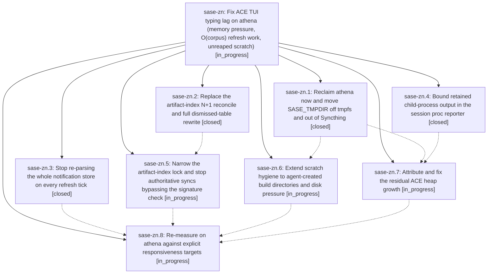

# Bead: sase-zn — Fix ACE TUI typing lag on athena (memory pressure, O(corpus) refresh work, unreaped scratch)

[Bead Pages](../README.md) / sase-zn

**Status:** ◐ in_progress · **Type:** ▸ plan · **Tier:** epic
**Owner:** `bryanbugyi34@gmail.com` · **Created by:** `bbugyi200.kellys_mbp.03` · **Assignee:** `sase-zn.land`
**Created:** 2026-09-11 12:20:19 EDT
**Plan:** [202609/ace\_typing\_lag\_athena.md](https://github.com/sase-org/sase--plans/blob/main/202609/ace_typing_lag_athena.md)

## Description

Typing in the ACE prompt input stays responsive on athena under normal agent load: the long-lived `sase ace` process holds a bounded heap instead of growing to ~12.5 GB, its periodic refresh work stops re-doing O(corpus) index and notification passes, and SASE scratch stops filling a RAM-backed /tmp and a Syncthing-synced SASE_TMPDIR.

## Phases

| Bead | Title | Status | Size | Created | Agents | Commits |
|---|---|---|---|---|---:|---:|
| [sase-zn.1](sase-zn.1.md) | Reclaim athena now and move SASE\_TMPDIR off tmpfs and out of Syncthing | ✓ closed | small | 2026-09-11 | 1 | 0 |
| [sase-zn.2](sase-zn.2.md) | Replace the artifact-index N+1 reconcile and full dismissed-table rewrite | ✓ closed | medium | 2026-09-11 | 1 | 1 |
| [sase-zn.3](sase-zn.3.md) | Stop re-parsing the whole notification store on every refresh tick | ✓ closed | medium | 2026-09-11 | 1 | 0 |
| [sase-zn.4](sase-zn.4.md) | Bound retained child-process output in the session proc reporter | ✓ closed | small | 2026-09-11 | 1 | 0 |
| [sase-zn.5](sase-zn.5.md) | Narrow the artifact-index lock and stop authoritative syncs bypassing the signature check | ◐ in_progress | medium | 2026-09-11 | 1 | 0 |
| [sase-zn.6](sase-zn.6.md) | Extend scratch hygiene to agent-created build directories and disk pressure | ◐ in_progress | medium | 2026-09-11 | 1 | 0 |
| [sase-zn.7](sase-zn.7.md) | Attribute and fix the residual ACE heap growth | ◐ in_progress | medium | 2026-09-11 | 1 | 0 |
| [sase-zn.8](sase-zn.8.md) | Re-measure on athena against explicit responsiveness targets | ◐ in_progress | small | 2026-09-11 | 1 | 0 |

## Lineage

## Agents

| Agent | Bead | Commits |
|---|---|---:|
| [bbugyi200.athena.sase-zn.1](https://github.com/sase-org/sase--agents/blob/main/agents/bbugyi200.athena.sase-zn.1/README.md) | [sase-zn.1](sase-zn.1.md) | 0 |
| [bbugyi200.athena.sase-zn.2](https://github.com/sase-org/sase--agents/blob/main/agents/bbugyi200.athena.sase-zn.2/README.md) | [sase-zn.2](sase-zn.2.md) | 1 |
| [bbugyi200.athena.sase-zn.3](https://github.com/sase-org/sase--agents/blob/main/agents/bbugyi200.athena.sase-zn.3/README.md) | [sase-zn.3](sase-zn.3.md) | 0 |
| [bbugyi200.athena.sase-zn.4](https://github.com/sase-org/sase--agents/blob/main/agents/bbugyi200.athena.sase-zn.4/README.md) | [sase-zn.4](sase-zn.4.md) | 0 |
| [bbugyi200.athena.sase-zn.5](https://github.com/sase-org/sase--agents/blob/main/agents/bbugyi200.athena.sase-zn.5/README.md) | [sase-zn.5](sase-zn.5.md) | 0 |
| [bbugyi200.athena.sase-zn.6](https://github.com/sase-org/sase--agents/blob/main/agents/bbugyi200.athena.sase-zn.6/README.md) | [sase-zn.6](sase-zn.6.md) | 0 |
| [bbugyi200.athena.sase-zn.7](https://github.com/sase-org/sase--agents/blob/main/agents/bbugyi200.athena.sase-zn.7/README.md) | [sase-zn.7](sase-zn.7.md) | 0 |
| [bbugyi200.athena.sase-zn.8](https://github.com/sase-org/sase--agents/blob/main/agents/bbugyi200.athena.sase-zn.8/README.md) | [sase-zn.8](sase-zn.8.md) | 0 |
| [bbugyi200.athena.sase-zn.land](https://github.com/sase-org/sase--agents/blob/main/agents/bbugyi200.athena.sase-zn.land/README.md) | [sase-zn](README.md) | 0 |

## Commits

| Repo | Commit | Subject | Bead | Committed |
|---|---|---|---|---|
| sase | [`ace0de2`](https://github.com/sase-org/sase/commit/ace0de26771479759eaf03614da1bf6098559e92) | feat(agent-scan): pass force through dismissed projection replace | [sase-zn.2](sase-zn.2.md) | 2026-09-11 17:33:58 EDT |
