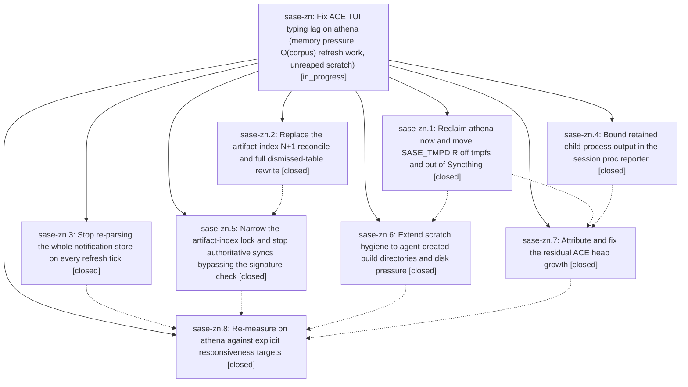

# Bead: sase-zn — Fix ACE TUI typing lag on athena (memory pressure, O(corpus) refresh work, unreaped scratch)

[Bead Pages](../README.md) / sase-zn

**Status:** ◐ in_progress · **Type:** ▸ plan · **Tier:** epic
**Owner:** `bryanbugyi34@gmail.com` · **Created by:** `bbugyi200.kellys_mbp.03` · **Assignee:** `sase-zn.land`
**Created:** 2026-09-11 12:20:19 EDT
**Plan:** [202609/ace\_typing\_lag\_athena.md](https://github.com/sase-org/sase--plans/blob/main/202609/ace_typing_lag_athena.md)

<!-- sase:links:start -->

## Links

| Relation | Artifact | Why |
| --- | --- | --- |
| implemented-by | [plan:202609/ace_typing_lag_athena.md][1] | derived from the plan's `bead_id:` frontmatter field |

[1]: https://github.com/sase-org/sase--plans/blob/main/202609/ace_typing_lag_athena.md

<!-- sase:links:end -->

## Description

Typing in the ACE prompt input stays responsive on athena under normal agent load: the long-lived `sase ace` process holds a bounded heap instead of growing to ~12.5 GB, its periodic refresh work stops re-doing O(corpus) index and notification passes, and SASE scratch stops filling a RAM-backed /tmp and a Syncthing-synced SASE_TMPDIR.

## Phases

| Bead | Title | Status | Size | Created | Agents | Commits |
|---|---|---|---|---|---:|---:|
| [sase-zn.1](sase-zn.1.md) | Reclaim athena now and move SASE\_TMPDIR off tmpfs and out of Syncthing | ✓ closed | small | 2026-09-11 | 1 | 1 |
| [sase-zn.2](sase-zn.2.md) | Replace the artifact-index N+1 reconcile and full dismissed-table rewrite | ✓ closed | medium | 2026-09-11 | 1 | 2 |
| [sase-zn.3](sase-zn.3.md) | Stop re-parsing the whole notification store on every refresh tick | ✓ closed | medium | 2026-09-11 | 1 | 1 |
| [sase-zn.4](sase-zn.4.md) | Bound retained child-process output in the session proc reporter | ✓ closed | small | 2026-09-11 | 1 | 1 |
| [sase-zn.5](sase-zn.5.md) | Narrow the artifact-index lock and stop authoritative syncs bypassing the signature check | ✓ closed | medium | 2026-09-11 | 1 | 1 |
| [sase-zn.6](sase-zn.6.md) | Extend scratch hygiene to agent-created build directories and disk pressure | ✓ closed | medium | 2026-09-11 | 1 | 1 |
| [sase-zn.7](sase-zn.7.md) | Attribute and fix the residual ACE heap growth | ✓ closed | medium | 2026-09-11 | 0 | 1 |
| [sase-zn.8](sase-zn.8.md) | Re-measure on athena against explicit responsiveness targets | ✓ closed | small | 2026-09-11 | 1 | 1 |

## Lineage

## Agents

| Agent | Bead | Commits |
|---|---|---:|
| [bbugyi200.athena.sase-zn.1](https://github.com/sase-org/sase--agents/blob/main/agents/bbugyi200.athena.sase-zn.1/README.md) | [sase-zn.1](sase-zn.1.md) | 0 |
| [bbugyi200.athena.sase-zn.2](https://github.com/sase-org/sase--agents/blob/main/agents/bbugyi200.athena.sase-zn.2/README.md) | [sase-zn.2](sase-zn.2.md) | 2 |
| [bbugyi200.athena.sase-zn.3](https://github.com/sase-org/sase--agents/blob/main/agents/bbugyi200.athena.sase-zn.3/README.md) | [sase-zn.3](sase-zn.3.md) | 1 |
| [bbugyi200.athena.sase-zn.4](https://github.com/sase-org/sase--agents/blob/main/agents/bbugyi200.athena.sase-zn.4/README.md) | [sase-zn.4](sase-zn.4.md) | 0 |
| [bbugyi200.athena.sase-zn.5](https://github.com/sase-org/sase--agents/blob/main/agents/bbugyi200.athena.sase-zn.5/README.md) | [sase-zn.5](sase-zn.5.md) | 1 |
| [bbugyi200.athena.sase-zn.6](https://github.com/sase-org/sase--agents/blob/main/agents/bbugyi200.athena.sase-zn.6/README.md) | [sase-zn.6](sase-zn.6.md) | 1 |
| [bbugyi200.athena.sase-zn.8](https://github.com/sase-org/sase--agents/blob/main/agents/bbugyi200.athena.sase-zn.8/README.md) | [sase-zn.8](sase-zn.8.md) | 1 |
| [bbugyi200.athena.sase-zn.land](https://github.com/sase-org/sase--agents/blob/main/agents/bbugyi200.athena.sase-zn.land/README.md) | [sase-zn](README.md) | 0 |

## Commits

| Repo | Commit | Subject | Bead | Committed |
|---|---|---|---|---|
| sase | [`ace0de2`](https://github.com/sase-org/sase/commit/ace0de26771479759eaf03614da1bf6098559e92) | feat(agent-scan): pass force through dismissed projection replace | [sase-zn.2](sase-zn.2.md) | 2026-09-11 17:33:58 EDT |
| sase | [`45a6b87`](https://github.com/sase-org/sase/commit/45a6b875a2c84c05f5ac4ce41e918622d06c886e) | perf(notifications): cache snapshot reads and compact live JSONL hourly | [sase-zn.3](sase-zn.3.md) | 2026-09-11 17:34:59 EDT |
| sase-core | [`sase-core@34b3229`](https://github.com/sase-org/sase-core/commit/34b32290ac2bd643a5b66b9835b4e3f4410ed2bf) | feat(agent-scan): set-based dismissed-family reconcile and diff replace | [sase-zn.2](sase-zn.2.md) | 2026-09-11 17:36:50 EDT |
| sase | [`62ad9b6`](https://github.com/sase-org/sase/commit/62ad9b657ccdb418033a5aa3b8b56b31a819a187) | fix(tui): bound artifact index reads | [sase-zn.5](sase-zn.5.md) | 2026-09-11 18:40:57 EDT |
| sase | [`32879ff`](https://github.com/sase-org/sase/commit/32879ff7f2416f123a86e2547ab2da1653edee61) | feat: Reclaim athena now and move SASE\_TMPDIR off tmpfs and out of Syncthing (sase-zn.1) | [sase-zn.1](sase-zn.1.md) | 2026-09-12 05:27:24 EDT |
| sase | [`96c3877`](https://github.com/sase-org/sase/commit/96c3877e08e643cf3cf8fe60a5438d4be4c87aac) | feat: Bound retained child-process output in the session proc reporter (sase-zn.4) | [sase-zn.4](sase-zn.4.md) | 2026-09-12 05:28:36 EDT |
| sase | [`2614668`](https://github.com/sase-org/sase/commit/2614668f48e89a61ee5c44dd380fd2707542f67a) | feat(tmp): route agent build scratch through managed reaper | [sase-zn.6](sase-zn.6.md) | 2026-09-12 11:05:07 EDT |
| sase | [`10bc40e`](https://github.com/sase-org/sase/commit/10bc40e94e024999d6021a82fd483f0be54057a8) | feat: Attribute and fix the residual ACE heap growth (sase-zn.7) | [sase-zn.7](sase-zn.7.md) | 2026-09-12 12:24:51 EDT |
| sase | [`ebb17c4`](https://github.com/sase-org/sase/commit/ebb17c4c291817779da96273854396d764252717) | docs(perf): record athena ace verification | [sase-zn.8](sase-zn.8.md) | 2026-09-12 14:07:58 EDT |
