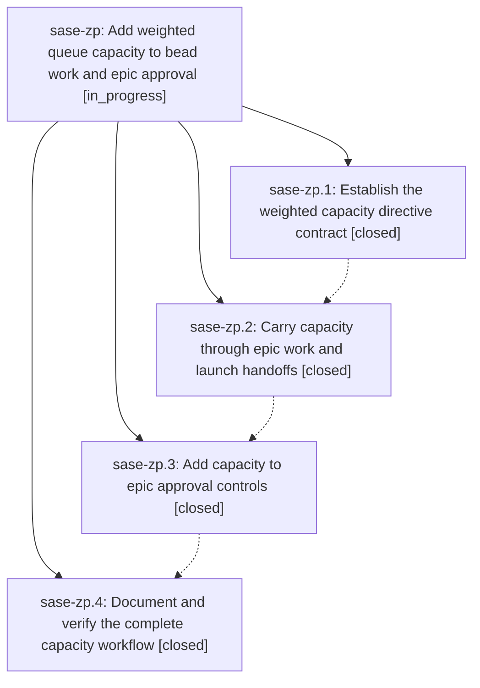

# Bead: sase-zp — Add weighted queue capacity to bead work and epic approval

[Bead Pages](../README.md) / sase-zp

**Status:** ◐ in_progress · **Type:** ▸ plan · **Tier:** epic
**Owner:** `bryanbugyi34@gmail.com` · **Created by:** [bbugyi200.athena.0jl](https://github.com/sase-org/sase--agents/blob/main/families/bbugyi200.athena.0jl.md) · **Assignee:** `sase-zp.land`
**Created:** 2026-09-11 13:40:27 EDT
**Plan:** [202609/bead\_work\_capacity.md](https://github.com/sase-org/sase--plans/blob/main/202609/bead_work_capacity.md)

## Description

Let users set the weighted-load threshold for every agent launched for an epic through sase bead work or its approval gate, and name the queue directive argument capacity consistently.

## Phases

| Bead | Title | Status | Size | Created | Agents | Commits |
|---|---|---|---|---|---:|---:|
| [sase-zp.1](sase-zp.1.md) | Establish the weighted capacity directive contract | ✓ closed | medium | 2026-09-11 | 1 | 2 |
| [sase-zp.2](sase-zp.2.md) | Carry capacity through epic work and launch handoffs | ✓ closed | medium | 2026-09-11 | 1 | 1 |
| [sase-zp.3](sase-zp.3.md) | Add capacity to epic approval controls | ✓ closed | medium | 2026-09-11 | 1 | 1 |
| [sase-zp.4](sase-zp.4.md) | Document and verify the complete capacity workflow | ✓ closed | small | 2026-09-11 | 1 | 1 |

## Lineage

## Agents

| Agent | Bead | Commits |
|---|---|---:|
| [bbugyi200.athena.sase-zp.1](https://github.com/sase-org/sase--agents/blob/main/agents/bbugyi200.athena.sase-zp.1/README.md) | [sase-zp.1](sase-zp.1.md) | 2 |
| [bbugyi200.athena.sase-zp.2](https://github.com/sase-org/sase--agents/blob/main/agents/bbugyi200.athena.sase-zp.2/README.md) | [sase-zp.2](sase-zp.2.md) | 1 |
| [bbugyi200.athena.sase-zp.3](https://github.com/sase-org/sase--agents/blob/main/agents/bbugyi200.athena.sase-zp.3/README.md) | [sase-zp.3](sase-zp.3.md) | 1 |
| [bbugyi200.athena.sase-zp.4](https://github.com/sase-org/sase--agents/blob/main/agents/bbugyi200.athena.sase-zp.4/README.md) | [sase-zp.4](sase-zp.4.md) | 1 |
| [bbugyi200.athena.sase-zp.land](https://github.com/sase-org/sase--agents/blob/main/agents/bbugyi200.athena.sase-zp.land/README.md) | [sase-zp](README.md) | 0 |

## Commits

| Repo | Commit | Subject | Bead | Committed |
|---|---|---|---|---|
| sase | [`e48aa7d`](https://github.com/sase-org/sase/commit/e48aa7db0fdcb39c35895b0bff82171c56e452c1) | feat(queue): rename runners to weighted capacity in Python adapters and TUI | [sase-zp.1](sase-zp.1.md) | 2026-09-11 15:39:48 EDT |
| sase-core | [`sase-core@d2f8d72`](https://github.com/sase-org/sase-core/commit/d2f8d72734c6a74ea116ed7d7ddf97b3a05bf796) | feat(queue): replace runners with weighted-load capacity contract | [sase-zp.1](sase-zp.1.md) | 2026-09-11 15:45:10 EDT |
| sase | [`39cc0c4`](https://github.com/sase-org/sase/commit/39cc0c4b8bae36e6edaed6201051bc85eb460802) | feat(bead): propagate work queue capacity | [sase-zp.2](sase-zp.2.md) | 2026-09-11 17:26:30 EDT |
| sase | [`41806ee`](https://github.com/sase-org/sase/commit/41806ee9885fc09d09b64d9df4614664def9ba8c) | feat(plan-gate): add capacity to epic approval controls | [sase-zp.3](sase-zp.3.md) | 2026-09-11 18:36:14 EDT |
| sase | [`14ddd4d`](https://github.com/sase-org/sase/commit/14ddd4d82787a79afaa70523bbdaab4d13f2f0d8) | docs(queue): document weighted capacity and verify gate-to-admission path | [sase-zp.4](sase-zp.4.md) | 2026-09-11 19:29:03 EDT |
