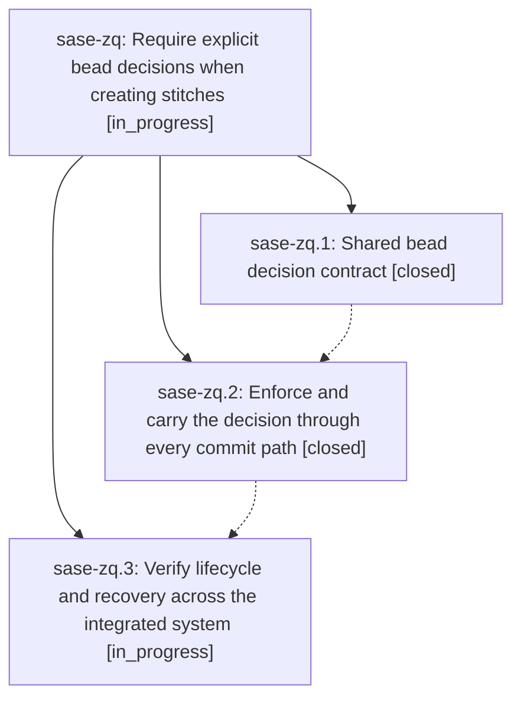

# Bead: sase-zq — Require explicit bead decisions when creating stitches

[Bead Pages](../README.md) / sase-zq

**Status:** ◐ in_progress · **Type:** ▸ plan · **Tier:** epic
**Owner:** `bryanbugyi34@gmail.com` · **Created by:** [bbugyi200.athena.0jp](https://github.com/sase-org/sase--agents/blob/main/families/bbugyi200.athena.0jp.md) · **Assignee:** `sase-zq.land`
**Created:** 2026-09-11 15:33:35 EDT
**Plan:** [202609/explicit\_bead\_action.md](https://github.com/sase-org/sase--plans/blob/main/202609/explicit_bead_action.md)

## Description

Prevent commits from closing unfinished beads by requiring an explicit close or keep decision for bead-associated stitch creation, including host finalization and checkpoint recovery.

## Notes

[2026-09-12T11:04:41Z · sase-zm.1] DISCOVERED ISSUE: just check was red at lint (symvision) on clean trees because sase-zq.1 exported FinalizerAssignedBeadWire and finalizer_assigned_bead_from_dict for sase-zq.2 but closed without --epic-symbol. Reproduced 2026-09-12 on sase-zm.1 at master 9c2eb4a35: unused public symbols in src/sase/core/finalizer_wire.py. Re-keyed Justfile _lint-symvision to --epic-symbol sase-zq.2(...) so the still-open integrate_policy phase owns them. Drop those two entries when zq.2 (or a later zq phase) actually consumes them from another src file, or if they become private.

## Phases

| Bead | Title | Status | Size | Created | Agents | Commits |
|---|---|---|---|---|---:|---:|
| [sase-zq.1](sase-zq.1.md) | Shared bead decision contract | ✓ closed | medium | 2026-09-11 | 1 | 2 |
| [sase-zq.2](sase-zq.2.md) | Enforce and carry the decision through every commit path | ✓ closed | medium | 2026-09-11 | 1 | 1 |
| [sase-zq.3](sase-zq.3.md) | Verify lifecycle and recovery across the integrated system | ◐ in_progress | medium | 2026-09-11 | 1 | 0 |

## Lineage

## Agents

| Agent | Bead | Commits |
|---|---|---:|
| [bbugyi200.athena.sase-zq.1](https://github.com/sase-org/sase--agents/blob/main/agents/bbugyi200.athena.sase-zq.1/README.md) | [sase-zq.1](sase-zq.1.md) | 0 |
| [bbugyi200.athena.sase-zq.2](https://github.com/sase-org/sase--agents/blob/main/agents/bbugyi200.athena.sase-zq.2/README.md) | [sase-zq.2](sase-zq.2.md) | 1 |
| [bbugyi200.athena.sase-zq.3](https://github.com/sase-org/sase--agents/blob/main/agents/bbugyi200.athena.sase-zq.3/README.md) | [sase-zq.3](sase-zq.3.md) | 0 |
| [bbugyi200.athena.sase-zq.land](https://github.com/sase-org/sase--agents/blob/main/agents/bbugyi200.athena.sase-zq.land/README.md) | [sase-zq](README.md) | 0 |

## Commits

| Repo | Commit | Subject | Bead | Committed |
|---|---|---|---|---|
| sase-core | [`sase-core@3102a21`](https://github.com/sase-org/sase-core/commit/3102a210930db10c5ff44a584526090599b77c29) | feat: Shared bead decision contract (sase-zq.1) | [sase-zq.1](sase-zq.1.md) | 2026-09-12 05:19:34 EDT |
| sase | [`ed11c13`](https://github.com/sase-org/sase/commit/ed11c135483179910fcf5f2c89a3431facfd570d) | feat: Shared bead decision contract (sase-zq.1) | [sase-zq.1](sase-zq.1.md) | 2026-09-12 05:19:53 EDT |
| sase | [`df33453`](https://github.com/sase-org/sase/commit/df33453b7f9b0012f549b64174d9364e05889da5) | feat(commit): require explicit bead action | [sase-zq.2](sase-zq.2.md) | 2026-09-12 10:45:26 EDT |
