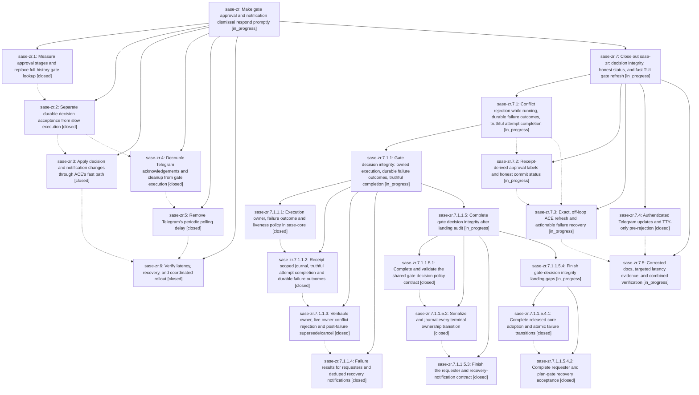

# Bead: sase-zr — Make gate approval and notification dismissal respond promptly

[Bead Pages](../README.md) / sase-zr

**Status:** ◐ in_progress · **Type:** ▸ plan · **Tier:** epic
**Owner:** `bryanbugyi34@gmail.com` · **Created by:** `bbugyi200.athena.0js` · **Assignee:** `sase-zr.land`
**Created:** 2026-09-12 05:06:12 EDT
**Plan:** [202609/prompt\_gate\_approval.md](https://github.com/sase-org/sase--plans/blob/main/202609/prompt_gate_approval.md)

<!-- sase:links:start -->

## Links

| Relation | Artifact | Why |
| --- | --- | --- |
| implemented-by | [plan:202609/prompt_gate_approval.md][1] | derived from the plan's `bead_id:` frontmatter field |

[1]: https://github.com/sase-org/sase--plans/blob/main/202609/prompt_gate_approval.md

<!-- sase:links:end -->

## Description

Publish durable tale and epic approval decisions and refresh ACE and Telegram promptly without waiting for archive publication or successor launch, while preserving execution recovery and exactly-once follow-up ownership.

## Notes

[2026-09-14T16:14:51Z · 0kp] DISCOVERED ISSUE: Telegram inbound is completely dead on athena since 2026-09-13 ~19:12 EDT — the supervised long-poll receiver introduced by sase-zr.5 (sase-telegram 829e738) can never launch. receiver.py submits argv ['sase_chop_tg_inbound','--receiver'] through sase.procs.submit_proc_request, but the proc supervisor resolves that bare console-script name against the host services' PATH, which does not include the uv tool venv bin (~/.local/share/uv/tools/sase/bin) — the script's only location ('which sase_chop_tg_inbound' fails; lumberjack/gateway PATH checked via /proc/<pid>/environ). Every ~5s re-arm therefore dies at spawn: proc rows show status=error, termination_reason=launch-failure, message "could not start command: [Errno 2] No such file or directory: 'sase_chop_tg_inbound'" (e.g. proc fybcqbbeppx1, log ~/.sase/procs/logs/fybcqbbeppx1.log), flooding ~/.sase/procs/procs.jsonl with ~1 failed row per 7s. update_offset.txt has not advanced since 2026-09-13 19:12, so every Telegram button press since then (incl. today's plan-approval attempts) is never fetched. Tests cannot catch this by design: ensure_receiver_running lets tests substitute a harmless argv, so the real console-script argv is never exercised. Also relevant to sase-zr.6's partial-command verification: plan gate plan/c7d980c0-f436-405c-b0a8-382ceb32676c holds an incomplete attempt (journal attempt_started 2026-09-13T16:42 EDT, approve+commit, empty input digests, no terminal event) and an identical Telegram resubmission would raise partial_attempt with no Telegram resume/restart affordance. Note: no sase-zr agent is currently running, so a remediation plan is being proposed separately for the receiver launch fix; sase-zr.6 should still verify the receiver lifecycle end-to-end on a real host.

[2026-09-16T17:43:19Z · 04] LANDING AUDIT (2026-09-16, apollo; the sase-zr.land agent on athena was dismissed while still waiting and never ran #bd/land_epic). The epic is NOT ready to close. All 6 phases are closed, but the audit found unmet plan requirements. They are now planned as a child epic whose parent_bead is sase-zr; that epic's land agent must re-verify and close sase-zr.

VERIFIED OK:
- Indexed exact gate-shell lookup: sase-core 682dbec, first released in v0.34.25.
- Decision-acceptance policy and binding: sase-core 809f45e, first released in v0.34.26.
- sase pin sase-core-rs>=0.34.36 covers both.
- Inherited gate ids do not match.
- %auto stays synchronous.
- sase bead epic-symbols sase-zr: no entries.
- Telegram receiver launch failure (note #1) is fixed by sase-telegram 8586f91 (plan 202609/telegram_receiver_launch_fix.md). A live receiver runs on athena with an absolute argv since 2026-09-14 20:30Z, with no recent launch-failure rows. The partial-attempt plan gate plan/c7d980c0 has since timed out, so it is moot.

GAPS FOUND (details in the child epic plan):
1. A conflicting answer can supersede a still-running attempt.
2. No durable failed outcome or visible recovery after acceptance dismisses the notification. poll_gate reports pending, and cancel is refused.
3. attempt_completed is journaled before archive, so an archive failure strands the gate.
4. Nothing reconciles orphaned receipts.
5. TALE/EPIC APPROVED is not derived from the receipt, and PLAN COMMITTED can show before archive success.
6. The lookup still has full-history and full-tree fallbacks, and an index miss silently skips settlement.
7. ACE refreshes are broad or racy, there is still synchronous count refresh on the UI thread, and plan gates have no partial_attempt retry.
8. Mobile and fleet gate actions are still fully synchronous.
9. Telegram:
   - updates are not sender-authenticated;
   - false success when side effects fail after response.json;
   - opaque acceptance-time errors;
   - no retry/resume after failure;
   - requires_tty sudo approve strands the gate;
   - source is recorded as cli;
   - cleanup retries never end.
10. Receiver:
   - never restarts after an upgrade (the live athena receiver predates 90815d2);
   - no crash-loop detection;
   - the real-argv test was replaced by a mock in ab9d985;
   - the offset advances past failed updates.
11. Docs: the stop procedure is wrong, the upgrade step is missing, and there are no before/after latency numbers or barrier tests.

INTEGRATION (commits since the epic began): no conflicting drift beyond gap 9's sudo requires_tty interaction (sase 7b85eb6c11 plus sase-telegram b547425). Checked and cleared:
- sase: 491daa988a, b9c28f25e8, c632a5552d, 45a2244ad1, 61febdcc68, ea358dace4.
- sase-telegram: ab9d985 (receiver fingerprint is argv-independent, so no duplicate consumers).

PROPOSED FOLLOW-UP TRIAGE:
- sase-zr.1 #1 (axe chop output-contract drift): declined, already fixed on master (tests/test_axe_chop_output_contract.py passes, 5 tests).
- sase-zr.1 #2 (agent-sync quarantine backlog): corroborated with +1 on sase-10x, being remediated by in-progress epic sase-11o.
- sase-zr.2 #1: status note, not a proposal.
- sase-zr.2 #2 (host disk full): declined as a new task; this is the goal of in-progress epic sase-zw.
- sase-zr.2 #3 (sase repo open sase-core unknown): declined, fixed. sase-core is now a registered linked repo, and the Justfile guidance works.
- sase-zr.4 #1 (store_lane ImportError): declined, fixed. store_lane now uses store.* module attributes. The residual symvision issue is tracked by sase-10q (caused by 8894213c95, not this epic).
- sase-zr.4 #2 and sase-zr.5 #1 (Telegram tmp_path under $HOME): declined, fixed in sase-telegram 8586f91 (tests use inbound._shorten_home).
- sase-zr.6 #1 (leak detector git identity env vars): declined, fixed. GIT_AUTHOR_*, GIT_COMMITTER_* and GIT_CONFIG_* are in tests/_global_state_leaks/fingerprints.py.

## Phases

| Bead | Title | Status | Size | Created | Agents | Commits |
|---|---|---|---|---|---:|---:|
| [sase-zr.1](sase-zr.1.md) | Measure approval stages and replace full-history gate lookup | ✓ closed | medium | 2026-09-12 | 1 | 2 |
| [sase-zr.2](sase-zr.2.md) | Separate durable decision acceptance from slow execution | ✓ closed | medium | 2026-09-12 | 1 | 3 |
| [sase-zr.3](sase-zr.3.md) | Apply decision and notification changes through ACE's fast path | ✓ closed | medium | 2026-09-12 | 1 | 1 |
| [sase-zr.4](sase-zr.4.md) | Decouple Telegram acknowledgements and cleanup from gate execution | ✓ closed | medium | 2026-09-12 | 0 | 0 |
| [sase-zr.5](sase-zr.5.md) | Remove Telegram's periodic polling delay | ✓ closed | medium | 2026-09-12 | 1 | 0 |
| [sase-zr.6](sase-zr.6.md) | Verify latency, recovery, and coordinated rollout | ✓ closed | medium | 2026-09-12 | 1 | 1 |

## Lineage

## Agents

| Agent | Bead | Commits |
|---|---|---:|
| [bbugyi200.apollo.sase-zr.1](https://github.com/sase-org/sase--agents/blob/main/agents/bbugyi200.apollo.sase-zr.1/README.md) | [sase-zr.1](sase-zr.1.md) | 2 |
| [bbugyi200.apollo.sase-zr.2](https://github.com/sase-org/sase--agents/blob/main/agents/bbugyi200.apollo.sase-zr.2/README.md) | [sase-zr.2](sase-zr.2.md) | 3 |
| [bbugyi200.apollo.sase-zr.3](https://github.com/sase-org/sase--agents/blob/main/agents/bbugyi200.apollo.sase-zr.3/README.md) | [sase-zr.3](sase-zr.3.md) | 1 |
| [bbugyi200.apollo.sase-zr.5](https://github.com/sase-org/sase--agents/blob/main/families/bbugyi200.apollo.sase-zr.5.md) | [sase-zr.5](sase-zr.5.md) | 0 |
| [bbugyi200.apollo.sase-zr.6](https://github.com/sase-org/sase--agents/blob/main/families/bbugyi200.apollo.sase-zr.6.md) | [sase-zr.6](sase-zr.6.md) | 1 |
| [bbugyi200.apollo.sase-zr.7.1](https://github.com/sase-org/sase--agents/blob/main/families/bbugyi200.apollo.sase-zr.7.1.md) | [sase-zr.7.1](sase-zr.7.1.md) | 0 |
| [bbugyi200.apollo.sase-zr.7.1.1.1](https://github.com/sase-org/sase--agents/blob/main/agents/bbugyi200.apollo.sase-zr.7.1.1.1/README.md) | [sase-zr.7.1.1.1](sase-zr.7.1.1.1.md) | 1 |
| [bbugyi200.apollo.sase-zr.7.1.1.2](https://github.com/sase-org/sase--agents/blob/main/agents/bbugyi200.apollo.sase-zr.7.1.1.2/README.md) | [sase-zr.7.1.1.2](sase-zr.7.1.1.2.md) | 1 |
| [bbugyi200.apollo.sase-zr.7.1.1.3](https://github.com/sase-org/sase--agents/blob/main/agents/bbugyi200.apollo.sase-zr.7.1.1.3/README.md) | [sase-zr.7.1.1.3](sase-zr.7.1.1.3.md) | 1 |
| [bbugyi200.apollo.sase-zr.7.1.1.4](https://github.com/sase-org/sase--agents/blob/main/agents/bbugyi200.apollo.sase-zr.7.1.1.4/README.md) | [sase-zr.7.1.1.4](sase-zr.7.1.1.4.md) | 1 |
| [bbugyi200.apollo.sase-zr.7.1.1.5.1](https://github.com/sase-org/sase--agents/blob/main/agents/bbugyi200.apollo.sase-zr.7.1.1.5.1/README.md) | [sase-zr.7.1.1.5.1](sase-zr.7.1.1.5.1.md) | 1 |
| [bbugyi200.apollo.sase-zr.7.1.1.5.2](https://github.com/sase-org/sase--agents/blob/main/agents/bbugyi200.apollo.sase-zr.7.1.1.5.2/README.md) | [sase-zr.7.1.1.5.2](sase-zr.7.1.1.5.2.md) | 1 |
| [bbugyi200.apollo.sase-zr.7.1.1.5.3](https://github.com/sase-org/sase--agents/blob/main/agents/bbugyi200.apollo.sase-zr.7.1.1.5.3/README.md) | [sase-zr.7.1.1.5.3](sase-zr.7.1.1.5.3.md) | 1 |
| [bbugyi200.apollo.sase-zr.7.1.1.5.4.1](https://github.com/sase-org/sase--agents/blob/main/agents/bbugyi200.apollo.sase-zr.7.1.1.5.4.1/README.md) | [sase-zr.7.1.1.5.4.1](sase-zr.7.1.1.5.4.1.md) | 1 |
| [bbugyi200.apollo.sase-zr.7.1.1.5.4.2](https://github.com/sase-org/sase--agents/blob/main/families/bbugyi200.apollo.sase-zr.7.1.1.5.4.2.md) | [sase-zr.7.1.1.5.4.2](sase-zr.7.1.1.5.4.2.md) | 1 |
| [bbugyi200.apollo.sase-zr.7.1.1.5.4.land](https://github.com/sase-org/sase--agents/blob/main/agents/bbugyi200.apollo.sase-zr.7.1.1.5.4.land/README.md) | [sase-zr.7.1.1.5.4](sase-zr.7.1.1.5.4.md) | 0 |
| [bbugyi200.apollo.sase-zr.7.1.1.5.land](https://github.com/sase-org/sase--agents/blob/main/families/bbugyi200.apollo.sase-zr.7.1.1.5.land.md) | [sase-zr.7.1.1.5](sase-zr.7.1.1.5.md) | 0 |
| [bbugyi200.apollo.sase-zr.7.1.1.land](https://github.com/sase-org/sase--agents/blob/main/families/bbugyi200.apollo.sase-zr.7.1.1.land.md) | [sase-zr.7.1.1](sase-zr.7.1.1.md) | 0 |
| [bbugyi200.apollo.sase-zr.7.2](https://github.com/sase-org/sase--agents/blob/main/agents/bbugyi200.apollo.sase-zr.7.2/README.md) | [sase-zr.7.2](sase-zr.7.2.md) | 0 |
| [bbugyi200.apollo.sase-zr.7.3](https://github.com/sase-org/sase--agents/blob/main/agents/bbugyi200.apollo.sase-zr.7.3/README.md) | [sase-zr.7.3](sase-zr.7.3.md) | 0 |
| [bbugyi200.apollo.sase-zr.7.4](https://github.com/sase-org/sase--agents/blob/main/agents/bbugyi200.apollo.sase-zr.7.4/README.md) | [sase-zr.7.4](sase-zr.7.4.md) | 0 |
| [bbugyi200.apollo.sase-zr.7.5](https://github.com/sase-org/sase--agents/blob/main/agents/bbugyi200.apollo.sase-zr.7.5/README.md) | [sase-zr.7.5](sase-zr.7.5.md) | 0 |
| [bbugyi200.apollo.sase-zr.7.land](https://github.com/sase-org/sase--agents/blob/main/agents/bbugyi200.apollo.sase-zr.7.land/README.md) | [sase-zr.7](sase-zr.7.md) | 0 |
| [bbugyi200.apollo.sase-zr.land](https://github.com/sase-org/sase--agents/blob/main/agents/bbugyi200.apollo.sase-zr.land/README.md) | [sase-zr](README.md) | 0 |

## Commits

| Repo | Commit | Subject | Bead | Committed |
|---|---|---|---|---|
| sase | [`93f3d58`](https://github.com/sase-org/sase/commit/93f3d58911b9968575bd08676c65b3577e01e016) | feat(gate-shell): add indexed gate-shell-by-gate-id lookup with telemetry | [sase-zr.1](sase-zr.1.md) | 2026-09-13 19:12:59 EDT |
| sase-core | [`sase-core@682dbec`](https://github.com/sase-org/sase-core/commit/682dbeca5967c2fd210597c6c9a6df6b90991a1b) | feat(agent\_scan): add core index module and Python bindings for gate-shell lookup | [sase-zr.1](sase-zr.1.md) | 2026-09-13 19:19:11 EDT |
| sase | [`c8152f4`](https://github.com/sase-org/sase/commit/c8152f4978272b6c6cce30ec9f23470926fff144) | feat(gate-shell): accept gate decisions durably before slow execution | [sase-zr.2](sase-zr.2.md) | 2026-09-13 21:51:48 EDT |
| sase-core | [`sase-core@809f45e`](https://github.com/sase-org/sase-core/commit/809f45ed26a656d8fb8152afb1f077dd6070f022) | feat(gate\_decision): add durable decision-acceptance policy and binding | [sase-zr.2](sase-zr.2.md) | 2026-09-13 21:53:32 EDT |
| sase | [`d2ba89c`](https://github.com/sase-org/sase/commit/d2ba89cb420aea18ac27b4192e6bb49731729cbd) | fix(monitor): keep lookup helpers private | [sase-zr.2](sase-zr.2.md) | 2026-09-14 08:59:17 EDT |
| sase | [`ae6afe9`](https://github.com/sase-org/sase/commit/ae6afe968541d24496496b5c82755f381435afc7) | feat(ace): submit plan gates through durable answers | [sase-zr.3](sase-zr.3.md) | 2026-09-14 14:16:18 EDT |
| sase | [`7f7700d`](https://github.com/sase-org/sase/commit/7f7700d030c3806b56e326db9567cfa9345cc2f5) | docs(notifications): document gate decision receipts, rollout order, and latency probes | [sase-zr.6](sase-zr.6.md) | 2026-09-14 19:28:12 EDT |
| sase-core | [`sase-core@b4c3ca6`](https://github.com/sase-org/sase-core/commit/b4c3ca63662ce2199b1af652eaebcc3946bb8b29) | feat(gate-decision): add execution owner recovery policy | [sase-zr.7.1.1.1](sase-zr.7.1.1.1.md) | 2026-09-17 07:12:32 EDT |
| sase | [`934be03`](https://github.com/sase-org/sase/commit/934be032dd7ea5fa61f5017fb90aeaac8d87c760) | feat(gate-decision): journal acceptance ids and durable attempt-failure outcomes | [sase-zr.7.1.1.2](sase-zr.7.1.1.2.md) | 2026-09-17 13:59:23 EDT |
| sase | [`26797a9`](https://github.com/sase-org/sase/commit/26797a95acef0dc653405b8b917b5e82676133ac) | fix(gates): enforce live owner decision integrity | [sase-zr.7.1.1.3](sase-zr.7.1.1.3.md) | 2026-09-17 18:26:10 EDT |
| sase | [`1d14218`](https://github.com/sase-org/sase/commit/1d14218a3c29238ee99fcb2d2a970979d0afeba6) | feat(gate): surface execution failures to requesters | [sase-zr.7.1.1.4](sase-zr.7.1.1.4.md) | 2026-09-17 19:37:07 EDT |
| sase-core | [`sase-core@41a9830`](https://github.com/sase-org/sase-core/commit/41a983030ea14ed165293d3b19941131f3b8ca83) | feat(gate-decision): complete policy evidence contract | [sase-zr.7.1.1.5.1](sase-zr.7.1.1.5.1.md) | 2026-09-17 20:25:08 EDT |
| sase | [`df0090f`](https://github.com/sase-org/sase/commit/df0090f040f29ffe0579bf83d1a61350c7a357fd) | fix(gates): serialize terminal decision transitions | [sase-zr.7.1.1.5.2](sase-zr.7.1.1.5.2.md) | 2026-09-17 22:21:29 EDT |
| sase | [`e91fa13`](https://github.com/sase-org/sase/commit/e91fa138b069c1f88e607a23cf1de3bba8fe9920) | fix(gates): surface execution failure recovery | [sase-zr.7.1.1.5.3](sase-zr.7.1.1.5.3.md) | 2026-09-17 23:09:06 EDT |
| sase | [`cc6d51d`](https://github.com/sase-org/sase/commit/cc6d51d2db9984b76e8128f757c60ceaade3c3cc) | fix(gates): harden gate failure lifecycle transitions | [sase-zr.7.1.1.5.4.1](sase-zr.7.1.1.5.4.1.md) | 2026-09-17 23:52:08 EDT |
| sase | [`8989d0a`](https://github.com/sase-org/sase/commit/8989d0a724b701c8816b8f004b8d033306c1dd47) | test: add requester recovery acceptance for launch, HITL, and plan archive | [sase-zr.7.1.1.5.4.2](sase-zr.7.1.1.5.4.2.md) | 2026-09-19 07:34:34 EDT |
