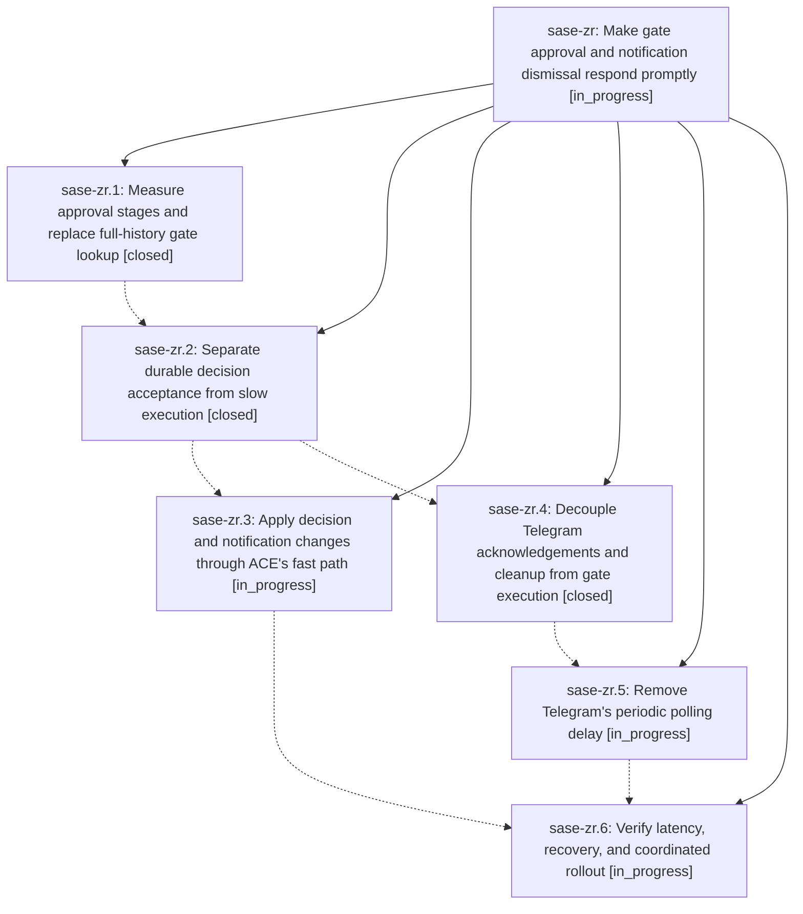

# Bead: sase-zr — Make gate approval and notification dismissal respond promptly

[Bead Pages](../README.md) / sase-zr

**Status:** ◐ in_progress · **Type:** ▸ plan · **Tier:** epic
**Owner:** `bryanbugyi34@gmail.com` · **Created by:** `bbugyi200.athena.0js` · **Assignee:** `sase-zr.land`
**Created:** 2026-09-12 05:06:12 EDT
**Plan:** [202609/prompt\_gate\_approval.md](https://github.com/sase-org/sase--plans/blob/main/202609/prompt_gate_approval.md)

## Description

Publish durable tale and epic approval decisions and refresh ACE and Telegram promptly without waiting for archive publication or successor launch, while preserving execution recovery and exactly-once follow-up ownership.

## Phases

| Bead | Title | Status | Size | Created | Agents | Commits |
|---|---|---|---|---|---:|---:|
| [sase-zr.1](sase-zr.1.md) | Measure approval stages and replace full-history gate lookup | ✓ closed | medium | 2026-09-12 | 1 | 2 |
| [sase-zr.2](sase-zr.2.md) | Separate durable decision acceptance from slow execution | ✓ closed | medium | 2026-09-12 | 1 | 3 |
| [sase-zr.3](sase-zr.3.md) | Apply decision and notification changes through ACE's fast path | ◐ in_progress | medium | 2026-09-12 | 1 | 0 |
| [sase-zr.4](sase-zr.4.md) | Decouple Telegram acknowledgements and cleanup from gate execution | ✓ closed | medium | 2026-09-12 | 1 | 1 |
| [sase-zr.5](sase-zr.5.md) | Remove Telegram's periodic polling delay | ◐ in_progress | medium | 2026-09-12 | 1 | 0 |
| [sase-zr.6](sase-zr.6.md) | Verify latency, recovery, and coordinated rollout | ◐ in_progress | medium | 2026-09-12 | 1 | 0 |

## Lineage

## Agents

| Agent | Bead | Commits |
|---|---|---:|
| [bbugyi200.apollo.sase-zr.1](https://github.com/sase-org/sase--agents/blob/main/families/bbugyi200.apollo.sase-zr.1.md) | [sase-zr.1](sase-zr.1.md) | 2 |
| [bbugyi200.apollo.sase-zr.2](https://github.com/sase-org/sase--agents/blob/main/families/bbugyi200.apollo.sase-zr.2.md) | [sase-zr.2](sase-zr.2.md) | 3 |
| [bbugyi200.apollo.sase-zr.3](https://github.com/sase-org/sase--agents/blob/main/agents/bbugyi200.apollo.sase-zr.3/README.md) | [sase-zr.3](sase-zr.3.md) | 0 |
| [bbugyi200.apollo.sase-zr.4](https://github.com/sase-org/sase--agents/blob/main/agents/bbugyi200.apollo.sase-zr.4/README.md) | [sase-zr.4](sase-zr.4.md) | 1 |
| [bbugyi200.apollo.sase-zr.5](https://github.com/sase-org/sase--agents/blob/main/agents/bbugyi200.apollo.sase-zr.5/README.md) | [sase-zr.5](sase-zr.5.md) | 0 |
| [bbugyi200.apollo.sase-zr.6](https://github.com/sase-org/sase--agents/blob/main/agents/bbugyi200.apollo.sase-zr.6/README.md) | [sase-zr.6](sase-zr.6.md) | 0 |
| [bbugyi200.apollo.sase-zr.land](https://github.com/sase-org/sase--agents/blob/main/agents/bbugyi200.apollo.sase-zr.land/README.md) | [sase-zr](README.md) | 0 |

## Commits

| Repo | Commit | Subject | Bead | Committed |
|---|---|---|---|---|
| sase | [`93f3d58`](https://github.com/sase-org/sase/commit/93f3d58911b9968575bd08676c65b3577e01e016) | feat(gate-shell): add indexed gate-shell-by-gate-id lookup with telemetry | [sase-zr.1](sase-zr.1.md) | 2026-09-13 19:12:59 EDT |
| sase-core | [`sase-core@682dbec`](https://github.com/sase-org/sase-core/commit/682dbeca5967c2fd210597c6c9a6df6b90991a1b) | feat(agent\_scan): add core index module and Python bindings for gate-shell lookup | [sase-zr.1](sase-zr.1.md) | 2026-09-13 19:19:11 EDT |
| sase | [`c8152f4`](https://github.com/sase-org/sase/commit/c8152f4978272b6c6cce30ec9f23470926fff144) | feat(gate-shell): accept gate decisions durably before slow execution | [sase-zr.2](sase-zr.2.md) | 2026-09-13 21:51:48 EDT |
| sase-core | [`sase-core@809f45e`](https://github.com/sase-org/sase-core/commit/809f45ed26a656d8fb8152afb1f077dd6070f022) | feat(gate\_decision): add durable decision-acceptance policy and binding | [sase-zr.2](sase-zr.2.md) | 2026-09-13 21:53:32 EDT |
| sase | [`d2ba89c`](https://github.com/sase-org/sase/commit/d2ba89cb420aea18ac27b4192e6bb49731729cbd) | fix(monitor): keep lookup helpers private | [sase-zr.2](sase-zr.2.md) | 2026-09-14 08:59:17 EDT |
| sase-telegram | [`sase-telegram@c34432c`](https://github.com/sase-org/sase-telegram/commit/c34432cac2dcf8fb27a8139c877446350607b89b) | feat(gate,inbound): submit Telegram gate answers through the shared supervised proc | [sase-zr.4](sase-zr.4.md) | 2026-09-14 09:41:27 EDT |
