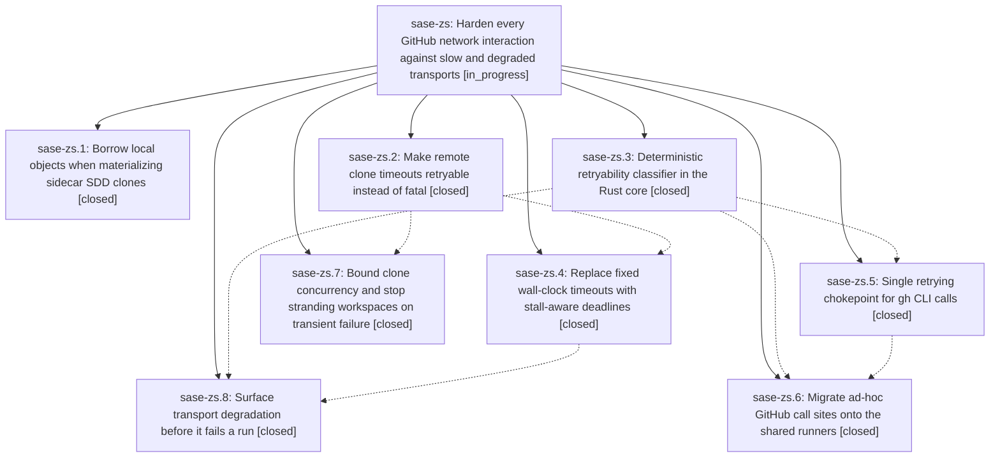

# Bead: sase-zs — Harden every GitHub network interaction against slow and degraded transports

[Bead Pages](../README.md) / sase-zs

**Status:** ◐ in_progress · **Type:** ▸ plan · **Tier:** epic
**Owner:** `bryanbugyi34@gmail.com` · **Created by:** [bbugyi200.athena.0k6](https://github.com/sase-org/sase--agents/blob/main/families/bbugyi200.athena.0k6.md) · **Assignee:** `sase-zs.land`
**Created:** 2026-09-12 09:44:48 EDT
**Plan:** [202609/github\_network\_resilience.md](https://github.com/sase-org/sase--plans/blob/main/202609/github_network_resilience.md)

## Description

A slow, congested, or degraded GitHub transport degrades SASE gracefully instead of failing an agent run: redundant bulk transfers are eliminated, every network git and `gh` call retries transient failures under a shared deterministic classifier, wall-clock timeouts are replaced by stall-aware deadlines, and sustained degradation is visible in telemetry before it becomes an agent failure.

## Phases

| Bead | Title | Status | Size | Created | Agents | Commits |
|---|---|---|---|---|---:|---:|
| [sase-zs.1](sase-zs.1.md) | Borrow local objects when materializing sidecar SDD clones | ✓ closed | small | 2026-09-12 | 1 | 1 |
| [sase-zs.2](sase-zs.2.md) | Make remote clone timeouts retryable instead of fatal | ✓ closed | small | 2026-09-12 | 1 | 1 |
| [sase-zs.3](sase-zs.3.md) | Deterministic retryability classifier in the Rust core | ✓ closed | medium | 2026-09-12 | 1 | 2 |
| [sase-zs.4](sase-zs.4.md) | Replace fixed wall-clock timeouts with stall-aware deadlines | ✓ closed | medium | 2026-09-12 | 1 | 1 |
| [sase-zs.5](sase-zs.5.md) | Single retrying chokepoint for gh CLI calls | ✓ closed | medium | 2026-09-12 | 1 | 0 |
| [sase-zs.6](sase-zs.6.md) | Migrate ad-hoc GitHub call sites onto the shared runners | ✓ closed | medium | 2026-09-12 | 1 | 1 |
| [sase-zs.7](sase-zs.7.md) | Bound clone concurrency and stop stranding workspaces on transient failure | ✓ closed | medium | 2026-09-12 | 1 | 1 |
| [sase-zs.8](sase-zs.8.md) | Surface transport degradation before it fails a run | ✓ closed | small | 2026-09-12 | 1 | 1 |

## Lineage

## Agents

| Agent | Bead | Commits |
|---|---|---:|
| [bbugyi200.athena.sase-zs.1](https://github.com/sase-org/sase--agents/blob/main/agents/bbugyi200.athena.sase-zs.1/README.md) | [sase-zs.1](sase-zs.1.md) | 1 |
| [bbugyi200.athena.sase-zs.2](https://github.com/sase-org/sase--agents/blob/main/agents/bbugyi200.athena.sase-zs.2/README.md) | [sase-zs.2](sase-zs.2.md) | 1 |
| [bbugyi200.athena.sase-zs.3](https://github.com/sase-org/sase--agents/blob/main/agents/bbugyi200.athena.sase-zs.3/README.md) | [sase-zs.3](sase-zs.3.md) | 2 |
| [bbugyi200.athena.sase-zs.4](https://github.com/sase-org/sase--agents/blob/main/agents/bbugyi200.athena.sase-zs.4/README.md) | [sase-zs.4](sase-zs.4.md) | 1 |
| [bbugyi200.athena.sase-zs.5](https://github.com/sase-org/sase--agents/blob/main/agents/bbugyi200.athena.sase-zs.5/README.md) | [sase-zs.5](sase-zs.5.md) | 0 |
| [bbugyi200.athena.sase-zs.6](https://github.com/sase-org/sase--agents/blob/main/agents/bbugyi200.athena.sase-zs.6/README.md) | [sase-zs.6](sase-zs.6.md) | 1 |
| [bbugyi200.athena.sase-zs.7](https://github.com/sase-org/sase--agents/blob/main/agents/bbugyi200.athena.sase-zs.7/README.md) | [sase-zs.7](sase-zs.7.md) | 1 |
| [bbugyi200.athena.sase-zs.8](https://github.com/sase-org/sase--agents/blob/main/agents/bbugyi200.athena.sase-zs.8/README.md) | [sase-zs.8](sase-zs.8.md) | 1 |
| [bbugyi200.athena.sase-zs.land](https://github.com/sase-org/sase--agents/blob/main/agents/bbugyi200.athena.sase-zs.land/README.md) | [sase-zs](README.md) | 0 |

## Commits

| Repo | Commit | Subject | Bead | Committed |
|---|---|---|---|---|
| sase | [`63653c5`](https://github.com/sase-org/sase/commit/63653c5ee1593d8deef0aa6890639af8f79ccfdb) | fix(sdd): reuse primary sidecar clone references | [sase-zs.1](sase-zs.1.md) | 2026-09-12 10:25:10 EDT |
| sase | [`4ea8a15`](https://github.com/sase-org/sase/commit/4ea8a1531b366d644522ddd7795d6cc8cb878ea1) | fix(sdd): retry remote clone timeouts | [sase-zs.2](sase-zs.2.md) | 2026-09-12 10:28:26 EDT |
| sase | [`186c543`](https://github.com/sase-org/sase/commit/186c543d0e79e0518a7da20a96754dd7295ea3da) | feat(github): add retryability classifier facade | [sase-zs.3](sase-zs.3.md) | 2026-09-12 10:40:55 EDT |
| sase-core | [`sase-core@61da8ef`](https://github.com/sase-org/sase-core/commit/61da8ef28d91ab851c00f94db84473328419e89a) | feat(retryability): classify git and gh failures | [sase-zs.3](sase-zs.3.md) | 2026-09-12 10:43:55 EDT |
| sase | [`ecea389`](https://github.com/sase-org/sase/commit/ecea389efd48ff04d3ab054c99496748299f3f9d) | feat(sdd): stream network git progress | [sase-zs.4](sase-zs.4.md) | 2026-09-12 12:03:05 EDT |
| sase | [`b681d50`](https://github.com/sase-org/sase/commit/b681d5072ff06553a95402e36917b0e697ce0905) | feat(sdd): surface git transport degradation | [sase-zs.8](sase-zs.8.md) | 2026-09-12 15:31:13 EDT |
| sase | [`072d657`](https://github.com/sase-org/sase/commit/072d657ab75d67d4b613393933474176a86d3a29) | fix(github): route network calls through shared runners | [sase-zs.6](sase-zs.6.md) | 2026-09-12 16:12:08 EDT |
| sase | [`336c17e`](https://github.com/sase-org/sase/commit/336c17e94e0b19a8392c4c50f313147ca0ded143) | fix(sdd): bound transient remote clone setup failures | [sase-zs.7](sase-zs.7.md) | 2026-09-12 17:00:50 EDT |
