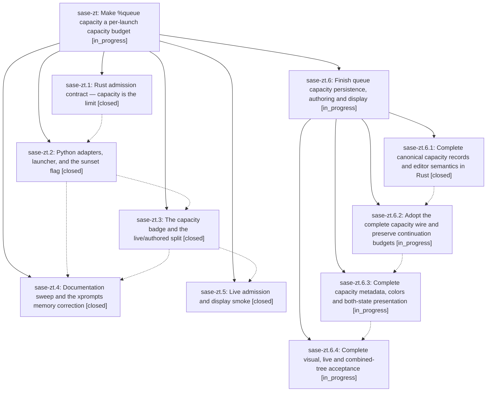

# Bead: sase-zt — Make %queue capacity a per-launch capacity budget

[Bead Pages](../README.md) / sase-zt

**Status:** ◐ in_progress · **Type:** ▸ plan · **Tier:** epic
**Owner:** `bryanbugyi34@gmail.com` · **Created by:** `bbugyi200.kellys_mbp.06.f0` · **Assignee:** `sase-zt.land`
**Created:** 2026-09-12 10:33:26 EDT
**Plan:** [202609/queue\_capacity\_budget.md](https://github.com/sase-org/sase--plans/blob/main/202609/queue_capacity_budget.md)

## Description

`%q:N` gives that launch a capacity budget of N that replaces `max_running_agents` for its own admission decision, unsatisfiable capacity/weight combinations are rejected when they are authored instead of parking forever, and every agent node and agent family node shows the capacity it authored.

## Notes

[2026-09-12T17:16:35Z · 0k9--code] DISCOVERED ISSUE: During unrelated Agents metadata bottom-pin verification on 2026-09-12, just check escalated into the governed full pytest lane and failed 44 queue/capacity/runner-threshold tests after lint gates passed. Representative standalone reproduction: .venv/bin/pytest tests/test_queue_directive.py::test_queue_adapter_collects_and_formats_through_rust -q fails because collect_queue_fields returns {'queue_capacity': 5, 'priority': 20, 'weight': 0.25} while the test expects {'capacity': 5, 'priority': 20, 'weight': 0.25}. The local diff only touches ACE prompt-panel scrolling/help/tests, not queue directive parsing or admission. This appears to belong to this epic's %queue capacity contract work rather than a new task.

[2026-09-12T21:23:13Z · sase-zn.land] DISCOVERED ISSUE disposition from sase-zn.8 note 2: the phase's 44 queue/capacity failures after 40,963 passes predate 89d51301f (sase-zt.2). This repeats the cohort mismatch already in this epic's note 1. Land audit at e498ce822 ran tests/test_queue_directive.py plus notification facade tests: 38 passed in 14.95s with core 0.34.22. The queue_capacity adapter is present; no new standalone task and no claim all 44 original nodes were reverified. Combined-tree checks remain required after sase-zn repairs.

[2026-09-13T10:56:23Z · claude-code-interactive] DISCOVERED ISSUE: The Rust agent scanner never learned the queue_capacity spelling. In sase-core, agent_scan/scanner.rs waiting_marker_from_object and WaitingMarkerWire (agent_scan/wire.rs) read only wait_runners/wait_runners_explicit from waiting.json, both at the pinned revision c55326f and on origin/master. sase-zt.2 (89d51301f) switched runner-slot waiters and ACE wait edits to write only queue_capacity/queue_capacity_explicit. From then on, every other waiter's scan lost a parked launch's authored capacity and judged it against the global limit (waiter_admission_limit saw queue_capacity_explicit=false).

Impact on athena, 2026-09-13: every new agent was QUEUED, including %q:100 launches with 7 of 8 capacity units free. The %q:1 smoke waiter home/20260913055512 was correctly blocked by its own budget behind claim sase-zu.6, but every other waiter's scan saw it as eligible at limit 8. Every later launch therefore parked with a queue-order blocker until sase-zu.6 stopped at 10:51:41Z. The live snapshot showed first_eligible_artifact_dir pointing at that self-blocked waiter.

Mitigated in sase f3a39fa83: writers emit both spellings via queue_capacity_marker_fields in src/sase/axe/run_agent_wait_markers.py. tests/test_run_agent_runner_slot_scan_capacity.py drives the real Rust scan with the flag on and off; the existing runner-slot tests build scan wires in Python, which is why they missed this. Remaining work: teach the scanner queue_capacity/queue_capacity_explicit with a wait_runners fallback, pin that core revision, then delete the legacy mirror.

[2026-09-13T10:56:46Z · claude-code-interactive] DISCOVERED ISSUE: The installed #research_swarm xprompt no longer parses with queue_capacity_budget on. tests/fakey/test_runner_slots_e2e.py::test_installed_research_swarm_quarter_weights_fill_one_fakey_capacity_unit fails on athena at f3a39fa83. expand_prompt_for_typed_launch("#research_swarm:: weighted queue acceptance") raises ValueError "%queue capacity is this launch's capacity budget and must be at least 1; use %q:1 to run alone." from plan_typed_launch_units in src/sase/core/agent_launch_facade.py. That is the sase-zt.1 capacity-zero rejection. The plugin source plugin:sase_research_artifacts/research_swarm.md appears to still author a zero capacity. The failure happens at prompt parse time, before any runner-slot code runs, so a real #research_swarm launch should fail the same way. The fix belongs in the sase-research-artifacts xprompt (use capacity >= 1), plus a check that the test still covers the quarter-weight fill.

[2026-09-13T10:58:00Z · claude-code-interactive] DISCOVERED ISSUE: Every runner-capacity snapshot pays for a failing Rust call. runner_capacity_snapshot_from_capacity_records (src/sase/core/runner_slots/_admission.py) passes every record and the candidate through _with_queue_capacity_alias, which sets both queue_capacity and wait_runners. RunnerCapacityRecordWire declares wait_runners as a serde alias of queue_capacity, so Rust rejects each request with "invalid runner capacity request: duplicate field queue_capacity". _core_runner_capacity_snapshot catches that ValueError and retries with _legacy_runner_capacity_request.

Result: each parked waiter's poll and each ACE capacity refresh serializes the full record list twice (about 1.7k records on athena) and makes one rejected Rust call. Reproduce with sase_core_rs 0.34.23: a single record carrying queue_capacity=1 plus wait_runners=1 raises the duplicate-field ValueError, while either spelling alone succeeds. Fix: send exactly one spelling to Rust.

[2026-09-13T11:06:43Z · sase-zt.land] LANDING AUDIT at f3a39fa835 (origin/master fetched and identical): reviewed this epic and both notes, every original child and all 10 child notes, approved plan, core c55326f, Python 89d51301fa/3c89591db8/dd1ed61a4a and relevant post-start integration commits. Not complete. Actual Rust scan of canonical-only metadata and waiting markers loses both capacities; running/indexed history rows lose authored badges. The original wire rename is incomplete. Detail metadata has Weight but no Capacity; maximum legal budget loses its gold accent. Editor suggestions still author invalid zero. Monitor continuation prefers legacy wait_runners over queue_capacity and reauthors historical zero, which the On parser rejects. Original .3/.5 do not supply the promised inspected visual/live color evidence. These remain epic work. Preserve morning dual-marker fix f3a39fa835 until the scanner is migrated; preserve newer schema-28 history loading, monitor delivery/capture, per-segment weight flooring and doctor changes. Source pin c55326f is older than installed core 0.34.24, so validate the repaired pinned cohort. Detailed audit: file:explicit:49e1cedbfb0962c856bb2e22. Focused verification: 13 adapter/schema/oracle/real-scan tests and 79 admission/gate/queue/display tests passed; no full landing gate claimed. epic-symbols is empty. No parent shown for sase-zt. Submitting a four-phase remaining-work epic with parent_bead=sase-zt; keep this epic and original plan unfinished. After the child completes, recheck descendants, linked plans, drift and just check-full through sase_monitor before normal close, post-close Symvision and original plan status update.

ALL PROPOSED FOLLOW-UP DISPOSITIONS (carry into eventual close note): sase-zt.1 #1 libpython loader corroborated existing sase-xv (+6), with phase reproduction and current source evidence, no new runtime failure claimed. sase-zt.3 #1 schema mismatch and #2 impossible-filter oracle both resolved by 3c1185c281; current tests pass, so new tasks declined. sase-zt.4 #1 settle count overage is resolved by 638647694b (12000 ceiling); historical CPU overage corroborates existing sase-xc (+9), no fresh full-lane failure or budget edit claimed. sase-zt.5 #1 LaunchApproval import error independently reproduces; standalone 71717d95a0 removed creator handoff exports. Filed distinct medium bug sase-106 with proposer, exact source/root cause and audit reference, retaining this unrelated work outside the child. Additional audit issues: configured repo-open identity failure corroborated existing sase-zo; artifact snapshot creation succeeded but automatic bead attachment failed on dirty hidden plans clone, relayed to causal active sase-yy.8. Snapshot reference preserved here; no hidden-clone cleanup. This epics original notes #1/#2 cohort mismatch is addressed by current adapters and focused tests, with the full combined gate still required.

[2026-09-13T11:07:54Z · sase-zt.land] LANDING HANDOFF ADDENDUM: remaining-work epic draft sase_plan_queue_capacity_landing_repairs.md passed validate --explain and final validation with zero warnings; parent_bead is sase-zt and phases are core-contracts, adapters-continuations, presentation, acceptance. No parent close, post-close Symvision or plan-status phase. Task sase-106 is READY with audit ref attached. Its typed related link to the requester-continuation epic also failed on the dirty hidden plans clone and is preserved in sase-106 prose; no duplicate link or hidden clone cleanup. Queue/legacy-zero continuation ownership was recorded on active sase-zl.13.11 to avoid conflicting implementations. This turn changes no tracked main/core source; full verification is deferred until the repair exists, not waived.

## Phases

| Bead | Title | Status | Size | Created | Agents | Commits |
|---|---|---|---|---|---:|---:|
| [sase-zt.1](sase-zt.1.md) | Rust admission contract — capacity is the limit | ✓ closed | medium | 2026-09-12 | 1 | 1 |
| [sase-zt.2](sase-zt.2.md) | Python adapters, launcher, and the sunset flag | ✓ closed | medium | 2026-09-12 | 1 | 1 |
| [sase-zt.3](sase-zt.3.md) | The capacity badge and the live/authored split | ✓ closed | medium | 2026-09-12 | 1 | 1 |
| [sase-zt.4](sase-zt.4.md) | Documentation sweep and the xprompts memory correction | ✓ closed | small | 2026-09-12 | 1 | 1 |
| [sase-zt.5](sase-zt.5.md) | Live admission and display smoke | ✓ closed | xsmall | 2026-09-12 | 1 | 0 |

## Lineage

## Agents

| Agent | Bead | Commits |
|---|---|---:|
| [bbugyi200.athena.sase-zt.1](https://github.com/sase-org/sase--agents/blob/main/agents/bbugyi200.athena.sase-zt.1/README.md) | [sase-zt.1](sase-zt.1.md) | 1 |
| [bbugyi200.athena.sase-zt.2](https://github.com/sase-org/sase--agents/blob/main/agents/bbugyi200.athena.sase-zt.2/README.md) | [sase-zt.2](sase-zt.2.md) | 1 |
| [bbugyi200.athena.sase-zt.3](https://github.com/sase-org/sase--agents/blob/main/agents/bbugyi200.athena.sase-zt.3/README.md) | [sase-zt.3](sase-zt.3.md) | 1 |
| [bbugyi200.athena.sase-zt.4](https://github.com/sase-org/sase--agents/blob/main/agents/bbugyi200.athena.sase-zt.4/README.md) | [sase-zt.4](sase-zt.4.md) | 1 |
| [bbugyi200.athena.sase-zt.5](https://github.com/sase-org/sase--agents/blob/main/families/bbugyi200.athena.sase-zt.5.md) | [sase-zt.5](sase-zt.5.md) | 0 |
| [bbugyi200.athena.sase-zt.6.1](https://github.com/sase-org/sase--agents/blob/main/agents/bbugyi200.athena.sase-zt.6.1/README.md) | [sase-zt.6.1](sase-zt.6.1.md) | 1 |
| [bbugyi200.athena.sase-zt.6.2](https://github.com/sase-org/sase--agents/blob/main/agents/bbugyi200.athena.sase-zt.6.2/README.md) | [sase-zt.6.2](sase-zt.6.2.md) | 0 |
| [bbugyi200.athena.sase-zt.6.3](https://github.com/sase-org/sase--agents/blob/main/agents/bbugyi200.athena.sase-zt.6.3/README.md) | [sase-zt.6.3](sase-zt.6.3.md) | 0 |
| [bbugyi200.athena.sase-zt.6.4](https://github.com/sase-org/sase--agents/blob/main/agents/bbugyi200.athena.sase-zt.6.4/README.md) | [sase-zt.6.4](sase-zt.6.4.md) | 0 |
| [bbugyi200.athena.sase-zt.6.land](https://github.com/sase-org/sase--agents/blob/main/agents/bbugyi200.athena.sase-zt.6.land/README.md) | [sase-zt.6](sase-zt.6.md) | 0 |
| [bbugyi200.athena.sase-zt.land](https://github.com/sase-org/sase--agents/blob/main/families/bbugyi200.athena.sase-zt.land.md) | [sase-zt](README.md) | 0 |

## Commits

| Repo | Commit | Subject | Bead | Committed |
|---|---|---|---|---|
| sase-core | [`sase-core@c55326f`](https://github.com/sase-org/sase-core/commit/c55326f7718abf588b8fecd21b52837ff47747db) | feat: make queue capacity an admission budget | [sase-zt.1](sase-zt.1.md) | 2026-09-12 11:41:47 EDT |
| sase | [`89d5130`](https://github.com/sase-org/sase/commit/89d51301fa153c9d53ecd7d328ae2702dff192ae) | feat: adopt queue capacity budget adapters | [sase-zt.2](sase-zt.2.md) | 2026-09-12 15:09:15 EDT |
| sase | [`3c89591`](https://github.com/sase-org/sase/commit/3c89591db8b4e46108fa56dd501b00060aa70cc0) | feat(ace): show authored queue capacity budgets | [sase-zt.3](sase-zt.3.md) | 2026-09-12 17:26:47 EDT |
| sase | [`dd1ed61`](https://github.com/sase-org/sase/commit/dd1ed61a4ab21d41d13b138b3c17b99e047746ba) | docs: describe queue capacity budgets | [sase-zt.4](sase-zt.4.md) | 2026-09-12 19:05:53 EDT |
| sase | [`fa84150`](https://github.com/sase-org/sase/commit/fa84150cd9ef52097aacbd3b276db9ba023b58d4) | feat(ace): honor queue\_capacity\_budget in LSP and editor contract | [sase-zt.6.1](sase-zt.6.1.md) | 2026-09-13 08:15:53 EDT |
