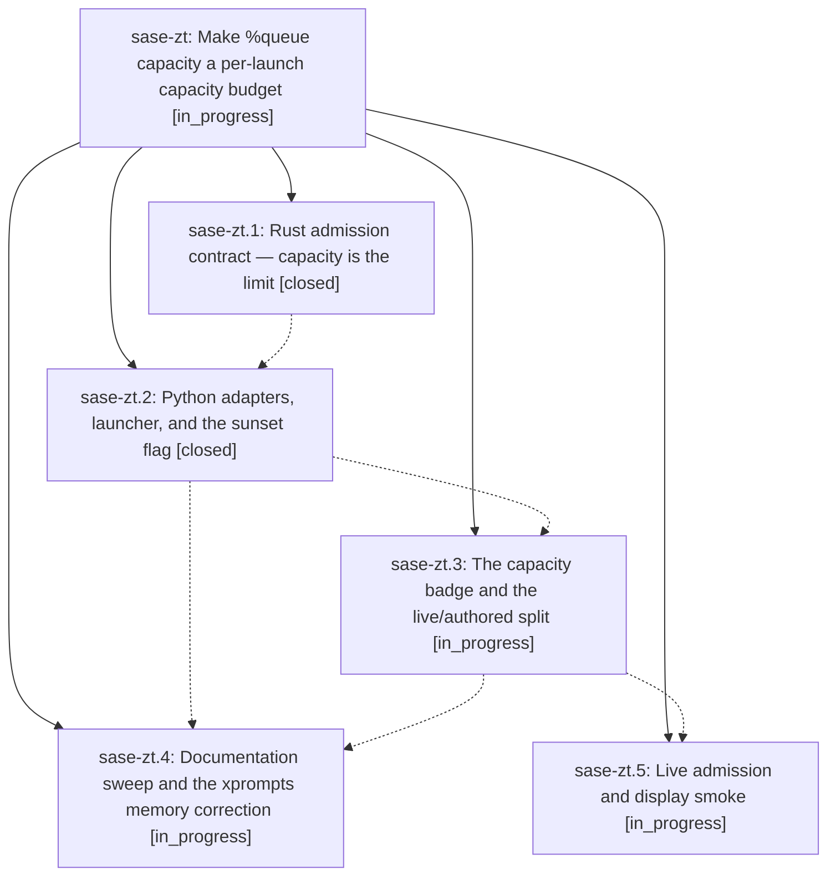

# Bead: sase-zt — Make %queue capacity a per-launch capacity budget

[Bead Pages](../README.md) / sase-zt

**Status:** ◐ in_progress · **Type:** ▸ plan · **Tier:** epic
**Owner:** `bryanbugyi34@gmail.com` · **Created by:** `bbugyi200.kellys_mbp.06.f0` · **Assignee:** `sase-zt.land`
**Created:** 2026-09-12 10:33:26 EDT
**Plan:** [202609/queue\_capacity\_budget.md](https://github.com/sase-org/sase--plans/blob/main/202609/queue_capacity_budget.md)

## Description

`%q:N` gives that launch a capacity budget of N that replaces `max_running_agents` for its own admission decision, unsatisfiable capacity/weight combinations are rejected when they are authored instead of parking forever, and every agent node and agent family node shows the capacity it authored.

## Notes

[2026-09-12T17:16:35Z · 0k9--code] DISCOVERED ISSUE: During unrelated Agents metadata bottom-pin verification on 2026-09-12, just check escalated into the governed full pytest lane and failed 44 queue/capacity/runner-threshold tests after lint gates passed. Representative standalone reproduction: .venv/bin/pytest tests/test_queue_directive.py::test_queue_adapter_collects_and_formats_through_rust -q fails because collect_queue_fields returns {'queue_capacity': 5, 'priority': 20, 'weight': 0.25} while the test expects {'capacity': 5, 'priority': 20, 'weight': 0.25}. The local diff only touches ACE prompt-panel scrolling/help/tests, not queue directive parsing or admission. This appears to belong to this epic's %queue capacity contract work rather than a new task.

## Phases

| Bead | Title | Status | Size | Created | Agents | Commits |
|---|---|---|---|---|---:|---:|
| [sase-zt.1](sase-zt.1.md) | Rust admission contract — capacity is the limit | ✓ closed | medium | 2026-09-12 | 1 | 1 |
| [sase-zt.2](sase-zt.2.md) | Python adapters, launcher, and the sunset flag | ✓ closed | medium | 2026-09-12 | 1 | 1 |
| [sase-zt.3](sase-zt.3.md) | The capacity badge and the live/authored split | ◐ in_progress | medium | 2026-09-12 | 1 | 0 |
| [sase-zt.4](sase-zt.4.md) | Documentation sweep and the xprompts memory correction | ◐ in_progress | small | 2026-09-12 | 1 | 0 |
| [sase-zt.5](sase-zt.5.md) | Live admission and display smoke | ◐ in_progress | xsmall | 2026-09-12 | 1 | 0 |

## Lineage

## Agents

| Agent | Bead | Commits |
|---|---|---:|
| [bbugyi200.athena.sase-zt.1](https://github.com/sase-org/sase--agents/blob/main/agents/bbugyi200.athena.sase-zt.1/README.md) | [sase-zt.1](sase-zt.1.md) | 1 |
| [bbugyi200.athena.sase-zt.2](https://github.com/sase-org/sase--agents/blob/main/agents/bbugyi200.athena.sase-zt.2/README.md) | [sase-zt.2](sase-zt.2.md) | 1 |
| [bbugyi200.athena.sase-zt.3](https://github.com/sase-org/sase--agents/blob/main/agents/bbugyi200.athena.sase-zt.3/README.md) | [sase-zt.3](sase-zt.3.md) | 0 |
| [bbugyi200.athena.sase-zt.4](https://github.com/sase-org/sase--agents/blob/main/agents/bbugyi200.athena.sase-zt.4/README.md) | [sase-zt.4](sase-zt.4.md) | 0 |
| [bbugyi200.athena.sase-zt.5](https://github.com/sase-org/sase--agents/blob/main/agents/bbugyi200.athena.sase-zt.5/README.md) | [sase-zt.5](sase-zt.5.md) | 0 |
| [bbugyi200.athena.sase-zt.land](https://github.com/sase-org/sase--agents/blob/main/agents/bbugyi200.athena.sase-zt.land/README.md) | [sase-zt](README.md) | 0 |

## Commits

| Repo | Commit | Subject | Bead | Committed |
|---|---|---|---|---|
| sase-core | [`sase-core@c55326f`](https://github.com/sase-org/sase-core/commit/c55326f7718abf588b8fecd21b52837ff47747db) | feat: make queue capacity an admission budget | [sase-zt.1](sase-zt.1.md) | 2026-09-12 11:41:47 EDT |
| sase | [`89d5130`](https://github.com/sase-org/sase/commit/89d51301fa153c9d53ecd7d328ae2702dff192ae) | feat: adopt queue capacity budget adapters | [sase-zt.2](sase-zt.2.md) | 2026-09-12 15:09:15 EDT |
