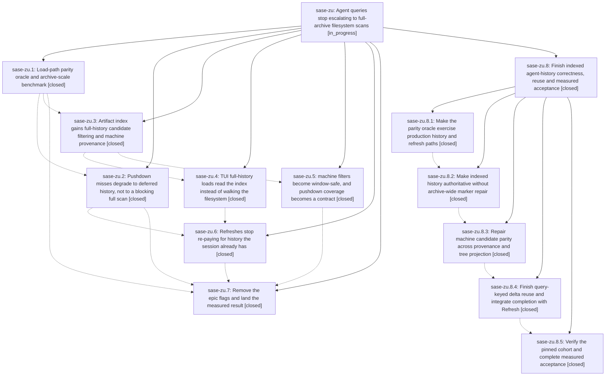

# Bead: sase-zu — Agent queries stop escalating to full-archive filesystem scans

[Bead Pages](../README.md) / sase-zu

**Status:** ◐ in_progress · **Type:** ▸ plan · **Tier:** epic
**Owner:** `bryanbugyi34@gmail.com` · **Created by:** `bbugyi200.kellys_mbp.05.f0` · **Assignee:** `sase-zu.land`
**Created:** 2026-09-12 10:35:41 EDT
**Plan:** [202609/agent\_query\_load\_tiering.md](https://github.com/sase-org/sase--plans/blob/main/202609/agent_query_load_tiering.md)

## Description

A committed Agents-tab filter never decides how much of the artifact archive a load reads. First paint always serves the bounded index window, full history arrives in the background from the SQLite index rather than a filesystem walk, and the common `machine:` filter is pushed down instead of falling off the indexed path — with a parity oracle proving no visible agent row is ever lost to any of it.

## Notes

[2026-09-13T14:18:19Z · sase-zu.land] LANDING AUDIT at 654335d555 (freshly fetched origin/master identical): reviewed this epic (no prior own notes, no parent), all seven child beads and all eight notes, the linked original plan, all 43 commits from 6665e7be27 through HEAD, and Rust implementation 7949496 plus later ba651fe/a64c40d integration. Not complete. Independent isolated production-loader reproduction: create a completed artifact, rebuild index, create a second artifact, request full history with not machine:apollo; source sees both, indexed load sees only the first yet reports complete_history=true and needs_full_history_reconcile=false. Independent machine reproduction: source_machine=athena plus imported_source_owner.machine_name=apollo matches the live machine:apollo query but index candidate selection returns zero records. The oracle uses cached full history rather than production revalidate, and its 72-row fast fixture never exercises settling beyond the tier cap. Active queries still disable exact deltas; overflow only requests broad Tier 1 without invalidating the history key; non-windowed stale full-history results bypass the bounded-prefix query guard. Rust revalidate repairs whole selected tiers before filtering; published full-history p50 7672.78ms versus source 8621.35ms does not satisfy the substantial speedup requirement. Main pins c55326f (wire 8/schema 27, pre-epic) while Python expects 9/29. Phase-seven flag removal is committed in ea18f5366e despite its schema-only title, but sase-zx/sase-101/sase-107 remain OPEN and the phase close explicitly lacked completed full-check evidence. The real-archive table is not fresh combined-tree settled-session proof. epic-symbols is empty. No parent/epic/flag close or plan-status change performed. Detailed audit and reproductions: file:explicit:8c69223181c49846b294f84a. Source review used the sanctioned core checkout; reproductions used this checkout Python source with installed SASE core 0.34.24. Workspace venv has a dangling editable extension, so no just check-full pass is claimed. No tracked source changed. A five-phase remaining-work epic with parent_bead=sase-zu passed validate --explain, correction, and revalidation (0 warnings). It owns production oracle, indexed freshness, machine parity, refresh integration and measured acceptance; no parent-close, Symvision or plan-status phase. Ownership notes on sase-100 and sase-zn.9 preserve Refresh gestures and distinguish broader responsiveness work. FOLLOW-UP DISPOSITIONS for eventual close: sase-zu.4 note 2 installer downgrade proposal declined as a new task because it lacks independent installer reproduction; current Justfile already applies overrides and forced cached-wheel reinstall, and floor is now 0.34.23. Existing sase-xw/sase-wg/sase-vr are different causes; the confirmed stale pin remains epic work. Clean supported install must be proved by child acceptance and any freshly reproduced downgrade triaged then. sase-zu.7 note 1 became small memory task sase-109 after same-type/all-type searches, recent-task sweeps and inspection of all 57 active epic scopes; no duplicate and no direct memory edit. After the child lands, recheck all descendant notes/plans and post-child drift, run combined verification, include these outcomes in the normal close note, then perform the requested post-close Symvision and original plan status update.

[2026-09-13T22:02:13Z · sase-zu.8.land] DISCOVERED ISSUE: the published sase-core-rs floor (>=0.34.23) lacks the schema-30 index / scan-wire-9 core work this epic's children landed at sase-core 23f19f0; no release tag contains it (newest release commit 782dc74 predates it), so a PyPI install would miss the machine-parity and index-completeness fixes. Release-gated remediation filed as task sase-10d (cut a sase-core release containing 23f19f0, then raise the floor via tools/ratchet_core_window) per the sase-wg/sase-d7 floor-bump precedent; the next sase release must wait on sase-10d. Local/dev gates unaffected (core-floor probe reports blocked_unpublished with exit 0). Recorded by sase-zu.8.land from sase-zu.8.5 follow-ups #5/#6.

## Phases

| Bead | Title | Status | Size | Created | Agents | Commits |
|---|---|---|---|---|---:|---:|
| [sase-zu.1](sase-zu.1.md) | Load-path parity oracle and archive-scale benchmark | ✓ closed | medium | 2026-09-12 | 1 | 1 |
| [sase-zu.2](sase-zu.2.md) | Pushdown misses degrade to deferred history, not to a blocking full scan | ✓ closed | medium | 2026-09-12 | 1 | 1 |
| [sase-zu.3](sase-zu.3.md) | Artifact index gains full-history candidate filtering and machine provenance | ✓ closed | medium | 2026-09-12 | 1 | 2 |
| [sase-zu.4](sase-zu.4.md) | TUI full-history loads read the index instead of walking the filesystem | ✓ closed | small | 2026-09-12 | 1 | 1 |
| [sase-zu.5](sase-zu.5.md) | machine filters become window-safe, and pushdown coverage becomes a contract | ✓ closed | small | 2026-09-12 | 1 | 1 |
| [sase-zu.6](sase-zu.6.md) | Refreshes stop re-paying for history the session already has | ✓ closed | medium | 2026-09-12 | 1 | 1 |
| [sase-zu.7](sase-zu.7.md) | Remove the epic flags and land the measured result | ✓ closed | small | 2026-09-12 | 1 | 1 |

## Lineage

## Agents

| Agent | Bead | Commits |
|---|---|---:|
| [bbugyi200.athena.sase-zu.1](https://github.com/sase-org/sase--agents/blob/main/agents/bbugyi200.athena.sase-zu.1/README.md) | [sase-zu.1](sase-zu.1.md) | 0 |
| [bbugyi200.athena.sase-zu.2](https://github.com/sase-org/sase--agents/blob/main/agents/bbugyi200.athena.sase-zu.2/README.md) | [sase-zu.2](sase-zu.2.md) | 1 |
| [bbugyi200.athena.sase-zu.3](https://github.com/sase-org/sase--agents/blob/main/agents/bbugyi200.athena.sase-zu.3/README.md) | [sase-zu.3](sase-zu.3.md) | 2 |
| [bbugyi200.athena.sase-zu.4](https://github.com/sase-org/sase--agents/blob/main/agents/bbugyi200.athena.sase-zu.4/README.md) | [sase-zu.4](sase-zu.4.md) | 1 |
| [bbugyi200.athena.sase-zu.5](https://github.com/sase-org/sase--agents/blob/main/agents/bbugyi200.athena.sase-zu.5/README.md) | [sase-zu.5](sase-zu.5.md) | 1 |
| [bbugyi200.athena.sase-zu.6](https://github.com/sase-org/sase--agents/blob/main/agents/bbugyi200.athena.sase-zu.6/README.md) | [sase-zu.6](sase-zu.6.md) | 1 |
| [bbugyi200.athena.sase-zu.7](https://github.com/sase-org/sase--agents/blob/main/families/bbugyi200.athena.sase-zu.7.md) | [sase-zu.7](sase-zu.7.md) | 1 |
| [bbugyi200.athena.sase-zu.8.1](https://github.com/sase-org/sase--agents/blob/main/agents/bbugyi200.athena.sase-zu.8.1/README.md) | [sase-zu.8.1](sase-zu.8.1.md) | 1 |
| [bbugyi200.athena.sase-zu.8.2](https://github.com/sase-org/sase--agents/blob/main/agents/bbugyi200.athena.sase-zu.8.2/README.md) | [sase-zu.8.2](sase-zu.8.2.md) | 2 |
| [bbugyi200.athena.sase-zu.8.3](https://github.com/sase-org/sase--agents/blob/main/agents/bbugyi200.athena.sase-zu.8.3/README.md) | [sase-zu.8.3](sase-zu.8.3.md) | 2 |
| [bbugyi200.athena.sase-zu.8.4](https://github.com/sase-org/sase--agents/blob/main/agents/bbugyi200.athena.sase-zu.8.4/README.md) | [sase-zu.8.4](sase-zu.8.4.md) | 1 |
| [bbugyi200.athena.sase-zu.8.5](https://github.com/sase-org/sase--agents/blob/main/families/bbugyi200.athena.sase-zu.8.5.md) | [sase-zu.8.5](sase-zu.8.5.md) | 1 |
| [bbugyi200.athena.sase-zu.8.land](https://github.com/sase-org/sase--agents/blob/main/agents/bbugyi200.athena.sase-zu.8.land/README.md) | [sase-zu.8](sase-zu.8.md) | 1 |
| [bbugyi200.athena.sase-zu.land](https://github.com/sase-org/sase--agents/blob/main/families/bbugyi200.athena.sase-zu.land.md) | [sase-zu](README.md) | 0 |

## Commits

| Repo | Commit | Subject | Bead | Committed |
|---|---|---|---|---|
| sase | [`6665e7b`](https://github.com/sase-org/sase/commit/6665e7be27e0367f34750ac0c5e2964a6a19bfc6) | feat: Load-path parity oracle and archive-scale benchmark (sase-zu.1) | [sase-zu.1](sase-zu.1.md) | 2026-09-12 13:16:29 EDT |
| sase | [`c0fd017`](https://github.com/sase-org/sase/commit/c0fd017f328fd6781da9cf5dad02922a26bf281c) | feat(agents): defer non-pushable query history loads | [sase-zu.2](sase-zu.2.md) | 2026-09-12 15:12:48 EDT |
| sase | [`3c1185c`](https://github.com/sase-org/sase/commit/3c1185c2819b3e693b1686b64348daaef2cdc013) | feat(agent-scan): mirror schema 28 index filtering | [sase-zu.3](sase-zu.3.md) | 2026-09-12 16:47:37 EDT |
| sase-core | [`sase-core@7949496`](https://github.com/sase-org/sase-core/commit/79494966a0f3b13ad8994fa1c1c0489b5adbdde7) | feat(agent-scan): filter full-history index candidates | [sase-zu.3](sase-zu.3.md) | 2026-09-12 16:50:17 EDT |
| sase | [`f609668`](https://github.com/sase-org/sase/commit/f609668b7276bccd14ccf2a5d78051c1f7dea6de) | feat(agents): load full history from artifact index | [sase-zu.4](sase-zu.4.md) | 2026-09-12 17:36:42 EDT |
| sase | [`2e08f08`](https://github.com/sase-org/sase/commit/2e08f0842d0be3c7526807e29b2c98d5be5509a8) | fix(agents): reuse full-history refreshes by query | [sase-zu.6](sase-zu.6.md) | 2026-09-13 06:49:43 EDT |
| sase | [`a45ee03`](https://github.com/sase-org/sase/commit/a45ee03542bbb3a5d9d3477432f63a303420f21f) | feat(ace): push machine: Agents-tab filters into the artifact index | [sase-zu.5](sase-zu.5.md) | 2026-09-13 07:59:35 EDT |
| sase | [`ea18f53`](https://github.com/sase-org/sase/commit/ea18f5366e74258a7d5b62ffd725fdffdb8dc5f5) | fix(tools): sync validate\_sase\_core\_rs expected schema version to 9 | [sase-zu.7](sase-zu.7.md) | 2026-09-13 09:09:46 EDT |
| sase | [`db6fd25`](https://github.com/sase-org/sase/commit/db6fd25182dbf8278b926a0b37c7acf6f685d1ed) | test(agent-load-tiering): route the parity oracle through the production TUI loader | [sase-zu.8.1](sase-zu.8.1.md) | 2026-09-13 11:08:40 EDT |
| sase | [`5beda06`](https://github.com/sase-org/sase/commit/5beda061fc5e3ac8e9c6954ba5e7398ff00129ce) | fix(ace): adopt rust index completeness for full-history loads | [sase-zu.8.2](sase-zu.8.2.md) | 2026-09-13 12:42:05 EDT |
| sase-core | [`sase-core@1b12228`](https://github.com/sase-org/sase-core/commit/1b12228757318afbd7b4b2061e7303e153d75524) | fix(agent-scan): discover source dirs before claiming complete history | [sase-zu.8.2](sase-zu.8.2.md) | 2026-09-13 12:44:08 EDT |
| sase | [`1cd445a`](https://github.com/sase-org/sase/commit/1cd445ae4fc3a08b3f318e578c112d7075262bee) | fix(ace): keep conflicting machine provenance in indexed candidates | [sase-zu.8.3](sase-zu.8.3.md) | 2026-09-13 13:43:27 EDT |
| sase-core | [`sase-core@b79accb`](https://github.com/sase-org/sase-core/commit/b79accb31708e350ef921c985374e01199eea249) | fix(agent-scan): project every live machine value into candidate filters | [sase-zu.8.3](sase-zu.8.3.md) | 2026-09-13 13:46:19 EDT |
| sase | [`d698f92`](https://github.com/sase-org/sase/commit/d698f92e0598f5579d249579dd8d0827786e96fa) | fix(tui): preserve query-keyed agents refresh | [sase-zu.8.4](sase-zu.8.4.md) | 2026-09-13 14:18:59 EDT |
| sase | [`ef254fd`](https://github.com/sase-org/sase/commit/ef254fd6dcb4bfbf3d14243579d2f96ea6a8708c) | test(perf): complete agent load tiering measured acceptance | [sase-zu.8.5](sase-zu.8.5.md) | 2026-09-13 17:21:40 EDT |
| sase--plans | [`sase--plans@90387a9`](https://github.com/sase-org/sase--plans/commit/90387a9ea45011ebcb32736f66e635152236b868) | docs(plans): add agent query landing repairs plan (sase-zu.8 land) | [sase-zu.8](sase-zu.8.md) | 2026-09-13 18:17:46 EDT |
