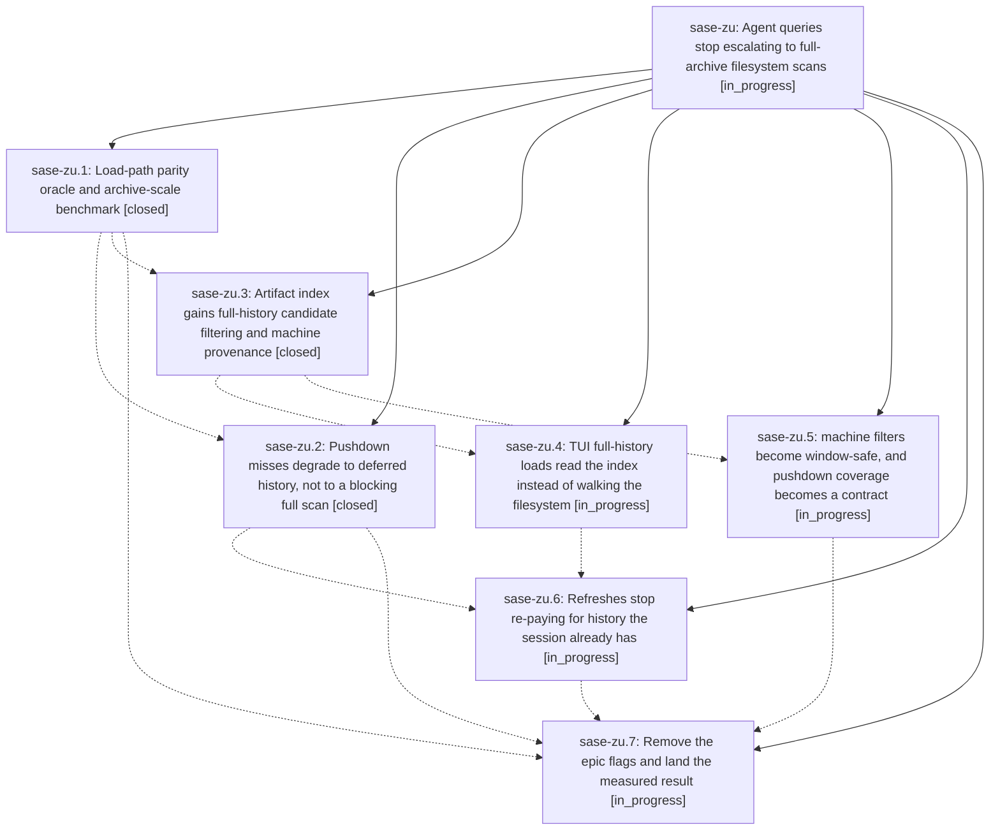

# Bead: sase-zu — Agent queries stop escalating to full-archive filesystem scans

[Bead Pages](../README.md) / sase-zu

**Status:** ◐ in_progress · **Type:** ▸ plan · **Tier:** epic
**Owner:** `bryanbugyi34@gmail.com` · **Created by:** `bbugyi200.kellys_mbp.05.f0` · **Assignee:** `sase-zu.land`
**Created:** 2026-09-12 10:35:41 EDT
**Plan:** [202609/agent\_query\_load\_tiering.md](https://github.com/sase-org/sase--plans/blob/main/202609/agent_query_load_tiering.md)

## Description

A committed Agents-tab filter never decides how much of the artifact archive a load reads. First paint always serves the bounded index window, full history arrives in the background from the SQLite index rather than a filesystem walk, and the common `machine:` filter is pushed down instead of falling off the indexed path — with a parity oracle proving no visible agent row is ever lost to any of it.

## Phases

| Bead | Title | Status | Size | Created | Agents | Commits |
|---|---|---|---|---|---:|---:|
| [sase-zu.1](sase-zu.1.md) | Load-path parity oracle and archive-scale benchmark | ✓ closed | medium | 2026-09-12 | 0 | 1 |
| [sase-zu.2](sase-zu.2.md) | Pushdown misses degrade to deferred history, not to a blocking full scan | ✓ closed | medium | 2026-09-12 | 1 | 1 |
| [sase-zu.3](sase-zu.3.md) | Artifact index gains full-history candidate filtering and machine provenance | ✓ closed | medium | 2026-09-12 | 1 | 1 |
| [sase-zu.4](sase-zu.4.md) | TUI full-history loads read the index instead of walking the filesystem | ◐ in_progress | small | 2026-09-12 | 1 | 0 |
| [sase-zu.5](sase-zu.5.md) | machine filters become window-safe, and pushdown coverage becomes a contract | ◐ in_progress | small | 2026-09-12 | 1 | 0 |
| [sase-zu.6](sase-zu.6.md) | Refreshes stop re-paying for history the session already has | ◐ in_progress | medium | 2026-09-12 | 1 | 0 |
| [sase-zu.7](sase-zu.7.md) | Remove the epic flags and land the measured result | ◐ in_progress | small | 2026-09-12 | 1 | 0 |

## Lineage

## Agents

| Agent | Bead | Commits |
|---|---|---:|
| [bbugyi200.athena.sase-zu.2](https://github.com/sase-org/sase--agents/blob/main/agents/bbugyi200.athena.sase-zu.2/README.md) | [sase-zu.2](sase-zu.2.md) | 1 |
| [bbugyi200.athena.sase-zu.3](https://github.com/sase-org/sase--agents/blob/main/agents/bbugyi200.athena.sase-zu.3/README.md) | [sase-zu.3](sase-zu.3.md) | 1 |
| [bbugyi200.athena.sase-zu.4](https://github.com/sase-org/sase--agents/blob/main/agents/bbugyi200.athena.sase-zu.4/README.md) | [sase-zu.4](sase-zu.4.md) | 0 |
| [bbugyi200.athena.sase-zu.5](https://github.com/sase-org/sase--agents/blob/main/agents/bbugyi200.athena.sase-zu.5/README.md) | [sase-zu.5](sase-zu.5.md) | 0 |
| [bbugyi200.athena.sase-zu.6](https://github.com/sase-org/sase--agents/blob/main/agents/bbugyi200.athena.sase-zu.6/README.md) | [sase-zu.6](sase-zu.6.md) | 0 |
| [bbugyi200.athena.sase-zu.7](https://github.com/sase-org/sase--agents/blob/main/agents/bbugyi200.athena.sase-zu.7/README.md) | [sase-zu.7](sase-zu.7.md) | 0 |
| [bbugyi200.athena.sase-zu.land](https://github.com/sase-org/sase--agents/blob/main/agents/bbugyi200.athena.sase-zu.land/README.md) | [sase-zu](README.md) | 0 |

## Commits

| Repo | Commit | Subject | Bead | Committed |
|---|---|---|---|---|
| sase | [`6665e7b`](https://github.com/sase-org/sase/commit/6665e7be27e0367f34750ac0c5e2964a6a19bfc6) | feat: Load-path parity oracle and archive-scale benchmark (sase-zu.1) | [sase-zu.1](sase-zu.1.md) | 2026-09-12 13:16:29 EDT |
| sase | [`c0fd017`](https://github.com/sase-org/sase/commit/c0fd017f328fd6781da9cf5dad02922a26bf281c) | feat(agents): defer non-pushable query history loads | [sase-zu.2](sase-zu.2.md) | 2026-09-12 15:12:48 EDT |
| sase | [`3c1185c`](https://github.com/sase-org/sase/commit/3c1185c2819b3e693b1686b64348daaef2cdc013) | feat(agent-scan): mirror schema 28 index filtering | [sase-zu.3](sase-zu.3.md) | 2026-09-12 16:47:37 EDT |
