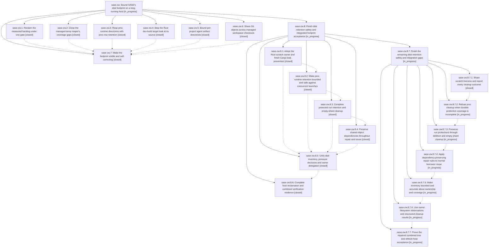

# Bead: sase-zw — Bound SASE's disk footprint on a long-running host

[Bead Pages](../README.md) / sase-zw

**Status:** ◐ in_progress · **Type:** ▸ plan · **Tier:** epic
**Owner:** `bryanbugyi34@gmail.com` · **Created by:** [bbugyi200.athena.0ka](https://github.com/sase-org/sase--agents/blob/main/families/bbugyi200.athena.0ka.md) · **Assignee:** `sase-zw.land`
**Created:** 2026-09-12 13:26:39 EDT
**Plan:** [202609/bound\_sase\_disk\_footprint.md](https://github.com/sase-org/sase--plans/blob/main/202609/bound_sase_disk_footprint.md)

## Description

Every class of disk SASE creates — Rust build output, managed scratch, proc runtime state, agent artifact directories, and managed workspace clones — has an owner that reclaims it on a bounded horizon, the host notices disk pressure before it runs out, and the ~340 GiB already leaked on athena is reclaimed.

## Notes

[2026-09-12T21:23:57Z · sase-zn.land] DISCOVERED ISSUE from sase-zn landing integration at e498ce822: 3114dbd03 (sase-zw.2) makes unknown directories stable buckets in the age pass, but _pressure_candidates still selects the entire unknown directory when horizon is None. Isolated reproduction: old unknown-bucket mtime=now-13h, fresh child containing 4096 bytes, horizons={}, pressure_max_bytes=100, target=50, min_entry=1; age pass preserves it, pressure pass removes both bucket and fresh child. No live state touched. The missing free-filesystem-space pressure trigger is also original sase-zn.6 work. A remaining-work child of sase-zn will repair the shared pressure contract in Rust and preserve your coverage changes; do not duplicate that repair. Preserve proc retention from sase-zw.3; separate payload minimization is task sase-104. Audit file:explicit:02de8d015400f55bd6267c43.

[2026-09-13T22:36:43Z · sase-zw.land] LANDING AUDIT at main 8f7dad695b, core pin 7f43a996 (2026-09-13): reviewed this epic and every note on all seven children, original linked plan and phase-6 sharing plan, epic commits 3114dbd03/e498ce822/edaf35bd95/b9684d76e6/4460e13c44/8f7dad695b, actual source/tests, and later main/core/provider changes. Full audit: file:explicit:b165eb0a7616cb5051633c9c. Artifact creation succeeded; automatic link attachment failed because the hidden plans clone has unrelated uncommitted/untracked changes. Preserve that clone.

NOT COMPLETE. Confirmed remaining epic work: proc orphan sweep deletes fresh/invalid directories without age/budget or synchronized reservation protection (isolated 4,000-directory reproduction left zero survivors), runs on append/reserve and lacks an ordinary hourly sweep; core dev-update still has incremental=true; muse-prompts gets 12h instead of planned 3d; Python duplicates the already-landed Rust scratch owner; artifact apply lacks refreshed ordinary reference protections, empty nested run dirs prevent shard cleanup (isolated reproduction: zero removed/two errors), and hourly preview only logs; shared-object repair/reuse needs safe dependency preservation, eligibility checks and broken-source opt-out recovery; disk pressure thresholds disagree (875 GiB total/40 GiB free => doctor WARN, managed pressure none), inventory fallback is unbounded, and preview/apply outcomes need owner-backed accuracy. Shared backend decisions belong in Rust. Operational and full combined-tree acceptance remain unfinished.

Integration reviewed: 70b018b91a/core a64c40d resolves this epic note #1's pressure bug and preserves unknown/fresh descendants, but Python never adopted its binding. eea8af0421 adds CARGO_BUILD_BUILD_DIR and launch overrides that cleanup/inventory must honor. a6f6ae5c66/core 23f19f0 and 52c80c9528 add continuation protection/portable locators/fail-closed planning; preserve these and core 3fa0a54 retention-cap repair. ef254fd6dc/index-schema-30/scan-wire-9 changes must stay compatible with retention deindexing. 638647694b fixes monitor project inference. GitHub provider normal materialization already uses ensure_workspace_checkout. Other post-start pager/keymap/cache/memory changes require no new disk owner. This is master, not a PR branch.

Recovered phase .1 gate result custom-68f1bf05-931f-4b34-b58e-036db7d1c9aa: user selected ONLY remove_leaked_state. Removed 821 stale runtime dirs plus ace-run/202608 and managed build-targets; no var-tmp candidates. A/B were already absent. Backups were NOT selected. Sync .stignore exists with all four patterns. Never reinterpret this as approval for backups or new candidates. No durable before/after/doctor report was recorded by the phase. Current root available space ~85.6 GiB; live inventory reports cargo-targets ~136.4 GiB, build-targets ~34.6 GiB, SASE workspaces ~122.3 GiB. List took minutes and stray scan was truncated, so no-unowned acceptance is unproved.

Every PROPOSED FOLLOW-UP disposition: .1 #2 gate creator import independently reproduced and corroborated existing ready sase-106 (+1). .5 #2 future timestamp/shard prevention corroborated existing ready sase-v4 (+1 with live 202704/202712 shards); no duplicate creator task. .6 #1 var test fail/pass history forwarded to exact existing flake sase-xk (+1, identifies proposer); current stale-extension mismatch is not claimed as another flake. .6 #1 tiering oracle report forwarded as a note to active owning epic sase-zu: its test/harness was rewritten by ef254fd6dc, and current old-wheel failure cannot establish a new flake, so no speculative task. .6 #1 monitor alias proposal declined as fixed by 638647694b and its regression now passes. .7 #1 stale refresh fixture and suffix-merge proposals declined as fixed by ef254fd6dc (confirmed by sase-zu.8.5 #7 and current tests). .7 #1 installed research_swarm runners=0 report did not reproduce in current launcher qualification; retain installed-cohort acceptance in remaining work, no new task without current evidence, and do not reopen unrelated cache-collision task sase-qs. Additional unrelated configured-repo alias defect corroborated sase-zo, and supported old-core dependency impact corroborated sase-10d. No new task was necessary.

Verification: focused combined run 98 passed/8 failed in 11.22s; failures are stale local extension (wire8/index27/missing continuation_plan_retention) versus current pinned source, so fresh just install is required before definitive testing. Separate monitor-alias/stale-search/incomplete-merge/multi-prompt run: 21 passed in 18.54s. Existing temp/proc/workspace focused checks passed but omitted the reproduced acceptance gaps. No full-suite success claimed. epic-symbols sase-zw is empty; no parent bead exists.

Prepared remaining-work child epic plan sase_plan_disk_footprint_remaining_work.md with parent_bead sase-zw: scratch, procs, runs, objects, pressure, acceptance. Completed validate --explain, edited, then revalidated with zero warnings. Only remaining repairs and acceptance are phased; parent close/post-close Symvision/plan-status update are not phases. Keep sase-zw and the original plan in progress. Child landing must recheck this audit, every new descendant/note and drift, pass combined verification, then resume normal parent landing without force.

[2026-09-14T20:45:28Z · sase-zw.8.land] CHILD LANDING BLOCKER (sase-zw.8, 2026-09-14): child audit at main 00acd607f / core v0.34.28 found remaining deletion-safety and integration gaps despite all six phase closes and 147 passing focused tests. Missing/malformed proc stores permit runtime deletion; run cleanup follows symlink ancestors and deletes protected empty runs; normal borrower reuse can break connectivity; disk results suppress errors and use the wrong owner filesystem. Full audit file:explicit:1b136cd32d914b18447bed0a and complete note/follow-up dispositions are on sase-zw.8. Its remaining-only child plan has parent_bead sase-zw.8 and passed validation. Keep this parent and its plan in progress; resume readiness review only after the repair child and sase-zw.8 land. Orphan-log proposal became ready large task sase-115; hidden audit-link attachment failure corroborated existing sase-10y (+1). No live cleanup, forced close, or plan done transition was performed.

## References

- file:explicit:b165eb0a7616cb5051633c9c

## Phases

| Bead | Title | Status | Size | Created | Agents | Commits |
|---|---|---|---|---|---:|---:|
| [sase-zw.1](sase-zw.1.md) | Reclaim the measured backlog under one gate | ✓ closed | small | 2026-09-12 | 1 | 0 |
| [sase-zw.2](sase-zw.2.md) | Close the managed-temp reaper's coverage gaps | ✓ closed | small | 2026-09-12 | 1 | 1 |
| [sase-zw.3](sase-zw.3.md) | Reap proc runtime directories with proc-row retention | ✓ closed | small | 2026-09-12 | 1 | 1 |
| [sase-zw.4](sase-zw.4.md) | Stop the Rust dev-build target leak at its source | ✓ closed | medium | 2026-09-12 | 1 | 1 |
| [sase-zw.5](sase-zw.5.md) | Bound per-project agent artifact directories | ✓ closed | medium | 2026-09-12 | 1 | 1 |
| [sase-zw.6](sase-zw.6.md) | Share Git objects across managed workspace checkouts | ✓ closed | large | 2026-09-12 | 1 | 1 |
| [sase-zw.7](sase-zw.7.md) | Make the footprint visible and self-correcting | ✓ closed | medium | 2026-09-12 | 1 | 1 |

## Lineage

## Agents

| Agent | Bead | Commits |
|---|---|---:|
| [bbugyi200.athena.sase-zw.1](https://github.com/sase-org/sase--agents/blob/main/agents/bbugyi200.athena.sase-zw.1/README.md) | [sase-zw.1](sase-zw.1.md) | 0 |
| [bbugyi200.athena.sase-zw.2](https://github.com/sase-org/sase--agents/blob/main/agents/bbugyi200.athena.sase-zw.2/README.md) | [sase-zw.2](sase-zw.2.md) | 1 |
| [bbugyi200.athena.sase-zw.3](https://github.com/sase-org/sase--agents/blob/main/agents/bbugyi200.athena.sase-zw.3/README.md) | [sase-zw.3](sase-zw.3.md) | 1 |
| [bbugyi200.athena.sase-zw.4](https://github.com/sase-org/sase--agents/blob/main/families/bbugyi200.athena.sase-zw.4.md) | [sase-zw.4](sase-zw.4.md) | 1 |
| [bbugyi200.athena.sase-zw.5](https://github.com/sase-org/sase--agents/blob/main/agents/bbugyi200.athena.sase-zw.5/README.md) | [sase-zw.5](sase-zw.5.md) | 1 |
| [bbugyi200.athena.sase-zw.6](https://github.com/sase-org/sase--agents/blob/main/families/bbugyi200.athena.sase-zw.6.md) | [sase-zw.6](sase-zw.6.md) | 1 |
| [bbugyi200.athena.sase-zw.7](https://github.com/sase-org/sase--agents/blob/main/families/bbugyi200.athena.sase-zw.7.md) | [sase-zw.7](sase-zw.7.md) | 1 |
| [bbugyi200.athena.sase-zw.8.1](https://github.com/sase-org/sase--agents/blob/main/agents/bbugyi200.athena.sase-zw.8.1/README.md) | [sase-zw.8.1](sase-zw.8.1.md) | 2 |
| [bbugyi200.athena.sase-zw.8.2](https://github.com/sase-org/sase--agents/blob/main/agents/bbugyi200.athena.sase-zw.8.2/README.md) | [sase-zw.8.2](sase-zw.8.2.md) | 2 |
| [bbugyi200.athena.sase-zw.8.3](https://github.com/sase-org/sase--agents/blob/main/agents/bbugyi200.athena.sase-zw.8.3/README.md) | [sase-zw.8.3](sase-zw.8.3.md) | 1 |
| [bbugyi200.athena.sase-zw.8.4](https://github.com/sase-org/sase--agents/blob/main/agents/bbugyi200.athena.sase-zw.8.4/README.md) | [sase-zw.8.4](sase-zw.8.4.md) | 2 |
| [bbugyi200.athena.sase-zw.8.5](https://github.com/sase-org/sase--agents/blob/main/agents/bbugyi200.athena.sase-zw.8.5/README.md) | [sase-zw.8.5](sase-zw.8.5.md) | 2 |
| [bbugyi200.athena.sase-zw.8.6](https://github.com/sase-org/sase--agents/blob/main/agents/bbugyi200.athena.sase-zw.8.6/README.md) | [sase-zw.8.6](sase-zw.8.6.md) | 1 |
| [bbugyi200.athena.sase-zw.8.7.1](https://github.com/sase-org/sase--agents/blob/main/agents/bbugyi200.athena.sase-zw.8.7.1/README.md) | [sase-zw.8.7.1](sase-zw.8.7.1.md) | 1 |
| [bbugyi200.athena.sase-zw.8.7.2](https://github.com/sase-org/sase--agents/blob/main/agents/bbugyi200.athena.sase-zw.8.7.2/README.md) | [sase-zw.8.7.2](sase-zw.8.7.2.md) | 0 |
| [bbugyi200.athena.sase-zw.8.7.3](https://github.com/sase-org/sase--agents/blob/main/agents/bbugyi200.athena.sase-zw.8.7.3/README.md) | [sase-zw.8.7.3](sase-zw.8.7.3.md) | 0 |
| [bbugyi200.athena.sase-zw.8.7.4](https://github.com/sase-org/sase--agents/blob/main/agents/bbugyi200.athena.sase-zw.8.7.4/README.md) | [sase-zw.8.7.4](sase-zw.8.7.4.md) | 0 |
| [bbugyi200.athena.sase-zw.8.7.5](https://github.com/sase-org/sase--agents/blob/main/agents/bbugyi200.athena.sase-zw.8.7.5/README.md) | [sase-zw.8.7.5](sase-zw.8.7.5.md) | 0 |
| [bbugyi200.athena.sase-zw.8.7.6](https://github.com/sase-org/sase--agents/blob/main/agents/bbugyi200.athena.sase-zw.8.7.6/README.md) | [sase-zw.8.7.6](sase-zw.8.7.6.md) | 0 |
| [bbugyi200.athena.sase-zw.8.7.7](https://github.com/sase-org/sase--agents/blob/main/agents/bbugyi200.athena.sase-zw.8.7.7/README.md) | [sase-zw.8.7.7](sase-zw.8.7.7.md) | 0 |
| [bbugyi200.athena.sase-zw.8.7.land](https://github.com/sase-org/sase--agents/blob/main/agents/bbugyi200.athena.sase-zw.8.7.land/README.md) | [sase-zw.8.7](sase-zw.8.7.md) | 0 |
| [bbugyi200.athena.sase-zw.8.land](https://github.com/sase-org/sase--agents/blob/main/families/bbugyi200.athena.sase-zw.8.land.md) | [sase-zw.8](sase-zw.8.md) | 0 |
| [bbugyi200.athena.sase-zw.land](https://github.com/sase-org/sase--agents/blob/main/families/bbugyi200.athena.sase-zw.land.md) | [sase-zw](README.md) | 0 |

## Commits

| Repo | Commit | Subject | Bead | Committed |
|---|---|---|---|---|
| sase | [`3114dbd`](https://github.com/sase-org/sase/commit/3114dbd03c33d48c8f3f6c41eae3fedea7c7f40e) | fix(tmp): close managed temp reaper gaps | [sase-zw.2](sase-zw.2.md) | 2026-09-12 15:33:34 EDT |
| sase | [`e498ce8`](https://github.com/sase-org/sase/commit/e498ce822c603d3f15301f2956e275db8445f829) | fix(procs): reap proc runtime directories | [sase-zw.3](sase-zw.3.md) | 2026-09-12 17:04:28 EDT |
| sase | [`edaf35b`](https://github.com/sase-org/sase/commit/edaf35bd95fd9312a3704e0e8ddf7830cbdcdeb6) | fix(rust): keep dev builds in managed targets | [sase-zw.4](sase-zw.4.md) | 2026-09-12 17:09:13 EDT |
| sase | [`b9684d7`](https://github.com/sase-org/sase/commit/b9684d76e60fc42e6778036d5d636663c44f9c30) | feat(artifacts): prune old ace-run artifact dirs | [sase-zw.5](sase-zw.5.md) | 2026-09-12 18:38:45 EDT |
| sase | [`4460e13`](https://github.com/sase-org/sase/commit/4460e13c4465fa36f2394f88a0723d67d7bb5970) | feat(workspace): share git objects across checkouts | [sase-zw.6](sase-zw.6.md) | 2026-09-12 19:57:44 EDT |
| sase | [`8f7dad6`](https://github.com/sase-org/sase/commit/8f7dad695bf775dc5fa149147129081a69b7212e) | feat(disk): add pressure footprint reporting | [sase-zw.7](sase-zw.7.md) | 2026-09-13 18:16:24 EDT |
| sase | [`6a60ee5`](https://github.com/sase-org/sase/commit/6a60ee5fb7c924ffc9bbe0613660f18cc68cec19) | feat(managed-tmp): make reaper horizons and pressure limits configurable | [sase-zw.8.1](sase-zw.8.1.md) | 2026-09-14 07:39:12 EDT |
| sase-core | [`sase-core@244eb3f`](https://github.com/sase-org/sase-core/commit/244eb3fc7b25d3ec8aafb2d2a9b584b9d5b49109) | build(release): disable incremental compilation to preserve isolated build scratch directories | [sase-zw.8.1](sase-zw.8.1.md) | 2026-09-14 07:41:28 EDT |
| sase | [`6c433c1`](https://github.com/sase-org/sase/commit/6c433c14d1ec0accb17ea6357ebe1da0b4ea528b) | feat(procs): route runtime retention through Rust owner | [sase-zw.8.2](sase-zw.8.2.md) | 2026-09-14 08:56:21 EDT |
| sase-core | [`sase-core@bc78952`](https://github.com/sase-org/sase-core/commit/bc7895217b29b095de3fea339a1f437d2f32cc27) | feat(procs): add runtime retention owner | [sase-zw.8.2](sase-zw.8.2.md) | 2026-09-14 08:58:43 EDT |
| sase | [`347e53b`](https://github.com/sase-org/sase/commit/347e53beabe7b04c6a5a331aa31cd513d97f5d10) | feat(artifacts): route agent artifact run retention pruning through Rust owner | [sase-zw.8.3](sase-zw.8.3.md) | 2026-09-14 09:51:12 EDT |
| sase-core | [`sase-core@4faf1d9`](https://github.com/sase-org/sase-core/commit/4faf1d95d56aa8cd06fd4817c5d76369a75b4311) | feat: Complete protected run retention and empty-shard cleanup (sase-zw.8.3) | [sase-zw.8.3](sase-zw.8.3.md) | 2026-09-14 09:51:31 EDT |
| sase | [`16ee9c2`](https://github.com/sase-org/sase/commit/16ee9c2336456f25e1f1cb4f6650bdd58dd9ff92) | fix(workspace): preserve shared object dependencies | [sase-zw.8.4](sase-zw.8.4.md) | 2026-09-14 10:49:04 EDT |
| sase-core | [`sase-core@afe7b70`](https://github.com/sase-org/sase-core/commit/afe7b70dbede84164be66c55b62f2b912262a87f) | feat(core): plan git object sharing rewrites | [sase-zw.8.4](sase-zw.8.4.md) | 2026-09-14 10:51:31 EDT |
| sase | [`c402a04`](https://github.com/sase-org/sase/commit/c402a04317228e8709a5e915e19d36328d7b6615) | feat(disk): unify pressure cleanup orchestration | [sase-zw.8.5](sase-zw.8.5.md) | 2026-09-14 12:41:28 EDT |
| sase-core | [`sase-core@6643634`](https://github.com/sase-org/sase-core/commit/664363431865bdade8d646d8ac4040f00d311e26) | feat(disk): add pressure classification contract | [sase-zw.8.5](sase-zw.8.5.md) | 2026-09-14 12:58:23 EDT |
| sase | [`6b4bee9`](https://github.com/sase-org/sase/commit/6b4bee96ddfd93478264de0356ddbdf266d3cab7) | test(global-state): ignore harness git env in leak snapshots | [sase-zw.8.6](sase-zw.8.6.md) | 2026-09-14 16:10:06 EDT |
| sase | [`b2a1077`](https://github.com/sase-org/sase/commit/b2a10778e6f8cacb79605c5cfcee26591cb96cce) | fix(managed-tmp): use owner for launch scratch cleanup | [sase-zw.8.7.1](sase-zw.8.7.1.md) | 2026-09-15 08:38:33 EDT |
