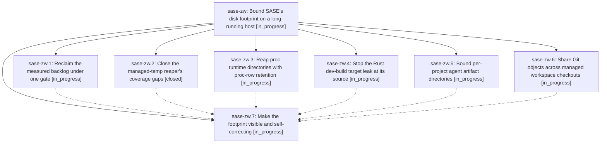

# Bead: sase-zw — Bound SASE's disk footprint on a long-running host

[Bead Pages](../README.md) / sase-zw

**Status:** ◐ in_progress · **Type:** ▸ plan · **Tier:** epic
**Owner:** `bryanbugyi34@gmail.com` · **Created by:** [bbugyi200.athena.0ka](https://github.com/sase-org/sase--agents/blob/main/families/bbugyi200.athena.0ka.md) · **Assignee:** `sase-zw.land`
**Created:** 2026-09-12 13:26:39 EDT
**Plan:** [202609/bound\_sase\_disk\_footprint.md](https://github.com/sase-org/sase--plans/blob/main/202609/bound_sase_disk_footprint.md)

## Description

Every class of disk SASE creates — Rust build output, managed scratch, proc runtime state, agent artifact directories, and managed workspace clones — has an owner that reclaims it on a bounded horizon, the host notices disk pressure before it runs out, and the ~340 GiB already leaked on athena is reclaimed.

## Phases

| Bead | Title | Status | Size | Created | Agents | Commits |
|---|---|---|---|---|---:|---:|
| [sase-zw.1](sase-zw.1.md) | Reclaim the measured backlog under one gate | ◐ in_progress | small | 2026-09-12 | 1 | 0 |
| [sase-zw.2](sase-zw.2.md) | Close the managed-temp reaper's coverage gaps | ✓ closed | small | 2026-09-12 | 1 | 1 |
| [sase-zw.3](sase-zw.3.md) | Reap proc runtime directories with proc-row retention | ◐ in_progress | small | 2026-09-12 | 1 | 0 |
| [sase-zw.4](sase-zw.4.md) | Stop the Rust dev-build target leak at its source | ◐ in_progress | medium | 2026-09-12 | 1 | 0 |
| [sase-zw.5](sase-zw.5.md) | Bound per-project agent artifact directories | ◐ in_progress | medium | 2026-09-12 | 1 | 0 |
| [sase-zw.6](sase-zw.6.md) | Share Git objects across managed workspace checkouts | ◐ in_progress | large | 2026-09-12 | 1 | 0 |
| [sase-zw.7](sase-zw.7.md) | Make the footprint visible and self-correcting | ◐ in_progress | medium | 2026-09-12 | 1 | 0 |

## Lineage

## Agents

| Agent | Bead | Commits |
|---|---|---:|
| [bbugyi200.athena.sase-zw.1](https://github.com/sase-org/sase--agents/blob/main/agents/bbugyi200.athena.sase-zw.1/README.md) | [sase-zw.1](sase-zw.1.md) | 0 |
| [bbugyi200.athena.sase-zw.2](https://github.com/sase-org/sase--agents/blob/main/agents/bbugyi200.athena.sase-zw.2/README.md) | [sase-zw.2](sase-zw.2.md) | 1 |
| [bbugyi200.athena.sase-zw.3](https://github.com/sase-org/sase--agents/blob/main/agents/bbugyi200.athena.sase-zw.3/README.md) | [sase-zw.3](sase-zw.3.md) | 0 |
| [bbugyi200.athena.sase-zw.4](https://github.com/sase-org/sase--agents/blob/main/agents/bbugyi200.athena.sase-zw.4/README.md) | [sase-zw.4](sase-zw.4.md) | 0 |
| [bbugyi200.athena.sase-zw.5](https://github.com/sase-org/sase--agents/blob/main/agents/bbugyi200.athena.sase-zw.5/README.md) | [sase-zw.5](sase-zw.5.md) | 0 |
| [bbugyi200.athena.sase-zw.6](https://github.com/sase-org/sase--agents/blob/main/agents/bbugyi200.athena.sase-zw.6/README.md) | [sase-zw.6](sase-zw.6.md) | 0 |
| [bbugyi200.athena.sase-zw.7](https://github.com/sase-org/sase--agents/blob/main/agents/bbugyi200.athena.sase-zw.7/README.md) | [sase-zw.7](sase-zw.7.md) | 0 |
| [bbugyi200.athena.sase-zw.land](https://github.com/sase-org/sase--agents/blob/main/agents/bbugyi200.athena.sase-zw.land/README.md) | [sase-zw](README.md) | 0 |

## Commits

| Repo | Commit | Subject | Bead | Committed |
|---|---|---|---|---|
| sase | [`3114dbd`](https://github.com/sase-org/sase/commit/3114dbd03c33d48c8f3f6c41eae3fedea7c7f40e) | fix(tmp): close managed temp reaper gaps | [sase-zw.2](sase-zw.2.md) | 2026-09-12 15:33:34 EDT |
